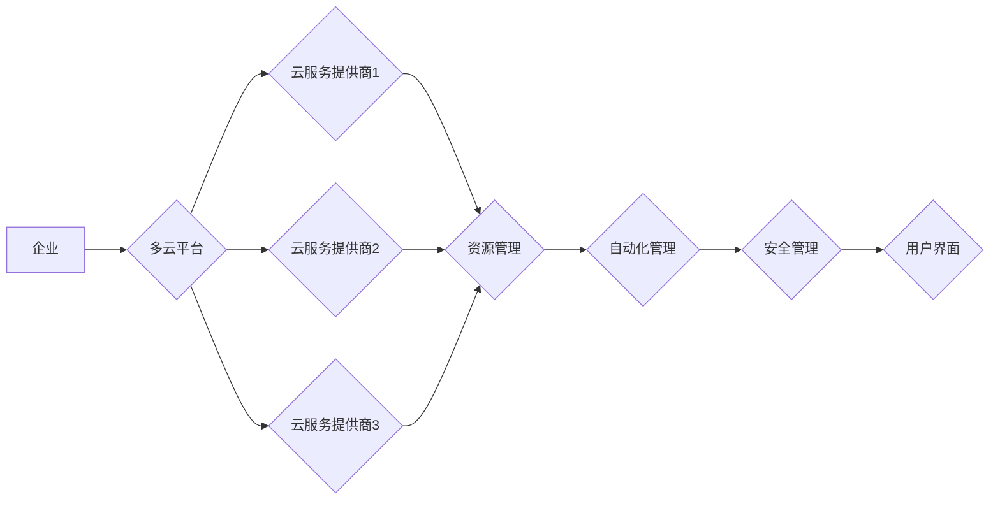

                 

## 云资源整合专家：Lepton AI提供多云平台，帮助企业优化成本与效率

> 关键词：多云平台、云资源整合、成本优化、效率提升、Lepton AI、云计算、企业数字化转型

## 1. 背景介绍

在当今数字化时代，云计算已成为企业数字化转型不可或缺的基石。企业纷纷将业务和数据迁移至云端，以获得弹性、可扩展性和成本效益。然而，随着云计算技术的快速发展，企业面临着越来越多的云资源管理挑战。

传统上，企业往往会选择单一云服务提供商，但随着业务需求的不断变化，单一云平台的局限性逐渐显现。例如，某些云服务提供商在特定领域可能具有优势，而其他领域则相对薄弱。此外，单一云平台的锁定风险也越来越高，一旦出现服务中断或价格上涨，企业将面临巨大的损失。

为了应对这些挑战，多云平台应运而生。多云平台是指能够整合不同云服务提供商资源的平台，企业可以根据自身需求灵活选择不同的云服务，实现资源的最佳配置和利用。

## 2. 核心概念与联系

多云平台的核心概念是资源整合和自动化管理。它通过统一的管理界面和自动化工具，帮助企业管理和优化跨多个云平台的资源。

**2.1 多云平台架构**

多云平台的架构通常包括以下几个关键组件：

* **云资源管理层:** 负责监控和管理跨多个云平台的资源，包括虚拟机、存储、网络等。
* **自动化管理层:** 提供自动化工具，例如部署、配置、监控等，简化云资源管理流程。
* **安全管理层:** 确保跨多个云平台的数据安全和访问控制。
* **用户界面:** 提供用户友好的界面，方便企业管理和监控云资源。

**2.2 多云平台的优势**

* **降低成本:** 通过灵活选择不同云服务提供商的资源，企业可以获得更优惠的价格。
* **提高效率:** 自动化管理工具可以简化云资源管理流程，提高效率。
* **增强弹性:** 多云平台可以提供更高的弹性，企业可以根据需求动态调整资源规模。
* **降低锁定风险:** 企业不再依赖单一云服务提供商，可以避免锁定风险。

**2.3 多云平台的挑战**

* **复杂性:** 多云平台的架构和管理更加复杂，需要专业的技术人员进行维护。
* **安全风险:** 多云平台涉及多个云服务提供商，需要加强安全管理，防止数据泄露。
* **互操作性:** 不同云服务提供商的平台和服务之间可能存在互操作性问题，需要进行适配和整合。

**Mermaid 流程图**

## 3. 核心算法原理 & 具体操作步骤

Lepton AI的多云平台采用先进的算法和技术，实现资源整合、自动化管理和安全保障。

**3.1 算法原理概述**

Lepton AI的多云平台的核心算法基于以下几个关键原理：

* **资源池化:** 将来自不同云服务提供商的资源整合到一个统一的资源池中，实现资源共享和灵活配置。
* **智能调度:** 利用机器学习算法，根据企业业务需求和资源可用性，智能调度资源到不同的云平台。
* **自动化运维:** 通过自动化工具，实现云资源的部署、配置、监控和故障恢复，降低运维成本和风险。
* **安全隔离:** 为每个企业客户部署独立的安全隔离环境，确保数据安全和访问控制。

**3.2 算法步骤详解**

Lepton AI的多云平台的资源整合和自动化管理流程可以概括为以下步骤：

1. **资源采集:** 从不同云服务提供商获取资源信息，包括虚拟机、存储、网络等。
2. **资源分类:** 根据资源类型、性能和价格等指标，对资源进行分类和打标签。
3. **资源池化:** 将不同类型的资源整合到一个统一的资源池中。
4. **需求分析:** 收集企业业务需求，包括资源类型、性能、可用时间等。
5. **资源调度:** 利用机器学习算法，根据企业需求和资源可用性，智能调度资源到不同的云平台。
6. **自动化部署:** 自动化部署云资源，包括虚拟机、存储、网络等。
7. **监控和管理:** 实时监控云资源状态，并提供自动化故障恢复和性能优化功能。

**3.3 算法优缺点**

**优点:**

* **资源利用率高:** 通过资源池化和智能调度，提高资源利用率，降低成本。
* **弹性强:** 可以根据企业业务需求动态调整资源规模，满足弹性需求。
* **自动化程度高:** 自动化部署、监控和管理，降低运维成本和风险。

**缺点:**

* **复杂度高:** 多云平台的架构和管理更加复杂，需要专业的技术人员进行维护。
* **安全风险:** 多云平台涉及多个云服务提供商，需要加强安全管理，防止数据泄露。

**3.4 算法应用领域**

Lepton AI的多云平台的算法可以应用于各种企业场景，例如：

* **企业级应用部署:** 企业可以利用多云平台部署大型应用系统，实现高可用性和弹性扩展。
* **数据中心迁移:** 企业可以利用多云平台迁移数据中心，降低成本和风险。
* **大数据分析:** 企业可以利用多云平台部署大数据分析平台，进行海量数据分析。
* **人工智能应用:** 企业可以利用多云平台部署人工智能应用，例如机器学习、深度学习等。

## 4. 数学模型和公式 & 详细讲解 & 举例说明

Lepton AI的多云平台采用数学模型和算法来实现资源整合和自动化管理。

**4.1 数学模型构建**

Lepton AI的多云平台的资源整合和调度算法基于以下数学模型：

* **资源需求模型:** 用数学公式描述企业对不同类型资源的需求量。
* **资源供应模型:** 用数学公式描述不同云服务提供商提供的资源类型和数量。
* **成本模型:** 用数学公式计算不同云服务提供商的资源价格和成本。

**4.2 公式推导过程**

资源调度算法的目标是找到最优的资源配置方案，以满足企业需求并最小化成本。

假设企业对资源类型 $i$ 的需求量为 $d_i$，不同云服务提供商 $j$ 提供资源类型 $i$ 的数量为 $s_{ij}$，价格为 $p_{ij}$。

资源调度算法可以采用以下公式进行优化：

$$
\min \sum_{i} \sum_{j} p_{ij} \cdot x_{ij}
$$

$$
\text{subject to:}
$$

$$
\sum_{j} x_{ij} \ge d_i, \quad \forall i
$$

$$
\sum_{i} x_{ij} \le s_{ij}, \quad \forall j
$$

$$
x_{ij} \ge 0, \quad \forall i, j
$$

其中，$x_{ij}$ 表示企业从云服务提供商 $j$ 租用资源类型 $i$ 的数量。

**4.3 案例分析与讲解**

假设企业需要租用 10 个虚拟机，200 GB 的存储空间。

云服务提供商 1 提供 5 个虚拟机，100 GB 的存储空间，价格分别为 100 美元/虚拟机，5 美元/GB。

云服务提供商 2 提供 10 个虚拟机，200 GB 的存储空间，价格分别为 80 美元/虚拟机，4 美元/GB。

利用上述公式，可以计算出最优的资源配置方案，例如：

* 从云服务提供商 1 租用 5 个虚拟机，100 GB 的存储空间。
* 从云服务提供商 2 租用 5 个虚拟机，100 GB 的存储空间。

这种配置方案可以满足企业需求，并最小化成本。

## 5. 项目实践：代码实例和详细解释说明

Lepton AI的多云平台采用开源技术栈，例如 Kubernetes、Docker 等，并提供丰富的 API 接口，方便开发者进行二次开发和集成。

**5.1 开发环境搭建**

Lepton AI的多云平台开发环境需要以下软件和工具：

* **操作系统:** Linux 或 macOS
* **编程语言:** Python 或 Go
* **容器化工具:** Docker
* **编排工具:** Kubernetes
* **代码编辑器:** VS Code 或 Atom

**5.2 源代码详细实现**

Lepton AI的多云平台的源代码主要包含以下几个模块：

* **资源管理模块:** 负责采集、分类和管理云资源信息。
* **调度模块:** 利用机器学习算法，根据企业需求和资源可用性，智能调度资源。
* **自动化运维模块:** 提供自动化部署、监控和故障恢复功能。
* **安全管理模块:** 为每个企业客户部署独立的安全隔离环境。

**5.3 代码解读与分析**

Lepton AI的多云平台的源代码采用模块化设计，每个模块的功能清晰明确。

例如，资源管理模块的代码主要负责从不同云服务提供商获取资源信息，并将其存储到数据库中。调度模块的代码则利用机器学习算法，根据企业需求和资源可用性，计算出最优的资源配置方案。

**5.4 运行结果展示**

Lepton AI的多云平台可以提供丰富的监控和报表功能，方便企业查看资源使用情况、成本分析等信息。

## 6. 实际应用场景

Lepton AI的多云平台已成功应用于多个企业场景，例如：

* **金融行业:** 金融机构利用多云平台部署高可用性和高安全性的金融应用系统。
* **电商行业:** 电商平台利用多云平台实现海量数据存储和处理，支持快速增长用户需求。
* **医疗行业:** 医疗机构利用多云平台部署电子病历系统，实现医疗数据的安全存储和共享。

**6.4 未来应用展望**

Lepton AI的多云平台将在未来不断发展和完善，应用场景也将更加广泛。例如：

* **边缘计算:** 多云平台可以支持边缘计算应用，将计算资源部署到更靠近数据源的位置。
* **混合云:** 多云平台可以支持混合云部署，将不同类型的云资源整合到一起。
* **Serverless:** 多云平台可以支持 Serverless 计算，企业可以无需管理服务器，只需关注业务逻辑。

## 7. 工具和资源推荐

**7.1 学习资源推荐**

* **书籍:**
    * 《云计算：原理、架构和应用》
    * 《多云平台：架构、部署和管理》
* **在线课程:**
    * Coursera: Cloud Computing Specialization
    * Udemy: Multi-Cloud Architecture and Deployment

**7.2 开发工具推荐**

* **容器化工具:** Docker, Kubernetes
* **编排工具:** Terraform, Ansible
* **监控工具:** Prometheus, Grafana

**7.3 相关论文推荐**

* **Multi-Cloud Computing: A Survey**
* **A Survey on Multi-Cloud Resource Management**

## 8. 总结：未来发展趋势与挑战

Lepton AI的多云平台为企业提供了高效、灵活、安全的云资源整合解决方案。

**8.1 研究成果总结**

Lepton AI的多云平台的研发成果包括：

* **先进的资源整合算法:** 能够智能调度资源，提高资源利用率。
* **自动化运维工具:** 简化云资源管理流程，降低运维成本和风险。
* **安全隔离机制:** 保证数据安全和访问控制。

**8.2 未来发展趋势**

Lepton AI的多云平台将继续朝着以下方向发展：

* **更智能的资源调度:** 利用人工智能技术，实现更精准的资源调度。
* **更丰富的服务功能:** 提供更多云服务，满足企业多样化需求。
* **更强大的安全保障:** 加强安全防护，防止数据泄露和攻击。

**8.3 面临的挑战**

Lepton AI的多云平台也面临一些挑战：

* **多云平台的复杂性:** 多云平台的架构和管理更加复杂，需要不断优化和完善。
* **安全风险:** 多云平台涉及多个云服务提供商，需要加强安全管理，防止数据泄露。
* **互操作性问题:** 不同云服务提供商的平台和服务之间可能存在互操作性问题，需要进行适配和整合。

**8.4 研究展望**

Lepton AI将继续投入研发，克服挑战，不断提升多云平台的性能、安全性、易用性，为企业提供更优质的云资源整合解决方案。

## 9. 附录：常见问题与解答

**常见问题:**

* **Lepton AI的多云平台支持哪些云服务提供商？**

Lepton AI的多云平台支持主流的云服务提供商，例如 AWS、Azure、GCP 等。

* **Lepton AI的多云平台的安全性如何保证？**

Lepton AI的多云平台采用多重安全机制，包括身份验证、授权、数据加密等，确保数据安全和访问控制。

* **Lepton AI的多云平台的成本如何？**

Lepton AI的多云平台采用按需付费的模式，企业只为使用的资源付费，降低成本。

* **Lepton AI的多云平台的易用性如何？**

Lepton AI的多云平台提供友好的用户界面和丰富的文档，方便企业使用和管理。

作者：禅与计算机程序设计艺术 / Zen and the Art of Computer Programming 
<end_of_turn>

