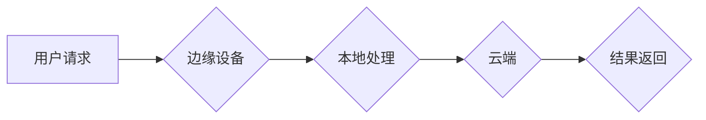

                 

## 云边协同计算：优化分布式AI系统性能

> 关键词：云边协同计算、分布式AI、边缘计算、模型压缩、数据隐私、高效推理

### 1. 背景介绍

随着人工智能（AI）技术的飞速发展，AI模型规模不断扩大，对计算资源和网络带宽的需求也日益增长。传统的云端计算模式在处理海量数据和复杂模型时面临着瓶颈，例如延迟高、带宽不足、数据传输成本高等问题。为了解决这些挑战，云边协同计算应运而生。

云边协同计算是一种将计算资源和数据处理能力分布到云端和边缘设备的计算架构。它将云端的强大计算能力与边缘设备的低延迟、高带宽和本地数据处理能力相结合，从而实现高效、灵活、安全的AI应用部署。

### 2. 核心概念与联系

**2.1 云边协同计算架构**

云边协同计算架构通常由以下几个关键组件组成：

* **云端:** 提供强大的计算能力、存储资源和模型训练平台。
* **边缘设备:** 靠近数据源的设备，例如智能手机、物联网传感器、无人机等，具有本地数据处理能力和低延迟特性。
* **边缘云:** 连接边缘设备和云端的中间层，负责数据传输、模型部署和资源管理。

**2.2 云边协同计算的优势**

* **降低延迟:** 将计算任务推送到靠近数据源的边缘设备，可以显著降低数据传输延迟，提高实时性。
* **提高效率:** 利用边缘设备的本地计算能力，可以减轻云端服务器的负担，提高整体系统效率。
* **增强安全性:** 将敏感数据处理在本地边缘设备，可以降低数据泄露风险。
* **灵活部署:** 可以根据应用需求灵活选择云端、边缘设备或两者结合的部署模式。

**2.3 Mermaid 流程图**



### 3. 核心算法原理 & 具体操作步骤

**3.1 算法原理概述**

云边协同计算中常用的核心算法包括模型压缩、联邦学习、数据分片等。

* **模型压缩:** 将大型AI模型压缩到更小的尺寸，以便在资源受限的边缘设备上高效运行。
* **联邦学习:** 在不共享原始数据的条件下，通过分布式训练的方式，在多个边缘设备上联合训练模型。
* **数据分片:** 将大型数据集分割成多个部分，分别存储在不同的边缘设备上，并通过协同计算的方式进行处理。

**3.2 算法步骤详解**

以模型压缩为例，其具体操作步骤如下：

1. **选择压缩方法:** 常用的模型压缩方法包括量化、剪枝、知识蒸馏等。
2. **对模型进行压缩:** 根据选择的压缩方法，对模型参数进行量化、剪枝或知识蒸馏等操作，减小模型尺寸。
3. **评估压缩效果:** 使用测试数据集评估压缩后的模型性能，确保压缩后模型精度损失在可接受范围内。
4. **部署到边缘设备:** 将压缩后的模型部署到边缘设备上，进行推理和应用。

**3.3 算法优缺点**

* **模型压缩:** 优点是能够显著减小模型尺寸，降低部署成本和延迟。缺点是可能会导致模型精度下降。
* **联邦学习:** 优点是能够保护数据隐私，同时实现模型训练的分布式化。缺点是训练速度较慢，需要协调多个设备的参与。
* **数据分片:** 优点是能够提高数据处理效率，并降低数据传输成本。缺点是需要复杂的协调机制，确保数据一致性和安全性。

**3.4 算法应用领域**

云边协同计算的算法在各个领域都有广泛的应用，例如：

* **智能家居:** 将语音识别、图像识别等AI模型部署到智能家居设备上，实现智能控制和个性化服务。
* **自动驾驶:** 将深度学习模型部署到自动驾驶车辆上，实现环境感知、路径规划和决策控制。
* **医疗保健:** 将医疗图像分析、疾病诊断等AI模型部署到边缘设备上，实现快速、精准的医疗服务。

### 4. 数学模型和公式 & 详细讲解 & 举例说明

**4.1 数学模型构建**

假设我们有一个包含N个数据点的训练数据集，每个数据点包含特征向量x和标签y。我们的目标是训练一个模型f(x)来预测给定特征向量x的标签y。

我们可以使用以下数学模型来表示模型的学习过程：

$$
f(x) = \arg\min_w \mathcal{L}(w, D)
$$

其中：

* $f(x)$ 是模型的预测函数。
* $w$ 是模型的参数。
* $\mathcal{L}(w, D)$ 是损失函数，用于衡量模型预测结果与真实标签之间的差异。
* $D$ 是训练数据集。

**4.2 公式推导过程**

损失函数的最小化可以通过梯度下降算法实现。梯度下降算法的基本思想是迭代更新模型参数，使得损失函数不断减小。

梯度下降算法的更新公式如下：

$$
w_{t+1} = w_t - \eta \nabla_w \mathcal{L}(w_t, D)
$$

其中：

* $w_t$ 是模型参数在第t次迭代的值。
* $w_{t+1}$ 是模型参数在第t+1次迭代的值。
* $\eta$ 是学习率，控制着参数更新的步长。
* $\nabla_w \mathcal{L}(w_t, D)$ 是损失函数关于模型参数的梯度。

**4.3 案例分析与讲解**

假设我们使用线性回归模型进行房价预测，损失函数为均方误差。

$$
\mathcal{L}(w, D) = \frac{1}{N} \sum_{i=1}^{N} (y_i - f(x_i))^2
$$

其中：

* $y_i$ 是第i个数据点的真实房价。
* $f(x_i) = w_0 + w_1 x_i$ 是模型对第i个数据点的预测房价。

我们可以使用梯度下降算法迭代更新模型参数$w_0$和$w_1$，使得损失函数最小化，从而得到一个能够准确预测房价的模型。

### 5. 项目实践：代码实例和详细解释说明

**5.1 开发环境搭建**

* 操作系统: Ubuntu 20.04
* Python 版本: 3.8
* 深度学习框架: TensorFlow 2.x

**5.2 源代码详细实现**

```python
import tensorflow as tf

# 定义模型
model = tf.keras.models.Sequential([
    tf.keras.layers.Dense(units=64, activation='relu', input_shape=(10,)),
    tf.keras.layers.Dense(units=1)
])

# 定义损失函数和优化器
loss_fn = tf.keras.losses.MeanSquaredError()
optimizer = tf.keras.optimizers.Adam(learning_rate=0.001)

# 训练模型
for epoch in range(10):
    for batch in dataset:
        with tf.GradientTape() as tape:
            predictions = model(batch['features'])
            loss = loss_fn(batch['labels'], predictions)
        gradients = tape.gradient(loss, model.trainable_variables)
        optimizer.apply_gradients(zip(gradients, model.trainable_variables))

# 保存模型
model.save('my_model.h5')
```

**5.3 代码解读与分析**

* 代码首先定义了一个简单的多层感知机模型，用于房价预测。
* 然后定义了损失函数和优化器，用于训练模型。
* 训练过程使用批处理方式进行，每次迭代处理一个批次的训练数据。
* 梯度下降算法用于更新模型参数，使得损失函数最小化。
* 最后，训练完成后将模型保存为文件。

**5.4 运行结果展示**

训练完成后，可以使用测试数据集评估模型的性能，例如计算模型的均方误差。

### 6. 实际应用场景

**6.1 智能家居**

云边协同计算可以将语音识别、图像识别等AI模型部署到智能家居设备上，实现智能控制和个性化服务。例如，可以利用边缘设备上的语音识别模型，实现对智能家居设备的语音控制，例如控制灯光、空调、窗帘等。

**6.2 自动驾驶**

云边协同计算可以将深度学习模型部署到自动驾驶车辆上，实现环境感知、路径规划和决策控制。例如，可以利用边缘设备上的图像识别模型，识别道路上的障碍物、交通信号灯等信息，并根据这些信息进行路径规划和决策控制。

**6.3 医疗保健**

云边协同计算可以将医疗图像分析、疾病诊断等AI模型部署到边缘设备上，实现快速、精准的医疗服务。例如，可以利用边缘设备上的图像识别模型，对患者的X光片、CT扫描等图像进行分析，辅助医生进行疾病诊断。

**6.4 未来应用展望**

云边协同计算在未来将有更广泛的应用场景，例如：

* **工业自动化:** 将AI模型部署到工业设备上，实现智能监控、故障诊断和生产优化。
* **智慧城市:** 将AI模型部署到城市传感器网络上，实现城市环境监测、交通管理和公共安全保障。
* **教育科技:** 将AI模型部署到教育设备上，实现个性化学习、智能辅导和教学评估。

### 7. 工具和资源推荐

**7.1 学习资源推荐**

* **书籍:**
    * 《云计算架构》
    * 《深度学习》
    * 《边缘计算》
* **在线课程:**
    * Coursera: 云计算与大数据
    * edX: 深度学习
    * Udacity: 边缘计算

**7.2 开发工具推荐**

* **云平台:**
    * AWS
    * Azure
    * Google Cloud
* **边缘计算平台:**
    * TensorFlow Lite
    * PyTorch Mobile
    * Edge Impulse

**7.3 相关论文推荐**

* 《云边协同计算: 架构、算法和应用》
* 《联邦学习: 对数据隐私的保护》
* 《模型压缩: 提高深度学习模型的效率》

### 8. 总结：未来发展趋势与挑战

**8.1 研究成果总结**

云边协同计算技术近年来取得了显著进展，在模型压缩、联邦学习、数据分片等方面积累了丰富的经验。

**8.2 未来发展趋势**

* **更智能的协同机制:** 研究更智能的协同机制，能够自动分配任务、协调资源和优化模型训练过程。
* **更强大的边缘计算能力:** 随着边缘设备计算能力的提升，将能够支持更复杂、更强大的AI模型部署。
* **更安全的隐私保护机制:** 研究更安全的隐私保护机制，能够有效保护用户数据隐私。

**8.3 面临的挑战**

* **异构环境的兼容性:** 云边协同计算需要支持不同类型的云平台、边缘设备和网络环境，这带来了兼容性挑战。
* **资源管理和调度:** 如何高效地管理和调度云边资源，是云边协同计算面临的重要挑战。
* **数据安全和隐私保护:** 如何确保数据在云边协同计算过程中安全可靠地传输和处理，是需要进一步研究和解决的问题。

**8.4 研究展望**

云边协同计算是一个充满机遇和挑战的领域，未来将会有更多的研究和创新。

### 9. 附录：常见问题与解答

**9.1 云边协同计算与云计算有什么区别？**

云边协同计算将计算资源分布到云端和边缘设备，而云计算只在云端进行计算。云边协同计算可以降低延迟、提高效率和增强安全性，而云计算更侧重于提供弹性、可扩展的计算资源。

**9.2 云边协同计算有哪些应用场景？**

云边协同计算的应用场景非常广泛，例如智能家居、自动驾驶、医疗保健、工业自动化、智慧城市等。

**9.3 如何选择合适的云边协同计算架构？**

选择合适的云边协同计算架构需要根据具体的应用场景、数据特点、计算资源和网络环境等因素进行综合考虑。

**9.4 云边协同计算有哪些安全风险？**

云边协同计算存在数据泄露、隐私侵犯、恶意攻击等安全风险。需要采取相应的安全措施，例如数据加密、身份认证、访问控制等，来保障数据安全和系统稳定性。


作者：禅与计算机程序设计艺术 / Zen and the Art of Computer Programming 
<end_of_turn>

