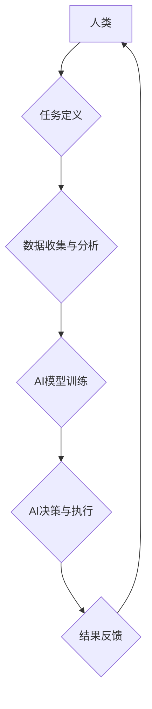

                 

## 人类-AI协作：增强人类与AI之间的信任和理解

> 关键词：人工智能、协作、信任、理解、人类-AI交互、算法、模型、应用场景

### 1. 背景介绍

人工智能（AI）技术近年来发展迅速，已渗透到各个领域，从自动驾驶到医疗诊断，从个性化推荐到金融风险评估，AI正在改变着我们的生活方式和工作模式。然而，AI技术的发展也引发了一些担忧，例如算法偏见、数据隐私、工作岗位替代等。如何有效地解决这些问题，并促进人类与AI的和谐共处，成为一个亟待解决的课题。

人类-AI协作，即人类与人工智能系统共同完成任务，是实现AI技术可持续发展和社会可持续发展的关键路径。通过协作，人类可以发挥其创造力、批判性思维和情感智能等优势，而AI可以提供其强大的计算能力、数据处理能力和自动化执行能力。这种合作关系，可以最大限度地发挥双方优势，共同创造更大的价值。

### 2. 核心概念与联系

**2.1 核心概念**

* **人类:** 拥有复杂情感、创造力和批判性思维能力的生物。
* **AI:** 通过算法和数据训练，模拟人类智能行为的计算机系统。
* **协作:** 人类和AI共同参与任务，相互补充，共同完成目标。
* **信任:** 人类对AI系统的可靠性和安全性有信心。
* **理解:** 人类能够理解AI系统的行为逻辑和决策过程。

**2.2  架构图**



**2.3  联系**

人类-AI协作的核心在于建立信任和理解。只有当人类对AI系统的行为有信心，并能够理解其决策过程，才能有效地与之合作。信任和理解的建立需要多方面的努力，包括：

* **透明度:** AI系统的决策过程应该尽可能透明，以便人类能够理解其背后的逻辑。
* **可解释性:** AI模型的决策结果应该能够被人类解释和理解。
* **安全性:** AI系统应该能够安全可靠地运行，避免出现意外情况。
* **公平性:** AI系统应该公平公正地对待所有用户，避免出现偏见。

### 3. 核心算法原理 & 具体操作步骤

**3.1 算法原理概述**

人类-AI协作中常用的算法包括：

* **强化学习:** AI系统通过与环境交互，学习最优的行为策略。
* **迁移学习:** AI系统将已有的知识迁移到新的任务中，提高学习效率。
* **联邦学习:** 多个设备或机构共享数据，训练一个全局模型，而无需将数据集中存储。

**3.2 算法步骤详解**

以强化学习为例，其基本步骤如下：

1. **环境建模:** 建立一个模拟真实世界的环境模型。
2. **奖励机制设计:** 设计一个奖励机制，根据AI系统的行为给予相应的奖励或惩罚。
3. **策略学习:** AI系统通过与环境交互，不断调整其行为策略，以最大化累积奖励。
4. **策略评估:** 对训练好的策略进行评估，并根据评估结果进行调整。

**3.3 算法优缺点**

* **优点:** 能够学习复杂的行为策略，适应动态变化的环境。
* **缺点:** 训练过程可能需要大量的数据和计算资源，并且容易陷入局部最优解。

**3.4 算法应用领域**

* **自动驾驶:** AI系统通过强化学习，学习驾驶车辆的最佳策略。
* **机器人控制:** AI系统通过强化学习，学习控制机器人的动作和行为。
* **游戏AI:** AI系统通过强化学习，学习玩游戏的策略，并与人类玩家进行对抗。

### 4. 数学模型和公式 & 详细讲解 & 举例说明

**4.1 数学模型构建**

强化学习中的核心数学模型是**价值函数**，它用来评估某个状态下采取某个动作的长期回报。

**价值函数定义:**

$$V(s) = E[\sum_{t=0}^{\infty} \gamma^t r(s_t)]$$

其中：

* $V(s)$ 是状态 $s$ 的价值函数。
* $E$ 表示期望值。
* $\gamma$ 是折扣因子，控制未来回报的权重。
* $r(s_t)$ 是在状态 $s_t$ 下获得的奖励。

**4.2 公式推导过程**

价值函数的推导过程基于马尔可夫决策过程（MDP）的理论。MDP是一个数学模型，用于描述一个智能体在环境中交互的行为。

**4.3 案例分析与讲解**

假设有一个简单的强化学习问题，一个机器人需要在迷宫中找到出口。

* 状态空间：迷宫中的所有位置。
* 动作空间：机器人可以向左、右、上、下移动。
* 奖励函数：到达出口时获得最大奖励，迷宫中其他位置获得较小的奖励。

通过强化学习算法，机器人可以学习到一个价值函数，该函数可以评估每个位置的价值，并指导机器人选择最优的移动方向。

### 5. 项目实践：代码实例和详细解释说明

**5.1 开发环境搭建**

* Python 3.x
* TensorFlow 或 PyTorch 等深度学习框架
* Jupyter Notebook 或 VS Code 等代码编辑器

**5.2 源代码详细实现**

```python
import tensorflow as tf

# 定义价值函数模型
model = tf.keras.Sequential([
    tf.keras.layers.Dense(64, activation='relu'),
    tf.keras.layers.Dense(1)
])

# 定义损失函数和优化器
loss_fn = tf.keras.losses.MeanSquaredError()
optimizer = tf.keras.optimizers.Adam()

# 训练模型
for epoch in range(100):
    # 训练数据
    states = ...
    actions = ...
    rewards = ...

    with tf.GradientTape() as tape:
        predictions = model(states)
        loss = loss_fn(rewards, predictions)

    gradients = tape.gradient(loss, model.trainable_variables)
    optimizer.apply_gradients(zip(gradients, model.trainable_variables))

# 评估模型
# ...
```

**5.3 代码解读与分析**

* 代码定义了一个价值函数模型，使用深度神经网络结构。
* 模型的输入是状态信息，输出是状态的价值估计。
* 使用均方误差损失函数和Adam优化器训练模型。
* 训练过程中，模型会根据奖励信号更新其参数，以最小化损失函数。

**5.4 运行结果展示**

* 通过训练后的模型，可以预测每个状态的价值，并指导机器人选择最优的行动。
* 可以通过仿真实验或实际测试，评估模型的性能。

### 6. 实际应用场景

**6.1 自动驾驶**

* AI系统可以辅助驾驶员进行决策，例如自动变道、自动停车等。
* 未来，AI系统可能完全取代驾驶员，实现无人驾驶。

**6.2 医疗诊断**

* AI系统可以辅助医生进行诊断，例如识别病灶、预测疾病风险等。
* 未来，AI系统可能能够独立进行诊断，并提供个性化的治疗方案。

**6.3 金融风险评估**

* AI系统可以分析金融数据，识别潜在的风险，并提供风险控制建议。
* 未来，AI系统可能能够自动进行风险管理，并降低金融风险。

**6.4 未来应用展望**

* 人类-AI协作将应用于更多领域，例如教育、娱乐、艺术等。
* AI系统将更加智能化、个性化和安全可靠。

### 7. 工具和资源推荐

**7.1 学习资源推荐**

* **书籍:**
    * 《深度学习》
    * 《强化学习：原理、算法和应用》
* **在线课程:**
    * Coursera: 深度学习
    * Udacity: 强化学习

**7.2 开发工具推荐**

* **Python:** 
    * TensorFlow
    * PyTorch
* **Jupyter Notebook:** 
    * VS Code

**7.3 相关论文推荐**

* **AlphaGo:** Mastering the game of Go with deep neural networks and tree search
* **DeepMind Control Suite:** Benchmarking deep reinforcement learning algorithms

### 8. 总结：未来发展趋势与挑战

**8.1 研究成果总结**

* 人类-AI协作取得了显著进展，在多个领域取得了成功应用。
* 算法、模型和工具不断发展，推动着人类-AI协作的进步。

**8.2 未来发展趋势**

* AI系统将更加智能化、个性化和安全可靠。
* 人类-AI协作将应用于更多领域，带来更大的价值。

**8.3 面临的挑战**

* 算法偏见、数据隐私、工作岗位替代等问题需要得到有效解决。
* 如何建立更加信任和理解的人类-AI关系，是未来发展的重要课题。

**8.4 研究展望**

* 需要进一步研究更安全、更可靠、更可解释的AI算法。
* 需要探索更有效的信任和理解机制，促进人类与AI之间的和谐共处。

### 9. 附录：常见问题与解答

**9.1 如何解决AI算法的偏见问题？**

* 使用更加公平的数据集进行训练。
* 开发算法去偏见的方法，例如公平学习。
* 对算法的决策结果进行监控和评估，及时发现和解决偏见问题。

**9.2 如何保护数据隐私在AI应用中？**

* 使用联邦学习等隐私保护技术，避免将数据集中存储。
* 对敏感数据进行脱敏处理，保护用户隐私。
* 制定相应的法律法规，规范AI应用中的数据使用。


作者：禅与计算机程序设计艺术 / Zen and the Art of Computer Programming 
<end_of_turn>

