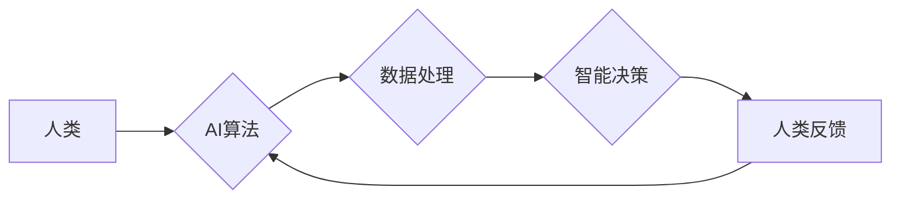

                 

## 以人为本的科技未来：人类计算的价值观

> 关键词： 人类计算、人工智能、伦理、可解释性、协同智能、未来趋势、价值观

### 1. 背景介绍

科技发展日新月异，人工智能（AI）作为科技发展的重要驱动力，正在深刻地改变着我们的生活和工作方式。从自动驾驶到医疗诊断，从个性化教育到智能客服，AI技术的应用场景日益广泛。然而，在AI技术飞速发展的过程中，我们也面临着一些重要的伦理和社会问题。如何确保AI技术的发展符合人类的价值观，如何避免AI技术带来的潜在风险，成为我们必须认真思考的问题。

人类计算的概念应运而生，它强调将人类的智慧和创造力与人工智能技术相结合，构建一种更加和谐、高效、人本化的科技未来。人类计算的核心在于将AI技术作为人类智能的扩展和工具，而不是替代人类智能。它强调人机协同，尊重人类价值，并致力于将科技发展成果更好地服务于人类社会。

### 2. 核心概念与联系

**2.1 人类计算的本质**

人类计算是一种将人类的认知能力、创造力、情感智能等与人工智能技术的计算能力相结合的全新计算模式。它强调人机协同，将人类的智慧融入到AI算法的设计、开发和应用过程中，从而构建更加智能、更加人性化的计算系统。

**2.2 人类计算的价值观**

人类计算的核心价值观包括：

* **以人为本:** 将人类的福祉和价值观作为科技发展的首要目标。
* **尊重伦理:** 遵循人类的道德规范和伦理原则，确保AI技术的发展符合人类的价值观。
* **可解释性:** 使AI算法更加透明、可理解，让人们能够理解AI的决策过程。
* **协同智能:** 强调人机协同，发挥人类和AI各自的优势，共同完成复杂的任务。
* **公平正义:** 确保AI技术应用公平公正，不产生歧视或偏见。

**2.3 人类计算的架构**



**图 1 人类计算架构**

从图 1 可以看出，人类计算是一个人机协同的循环系统。人类提供数据、目标和反馈，AI算法进行数据处理和智能决策，最终的结果反馈给人类，人类根据反馈进行调整和改进。

### 3. 核心算法原理 & 具体操作步骤

**3.1 算法原理概述**

人类计算的核心算法原理是基于深度学习和强化学习的算法，结合人类专家知识和反馈，实现人机协同智能。

* **深度学习:** 深度学习算法能够从海量数据中自动学习特征和模式，并进行预测和决策。
* **强化学习:** 强化学习算法通过奖励和惩罚机制，训练AI模型在特定环境中做出最优决策。

**3.2 算法步骤详解**

1. **数据收集和预处理:** 收集与任务相关的各种数据，并进行清洗、转换和格式化等预处理工作。
2. **模型构建:** 根据任务需求，选择合适的深度学习或强化学习算法，并构建相应的模型架构。
3. **模型训练:** 使用训练数据训练模型，调整模型参数，使其能够准确地完成任务。
4. **模型评估:** 使用测试数据评估模型的性能，并进行必要的调整和优化。
5. **人类反馈:** 将模型的预测结果展示给人类专家，并收集人类的反馈和标注。
6. **模型迭代:** 将人类反馈融入到模型训练过程中，不断迭代优化模型，提高模型的准确性和可靠性。

**3.3 算法优缺点**

**优点:**

* 能够学习复杂的数据模式，提高决策的准确性和效率。
* 能够不断学习和改进，适应不断变化的环境。
* 能够实现人机协同，发挥人类和AI各自的优势。

**缺点:**

* 需要大量的训练数据，数据质量对模型性能有重要影响。
* 模型训练过程可能需要很长时间，计算资源消耗较大。
* 模型的决策过程可能难以解释，缺乏透明度。

**3.4 算法应用领域**

人类计算算法在各个领域都有广泛的应用，例如：

* **医疗诊断:** 利用AI算法辅助医生诊断疾病，提高诊断的准确性和效率。
* **金融风险管理:** 利用AI算法识别金融风险，降低金融风险。
* **个性化教育:** 利用AI算法根据学生的学习情况提供个性化的学习方案。
* **智能客服:** 利用AI算法提供智能化的客服服务，提高客户体验。

### 4. 数学模型和公式 & 详细讲解 & 举例说明

**4.1 数学模型构建**

人类计算的数学模型可以基于概率论、统计学和机器学习等理论构建。例如，在医疗诊断领域，可以构建一个基于贝叶斯网络的数学模型，将患者的症状、病史、检查结果等信息作为输入，预测患者患某种疾病的概率。

**4.2 公式推导过程**

假设我们有一个贝叶斯网络模型，其中包含节点A（患者的症状）、节点B（患者的病史）、节点C（检查结果）和节点D（疾病诊断）。我们可以使用贝叶斯公式来计算疾病诊断的概率：

$$P(D|A,B,C) = \frac{P(A,B,C|D)P(D)}{P(A,B,C)}$$

其中：

* $P(D|A,B,C)$ 是患者患有疾病D的概率，给定症状A、病史B和检查结果C。
* $P(A,B,C|D)$ 是给定患者患有疾病D的情况下，患者出现症状A、病史B和检查结果C的联合概率。
* $P(D)$ 是患者患有疾病D的先验概率。
* $P(A,B,C)$ 是患者出现症状A、病史B和检查结果C的联合概率。

**4.3 案例分析与讲解**

假设我们有一个贝叶斯网络模型，用于预测患者患有感冒的概率。模型包含节点A（患者发烧）、节点B（患者咳嗽）、节点C（患者鼻塞）和节点D（感冒）。我们可以根据患者的症状、病史和检查结果，使用贝叶斯公式计算患者患感冒的概率。

例如，如果患者发烧、咳嗽和鼻塞，那么我们可以根据模型的参数和贝叶斯公式计算出患者患感冒的概率。

### 5. 项目实践：代码实例和详细解释说明

**5.1 开发环境搭建**

人类计算项目可以使用Python语言和相关的机器学习库进行开发，例如TensorFlow、PyTorch等。

**5.2 源代码详细实现**

以下是一个简单的基于TensorFlow的人类计算模型的代码示例：

```python
import tensorflow as tf

# 定义模型架构
model = tf.keras.models.Sequential([
  tf.keras.layers.Dense(128, activation='relu', input_shape=(10,)),
  tf.keras.layers.Dense(64, activation='relu'),
  tf.keras.layers.Dense(1, activation='sigmoid')
])

# 编译模型
model.compile(optimizer='adam',
              loss='binary_crossentropy',
              metrics=['accuracy'])

# 训练模型
model.fit(x_train, y_train, epochs=10)

# 评估模型
loss, accuracy = model.evaluate(x_test, y_test)
print('Loss:', loss)
print('Accuracy:', accuracy)
```

**5.3 代码解读与分析**

这段代码定义了一个简单的多层感知机模型，用于二分类任务。模型包含三个全连接层，第一层输入层有10个神经元，其他两层分别有128个和64个神经元。激活函数使用ReLU函数，输出层使用sigmoid函数进行二分类。

模型使用Adam优化器进行训练，损失函数使用二分类交叉熵损失函数，评价指标使用准确率。训练过程使用训练数据进行10个epochs的训练，最后使用测试数据评估模型的性能。

**5.4 运行结果展示**

训练完成后，模型的损失值和准确率会打印出来。

### 6. 实际应用场景

**6.1 医疗诊断辅助系统**

人类计算可以用于构建医疗诊断辅助系统，帮助医生更快、更准确地诊断疾病。例如，可以利用AI算法分析患者的影像数据、病史记录和实验室检查结果，并提供诊断建议。

**6.2 金融风险管理系统**

人类计算可以用于构建金融风险管理系统，帮助金融机构识别和评估金融风险。例如，可以利用AI算法分析市场数据、客户数据和交易数据，并预测潜在的风险事件。

**6.3 个性化教育系统**

人类计算可以用于构建个性化教育系统，根据学生的学习情况提供个性化的学习方案。例如，可以利用AI算法分析学生的学习进度、学习风格和知识掌握情况，并推荐相应的学习资源和练习题。

**6.4 智能客服系统**

人类计算可以用于构建智能客服系统，提供更加智能化和人性化的客服服务。例如，可以利用AI算法理解用户的自然语言输入，并提供准确、及时和个性化的回复。

**6.5 未来应用展望**

随着人工智能技术的不断发展，人类计算将在更多领域得到应用，例如：

* **自动驾驶:** 人类计算可以帮助自动驾驶系统更好地理解道路环境和交通规则，提高驾驶安全性和效率。
* **机器人技术:** 人类计算可以帮助机器人更好地理解人类指令和意图，提高机器人的智能化和适应性。
* **科学研究:** 人类计算可以帮助科学家更快、更有效地进行科学研究，例如药物研发、材料科学等。

### 7. 工具和资源推荐

**7.1 学习资源推荐**

* **在线课程:** Coursera、edX、Udacity等平台提供丰富的机器学习和人工智能课程。
* **书籍:** 《深度学习》、《机器学习实战》等书籍是学习机器学习和人工智能的经典教材。
* **开源项目:** TensorFlow、PyTorch等开源项目提供了丰富的代码示例和学习资源。

**7.2 开发工具推荐**

* **Python:** Python是一种流行的编程语言，广泛应用于机器学习和人工智能领域。
* **TensorFlow:** TensorFlow是一个开源的机器学习框架，提供丰富的功能和工具。
* **PyTorch:** PyTorch是一个开源的机器学习框架，以其灵活性和易用性而闻名。

**7.3 相关论文推荐**

* **《Attention Is All You Need》:** 这篇论文介绍了Transformer模型，是一种新的序列建模方法，在自然语言处理领域取得了突破性进展。
* **《Generative Adversarial Networks》:** 这篇论文介绍了生成对抗网络（GAN）模型，是一种生成式模型，能够生成逼真的图像、文本和音频等数据。

### 8. 总结：未来发展趋势与挑战

**8.1 研究成果总结**

人类计算是一个新兴的领域，近年来取得了显著的进展。深度学习和强化学习算法的不断发展，为人类计算提供了强大的技术支撑。

**8.2 未来发展趋势**

未来，人类计算将朝着以下几个方向发展：

* **更加智能化:** 人工智能算法将更加智能化，能够更好地理解人类意图和需求。
* **更加个性化:** 人类计算将更加个性化，能够根据用户的不同需求提供定制化的服务。
* **更加协同:** 人类和AI将更加协同，共同完成复杂的任务。

**8.3 面临的挑战**

人类计算也面临着一些挑战：

* **数据安全和隐私保护:** 人类计算需要处理大量的个人数据，因此数据安全和隐私保护是一个重要的挑战。
* **算法可解释性:** 人类难以理解复杂的AI算法，这可能会导致人们对AI技术的信任度下降。
* **伦理问题:** 人类计算可能会带来一些伦理问题，例如算法偏见、工作岗位替代等。

**8.4 研究展望**

为了克服这些挑战，我们需要加强对人类计算伦理、安全和可解释性的研究，并制定相应的规范和政策。同时，还需要加强与社会各界的沟通和合作，确保人类计算技术的发展符合人类的价值观和利益。

### 9. 附录：常见问题与解答

**9.1 如何确保人类计算的安全性？**

为了确保人类计算的安全性，我们需要采取以下措施：

* **数据加密和安全存储:** 对个人数据进行加密和安全存储，防止数据泄露。
* **算法审计和评估:** 对AI算法进行审计和评估，识别潜在的风险和漏洞。
* **安全监控和响应机制:** 建立安全监控和响应机制，及时发现和处理安全事件。

**9.2 如何提高人类计算的透明度？**

为了提高人类计算的透明度，我们可以采取以下措施：

* **开发可解释的AI算法:** 研究和开发能够解释其决策过程的AI算法。
* **提供算法文档和报告:** 对AI算法进行文档化，并提供详细的报告，说明算法的原理、功能和局限性。
* **建立公众参与机制:** 鼓励公众参与到AI算法的开发和评估过程中，提高算法的透明度和可信度。


作者：禅与计算机程序设计艺术 / Zen and the Art of Computer Programming 
<end_of_turn>

