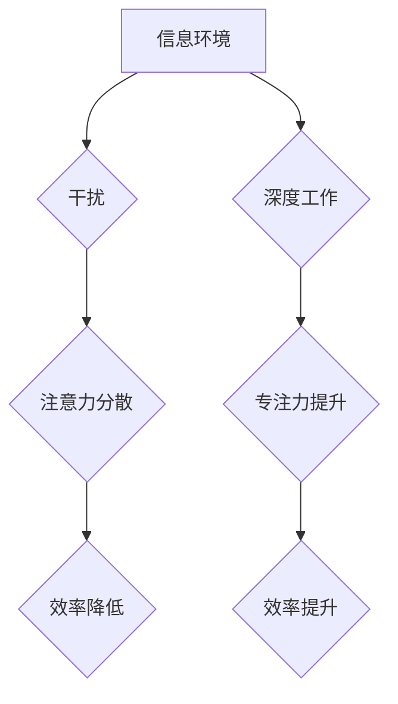

                 

## 信息时代的注意力管理：在充满干扰的世界中保持专注

> 关键词：注意力管理、深度工作、干扰、专注力、认知科学、信息 overload、时间管理、效率提升

### 1. 背景介绍

在当今信息爆炸的时代，我们被来自各个方向的信息和干扰所包围。手机、电子邮件、社交媒体、新闻推送，无时无刻不在争夺我们的注意力。这种持续不断的刺激和打断，严重损害了我们的专注力，降低了工作和学习效率。

注意力，是人类认知的核心能力之一，它决定了我们能够有效地处理信息、学习新知识、完成复杂任务的能力。然而，现代社会的信息环境对我们的注意力提出了前所未有的挑战。

根据一项研究，人类的平均注意力持续时间已经从过去20分钟缩短到仅仅8秒，这甚至比金鱼的注意力还短。这种注意力碎片化现象，不仅影响了我们的个人生活，也对社会生产力造成了巨大损失。

### 2. 核心概念与联系

#### 2.1  注意力机制

注意力机制是近年来深度学习领域取得的重要突破，它能够帮助模型聚焦于输入数据中最重要的部分，从而提高学习效率和准确性。

注意力机制的灵感来源于人类的注意力机制，我们通常会根据任务需求，选择性地关注某些信息，而忽略其他无关的信息。

#### 2.2  干扰与注意力

干扰是指任何能够分散我们注意力的事物，包括外部环境的噪音、社交媒体的通知、电子邮件的提醒等等。

干扰会打断我们的思维流程，降低我们的专注力，从而影响我们的工作和学习效率。

#### 2.3  深度工作与专注力

深度工作是指专注于一项任务，排除所有干扰，全身心投入，直到完成为止。

深度工作是提高效率、创造价值的关键，它能够帮助我们更好地理解复杂问题，产生更深刻的见解，并完成更复杂的任务。

**Mermaid 流程图**



### 3. 核心算法原理 & 具体操作步骤

#### 3.1  算法原理概述

注意力机制的核心原理是通过一个注意力权重来分配输入数据的关注度。

注意力权重可以根据输入数据的特征和任务需求进行动态调整，从而使模型能够聚焦于最重要的信息。

#### 3.2  算法步骤详解

1. **输入数据处理:** 将输入数据转换为模型能够理解的格式。
2. **特征提取:** 使用神经网络提取输入数据的特征。
3. **注意力计算:** 计算每个输入数据元素的注意力权重。
4. **加权求和:** 根据注意力权重对特征进行加权求和，得到最终的输出。

#### 3.3  算法优缺点

**优点:**

* 能够有效地聚焦于输入数据中最重要的部分。
* 能够提高模型的学习效率和准确性。
* 能够处理长序列数据。

**缺点:**

* 计算复杂度较高。
* 需要大量的训练数据。

#### 3.4  算法应用领域

注意力机制在自然语言处理、计算机视觉、机器翻译等领域都有广泛的应用。

### 4. 数学模型和公式 & 详细讲解 & 举例说明

#### 4.1  数学模型构建

注意力机制的数学模型通常基于一个注意力权重函数，该函数将输入数据映射到一个注意力权重向量。

注意力权重向量中的每个元素代表了输入数据元素的重要性。

#### 4.2  公式推导过程

注意力权重函数通常使用softmax函数来归一化，使其元素之和为1。

$$
\text{Attention}(Q, K, V) = \text{softmax}\left(\frac{Q K^T}{\sqrt{d_k}}\right) V
$$

其中：

* $Q$：查询矩阵
* $K$：键矩阵
* $V$：值矩阵
* $d_k$：键向量的维度

#### 4.3  案例分析与讲解

例如，在机器翻译任务中，可以使用注意力机制来帮助模型关注源语言句子中与目标语言句子相关的词语。

通过计算每个源语言词语的注意力权重，模型能够更好地理解源语言句子的含义，并生成更准确的翻译结果。

### 5. 项目实践：代码实例和详细解释说明

#### 5.1  开发环境搭建

可以使用Python语言和TensorFlow框架来实现注意力机制。

需要安装Python、TensorFlow和必要的库。

#### 5.2  源代码详细实现

```python
import tensorflow as tf

# 定义注意力机制层
class AttentionLayer(tf.keras.layers.Layer):
    def __init__(self, units):
        super(AttentionLayer, self).__init__()
        self.Wq = tf.keras.layers.Dense(units)
        self.Wk = tf.keras.layers.Dense(units)
        self.Wv = tf.keras.layers.Dense(units)
        self.dense = tf.keras.layers.Dense(units)

    def call(self, inputs):
        Q = self.Wq(inputs[0])
        K = self.Wk(inputs[1])
        V = self.Wv(inputs[2])
        attention_scores = tf.matmul(Q, K, transpose_b=True) / tf.math.sqrt(tf.cast(K.shape[-1], tf.float32))
        attention_weights = tf.nn.softmax(attention_scores, axis=-1)
        context_vector = tf.matmul(attention_weights, V)
        output = self.dense(context_vector)
        return output

# 使用注意力机制层
inputs = [tf.random.normal((1, 10, 64)), tf.random.normal((1, 10, 64)), tf.random.normal((1, 10, 64))]
attention_layer = AttentionLayer(units=64)
output = attention_layer(inputs)
print(output.shape)
```

#### 5.3  代码解读与分析

这段代码定义了一个注意力机制层，并使用它来处理三个输入张量。

* `Wq`, `Wk`, `Wv`：分别用于将查询、键和值向量映射到注意力权重空间。
* `attention_scores`：计算查询向量与键向量的点积，并进行归一化。
* `attention_weights`：使用softmax函数将注意力分数转换为注意力权重。
* `context_vector`：根据注意力权重对值向量进行加权求和，得到上下文向量。
* `output`：将上下文向量输入到一个全连接层，得到最终输出。

#### 5.4  运行结果展示

运行这段代码后，会输出一个形状为`(1, 10, 64)`的张量，表示注意力机制层的输出。

### 6. 实际应用场景

#### 6.1  信息过滤与推荐

注意力机制可以用于过滤信息流，识别重要的信息，并推荐相关的资源。

例如，社交媒体平台可以使用注意力机制来识别用户感兴趣的内容，并推荐给用户。

#### 6.2  个性化学习

注意力机制可以用于个性化学习，根据学生的学习进度和兴趣，推荐合适的学习内容。

例如，在线学习平台可以使用注意力机制来识别学生的学习难点，并提供针对性的帮助。

#### 6.3  医疗诊断

注意力机制可以用于医疗诊断，帮助医生识别病人的关键症状，并做出更准确的诊断。

例如，医学图像分析系统可以使用注意力机制来识别病灶区域，帮助医生进行诊断。

#### 6.4  未来应用展望

注意力机制在未来将有更广泛的应用，例如：

* 自动驾驶：帮助自动驾驶系统识别道路上的障碍物和行人。
* 机器翻译：提高机器翻译的准确性和流畅度。
* 自然语言生成：生成更自然、更流畅的文本。

### 7. 工具和资源推荐

#### 7.1  学习资源推荐

* **书籍:**

    * 《深度学习》
    * 《自然语言处理》

* **在线课程:**

    * Coursera: 深度学习
    * Udacity: 自然语言处理

#### 7.2  开发工具推荐

* **TensorFlow:** 深度学习框架
* **PyTorch:** 深度学习框架
* **Keras:** 深度学习 API

#### 7.3  相关论文推荐

* **Attention Is All You Need**
* **BERT: Pre-training of Deep Bidirectional Transformers for Language Understanding**

### 8. 总结：未来发展趋势与挑战

#### 8.1  研究成果总结

注意力机制是近年来深度学习领域取得的重要突破，它能够有效地聚焦于输入数据中最重要的部分，从而提高模型的学习效率和准确性。

注意力机制在自然语言处理、计算机视觉、机器翻译等领域都有广泛的应用。

#### 8.2  未来发展趋势

未来，注意力机制的研究将继续深入，包括：

* **更有效的注意力机制:** 研究更有效的注意力机制，提高模型的效率和准确性。
* **多模态注意力机制:** 研究能够处理多模态数据的注意力机制，例如文本、图像、音频等。
* **可解释性注意力机制:** 研究能够解释注意力机制决策过程的模型，提高模型的可解释性。

#### 8.3  面临的挑战

注意力机制也面临一些挑战，例如：

* **计算复杂度:** 一些注意力机制的计算复杂度较高，难以在资源有限的设备上运行。
* **数据依赖性:** 注意力机制需要大量的训练数据才能达到最佳效果。
* **可解释性:** 注意力机制的决策过程往往难以解释，这可能会影响模型的信任度。

#### 8.4  研究展望

尽管面临挑战，但注意力机制仍然是一个非常有前景的研究方向。

未来，随着研究的深入，注意力机制将会有更广泛的应用，并为人工智能的发展做出更大的贡献。

### 9. 附录：常见问题与解答

#### 9.1  Q1: 注意力机制和深度学习有什么关系？

**A1:** 注意力机制是一种深度学习中的重要技术，它能够帮助模型聚焦于输入数据中最重要的部分，从而提高模型的学习效率和准确性。

#### 9.2  Q2: 注意力机制有哪些应用场景？

**A2:** 注意力机制在自然语言处理、计算机视觉、机器翻译等领域都有广泛的应用。

#### 9.3  Q3: 如何实现注意力机制？

**A3:** 可以使用深度学习框架，例如TensorFlow和PyTorch，来实现注意力机制。

#### 9.4  Q4: 注意力机制的未来发展趋势是什么？

**A4:** 未来，注意力机制的研究将继续深入，包括研究更有效的注意力机制、多模态注意力机制和可解释性注意力机制。


作者：禅与计算机程序设计艺术 / Zen and the Art of Computer Programming 
<end_of_turn>

