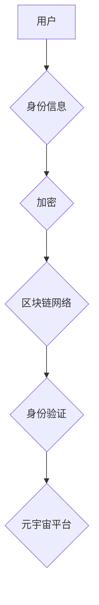

                 

## 元宇宙身份认证:区块链技术在身份管理中的应用

> 关键词：元宇宙、身份认证、区块链、去中心化、加密、数字身份、隐私保护

## 1. 背景介绍

元宇宙概念的兴起，标志着人类进入一个全新的数字世界。在这个虚拟世界中，用户将拥有虚拟身份，参与各种社交、娱乐、商业等活动。然而，元宇宙的蓬勃发展也带来了新的挑战，其中身份认证问题尤为突出。传统的身份认证方式在元宇宙环境下显得捉襟见肘，难以满足其对安全、隐私和去中心化的需求。

传统的身份认证系统通常依赖于集中式数据库，用户身份信息存储在服务器上，容易受到攻击和泄露。此外，这些系统缺乏用户数据控制权，用户无法自主管理自己的身份信息。元宇宙的去中心化特性要求身份认证系统也必须去中心化，用户拥有对自身身份信息的完全控制权。

区块链技术凭借其去中心化、不可篡改、透明的特点，为元宇宙身份认证提供了新的解决方案。区块链可以将用户的身份信息存储在分布式网络中，确保身份信息的安全性、不可篡改性和隐私性。

## 2. 核心概念与联系

### 2.1 元宇宙

元宇宙是一个融合了虚拟现实、增强现实、区块链等技术的虚拟世界，它是一个开放、共享、互联的数字空间，用户可以在其中创建、分享和体验虚拟内容。

### 2.2 区块链

区块链是一种分布式账本技术，它可以记录和验证交易信息，并将其存储在多个节点上，确保数据的安全性和不可篡改性。

### 2.3 身份认证

身份认证是指验证用户身份的过程，确保只有授权的用户才能访问系统或资源。

**区块链技术在元宇宙身份认证中的应用架构**



## 3. 核心算法原理 & 具体操作步骤

### 3.1 算法原理概述

元宇宙身份认证基于区块链技术，主要采用以下算法原理：

* **加密算法:** 用于对用户的身份信息进行加密，确保其安全性。常用的加密算法包括RSA、ECC等。
* **哈希算法:** 用于生成用户的身份标识，确保其唯一性。常用的哈希算法包括SHA-256、MD5等。
* **数字签名算法:** 用于验证用户的身份信息，确保其真实性。常用的数字签名算法包括DSA、ECDSA等。

### 3.2 算法步骤详解

1. **用户注册:** 用户向身份认证系统提交身份信息，并选择一个密码。
2. **身份信息加密:** 系统使用加密算法对用户的身份信息进行加密，生成加密后的身份数据。
3. **哈希生成身份标识:** 系统使用哈希算法对加密后的身份数据进行哈希运算，生成用户的唯一身份标识。
4. **数字签名验证:** 用户使用私钥对身份标识进行数字签名，并提交给系统。
5. **身份验证:** 系统使用公钥验证用户的数字签名，确认用户的身份信息真实性。
6. **身份信息存储:** 系统将用户的身份标识和相关信息存储在区块链网络中，形成不可篡改的记录。

### 3.3 算法优缺点

**优点:**

* **安全性:** 区块链技术的去中心化和不可篡改性，确保身份信息的安全性。
* **隐私性:** 用户可以自主控制自己的身份信息，选择哪些信息公开，哪些信息隐藏。
* **去中心化:** 用户身份信息不再依赖于单一机构，提高了系统的可靠性和抗攻击性。

**缺点:**

* **技术复杂性:** 区块链技术本身较为复杂，需要专业的技术人员进行开发和维护。
* **性能瓶颈:** 区块链网络的处理能力有限，可能无法满足元宇宙高并发访问的需求。
* **可扩展性:** 区块链网络的扩展性有限，需要不断改进技术才能满足元宇宙不断增长的用户规模。

### 3.4 算法应用领域

* **元宇宙游戏:** 用户可以使用区块链身份认证系统在游戏中创建虚拟角色，并拥有对角色资产的控制权。
* **元宇宙社交平台:** 用户可以使用区块链身份认证系统在社交平台上建立真实身份，并进行安全可靠的社交互动。
* **元宇宙电商平台:** 用户可以使用区块链身份认证系统在电商平台上进行安全可靠的交易，并保护自己的个人信息。

## 4. 数学模型和公式 & 详细讲解 & 举例说明

### 4.1 数学模型构建

元宇宙身份认证系统可以采用基于密码学的数学模型，其中包括：

* **公钥加密:** 使用公钥加密算法对用户的身份信息进行加密，只有持有对应私钥的用户才能解密。
* **哈希函数:** 使用哈希函数将用户的身份信息转换为唯一的哈希值，用于生成身份标识。
* **数字签名:** 使用数字签名算法对用户的身份标识进行签名，验证用户的身份真实性。

### 4.2 公式推导过程

* **公钥加密:**

$$C = E_pk(M)$$

其中：

* $C$ 为加密后的身份信息
* $E_pk$ 为公钥加密算法
* $M$ 为用户的身份信息
* $p$ 为公钥

* **哈希函数:**

$$H(M) = h$$

其中：

* $H$ 为哈希函数
* $M$ 为用户的身份信息
* $h$ 为哈希值

* **数字签名:**

$$S = D_sk(H(M))$$

其中：

* $S$ 为数字签名
* $D_sk$ 为私钥解密算法
* $H(M)$ 为用户的身份信息的哈希值
* $s$ 为私钥

### 4.3 案例分析与讲解

假设用户Alice想要在元宇宙平台上注册身份。

1. Alice选择一个密码并将其加密，生成加密后的密码 $P_a$.
2. Alice使用哈希函数对加密后的密码进行哈希运算，生成她的身份标识 $ID_a$.
3. Alice使用私钥对身份标识进行数字签名，生成数字签名 $S_a$.
4. Alice将加密后的密码 $P_a$、身份标识 $ID_a$ 和数字签名 $S_a$ 发送给元宇宙平台。
5. 元宇宙平台使用Alice的公钥解密加密后的密码，并使用公钥验证Alice的数字签名，确认Alice的身份真实性。
6. 元宇宙平台将Alice的 $ID_a$ 和相关信息存储在区块链网络中，形成不可篡改的记录。

## 5. 项目实践：代码实例和详细解释说明

### 5.1 开发环境搭建

* **编程语言:** Solidity (用于开发智能合约)
* **区块链平台:** Ethereum (以太坊)
* **开发工具:** Remix IDE (在线智能合约开发环境)

### 5.2 源代码详细实现

```solidity
pragma solidity ^0.8.0;

contract IdentityManagement {

    mapping(address => string) public identities;

    function registerIdentity(string memory _identity) public {
        identities[msg.sender] = _identity;
    }

    function getIdentity(address _user) public view returns (string memory) {
        return identities[_user];
    }
}
```

### 5.3 代码解读与分析

* `pragma solidity ^0.8.0;`: 指定合约的 Solidity 版本。
* `contract IdentityManagement`: 定义一个名为 `IdentityManagement` 的智能合约。
* `mapping(address => string) public identities;`: 定义一个映射数据结构，用于存储用户的地址和身份信息。
* `function registerIdentity(string memory _identity) public`: 定义一个名为 `registerIdentity` 的函数，用于用户注册身份。
* `identities[msg.sender] = _identity;`: 将用户的地址和身份信息存储在映射数据结构中。
* `function getIdentity(address _user) public view returns (string memory)`: 定义一个名为 `getIdentity` 的函数，用于查询用户的身份信息。

### 5.4 运行结果展示

当用户调用 `registerIdentity` 函数注册身份时，智能合约会将用户的地址和身份信息存储在区块链网络中，形成不可篡改的记录。用户可以通过调用 `getIdentity` 函数查询自己的身份信息。

## 6. 实际应用场景

### 6.1 元宇宙游戏

在元宇宙游戏中，玩家可以使用区块链身份认证系统创建虚拟角色，并拥有对角色资产的控制权。例如，玩家可以将自己的NFT资产绑定到角色上，并在游戏中进行交易。

### 6.2 元宇宙社交平台

在元宇宙社交平台上，用户可以使用区块链身份认证系统建立真实身份，并进行安全可靠的社交互动。例如，用户可以验证对方的身份信息，确保其真实性，并进行私密聊天。

### 6.3 元宇宙电商平台

在元宇宙电商平台上，用户可以使用区块链身份认证系统进行安全可靠的交易，并保护自己的个人信息。例如，用户可以使用数字签名进行交易验证，确保交易的安全性，并保护自己的支付信息。

### 6.4 未来应用展望

随着元宇宙的发展，区块链身份认证系统将在更多领域得到应用，例如：

* **元宇宙教育:** 用户可以使用区块链身份认证系统获得教育证书，并进行在线学习。
* **元宇宙医疗:** 用户可以使用区块链身份认证系统管理自己的医疗信息，并进行远程医疗。
* **元宇宙金融:** 用户可以使用区块链身份认证系统进行金融交易，并获得金融服务。

## 7. 工具和资源推荐

### 7.1 学习资源推荐

* **区块链技术入门书籍:** 《区块链技术入门》
* **区块链技术在线课程:** Coursera、Udemy
* **区块链技术社区:** Ethereum.org、Bitcoin.org

### 7.2 开发工具推荐

* **Remix IDE:** 在线智能合约开发环境
* **Truffle Suite:** 智能合约测试和部署工具
* **Ganache:** 本地区块链测试环境

### 7.3 相关论文推荐

* **"A Blockchain-Based Identity Management System for the Metaverse"**
* **"Decentralized Identity Management in the Metaverse"**

## 8. 总结：未来发展趋势与挑战

### 8.1 研究成果总结

元宇宙身份认证系统基于区块链技术，具有安全性、隐私性和去中心化的特点，为元宇宙的发展提供了新的解决方案。

### 8.2 未来发展趋势

* **更完善的隐私保护机制:** 研究更有效的隐私保护机制，确保用户数据安全。
* **更高的性能和可扩展性:** 提升区块链网络的性能和可扩展性，满足元宇宙高并发访问的需求。
* **更广泛的应用场景:** 将区块链身份认证系统应用到更多元宇宙领域，例如教育、医疗、金融等。

### 8.3 面临的挑战

* **技术复杂性:** 区块链技术本身较为复杂，需要专业的技术人员进行开发和维护。
* **监管政策:** 缺乏完善的监管政策，可能阻碍区块链技术的应用发展。
* **用户接受度:** 用户对区块链技术的了解和接受度仍然有限。

### 8.4 研究展望

未来，我们将继续研究区块链技术在元宇宙身份认证领域的应用，探索更安全、更隐私、更便捷的解决方案，为元宇宙的发展贡献力量。

## 9. 附录：常见问题与解答

* **Q1: 区块链身份认证系统是否安全？**

A1: 区块链技术的去中心化和不可篡改性，确保了身份信息的安全性。

* **Q2: 区块链身份认证系统是否隐私？**

A2: 用户可以自主控制自己的身份信息，选择哪些信息公开，哪些信息隐藏，保障了用户的隐私性。

* **Q3: 如何使用区块链身份认证系统？**

A3: 用户需要注册一个区块链钱包，并使用智能合约进行身份认证操作。

* **Q4: 区块链身份认证系统有哪些应用场景？**

A4: 区块链身份认证系统可以应用于元宇宙游戏、社交平台、电商平台等领域。


作者：禅与计算机程序设计艺术 / Zen and the Art of Computer Programming 
<end_of_turn>

