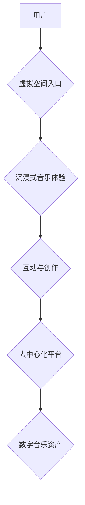

                 

## 元宇宙音乐:跨越时空的听觉盛宴

> 关键词：元宇宙、音乐、音频技术、沉浸式体验、人工智能、区块链、NFT

## 1. 背景介绍

音乐，作为人类文明的重要组成部分，自古以来就以其独特的魅力影响着人们的生活。随着科技的进步，音乐的传播和体验方式也在不断革新。元宇宙的出现，为音乐行业带来了前所未有的机遇，它将音乐从二维平面拉入三维空间，创造出更加沉浸式、互动性和个性化的听觉体验。

元宇宙音乐的概念，指的是在虚拟世界中构建的音乐体验环境。在这个环境中，用户可以身临其境地感受音乐，与其他用户互动，创作和分享音乐，甚至可以与虚拟音乐人进行交流。元宇宙音乐的出现，将音乐从传统的消费模式转变为一种参与式体验，赋予音乐全新的生命力。

## 2. 核心概念与联系

元宇宙音乐的核心概念包括：虚拟空间、沉浸式体验、互动性、去中心化和数字所有权。

* **虚拟空间:** 元宇宙音乐的舞台是虚拟空间，用户可以通过虚拟现实（VR）或增强现实（AR）技术进入这个空间，体验身临其境的音乐表演。
* **沉浸式体验:** 元宇宙音乐利用3D音频技术、视觉特效和互动元素，创造出更加沉浸式的听觉体验，让用户仿佛置身于音乐之中。
* **互动性:** 元宇宙音乐打破了传统的单向音乐消费模式，用户可以与音乐人、其他用户互动，共同创作音乐，参与音乐表演，甚至可以影响音乐的走向。
* **去中心化:** 元宇宙音乐平台通常基于区块链技术，用户可以拥有自己的数字音乐资产，并通过去中心化应用进行交易和分享。
* **数字所有权:** 元宇宙音乐平台支持NFT（不可替代代币）技术，用户可以拥有独一无二的数字音乐作品，并将其进行交易和收藏。

**元宇宙音乐架构流程图:**



## 3. 核心算法原理 & 具体操作步骤

### 3.1  算法原理概述

元宇宙音乐的核心算法主要包括：

* **3D音频渲染算法:** 用于模拟声音在三维空间中的传播和反射，创造出更加逼真的沉浸式听觉体验。
* **音乐生成算法:** 用于根据用户输入或其他数据生成新的音乐作品，例如基于人工智能的音乐创作算法。
* **用户行为分析算法:** 用于分析用户的音乐偏好和行为模式，提供个性化的音乐推荐和互动体验。
* **去中心化平台算法:** 用于管理数字音乐资产的交易和分享，确保平台的安全性、透明性和公平性。

### 3.2  算法步骤详解

**3D音频渲染算法步骤:**

1. **声音源定位:** 确定声音在虚拟空间中的位置。
2. **声音传播模拟:** 根据声音源的位置、虚拟空间的几何形状和材质特性，模拟声音在空间中的传播路径。
3. **声音反射处理:** 模拟声音在虚拟空间中的反射和散射，增加声音的真实感。
4. **音频信号混合:** 将所有经过处理的声音信号混合在一起，生成最终的3D音频输出。

**音乐生成算法步骤:**

1. **数据输入:** 收集用户输入或其他数据，例如音乐风格、节奏、旋律等。
2. **特征提取:** 从输入数据中提取音乐特征，例如音调、节奏、和声等。
3. **音乐模型训练:** 利用机器学习算法训练音乐生成模型，使其能够根据提取的特征生成新的音乐作品。
4. **音乐生成:** 将用户输入或其他数据输入到训练好的音乐模型中，生成新的音乐作品。

### 3.3  算法优缺点

**3D音频渲染算法:**

* **优点:** 可以创造出更加逼真的沉浸式听觉体验，增强用户对音乐的感知和参与度。
* **缺点:** 计算复杂度高，对硬件性能要求较高。

**音乐生成算法:**

* **优点:** 可以根据用户需求生成个性化的音乐作品，丰富音乐创作的可能性。
* **缺点:** 目前生成的音乐作品仍然缺乏情感和创意，难以完全替代人类音乐创作。

### 3.4  算法应用领域

* **游戏音乐:** 为游戏场景创造更加沉浸式的听觉体验。
* **虚拟音乐会:** 举办虚拟音乐会，让用户身临其境地感受音乐表演。
* **音乐创作工具:** 为音乐人提供新的创作工具，帮助他们生成新的音乐作品。
* **个性化音乐推荐:** 根据用户的音乐偏好，推荐个性化的音乐作品。

## 4. 数学模型和公式 & 详细讲解 & 举例说明

### 4.1  数学模型构建

元宇宙音乐的数学模型主要涉及音频信号处理、3D空间几何计算、用户行为分析等领域。

**3D音频渲染模型:**

该模型利用声波传播方程和几何学原理，模拟声音在虚拟空间中的传播和反射。

**音乐生成模型:**

该模型通常基于深度学习算法，例如循环神经网络（RNN）或变分自编码器（VAE），利用音乐数据训练模型，使其能够生成新的音乐作品。

### 4.2  公式推导过程

**声波传播方程:**

$$
\frac{\partial^2 p}{\partial t^2} = c^2 \nabla^2 p
$$

其中：

* $p$ 为声压
* $t$ 为时间
* $c$ 为声速
* $\nabla^2$ 为拉普拉斯算符

**音乐生成模型损失函数:**

$$
L = \sum_{i=1}^{N} ||y_i - \hat{y}_i||^2
$$

其中：

* $y_i$ 为真实音乐数据
* $\hat{y}_i$ 为模型生成的音乐数据
* $N$ 为数据样本数量

### 4.3  案例分析与讲解

**3D音频渲染案例:**

在虚拟音乐会中，可以使用3D音频渲染算法，让观众感受到音乐从不同方向传来，仿佛身临其境地感受音乐表演。

**音乐生成案例:**

可以使用音乐生成算法，根据用户的音乐风格偏好，生成个性化的音乐作品，例如为用户创作一首根据其喜欢的音乐风格和节奏生成的歌曲。

## 5. 项目实践：代码实例和详细解释说明

### 5.1  开发环境搭建

元宇宙音乐项目开发环境通常包括：

* **编程语言:** Python、C++、JavaScript等
* **音频处理库:** PyAudio、Librosa、SoundFile等
* **3D图形库:** Unity、Unreal Engine、Three.js等
* **区块链框架:** Ethereum、Hyperledger Fabric等

### 5.2  源代码详细实现

以下是一个简单的Python代码示例，演示如何使用PyAudio库播放3D音频：

```python
import pyaudio
import numpy as np

# 音频数据
audio_data = np.random.rand(10000)

# 音频参数
sample_rate = 44100
channels = 2
duration = 1

# 创建PyAudio对象
p = pyaudio.PyAudio()

# 打开音频流
stream = p.open(format=pyaudio.paFloat32,
                channels=channels,
                rate=sample_rate,
                output=True)

# 播放音频数据
stream.write(audio_data.astype(np.float32).tobytes())

# 关闭音频流
stream.stop_stream()
stream.close()

# 关闭PyAudio对象
p.terminate()
```

### 5.3  代码解读与分析

这段代码首先导入必要的库，然后创建音频数据、音频参数和PyAudio对象。接着，打开音频流，并将音频数据写入流中，最后关闭音频流和PyAudio对象。

### 5.4  运行结果展示

运行这段代码后，将播放一段随机生成的音频。

## 6. 实际应用场景

### 6.1  虚拟音乐会

元宇宙音乐可以用于举办虚拟音乐会，让用户身临其境地感受音乐表演。用户可以身穿虚拟服装，坐在虚拟观众席上，欣赏虚拟音乐人演唱的歌曲。

### 6.2  音乐游戏

元宇宙音乐可以融入音乐游戏，为游戏增添更加沉浸式的听觉体验。例如，在节奏游戏中，用户可以根据音乐节奏进行操作，在音乐冒险游戏中，音乐可以引导玩家探索虚拟世界。

### 6.3  音乐创作工具

元宇宙音乐可以为音乐人提供新的创作工具，例如基于人工智能的音乐生成工具，可以帮助音乐人快速生成音乐旋律、和声和节奏。

### 6.4  未来应用展望

元宇宙音乐的应用场景还在不断拓展，未来可能会有更多创新应用出现，例如：

* **虚拟音乐工作室:** 用户可以在虚拟空间中与其他音乐人合作创作音乐。
* **音乐社交平台:** 用户可以与其他音乐爱好者互动，分享音乐作品，参加音乐活动。
* **音乐教育平台:** 用户可以利用元宇宙音乐学习音乐知识，练习音乐技能。

## 7. 工具和资源推荐

### 7.1  学习资源推荐

* **书籍:**

    * 《The Metaverse: And How It Will Revolutionize Everything》
    * 《Metaverse: The Next Evolution of the Internet》

* **在线课程:**

    * Coursera: Metaverse and Web3
    * Udemy: Metaverse Development

### 7.2  开发工具推荐

* **虚拟现实平台:**

    * Unity
    * Unreal Engine

* **增强现实平台:**

    * ARKit
    * ARCore

* **区块链框架:**

    * Ethereum
    * Hyperledger Fabric

### 7.3  相关论文推荐

* **Metaverse Music: A Survey**
* **Immersive Audio for the Metaverse**
* **Decentralized Music Streaming in the Metaverse**

## 8. 总结：未来发展趋势与挑战

### 8.1  研究成果总结

元宇宙音乐是一个新兴领域，近年来取得了显著进展。3D音频渲染技术、音乐生成算法、去中心化平台技术等关键技术不断发展，为元宇宙音乐的构建提供了技术基础。

### 8.2  未来发展趋势

元宇宙音乐的未来发展趋势包括：

* **更加沉浸式的听觉体验:** 利用更先进的音频渲染技术和硬件设备，创造更加逼真的虚拟音乐环境。
* **更加个性化的音乐创作和分享:** 利用人工智能和区块链技术，让用户能够更加自由地创作和分享音乐作品。
* **更加丰富的音乐互动体验:** 

利用虚拟现实和增强现实技术，创造更加丰富的音乐互动体验，例如虚拟音乐会、音乐游戏、音乐社交平台等。

### 8.3  面临的挑战

元宇宙音乐的发展也面临着一些挑战，例如：

* **技术挑战:** 

元宇宙音乐需要整合多种技术，例如音频处理、3D图形、区块链等，技术实现难度较大。
* **内容挑战:** 元宇宙音乐需要丰富的音乐内容，需要音乐人、音乐平台和用户共同努力。
* **商业模式挑战:** 元宇宙音乐的商业模式尚不成熟，需要探索新的商业模式。

### 8.4  研究展望

未来，元宇宙音乐将继续发展壮大，成为数字文化的重要组成部分。研究者需要继续探索元宇宙音乐的技术、内容和商业模式，为用户创造更加丰富、精彩的音乐体验。

## 9. 附录：常见问题与解答

**Q1: 元宇宙音乐和传统音乐有什么区别？**

**A1:** 元宇宙音乐和传统音乐的主要区别在于体验方式。传统音乐是单向的，用户只能被动地聆听。而元宇宙音乐是互动式的，用户可以身临其境地感受音乐，与音乐人、其他用户互动，甚至可以影响音乐的走向。

**Q2: 元宇宙音乐需要什么硬件设备？**

**A2:** 元宇宙音乐可以利用多种硬件设备，例如电脑、手机、VR头显、AR眼镜等。

**Q3: 元宇宙音乐的商业模式是什么？**

**A3:** 元宇宙音乐的商业模式尚不成熟，可能包括虚拟音乐会门票销售、音乐作品版权交易、虚拟音乐道具销售等。


作者：禅与计算机程序设计艺术 / Zen and the Art of Computer Programming 
<end_of_turn>

