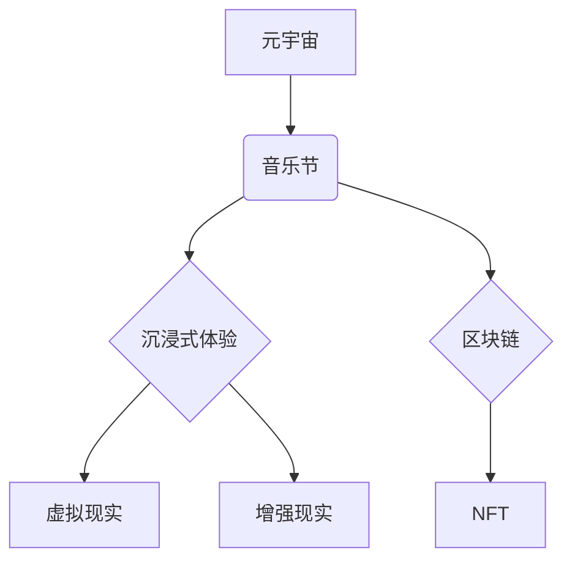

                 

## 元宇宙音乐节:跨越时空的听觉艺术盛宴

> 关键词：元宇宙、音乐节、沉浸式体验、区块链、NFT、Web3、虚拟现实、增强现实、音频技术、人工智能

## 1. 背景介绍

音乐节作为一种集娱乐、社交、文化于一体的盛大活动，一直以来都吸引着来自世界各地的音乐爱好者。然而，传统的音乐节受限于时间、空间和地理位置等因素，无法满足所有人的需求。随着元宇宙概念的兴起，一场全新的音乐节体验即将到来——元宇宙音乐节。

元宇宙音乐节将利用虚拟现实 (VR)、增强现实 (AR) 和区块链等前沿技术，构建一个沉浸式的虚拟世界，让用户能够跨越时空，与来自世界各地的音乐爱好者和艺术家互动，共同享受一场前所未有的听觉盛宴。

## 2. 核心概念与联系

元宇宙音乐节的核心概念包括：

* **元宇宙:**  一个由虚拟世界、数字资产和去中心化网络组成的虚拟空间，用户可以在其中创建、分享和体验内容。
* **音乐节:**  一种大型的音乐表演活动，通常包括多个舞台、各种音乐类型和丰富的周边活动。
* **沉浸式体验:**  通过虚拟现实、增强现实等技术，让用户身临其境地感受音乐节的氛围和魅力。
* **区块链:**  一种去中心化的分布式账本技术，可以用于管理音乐节的虚拟资产、票务和版权等。
* **NFT:**  不可替代的代币，可以代表音乐节的独一无二的虚拟物品，例如演唱会门票、限量版周边等。

**核心概念架构图:**



## 3. 核心算法原理 & 具体操作步骤

元宇宙音乐节的实现需要多种算法的协同工作，例如：

* **音频渲染算法:**  将数字音频信号转换为用户可以听到的声音，并根据用户的设备和环境进行调整。
* **虚拟场景渲染算法:**  生成逼真的虚拟场景，包括舞台、观众席、周边环境等。
* **用户交互算法:**  处理用户的输入和反馈，例如手势控制、语音识别等，并将其转化为虚拟世界中的动作。
* **网络传输算法:**  保证音乐节的流畅运行，包括音频、视频和用户数据等信息的传输。

### 3.1  算法原理概述

元宇宙音乐节的核心算法原理主要基于以下几个方面：

* **实时音频处理:**  利用实时音频处理技术，将音频信号进行压缩、编码和传输，保证音乐节的实时性和流畅性。
* **3D图形渲染:**  利用3D图形渲染技术，生成逼真的虚拟场景，并根据用户的视角进行动态渲染。
* **用户交互:**  利用手势识别、语音识别等技术，实现用户与虚拟世界的交互，例如控制视角、选择音乐、与其他用户聊天等。
* **网络协同:**  利用分布式网络技术，将音乐节的各个部分进行协同工作，保证音乐节的稳定性和可靠性。

### 3.2  算法步骤详解

元宇宙音乐节的具体操作步骤可以概括为以下几个阶段：

1. **场景搭建:**  利用3D建模软件，构建虚拟音乐节的场景，包括舞台、观众席、周边环境等。
2. **音频处理:**  将音乐曲目进行压缩、编码和格式转换，并根据用户的设备和网络环境进行调整。
3. **用户登录:**  用户通过VR头显、AR眼镜或电脑等设备登录元宇宙音乐节的平台。
4. **场景渲染:**  根据用户的视角和设备，实时渲染虚拟音乐节的场景。
5. **音频播放:**  将音频信号传输到用户的设备，并根据用户的设备和环境进行调整。
6. **用户交互:**  用户可以通过手势控制、语音识别等方式与虚拟世界进行交互，例如选择音乐、与其他用户聊天等。
7. **数据记录:**  平台记录用户的活动数据，例如观看时间、互动行为等，用于分析和改进音乐节体验。

### 3.3  算法优缺点

元宇宙音乐节的算法具有以下优点：

* **沉浸式体验:**  通过虚拟现实和增强现实技术，用户可以身临其境地感受音乐节的氛围和魅力。
* **跨越时空:**  用户可以不受时间和空间的限制，参与来自世界各地的音乐节。
* **个性化定制:**  用户可以根据自己的喜好选择音乐、场景和互动方式，打造个性化的音乐节体验。

但也存在一些缺点：

* **技术门槛:**  元宇宙音乐节的开发和运营需要较高的技术门槛，需要整合多种前沿技术。
* **硬件成本:**  用户需要配备VR头显、AR眼镜或其他设备才能体验元宇宙音乐节，硬件成本较高。
* **网络依赖:**  元宇宙音乐节的运行需要稳定的网络连接，网络延迟或中断会影响用户体验。

### 3.4  算法应用领域

元宇宙音乐节的算法技术可以应用于以下领域：

* **虚拟演唱会:**  为艺术家提供一个虚拟舞台，让粉丝们可以身临其境地观看演唱会。
* **在线音乐教育:**  为音乐爱好者提供一个虚拟的学习环境，可以学习乐器演奏、音乐理论等知识。
* **音乐游戏:**  开发基于元宇宙的音乐游戏，让玩家可以沉浸在音乐的世界中。
* **虚拟社交平台:**  构建一个虚拟的社交平台，让用户可以与其他音乐爱好者互动，分享音乐和体验。

## 4. 数学模型和公式 & 详细讲解 & 举例说明

元宇宙音乐节的实现需要利用多种数学模型和公式，例如：

* **音频信号处理:**  利用傅里叶变换、滤波器等数学工具进行音频信号的压缩、编码和解码。
* **3D图形渲染:**  利用投影变换、光照模型等数学模型生成逼真的虚拟场景。
* **用户交互:**  利用线性代数、概率论等数学工具处理用户输入和反馈，实现用户与虚拟世界的交互。

### 4*1  数学模型构建

元宇宙音乐节的数学模型主要包括以下几个方面：

* **音频信号模型:**  描述音频信号的时域和频域特性，例如波形、频率、振幅等。
* **3D场景模型:**  描述虚拟场景的几何形状、材质、纹理等信息。
* **用户交互模型:**  描述用户与虚拟世界的交互方式，例如手势识别、语音识别等。

### 4.2  公式推导过程

例如，在音频信号处理方面，可以使用傅里叶变换将音频信号从时域转换为频域，从而进行音频压缩和编码。傅里叶变换的公式如下：

$$
X(f) = \int_{-\infty}^{\infty} x(t) e^{-2\pi i f t} dt
$$

其中：

* $X(f)$ 是音频信号在频率 $f$ 处的幅度谱。
* $x(t)$ 是音频信号在时间 $t$ 处的波形。

### 4.3  案例分析与讲解

例如，在3D场景渲染方面，可以使用光照模型计算物体在不同光照条件下的颜色和亮度。一种常用的光照模型是 Phong 模型，其公式如下：

$$
I = I_a + I_d + I_s
$$

其中：

* $I$ 是物体在某个点的最终颜色。
* $I_a$ 是环境光照强度。
* $I_d$ 是漫反射光照强度。
* $I_s$ 是镜面反射光照强度。

## 5. 项目实践：代码实例和详细解释说明

元宇宙音乐节的开发需要多种编程语言和技术，例如：

* **C++:**  用于开发高性能的音频渲染引擎和3D图形渲染引擎。
* **Python:**  用于开发用户交互逻辑、数据分析和人工智能算法。
* **Unity:**  用于构建虚拟场景和游戏逻辑。
* **Unreal Engine:**  用于构建高品质的虚拟场景和游戏体验。

### 5.1  开发环境搭建

开发元宇宙音乐节的开发环境需要包含以下软件和硬件：

* **操作系统:**  Windows、macOS 或 Linux。
* **编程语言:**  C++、Python 等。
* **开发工具:**  IDE、编译器、调试器等。
* **虚拟现实头显:**  Oculus Rift、HTC Vive 等。
* **增强现实眼镜:**  Google Glass、Microsoft HoloLens 等。

### 5.2  源代码详细实现

由于篇幅限制，这里只提供一个简单的音频渲染代码示例，用于演示音频信号的播放：

```python
import pyaudio

# 初始化音频流
p = pyaudio.PyAudio()
stream = p.open(format=pyaudio.paFloat32,
                channels=1,
                rate=44100,
                output=True)

# 读取音频数据
with open("music.wav", "rb") as f:
    data = f.read()

# 将音频数据转换为浮点数
data = np.frombuffer(data, dtype=np.float32)

# 播放音频数据
stream.write(data)

# 关闭音频流
stream.stop_stream()
stream.close()
p.terminate()
```

### 5.3  代码解读与分析

这段代码首先使用pyaudio库初始化音频流，然后读取音频文件，将音频数据转换为浮点数格式，最后将音频数据写入音频流，播放音乐。

### 5.4  运行结果展示

运行这段代码后，将播放名为"music.wav"的音频文件。

## 6. 实际应用场景

元宇宙音乐节的实际应用场景非常广泛，例如：

* **虚拟演唱会:**  为艺术家提供一个虚拟舞台，让粉丝们可以身临其境地观看演唱会。
* **音乐节体验:**  为音乐爱好者提供一个虚拟的音乐节体验，可以欣赏来自世界各地的音乐表演，与其他音乐爱好者互动。
* **音乐教育:**  为音乐爱好者提供一个虚拟的学习环境，可以学习乐器演奏、音乐理论等知识。
* **音乐游戏:**  开发基于元宇宙的音乐游戏，让玩家可以沉浸在音乐的世界中。

### 6.4  未来应用展望

未来，元宇宙音乐节将更加沉浸式、互动性和个性化。例如：

* **增强现实音乐节:**  将虚拟音乐节元素叠加到现实世界中，让用户可以身临其境地体验音乐节的氛围。
* **人工智能音乐节:**  利用人工智能技术，生成个性化的音乐推荐、虚拟乐队表演等。
* **元宇宙音乐创作:**  让用户可以参与到音乐创作中，例如创作虚拟乐器、虚拟音乐作品等。

## 7. 工具和资源推荐

### 7.1  学习资源推荐

* **书籍:**  《元宇宙：下一个互联网》
* **网站:**  Metaverse.org、Decentraland.org
* **课程:**  Coursera、edX 等平台上的元宇宙相关课程

### 7.2  开发工具推荐

* **Unity:**  https://unity.com/
* **Unreal Engine:**  https://www.unrealengine.com/
* **Blender:**  https://www.blender.org/

### 7.3  相关论文推荐

* **The Metaverse: A New Paradigm for Social Interaction and Collaboration**
* **Decentralized Music Streaming in the Metaverse**

## 8. 总结：未来发展趋势与挑战

元宇宙音乐节作为一种全新的音乐体验方式，具有巨大的发展潜力。未来，元宇宙音乐节将更加沉浸式、互动性和个性化，并与其他领域，例如游戏、社交、教育等融合，形成一个庞大的元宇宙生态系统。

然而，元宇宙音乐节的发展也面临着一些挑战，例如：

* **技术挑战:**  元宇宙音乐节的开发和运营需要整合多种前沿技术，例如虚拟现实、增强现实、区块链等，技术难度较高。
* **内容挑战:**  元宇宙音乐节需要丰富的优质内容才能吸引用户，例如虚拟音乐表演、音乐游戏、音乐教育等。
* **商业模式挑战:**  元宇宙音乐节的商业模式尚不成熟，需要探索新的盈利模式。

## 9. 附录：常见问题与解答

**Q1: 元宇宙音乐节需要哪些设备才能体验？**

A1: 元宇宙音乐节可以体验多种设备，例如VR头显、AR眼镜、电脑、手机等。

**Q2: 元宇宙音乐节的音乐版权如何保障？**

A2: 元宇宙音乐节可以利用区块链技术来保障音乐版权，例如使用NFT来代表音乐作品的独一无二的版权。

**Q3: 元宇宙音乐节的安全性如何保障？**

A3: 元宇宙音乐节的平台需要采取相应的安全措施，例如身份验证、数据加密等，保障用户的个人信息和财产安全。


作者：禅与计算机程序设计艺术 / Zen and the Art of Computer Programming 
<end_of_turn>

