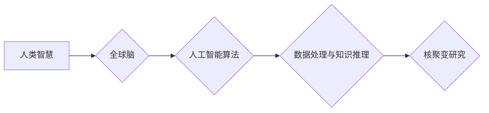

                 

## 全球脑与核聚变研究:集体智慧助力能源技术突破

> 关键词：全球脑、核聚变、人工智能、集体智慧、能源技术、计算模型、优化算法、大数据分析

## 1. 背景介绍

人类社会正处于能源转型的重要关口。传统化石能源的枯竭和环境污染问题日益突出，迫切需要寻找清洁、可持续的能源替代方案。核聚变作为一种清洁、高效的能源技术，被视为未来能源发展的方向之一。然而，核聚变技术的实现面临着巨大的技术挑战，例如高温高压的控制、等离子体约束等。

近年来，人工智能（AI）技术取得了飞速发展，特别是深度学习算法的突破，为解决复杂科学问题提供了新的思路和工具。全球脑的概念应运而生，旨在通过构建一个连接全球计算资源的大型神经网络，实现人类智慧的协同放大，从而攻克人类面临的重大挑战，包括核聚变研究。

## 2. 核心概念与联系

### 2.1 全球脑

全球脑是一个由全球分布的计算资源组成的超级智能网络，旨在模拟和超越人类大脑的认知能力。它通过连接各种计算设备，如超级计算机、云服务器、个人电脑等，形成一个庞大的计算网络，并利用人工智能算法进行数据处理和知识推理。

### 2.2 核聚变

核聚变是原子核融合在一起释放能量的过程，是太阳和恒星发光发热的根本来源。核聚变反应的能量密度极高，并且产生的废料相对较少，因此被视为一种清洁、高效的能源技术。

### 2.3 集体智慧

集体智慧是指通过多人合作和信息共享，能够获得比单个成员更智能的决策和解决方案。在全球脑的框架下，人工智能算法可以帮助人们更好地协同工作，共享知识和经验，从而实现集体智慧的放大。

**核心概念与联系流程图**



## 3. 核心算法原理 & 具体操作步骤

### 3.1 算法原理概述

全球脑在核聚变研究中的应用主要依赖于以下核心算法：

* **机器学习算法:** 用于分析核聚变实验数据，识别模式和趋势，并预测实验结果。
* **强化学习算法:** 用于优化核聚变反应条件，例如温度、压力、等离子体密度等，以提高反应效率。
* **模拟仿真算法:** 用于构建核聚变反应的数值模型，模拟反应过程，并预测反应结果。

### 3.2 算法步骤详解

1. **数据收集与预处理:** 从核聚变实验、理论计算和文献资料中收集相关数据，并进行清洗、格式化和特征提取等预处理工作。
2. **模型训练:** 利用机器学习算法对数据进行训练，建立核聚变反应的预测模型。
3. **模型评估:** 使用测试数据对模型进行评估，并根据评估结果进行模型优化和调整。
4. **仿真模拟:** 利用模拟仿真算法构建核聚变反应模型，并进行数值模拟，预测反应过程和结果。
5. **结果分析与反馈:** 分析模拟结果，并将其反馈到实验设计和模型优化中，不断迭代改进。

### 3.3 算法优缺点

**优点:**

* **提高效率:** 自动化数据分析和模型训练，提高研究效率。
* **发现新规律:** 通过大规模数据分析，发现核聚变反应的新规律和机制。
* **优化设计:** 利用强化学习算法优化反应条件，提高反应效率。

**缺点:**

* **数据依赖:** 算法性能依赖于数据质量和数量。
* **模型复杂性:** 建立精确的核聚变反应模型非常复杂。
* **解释性:** 一些深度学习算法的决策过程难以解释。

### 3.4 算法应用领域

* **核聚变反应条件优化:** 利用强化学习算法优化反应温度、压力、等离子体密度等参数，提高反应效率。
* **等离子体控制:** 利用机器学习算法分析等离子体行为，预测和控制等离子体不稳定性。
* **核聚变材料研究:** 利用机器学习算法分析材料性能，筛选出适合核聚变反应的材料。

## 4. 数学模型和公式 & 详细讲解 & 举例说明

### 4.1 数学模型构建

核聚变反应的数学模型通常基于以下物理原理：

* **热力学:** 描述反应过程中的能量变化和热力学平衡。
* **流体力学:** 描述等离子体流动和压力分布。
* **电磁学:** 描述等离子体中的电磁场和粒子相互作用。

这些物理原理可以用来构建描述核聚变反应的微分方程组，例如：

* **能量守恒方程:** 描述反应过程中能量的转化和传递。
* **动量守恒方程:** 描述等离子体运动的规律。
* **电荷守恒方程:** 描述等离子体中电荷的分布和运动。

### 4.2 公式推导过程

例如，能量守恒方程可以推导如下：

$$
\frac{dE}{dt} = Q - P
$$

其中：

* $E$ 是等离子体能量。
* $t$ 是时间。
* $Q$ 是核聚变反应产生的能量。
* $P$ 是等离子体能量损失。

### 4.3 案例分析与讲解

通过数值模拟和分析，我们可以利用数学模型来研究不同反应条件下的核聚变效率，例如：

* 改变反应温度和压力，观察其对反应速率和能量产出的影响。
* 研究不同等离子体约束方法对反应效率的影响。
* 分析不同核聚变燃料的反应特性。

## 5. 项目实践：代码实例和详细解释说明

### 5.1 开发环境搭建

* **操作系统:** Linux 或 macOS
* **编程语言:** Python
* **深度学习框架:** TensorFlow 或 PyTorch
* **数值计算库:** NumPy

### 5.2 源代码详细实现

以下是一个使用 TensorFlow 实现核聚变反应预测模型的简单代码示例：

```python
import tensorflow as tf

# 定义模型结构
model = tf.keras.models.Sequential([
    tf.keras.layers.Dense(64, activation='relu', input_shape=(10,)),
    tf.keras.layers.Dense(32, activation='relu'),
    tf.keras.layers.Dense(1)
])

# 编译模型
model.compile(optimizer='adam', loss='mse')

# 训练模型
model.fit(X_train, y_train, epochs=10)

# 预测结果
predictions = model.predict(X_test)
```

### 5.3 代码解读与分析

* **模型结构:** 该模型是一个简单的多层感知机，包含三个全连接层。
* **激活函数:** 使用 ReLU 激活函数，可以提高模型的表达能力。
* **损失函数:** 使用均方误差 (MSE) 作为损失函数，用于衡量模型预测结果与真实值的差异。
* **优化器:** 使用 Adam 优化器，用于更新模型参数。

### 5.4 运行结果展示

训练完成后，可以使用测试数据评估模型的性能，例如计算模型的均方根误差 (RMSE) 和 R-squared 值。

## 6. 实际应用场景

* **核聚变实验设计:** 利用全球脑预测不同反应条件下的实验结果，帮助科学家设计更有效的实验方案。
* **核聚变反应优化:** 利用强化学习算法优化反应条件，提高反应效率和能量输出。
* **核聚变材料研发:** 利用机器学习算法分析材料性能，筛选出适合核聚变反应的材料。

### 6.4 未来应用展望

随着人工智能和计算技术的不断发展，全球脑在核聚变研究中的应用将更加广泛和深入，例如：

* **实时控制:** 利用全球脑实时监控和控制核聚变反应，提高反应稳定性和安全性。
* **自动设计:** 利用人工智能算法自动设计核聚变反应堆和相关设备。
* **多学科协同:** 建立一个连接物理学家、工程师、计算机科学家等多学科专家的全球脑平台，促进核聚变研究的协同发展。

## 7. 工具和资源推荐

### 7.1 学习资源推荐

* **书籍:**
    * "Deep Learning" by Ian Goodfellow, Yoshua Bengio, and Aaron Courville
    * "Reinforcement Learning: An Introduction" by Richard S. Sutton and Andrew G. Barto
* **在线课程:**
    * Coursera: Deep Learning Specialization
    * Udacity: Artificial Intelligence Nanodegree

### 7.2 开发工具推荐

* **编程语言:** Python
* **深度学习框架:** TensorFlow, PyTorch
* **数值计算库:** NumPy, SciPy

### 7.3 相关论文推荐

* "Deep Learning for Fusion Energy Research" by A. J. H. van der Meer et al.
* "Reinforcement Learning for Plasma Control" by S. J. Zweistra et al.

## 8. 总结：未来发展趋势与挑战

### 8.1 研究成果总结

全球脑与核聚变研究的结合为解决核聚变技术难题提供了新的思路和方法。通过人工智能算法的应用，可以提高核聚变反应效率、优化反应条件、筛选出适合核聚变反应的材料，并促进多学科协同研究。

### 8.2 未来发展趋势

未来，全球脑在核聚变研究中的应用将更加深入和广泛，例如：

* **实时控制:** 利用全球脑实时监控和控制核聚变反应，提高反应稳定性和安全性。
* **自动设计:** 利用人工智能算法自动设计核聚变反应堆和相关设备。
* **多学科协同:** 建立一个连接物理学家、工程师、计算机科学家等多学科专家的全球脑平台，促进核聚变研究的协同发展。

### 8.3 面临的挑战

* **数据获取和质量:** 核聚变实验数据通常稀缺和复杂，需要开发新的数据采集和处理方法。
* **模型复杂性和解释性:** 建立精确的核聚变反应模型非常复杂，并且一些深度学习算法的决策过程难以解释。
* **计算资源和成本:** 训练大型人工智能模型需要大量的计算资源和时间，成本较高。

### 8.4 研究展望

克服上述挑战，需要加强多学科合作，开发新的算法和模型，并利用云计算和分布式计算技术提高计算效率。相信随着技术的不断发展，全球脑将为核聚变研究带来新的突破，推动人类迈向清洁、可持续的能源未来。

## 9. 附录：常见问题与解答

* **什么是全球脑？** 全球脑是一个由全球分布的计算资源组成的超级智能网络，旨在模拟和超越人类大脑的认知能力。
* **全球脑如何应用于核聚变研究？** 全球脑可以利用人工智能算法分析核聚变实验数据，预测反应结果，优化反应条件，并筛选出适合核聚变反应的材料。
* **全球脑的应用前景如何？** 全球脑在核聚变研究中的应用前景广阔，有望推动人类迈向清洁、可持续的能源未来。

作者：禅与计算机程序设计艺术 / Zen and the Art of Computer Programming


<end_of_turn>

