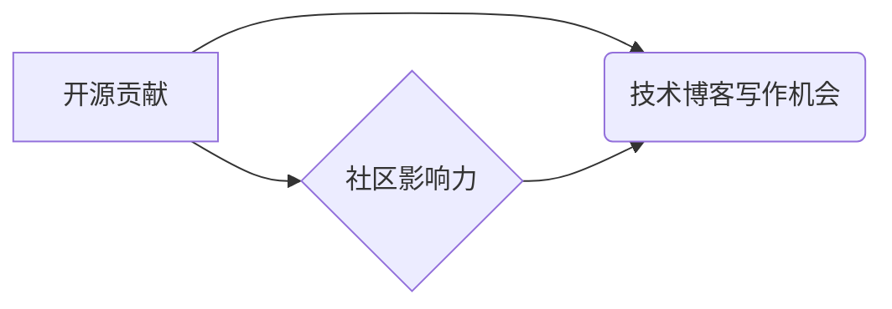

                 

## 利用开源影响力获得技术博客写作机会

> 关键词：开源贡献、技术博客、写作机会、社区影响力、个人品牌

### 1. 背景介绍

在当今科技日新月异的时代，技术博客已成为技术人员展示专业技能、分享知识经验和建立个人品牌的有效平台。然而，想要在技术博客领域脱颖而出，获得更多曝光和写作机会，仅仅依靠个人努力往往不够。 

开源贡献作为一种积极参与技术社区的行动，不仅可以提升个人技术水平，更能有效地积累影响力，为获得技术博客写作机会打开大门。

### 2. 核心概念与联系

#### 2.1 开源贡献

开源贡献是指将软件代码、文档、工具等技术成果公开共享，并允许他人自由使用、修改和分发。 

#### 2.2 技术博客

技术博客是技术人员用来分享技术知识、经验和见解的在线平台。它可以帮助技术人员建立个人品牌、提升知名度、拓展人脉和获得职业发展机会。

#### 2.3 社区影响力

社区影响力是指个人在技术社区中的声誉和认可度。拥有高社区影响力的技术人员通常被视为技术领域的专家，更容易获得资源、支持和机会。

**核心概念关系图:**



### 3. 核心算法原理 & 具体操作步骤

#### 3.1 算法原理概述

开源贡献可以看作是一种“价值交换”的算法。

* **输入:** 个人技术技能、知识经验、代码能力
* **输出:** 开源项目贡献、社区认可、个人品牌提升、技术博客写作机会

#### 3.2 算法步骤详解

1. **选择合适的开源项目:** 

   * 关注自己感兴趣的技术领域
   * 了解项目的活跃度和贡献者社区
   * 评估项目的技术难度和贡献门槛

2. **学习项目代码和文档:** 

   * 熟悉项目的架构、设计模式和代码风格
   * 理解项目的功能和使用场景
   * 寻找需要改进或扩展的地方

3. **提出贡献计划:** 

   * 确定具体的改进方案或新功能
   * 撰写清晰的提议文档，描述问题、解决方案和预期效果
   * 与项目维护者沟通，获得反馈和指导

4. **编写代码并提交 Pull Request:** 

   * 遵循项目的代码规范和提交流程
   * 进行代码测试和文档更新
   * 积极回复评论和解决问题

5. **参与社区讨论:** 

   * 在项目论坛或邮件列表中积极参与讨论
   * 回答其他贡献者的问题，提供帮助和建议
   * 分享自己的技术经验和见解

#### 3.3 算法优缺点

**优点:**

* 提升个人技术水平
* 积累社区影响力
* 建立个人品牌
* 获得技术博客写作机会

**缺点:**

* 需要投入时间和精力
* 可能面临技术挑战和沟通障碍
* 需要具备良好的沟通和协作能力

#### 3.4 算法应用领域

开源贡献适用于所有技术领域，包括软件开发、数据科学、人工智能、网络安全等。

### 4. 数学模型和公式 & 详细讲解 & 举例说明

#### 4.1 数学模型构建

我们可以用一个简单的数学模型来表示开源贡献带来的社区影响力提升：

```latex
I = f(C, A, E)
```

其中：

*  $I$ 代表社区影响力
*  $C$ 代表开源贡献量 (例如，提交的代码行数、修复的 bug 数)
*  $A$ 代表参与社区活动的频率和深度 (例如，论坛回复次数、提问次数)
*  $E$ 代表个人技术能力和专业知识水平

#### 4.2 公式推导过程

这个模型表明，社区影响力 $I$ 是开源贡献量 $C$、参与社区活动 $A$ 和个人能力 $E$ 的综合函数。

*  $C$ 的增加会直接提升 $I$，因为贡献越多，对社区价值越大。
*  $A$ 的增加也会提升 $I$，因为积极参与社区活动可以展示个人热情和专业度。
*  $E$ 的提升会间接提升 $I$，因为高水平的技术能力可以带来更优质的贡献和更深入的参与。

#### 4.3 案例分析与讲解

假设有两个开发者，A 和 B，他们都参与了一个开源项目。

*  A 贡献了大量代码，修复了多个 bug，但很少参与社区讨论。
*  B 贡献了相对较少的代码，但积极参与社区讨论，回答问题，提供帮助。

根据上述模型，A 的社区影响力可能高于 B，因为 A 的贡献量更大。但随着时间的推移，B 的积极参与和良好互动可能会让他获得更高的社区认可度，最终超越 A。

### 5. 项目实践：代码实例和详细解释说明

#### 5.1 开发环境搭建

*  选择一个合适的开源项目，例如 Linux 内核、Apache HTTP 服务器、Django Web 框架等。
*  根据项目的开发环境要求，安装必要的软件和工具，例如 Git、编译器、数据库等。

#### 5.2 源代码详细实现

*  选择一个需要改进或扩展的功能，并阅读相关代码文档。
*  编写新的代码实现，并进行单元测试和集成测试。
*  提交代码变更请求 (Pull Request) 给项目维护者，并积极回复评论和解决问题。

#### 5.3 代码解读与分析

*  分析代码结构、设计模式和算法实现。
*  理解代码的功能和工作原理。
*  寻找代码中的潜在问题和改进空间。

#### 5.4 运行结果展示

*  运行测试代码，验证代码功能是否正确。
*  记录测试结果和遇到的问题。
*  根据测试结果进行代码优化和改进。

### 6. 实际应用场景

#### 6.1 技术博客写作

*  将开源贡献经验撰写成技术博客文章，分享自己的学习和实践过程。
*  分析开源项目的技术细节和设计理念，提供技术 insights。
*  探讨开源社区的文化和发展趋势，分享个人见解。

#### 6.2 个人品牌建设

*  开源贡献可以提升个人技术能力和专业形象，建立个人品牌。
*  参与开源社区可以拓展人脉，结识行业同行和潜在雇主。
*  开源项目可以作为个人作品集，展示自己的技术实力。

#### 6.3 职业发展

*  开源贡献可以为技术人员提供职业发展机会，例如加入开源项目团队、成为技术顾问或创业。
*  开源项目经验可以提升技术人员的竞争力，获得更高的薪资和职位。
*  开源社区可以为技术人员提供学习和交流平台，促进职业成长。

#### 6.4 未来应用展望

随着开源软件的普及和发展，开源贡献将成为技术人员职业发展的重要组成部分。

*  开源项目将更加复杂和多样化，需要更多技术人员参与贡献。
*  开源社区将更加活跃和国际化，提供更多学习和交流机会。
*  开源贡献将成为技术人员展示个人能力和价值的重要途径。

### 7. 工具和资源推荐

#### 7.1 学习资源推荐

*  GitHub: https://github.com/
*  GitLab: https://gitlab.com/
*  SourceForge: https://sourceforge.net/
*  Open Source Initiative: https://opensource.org/

#### 7.2 开发工具推荐

*  Git: https://git-scm.com/
*  IDE (集成开发环境): Visual Studio Code, IntelliJ IDEA, Eclipse 等
*  版本控制工具: GitLab CI/CD, Jenkins 等

#### 7.3 相关论文推荐

*  The Open Source Software Development Model: A Review
*  The Impact of Open Source Software on Innovation
*  Community-Driven Software Development: A Survey

### 8. 总结：未来发展趋势与挑战

#### 8.1 研究成果总结

开源贡献是技术人员提升技能、建立个人品牌和获得职业发展机会的重要途径。

*  开源贡献可以提升个人技术水平和社区影响力。
*  开源项目经验可以作为个人作品集，展示技术实力。
*  开源社区可以为技术人员提供学习和交流平台。

#### 8.2 未来发展趋势

*  开源软件将更加普及和多样化，需要更多技术人员参与贡献。
*  开源社区将更加活跃和国际化，提供更多学习和交流机会。
*  开源贡献将成为技术人员展示个人能力和价值的重要途径。

#### 8.3 面临的挑战

*  开源项目维护和发展需要持续的投入和支持。
*  开源社区需要建立更加完善的治理机制和规范。
*  开源贡献者需要具备良好的沟通和协作能力。

#### 8.4 研究展望

*  探索开源贡献的激励机制和社区治理模式。
*  研究开源软件的商业模式和可持续发展路径。
*  探讨开源贡献对技术人才培养和产业发展的影响。

### 9. 附录：常见问题与解答

#### 9.1 如何找到合适的开源项目？

*  关注自己感兴趣的技术领域。
*  了解项目的活跃度和贡献者社区。
*  评估项目的技术难度和贡献门槛。

#### 9.2 如何进行开源贡献？

*  学习项目代码和文档。
*  提出贡献计划。
*  编写代码并提交 Pull Request。
*  积极参与社区讨论。

#### 9.3 开源贡献有什么好处？

*  提升个人技术水平。
*  积累社区影响力。
*  建立个人品牌。
*  获得技术博客写作机会。


作者：禅与计算机程序设计艺术 / Zen and the Art of Computer Programming 
<end_of_turn>

