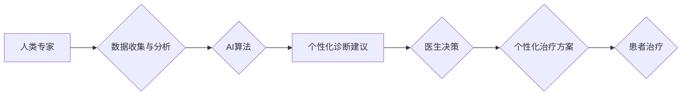

                 

## 医疗保健的未来：人类计算助力精准医疗

> 关键词：人类计算、精准医疗、深度学习、自然语言处理、医疗影像分析、数据可视化、医疗保健创新

### 1. 背景介绍

医疗保健领域正处于前所未有的变革时期。随着技术的飞速发展，特别是人工智能（AI）的兴起，医疗保健的未来充满了无限可能。精准医疗，即根据个体患者的基因、环境和生活方式等因素提供个性化的医疗服务，正成为医疗保健的未来趋势。而人类计算，作为一种将人类智能与计算机智能相结合的新型计算模式，为精准医疗的发展提供了强大的技术支撑。

传统医疗模式往往依赖于经验和统计数据，难以满足个性化医疗的需求。而精准医疗则通过对患者个体数据的深入分析，识别疾病的潜在风险因素，制定个性化的治疗方案，从而提高治疗效果，降低医疗成本。

人类计算通过将人类的智慧和经验与计算机的计算能力相结合，可以有效解决精准医疗面临的一些挑战。例如，人类专家可以利用AI算法对海量医疗数据进行分析，识别疾病的早期征兆，并提供更精准的诊断建议。同时，AI算法也可以辅助医生进行手术操作，提高手术的精准度和安全性。

### 2. 核心概念与联系

#### 2.1 人类计算

人类计算是一种将人类智能与计算机智能相结合的新型计算模式。它强调人类的创造力、洞察力和决策能力，并利用计算机的计算能力、存储能力和数据处理能力，共同完成复杂的任务。

#### 2.2 精准医疗

精准医疗是指根据个体患者的基因、环境和生活方式等因素，提供个性化的医疗服务。它旨在通过对患者个体数据的深入分析，识别疾病的潜在风险因素，制定个性化的治疗方案，从而提高治疗效果，降低医疗成本。

#### 2.3 人类计算与精准医疗的联系

人类计算为精准医疗提供了强大的技术支撑。

* **数据分析:** 人类计算可以利用AI算法对海量医疗数据进行分析，识别疾病的潜在风险因素，并提供更精准的诊断建议。
* **个性化治疗:** 人类计算可以根据患者的个体特征，制定个性化的治疗方案，提高治疗效果。
* **辅助决策:** 人类计算可以辅助医生进行医疗决策，提高决策的准确性和效率。

**Mermaid 流程图**



### 3. 核心算法原理 & 具体操作步骤

#### 3.1 算法原理概述

精准医疗的核心算法主要包括机器学习、深度学习、自然语言处理和计算机视觉等。

* **机器学习:** 通过训练模型，从数据中学习规律，进行预测和分类。
* **深度学习:** 基于多层神经网络，能够学习更复杂的特征，提高预测精度。
* **自然语言处理:** 处理和理解自然语言文本，例如患者病历、医学文献等。
* **计算机视觉:** 处理和理解图像数据，例如医学影像、病理切片等。

#### 3.2 算法步骤详解

以机器学习算法为例，其具体操作步骤如下：

1. **数据收集:** 收集相关医疗数据，例如患者病历、基因信息、影像数据等。
2. **数据预处理:** 对收集到的数据进行清洗、转换和特征提取等操作，使其适合模型训练。
3. **模型选择:** 根据具体任务选择合适的机器学习模型，例如分类模型、回归模型等。
4. **模型训练:** 利用训练数据训练模型，调整模型参数，使其能够准确预测或分类。
5. **模型评估:** 利用测试数据评估模型的性能，例如准确率、召回率等。
6. **模型部署:** 将训练好的模型部署到实际应用场景中，例如用于疾病诊断、治疗方案推荐等。

#### 3.3 算法优缺点

**优点:**

* **高精度:** 机器学习算法能够学习复杂的特征，提高预测精度。
* **自动化:** 能够自动完成数据分析和预测任务，提高效率。
* **个性化:** 可以根据患者的个体特征，提供个性化的医疗服务。

**缺点:**

* **数据依赖:** 需要大量高质量的训练数据才能训练出准确的模型。
* **解释性差:** 一些机器学习模型的决策过程难以解释，难以获得用户的信任。
* **算法偏差:** 训练数据中的偏差可能会导致模型产生偏差，影响预测结果的准确性。

#### 3.4 算法应用领域

* **疾病诊断:** 利用机器学习算法对患者的症状、检查结果等数据进行分析，辅助医生进行疾病诊断。
* **治疗方案推荐:** 根据患者的个体特征和疾病类型，推荐个性化的治疗方案。
* **药物研发:** 利用机器学习算法分析药物的结构和作用机制，加速药物研发过程。
* **医疗影像分析:** 利用计算机视觉算法分析医学影像，例如X光片、CT扫描等，辅助医生进行疾病诊断和治疗。

### 4. 数学模型和公式 & 详细讲解 & 举例说明

#### 4.1 数学模型构建

在精准医疗中，常用的数学模型包括线性回归模型、逻辑回归模型、支持向量机模型、决策树模型等。

* **线性回归模型:** 用于预测连续变量，例如患者的年龄、血压等。其数学公式如下：

$$
y = \beta_0 + \beta_1x_1 + \beta_2x_2 + ... + \beta_nx_n + \epsilon
$$

其中，$y$ 是预测变量，$x_1, x_2, ..., x_n$ 是自变量，$\beta_0, \beta_1, ..., \beta_n$ 是模型参数，$\epsilon$ 是误差项。

* **逻辑回归模型:** 用于预测分类变量，例如患者是否患有某种疾病。其数学公式如下：

$$
P(y=1|x) = \frac{1}{1 + e^{-( \beta_0 + \beta_1x_1 + \beta_2x_2 + ... + \beta_nx_n)}}
$$

其中，$P(y=1|x)$ 是患者患有疾病的概率，$x_1, x_2, ..., x_n$ 是自变量，$\beta_0, \beta_1, ..., \beta_n$ 是模型参数。

#### 4.2 公式推导过程

上述公式的推导过程涉及到概率论、统计学和线性代数等数学知识。

#### 4.3 案例分析与讲解

例如，可以使用线性回归模型预测患者的住院天数，根据患者的年龄、性别、疾病类型等数据进行训练，并利用训练好的模型预测新患者的住院天数。

### 5. 项目实践：代码实例和详细解释说明

#### 5.1 开发环境搭建

* **操作系统:** Linux、Windows、macOS
* **编程语言:** Python
* **机器学习库:** scikit-learn、TensorFlow、PyTorch
* **数据处理库:** pandas、NumPy
* **数据可视化库:** matplotlib、seaborn

#### 5.2 源代码详细实现

```python
# 导入必要的库
import pandas as pd
from sklearn.linear_model import LinearRegression

# 加载数据
data = pd.read_csv('hospital_data.csv')

# 选择特征和目标变量
features = ['age', 'gender', 'disease_type']
target = 'hospital_days'

# 训练模型
model = LinearRegression()
model.fit(data[features], data[target])

# 预测新患者的住院天数
new_patient_data = pd.DataFrame({
    'age': [50],
    'gender': ['male'],
    'disease_type': ['heart_disease']
})
predicted_days = model.predict(new_patient_data)

# 打印预测结果
print(f'Predicted hospital days: {predicted_days[0]}')
```

#### 5.3 代码解读与分析

* 首先，导入必要的库。
* 然后，加载数据，并选择特征和目标变量。
* 接着，训练线性回归模型，并使用训练好的模型预测新患者的住院天数。
* 最后，打印预测结果。

#### 5.4 运行结果展示

运行上述代码后，将输出新患者的预测住院天数。

### 6. 实际应用场景

#### 6.1 疾病诊断

* **癌症诊断:** 利用机器学习算法分析患者的基因信息、影像数据等，辅助医生进行癌症诊断。
* **心血管疾病诊断:** 利用机器学习算法分析患者的症状、心电图、血压等数据，辅助医生进行心血管疾病诊断。

#### 6.2 治疗方案推荐

* **个性化癌症治疗:** 根据患者的基因信息、肿瘤类型等，推荐个性化的癌症治疗方案。
* **糖尿病治疗:** 根据患者的血糖水平、生活方式等数据，推荐个性化的糖尿病治疗方案。

#### 6.3 药物研发

* **药物靶点发现:** 利用机器学习算法分析药物的结构和作用机制，发现新的药物靶点。
* **药物筛选:** 利用机器学习算法筛选潜在的药物候选物。

#### 6.4 未来应用展望

* **远程医疗:** 利用人工智能技术，实现远程医疗服务，为患者提供更便捷的医疗服务。
* **医疗机器人:** 利用人工智能技术，开发医疗机器人，辅助医生进行手术操作、护理等工作。
* **虚拟助理:** 利用人工智能技术，开发医疗虚拟助理，为患者提供医疗咨询、预约挂号等服务。

### 7. 工具和资源推荐

#### 7.1 学习资源推荐

* **在线课程:** Coursera、edX、Udacity
* **书籍:**
    * 深度学习
    * 人工智能：一种现代方法
    * 机器学习实战

#### 7.2 开发工具推荐

* **Python:** 
    * scikit-learn
    * TensorFlow
    * PyTorch
* **数据可视化工具:**
    * matplotlib
    * seaborn
    * Tableau

#### 7.3 相关论文推荐

* **Nature:**
    * Deep learning for healthcare
    * Artificial intelligence in medicine
* **Science:**
    * Machine learning in healthcare
    * The promise and peril of artificial intelligence in medicine

### 8. 总结：未来发展趋势与挑战

#### 8.1 研究成果总结

人类计算为精准医疗的发展提供了强大的技术支撑，在疾病诊断、治疗方案推荐、药物研发等方面取得了显著成果。

#### 8.2 未来发展趋势

* **模型更加精准:** 利用更先进的机器学习算法和更大的数据规模，训练更加精准的模型。
* **应用场景更加广泛:** 将人工智能技术应用到更多医疗领域，例如远程医疗、医疗机器人等。
* **伦理问题更加重视:** 随着人工智能技术的应用越来越广泛，伦理问题也越来越重要，需要制定相应的规范和政策。

#### 8.3 面临的挑战

* **数据隐私保护:** 医疗数据具有高度敏感性，需要采取有效的措施保护患者隐私。
* **算法解释性:** 一些机器学习模型的决策过程难以解释，难以获得用户的信任。
* **算法偏差:** 训练数据中的偏差可能会导致模型产生偏差，影响预测结果的准确性。

#### 8.4 研究展望

未来，人类计算与精准医疗将继续深度融合，推动医疗保健的创新发展。需要加强基础研究，开发更先进的算法和技术，并制定相应的规范和政策，确保人工智能技术在医疗领域的健康发展。

### 9. 附录：常见问题与解答

#### 9.1 Q: 人工智能技术是否会取代医生？

A: 人工智能技术可以辅助医生进行工作，提高效率和准确性，但不会取代医生。医生需要具备丰富的临床经验、专业知识和人际交往能力，这些都是人工智能无法替代的。

#### 9.2 Q: 人工智能技术在医疗领域的应用是否安全可靠？

A: 人工智能技术在医疗领域的应用需要经过严格的测试和验证，确保其安全性和可靠性。同时，需要制定相应的规范和政策，规范人工智能技术的应用，避免其带来的潜在风险。


作者：禅与计算机程序设计艺术 / Zen and the Art of Computer Programming 
<end_of_turn>

