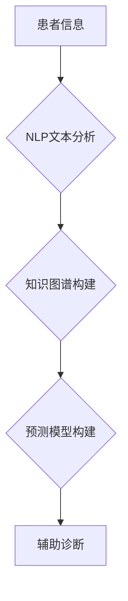

                 

## 医疗诊断中的自然语言处理应用

> 关键词：自然语言处理，医疗诊断，机器学习，深度学习，临床文本，知识图谱，医疗信息提取，预测模型

## 1. 背景介绍

医疗诊断是医疗保健的核心环节，准确的诊断对于患者的治疗和预后至关重要。传统上，医疗诊断主要依赖于医生的经验和临床检查结果。然而，随着医疗数据的爆炸式增长，以及患者对个性化医疗需求的不断提升，传统的诊断方式面临着挑战。自然语言处理（NLP）技术作为一种能够理解和处理人类语言的智能技术，为医疗诊断带来了新的机遇。

NLP技术能够从海量医疗文本数据中提取关键信息，例如患者症状、病史、检查结果等，并将其转化为机器可理解的格式。这使得机器能够辅助医生进行诊断，提高诊断效率和准确性。

## 2. 核心概念与联系

### 2.1 自然语言处理（NLP）

自然语言处理（NLP）是人工智能领域的一个重要分支，旨在使计算机能够理解、处理和生成人类语言。NLP技术涵盖了多种子领域，例如：

* **文本分类：** 将文本自动分类到预定义的类别中，例如情感分析、主题分类等。
* **文本摘要：** 从长文本中提取关键信息，生成简洁的摘要。
* **机器翻译：** 将文本从一种语言翻译成另一种语言。
* **问答系统：** 能够理解用户的问题，并从知识库中找到相应的答案。

### 2.2 医疗诊断

医疗诊断是指根据患者的临床表现、病史、检查结果等信息，确定患者患有哪种疾病的过程。传统的医疗诊断主要依赖于医生的经验和临床判断，而随着医疗数据的增长和复杂性增加，传统的诊断方式面临着挑战。

### 2.3 核心概念联系

NLP技术可以应用于医疗诊断的各个环节，例如：

* **临床文本分析：** 从患者的病历、医嘱、检查报告等文本中提取关键信息，例如症状、诊断、治疗方案等。
* **知识图谱构建：** 建立医疗知识图谱，将疾病、症状、治疗方案等信息进行关联，以便于机器理解和推理。
* **预测模型构建：** 利用机器学习算法，从历史医疗数据中学习，构建预测模型，预测患者患病风险、疾病类型等。

**Mermaid 流程图**



## 3. 核心算法原理 & 具体操作步骤

### 3.1 算法原理概述

在医疗诊断中的NLP应用中，常用的算法包括：

* **机器学习算法：** 

例如支持向量机（SVM）、决策树、随机森林等，用于从历史医疗数据中学习，构建预测模型。

* **深度学习算法：** 

例如循环神经网络（RNN）、长短期记忆网络（LSTM）、Transformer等，能够处理更复杂的文本数据，例如患者的病历、医嘱等。

* **自然语言理解（NLU）算法：** 

例如命名实体识别（NER）、关系抽取、文本分类等，用于从文本中提取关键信息，例如患者症状、诊断结果等。

### 3.2 算法步骤详解

以机器学习算法为例，构建医疗诊断预测模型的具体步骤如下：

1. **数据收集和预处理：** 收集相关的医疗数据，例如患者病历、检查报告、诊断结果等，并进行清洗、格式化、标注等预处理工作。
2. **特征提取：** 从医疗文本数据中提取特征，例如患者症状、年龄、性别、病史等，可以使用词袋模型、TF-IDF等方法。
3. **模型训练：** 选择合适的机器学习算法，例如SVM、决策树等，并使用训练数据进行模型训练。
4. **模型评估：** 使用测试数据评估模型的性能，例如准确率、召回率、F1-score等。
5. **模型部署：** 将训练好的模型部署到实际应用环境中，用于辅助医生进行诊断。

### 3.3 算法优缺点

**优点：**

* 能够处理海量医疗文本数据，提取关键信息。
* 能够辅助医生进行诊断，提高诊断效率和准确性。
* 能够识别潜在的疾病风险，帮助医生进行早期干预。

**缺点：**

* 需要大量的训练数据，数据质量对模型性能影响较大。
* 模型解释性较差，难以理解模型的决策过程。
* 存在伦理和隐私问题，需要确保患者数据的安全和隐私。

### 3.4 算法应用领域

* **疾病诊断：** 辅助医生诊断各种疾病，例如癌症、心血管疾病、神经系统疾病等。
* **风险预测：** 预测患者患病风险，例如糖尿病、心血管疾病等。
* **个性化治疗：** 根据患者的基因信息、病史、生活方式等信息，制定个性化的治疗方案。
* **药物研发：** 从医疗文本数据中挖掘药物研发线索。

## 4. 数学模型和公式 & 详细讲解 & 举例说明

### 4.1 数学模型构建

在医疗诊断中的NLP应用中，常用的数学模型包括：

* **词袋模型：** 将文本表示为词的集合，每个词的出现频率作为特征。

* **TF-IDF：** 

Term Frequency-Inverse Document Frequency， 衡量词在文档中的重要性， 

$$TF-IDF(t,d) = TF(t,d) \times IDF(t)$$

其中，$TF(t,d)$表示词$t$在文档$d$中出现的频率，$IDF(t)$表示词$t$在整个语料库中出现的逆文档频率。

* **Word2Vec：** 

一种基于神经网络的词嵌入模型，将词映射到低维向量空间， 

$$v_w = \text{Word2Vec}(w)$$

其中，$v_w$表示词$w$的词向量。

### 4.2 公式推导过程

**词袋模型**

假设一个文档包含$N$个词，每个词$w_i$出现的频率为$f_i$，则词袋模型表示为：

$$D = \{w_1, w_2, ..., w_N\}$$

$$TF(w_i, D) = \frac{f_i}{N}$$

**TF-IDF**

假设一个语料库包含$M$个文档，词$t$在文档$d$中出现的频率为$f_{td}$，在整个语料库中出现的次数为$f_t$，则IDF定义为：

$$IDF(t) = \log_e \frac{M}{f_t}$$

### 4.3 案例分析与讲解

**Word2Vec**

Word2Vec模型可以学习到词之间的语义关系。例如，"king"和"queen"之间的语义关系是"性别反转"，因此，我们可以通过Word2Vec模型得到：

$$v_{king} - v_{male} \approx v_{queen} - v_{female}$$

## 5. 项目实践：代码实例和详细解释说明

### 5.1 开发环境搭建

* **操作系统：** Linux/macOS/Windows
* **编程语言：** Python
* **深度学习框架：** TensorFlow/PyTorch
* **NLP库：** NLTK/spaCy/Gensim

### 5.2 源代码详细实现

```python
import tensorflow as tf
from tensorflow.keras.models import Sequential
from tensorflow.keras.layers import Embedding, LSTM, Dense

# 数据预处理
# ...

# 模型构建
model = Sequential()
model.add(Embedding(input_dim=vocab_size, output_dim=embedding_dim))
model.add(LSTM(units=128))
model.add(Dense(units=num_classes, activation='softmax'))

# 模型编译
model.compile(loss='categorical_crossentropy', optimizer='adam', metrics=['accuracy'])

# 模型训练
model.fit(x_train, y_train, epochs=10, batch_size=32)

# 模型评估
loss, accuracy = model.evaluate(x_test, y_test)
print('Test Loss:', loss)
print('Test Accuracy:', accuracy)
```

### 5.3 代码解读与分析

* **Embedding层：** 将词向量化，将每个词映射到一个低维向量空间。
* **LSTM层：** 用于处理序列数据，例如患者的病历文本。
* **Dense层：** 全连接层，用于输出预测结果。

### 5.4 运行结果展示

* **训练损失和准确率：** 

通过训练过程，观察模型的损失和准确率的变化趋势，判断模型的训练效果。

* **测试损失和准确率：** 

使用测试数据评估模型的性能，例如准确率、召回率、F1-score等。

## 6. 实际应用场景

### 6.1 疾病诊断辅助系统

* **癌症诊断：** 

从患者的病历、影像报告等文本数据中提取特征，辅助医生诊断癌症类型和分期。

* **心血管疾病诊断：** 

从患者的症状、检查结果等文本数据中提取特征，辅助医生诊断心血管疾病类型和严重程度。

### 6.2 药物研发

* **药物靶点发现：** 

从医学文献中挖掘药物靶点信息，帮助药物研发人员寻找新的治疗靶点。
* **药物副作用预测：** 

从患者的病历、药物使用记录等文本数据中预测药物副作用，帮助医生避免药物不良反应。

### 6.3 医疗知识管理

* **知识图谱构建：** 

从医疗文献、临床数据等文本数据中构建医疗知识图谱，方便医生查找和利用医疗知识。
* **问答系统：** 

构建医疗问答系统，帮助患者获取医疗信息。

### 6.4 未来应用展望

* **个性化医疗：** 

根据患者的基因信息、病史、生活方式等信息，制定个性化的治疗方案。
* **远程医疗：** 

利用NLP技术，实现远程医疗诊断和咨询。
* **医疗机器人：** 

开发能够理解和处理患者语言的医疗机器人，辅助医生进行诊疗工作。

## 7. 工具和资源推荐

### 7.1 学习资源推荐

* **书籍：**

《自然语言处理入门》

* **在线课程：**

Coursera、edX、Udacity等平台上的NLP课程。

### 7.2 开发工具推荐

* **编程语言：** Python
* **深度学习框架：** TensorFlow、PyTorch
* **NLP库：** NLTK、spaCy、Gensim

### 7.3 相关论文推荐

* **ACL、EMNLP、NAACL等顶级NLP会议论文。**

## 8. 总结：未来发展趋势与挑战

### 8.1 研究成果总结

NLP技术在医疗诊断领域取得了显著进展，能够辅助医生进行诊断，提高诊断效率和准确性。

### 8.2 未来发展趋势

* **模型性能提升：** 

开发更强大的NLP模型，提高模型的准确率和鲁棒性。
* **解释性增强：** 

提高模型的解释性，帮助医生理解模型的决策过程。
* **跨模态融合：** 

将NLP技术与其他模态数据，例如图像、音频等融合，构建更全面的医疗诊断系统。

### 8.3 面临的挑战

* **数据质量问题：** 

医疗文本数据往往存在格式不统一、标注不准确等问题，需要进行大量的预处理工作。
* **模型解释性问题：** 

深度学习模型的决策过程往往难以理解，需要开发更可解释的模型。
* **伦理和隐私问题：** 

需要确保患者数据的安全和隐私，避免模型的误用。

### 8.4 研究展望

未来，NLP技术将在医疗诊断领域发挥越来越重要的作用，为患者提供更精准、更个性化的医疗服务。


## 9. 附录：常见问题与解答

* **Q：NLP技术在医疗诊断中的应用有哪些？**

* **A：** NLP技术在医疗诊断中的应用包括疾病诊断辅助、风险预测、个性化治疗、药物研发等。

* **Q：NLP技术在医疗诊断中的优势和劣势是什么？**

* **A：** 优势：能够处理海量医疗文本数据，提取关键信息，提高诊断效率和准确性。劣势：需要大量的训练数据，数据质量对模型性能影响较大，模型解释性较差。

* **Q：如何评估NLP模型在医疗诊断中的性能？**

* **A：** 使用测试数据评估模型的性能，例如准确率、召回率、F1-score等。

* **Q：NLP技术在医疗诊断中的伦理和隐私问题有哪些？**

* **A：** 需要确保患者数据的安全和隐私，避免模型的误用。


作者：禅与计算机程序设计艺术 / Zen and the Art of Computer Programming 
<end_of_turn>

