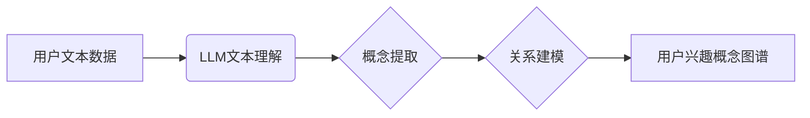

                 

## 基于LLM的用户兴趣概念图谱构建

> 关键词：LLM, 用户兴趣, 概念图谱, 自然语言处理, 个性化推荐

## 1. 背景介绍

在数字时代，海量数据和个性化需求共同催生了对用户兴趣精准识别的迫切需求。传统的用户兴趣建模方法主要依赖于用户显性行为数据，如点击记录、购买历史等，但这些数据往往难以捕捉用户潜在的兴趣和需求。近年来，大语言模型（LLM）的快速发展为用户兴趣建模提供了新的思路和可能性。

LLM 拥有强大的文本理解和生成能力，能够从用户文本数据中挖掘出丰富的语义信息，包括用户偏好、兴趣爱好、价值观等。基于 LLM 的用户兴趣概念图谱构建，可以将用户兴趣表示为一个结构化的知识图谱，更全面地刻画用户兴趣的层次结构和关联关系，为个性化推荐、内容创作、用户画像等应用提供更精准的洞察。

## 2. 核心概念与联系

### 2.1 用户兴趣概念图谱

用户兴趣概念图谱是一种将用户兴趣表示为知识图谱的形式。它将用户兴趣视为一系列概念节点，并通过关系边连接这些节点，构建出用户兴趣的层次结构和关联关系。

* **概念节点:** 代表用户兴趣的具体主题或类别，例如“电影”、“音乐”、“旅游”等。
* **关系边:** 描述概念节点之间的关系，例如“喜欢”、“关注”、“推荐”等。

### 2.2 LLM 在用户兴趣概念图谱构建中的作用

LLM 在用户兴趣概念图谱构建中扮演着关键角色，主要体现在以下几个方面：

* **文本理解:** LLM 可以理解用户文本数据中的语义信息，识别出用户感兴趣的主题和概念。
* **概念提取:** LLM 可以从文本数据中提取出用户兴趣相关的概念词，并进行概念聚类和分类。
* **关系建模:** LLM 可以分析文本数据中的语义关系，识别出用户兴趣之间的关联关系。

### 2.3 架构图



## 3. 核心算法原理 & 具体操作步骤

### 3.1 算法原理概述

基于 LLM 的用户兴趣概念图谱构建主要采用以下算法原理：

* **Transformer 模型:** Transformer 模型是一种强大的深度学习模型，能够有效地捕捉文本序列中的长距离依赖关系，在自然语言处理任务中表现出色。
* **BERT 预训练:** BERT 模型是一种基于 Transformer 的预训练语言模型，在大量的文本数据上进行预训练，能够对语言进行更深入的理解。
* **知识图谱嵌入:** 将概念节点和关系边嵌入到低维向量空间中，方便进行相似度计算和关系推理。

### 3.2 算法步骤详解

1. **数据预处理:** 收集用户文本数据，进行清洗、分词、停用词去除等预处理操作。
2. **LLM 文本理解:** 使用预训练的 LLM 模型对用户文本数据进行理解，提取出关键信息和语义特征。
3. **概念提取:** 利用自然语言处理技术，从 LLM 的输出结果中提取出用户兴趣相关的概念词。
4. **概念聚类:** 对提取出的概念词进行聚类，将相似的概念词归为同一个类别。
5. **关系建模:** 分析用户文本数据中的语义关系，识别出概念词之间的关联关系。
6. **知识图谱构建:** 将概念节点和关系边构建成用户兴趣概念图谱。
7. **图谱优化:** 对构建的图谱进行优化，例如去除冗余节点和边，提高图谱的结构完整性和可读性。

### 3.3 算法优缺点

**优点:**

* 能够捕捉用户潜在的兴趣和需求，超越传统方法的局限性。
* 能够构建出结构化的用户兴趣知识图谱，方便进行分析和推理。
* 能够利用 LLM 的强大文本理解能力，提高概念提取和关系建模的准确性。

**缺点:**

* 需要大量的文本数据进行训练和测试，数据获取和预处理成本较高。
* 算法的复杂度较高，需要专业的技术人员进行开发和维护。
* 知识图谱的构建和优化需要不断迭代和完善，需要持续投入时间和精力。

### 3.4 算法应用领域

* **个性化推荐:** 基于用户兴趣概念图谱，可以为用户推荐更精准、更符合其兴趣的内容和产品。
* **内容创作:** 可以根据用户兴趣概念图谱，创作更符合用户需求的内容，提高内容的吸引力和用户粘性。
* **用户画像:** 可以构建用户兴趣画像，更深入地了解用户的兴趣爱好和需求，为精准营销和用户服务提供支持。

## 4. 数学模型和公式 & 详细讲解 & 举例说明

### 4.1 数学模型构建

用户兴趣概念图谱可以表示为一个三元组 (N, R, E)，其中：

* N: 概念节点集合，每个节点代表一个用户兴趣主题。
* R: 关系集合，每个关系代表两个概念节点之间的关联关系。
* E: 三元组集合，每个三元组 (h, r, t) 表示节点 h 与节点 t 之间存在关系 r。

### 4.2 公式推导过程

为了量化用户兴趣概念图谱中的关系强度，可以使用以下公式：

$$
Sim(h, t) = \frac{ \sum_{r \in R} w(r) * \text{count}(h, r, t) }{ \sum_{r \in R} w(r) }
$$

其中：

* Sim(h, t): 节点 h 和节点 t 之间的相似度。
* w(r): 关系 r 的权重，可以根据关系类型和语义强度进行设定。
* count(h, r, t): 节点 h 和节点 t 之间存在关系 r 的次数。

### 4.3 案例分析与讲解

假设用户文本数据中包含以下信息：

* 用户 A 喜欢看电影，也喜欢听音乐。
* 用户 B 喜欢看电影，也喜欢玩游戏。

可以构建出以下用户兴趣概念图谱：

* 节点：电影、音乐、游戏
* 关系：喜欢

根据公式，可以计算出：

* Sim(电影, 音乐) = (w(喜欢) * 1) / w(喜欢) = 1
* Sim(电影, 游戏) = (w(喜欢) * 1) / w(喜欢) = 1

结果表明，用户 A 和用户 B 对电影的兴趣相似度较高。

## 5. 项目实践：代码实例和详细解释说明

### 5.1 开发环境搭建

* Python 3.7+
* PyTorch 1.7+
* Transformers 4.10+
* NetworkX 2.6+

### 5.2 源代码详细实现

```python
import torch
from transformers import AutoTokenizer, AutoModel
from networkx import Graph

# 加载预训练模型和词典
model_name = "bert-base-uncased"
tokenizer = AutoTokenizer.from_pretrained(model_name)
model = AutoModel.from_pretrained(model_name)

# 用户文本数据
user_texts = [
    "我最近喜欢看电影，也喜欢听音乐。",
    "我喜欢玩游戏，也喜欢看电影。"
]

# 概念提取
def extract_concepts(text):
    inputs = tokenizer(text, return_tensors="pt")
    outputs = model(**inputs)
    # ... (使用 LLM 输出进行概念提取)

# 关系建模
def model_relations(concepts):
    # ... (使用 LLM 输出进行关系建模)

# 知识图谱构建
def build_knowledge_graph(user_texts):
    graph = Graph()
    for text in user_texts:
        concepts = extract_concepts(text)
        relations = model_relations(concepts)
        # ... (将概念和关系添加到知识图谱中)
    return graph

# 知识图谱构建
graph = build_knowledge_graph(user_texts)

# 打印知识图谱
print(graph.nodes())
print(graph.edges())
```

### 5.3 代码解读与分析

* 代码首先加载预训练的 LLM 模型和词典。
* 然后，对用户文本数据进行概念提取和关系建模。
* 最后，将提取出的概念和关系构建成用户兴趣概念图谱。

### 5.4 运行结果展示

运行代码后，将输出用户兴趣概念图谱的节点和边信息。

## 6. 实际应用场景

### 6.1 个性化推荐

基于用户兴趣概念图谱，可以为用户推荐更精准、更符合其兴趣的内容和产品。例如，可以根据用户的电影和音乐兴趣，推荐相关的电影、音乐、演唱会等。

### 6.2 内容创作

可以根据用户兴趣概念图谱，创作更符合用户需求的内容，提高内容的吸引力和用户粘性。例如，可以根据用户的旅行兴趣，创作相关的旅行攻略、旅游景点介绍等。

### 6.3 用户画像

可以构建用户兴趣画像，更深入地了解用户的兴趣爱好和需求，为精准营销和用户服务提供支持。例如，可以根据用户的兴趣画像，为其提供个性化的广告推送、产品推荐等。

### 6.4 未来应用展望

随着 LLM 技术的不断发展，用户兴趣概念图谱构建将有更广泛的应用场景，例如：

* **教育领域:** 根据学生的兴趣爱好，个性化推荐学习资源和教学内容。
* **医疗领域:** 根据患者的兴趣和需求，提供个性化的健康咨询和医疗服务。
* **社交领域:** 根据用户的兴趣爱好，推荐新的朋友和社交圈。

## 7. 工具和资源推荐

### 7.1 学习资源推荐

* **论文:**

    * Devlin, J., Chang, M. W., Lee, K., & Toutanova, K. (2018). Bert: Pre-training of deep bidirectional transformers for language understanding. arXiv preprint arXiv:1810.04805.
    * Wang, Z., & Lee, S. (2019). Knowledge graph embedding by translating embeddings of nodes into a common semantic space. In Proceedings of the 2019 Conference on Empirical Methods in Natural Language Processing (pp. 404-414).

* **博客:**

    * https://huggingface.co/blog/bert-explained
    * https://towardsdatascience.com/knowledge-graph-embeddings-a-comprehensive-guide-59726067668c

### 7.2 开发工具推荐

* **Transformers:** https://huggingface.co/docs/transformers/index
* **NetworkX:** https://networkx.org/

### 7.3 相关论文推荐

* **Knowledge Graph Embedding:**

    * Bordes, A., Nickel, M., & Parthasarathy, S. (2013). Translating embeddings for modeling multi-relational data. In Proceedings of the 2013 ACM SIGKDD International Conference on Knowledge Discovery and Data Mining (pp. 1787-1796).
    * Wang, Z., & Lee, S. (2019). Knowledge graph embedding by translating embeddings of nodes into a common semantic space. In Proceedings of the 2019 Conference on Empirical Methods in Natural Language Processing (pp. 404-414).

* **LLM in NLP:**

    * Devlin, J., Chang, M. W., Lee, K., & Toutanova, K. (2018). Bert: Pre-training of deep bidirectional transformers for language understanding. arXiv preprint arXiv:1810.04805.
    * Radford, A., Wu, J., Child, R., Luan, D., Amodei, D., & Sutskever, I. (2019). Language models are few-shot learners. arXiv preprint arXiv:1905.00221.

## 8. 总结：未来发展趋势与挑战

### 8.1 研究成果总结

基于 LLM 的用户兴趣概念图谱构建取得了显著的成果，能够更精准地捕捉用户兴趣，为个性化推荐、内容创作、用户画像等应用提供更强大的支持。

### 8.2 未来发展趋势

* **多模态用户兴趣建模:** 将文本数据与其他模态数据（如图像、音频、视频）结合，构建更全面的用户兴趣图谱。
* **动态用户兴趣更新:** 随着用户行为和环境变化，用户兴趣也会发生动态变化，需要开发更灵活的算法，实时更新用户兴趣概念图谱。
* **隐私保护:** 用户兴趣数据具有敏感性，需要开发更有效的隐私保护机制，确保用户数据安全。

### 8.3 面临的挑战

* **数据质量:** 用户兴趣概念图谱的构建依赖于高质量的文本数据，数据获取和预处理成本较高。
* **算法复杂度:** 构建和优化用户兴趣概念图谱的算法复杂度较高，需要更强大的计算资源和更优化的算法设计。
* **可解释性:** LLM 的决策过程往往难以解释，需要开发更可解释的算法，提高用户对模型结果的信任度。

### 8.4 研究展望

未来，基于 LLM 的用户兴趣概念图谱构建将继续朝着更精准、更智能、更可解释的方向发展，为用户提供更个性化、更丰富的体验。


## 9. 附录：常见问题与解答

* **Q: 如何获取高质量的用户文本数据？**

    * A: 可以通过用户评论、社交媒体数据、问答平台数据等方式获取用户文本数据。

* **Q: 如何评估用户兴趣概念图谱的质量？**

    * A: 可以使用准确率、召回率、F1-score等指标评估用户兴趣概念图谱的质量。

* **Q: 如何提高用户兴趣概念图谱的可解释性？**

    * A: 可以使用注意力机制、可视化技术等方法提高用户兴趣概念图谱的可解释性。


作者：禅与计算机程序设计艺术 / Zen and the Art of Computer Programming<end_of_turn>

