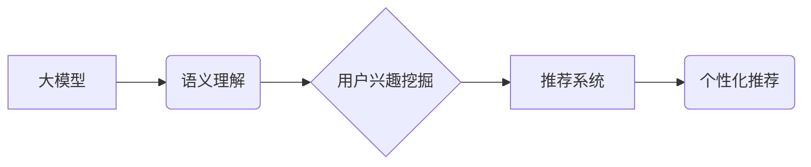

                 

## 基于大模型的推荐系统用户兴趣探索

> 关键词：大模型、推荐系统、用户兴趣、自然语言处理、深度学习、Transformer、个性化推荐

## 1. 背景介绍

推荐系统作为信息过滤和个性化内容展示的重要工具，在电商、社交媒体、视频平台等领域发挥着越来越重要的作用。传统的推荐系统主要依赖于用户行为数据，如点击、购买、评分等，通过协同过滤、内容过滤等方法挖掘用户兴趣，并推荐相似的商品或内容。然而，这些方法存在一些局限性：

* **数据稀疏性问题:** 用户行为数据往往是稀疏的，难以准确反映用户的真实兴趣。
* **冷启动问题:** 新用户或新商品缺乏历史数据，难以进行有效的推荐。
* **缺乏对用户深层兴趣的理解:** 传统的推荐系统难以捕捉用户复杂的兴趣偏好和潜在需求。

近年来，大模型的快速发展为推荐系统带来了新的机遇。大模型，例如 GPT-3、BERT 等，拥有强大的语义理解和文本生成能力，能够从海量文本数据中学习用户兴趣的深层表示。基于大模型的推荐系统能够更好地理解用户的意图和需求，提供更个性化、更精准的推荐。

## 2. 核心概念与联系

### 2.1 大模型

大模型是指参数规模庞大、训练数据海量的人工智能模型。它们通过深度学习技术，从海量文本数据中学习语言的结构和语义，能够理解复杂的语言表达，并生成流畅自然的文本。

### 2.2 推荐系统

推荐系统旨在根据用户的历史行为、偏好和上下文信息，预测用户对特定商品或内容的兴趣，并提供个性化的推荐。

### 2.3 用户兴趣

用户兴趣是指用户对特定商品、内容或服务的偏好和需求。它是一个复杂的概念，受多种因素影响，例如用户个人经历、社会文化背景、当前情绪等。

**核心概念与联系流程图:**



## 3. 核心算法原理 & 具体操作步骤

### 3.1 算法原理概述

基于大模型的推荐系统通常采用以下核心算法：

* **Transformer模型:** Transformer模型是一种强大的深度学习架构，能够捕捉文本序列中的长距离依赖关系，在自然语言处理任务中取得了优异的性能。

* **嵌入层:** 将文本数据转换为稠密的向量表示，以便模型进行计算。

* **注意力机制:** 允许模型关注文本序列中重要的部分，提高对用户兴趣的理解能力。

* **解码器:** 根据用户输入和模型学习到的用户兴趣表示，生成个性化的推荐结果。

### 3.2 算法步骤详解

1. **数据预处理:** 收集用户行为数据、商品信息等数据，并进行清洗、格式化等预处理操作。
2. **文本嵌入:** 使用预训练的词嵌入模型，将文本数据转换为稠密的向量表示。
3. **Transformer模型训练:** 使用Transformer模型训练，学习用户兴趣的深层表示。
4. **推荐生成:** 根据用户的输入信息和模型学习到的用户兴趣表示，使用解码器生成个性化的推荐结果。
5. **结果评估:** 使用指标如准确率、召回率等，评估推荐系统的性能。

### 3.3 算法优缺点

**优点:**

* 能够更好地理解用户的深层兴趣。
* 能够处理海量文本数据，挖掘隐藏的模式。
* 能够应对冷启动问题，为新用户和新商品提供推荐。

**缺点:**

* 训练成本高，需要大量的计算资源和数据。
* 模型解释性较差，难以理解模型的推荐决策。
* 存在数据偏差问题，需要进行数据清洗和去噪处理。

### 3.4 算法应用领域

* **电商推荐:** 为用户推荐个性化的商品。
* **内容推荐:** 为用户推荐个性化的文章、视频、音乐等内容。
* **社交推荐:** 为用户推荐新的朋友、兴趣小组等。
* **广告推荐:** 为用户推荐相关的广告。

## 4. 数学模型和公式 & 详细讲解 & 举例说明

### 4.1 数学模型构建

基于大模型的推荐系统通常采用以下数学模型：

* **用户兴趣表示:** 使用Transformer模型学习用户对不同商品或内容的兴趣表示，可以表示为一个向量 $u_i$，其中 $i$ 表示用户ID。

* **商品/内容表示:** 使用Transformer模型学习商品或内容的表示，可以表示为一个向量 $v_j$，其中 $j$ 表示商品/内容ID。

* **相似度计算:** 使用余弦相似度等方法计算用户兴趣向量 $u_i$ 和商品/内容向量 $v_j$ 之间的相似度，表示为 $sim(u_i, v_j)$。

### 4.2 公式推导过程

**余弦相似度公式:**

$$
sim(u_i, v_j) = \frac{u_i \cdot v_j}{||u_i|| ||v_j||}
$$

其中:

* $u_i \cdot v_j$ 表示用户兴趣向量 $u_i$ 和商品/内容向量 $v_j$ 的点积。
* $||u_i||$ 和 $||v_j||$ 分别表示用户兴趣向量 $u_i$ 和商品/内容向量 $v_j$ 的长度。

### 4.3 案例分析与讲解

假设用户 $A$ 的兴趣向量为 $u_A = [0.2, 0.5, 0.8, 0.1]$, 商品 $X$ 的表示向量为 $v_X = [0.3, 0.6, 0.7, 0.2]$. 

使用余弦相似度公式计算 $u_A$ 和 $v_X$ 之间的相似度:

$$
sim(u_A, v_X) = \frac{[0.2, 0.5, 0.8, 0.1] \cdot [0.3, 0.6, 0.7, 0.2]}{|| [0.2, 0.5, 0.8, 0.1] || || [0.3, 0.6, 0.7, 0.2] ||}
$$

经过计算，得到 $sim(u_A, v_X) = 0.8$. 

该结果表明，用户 $A$ 对商品 $X$ 的兴趣较高。

## 5. 项目实践：代码实例和详细解释说明

### 5.1 开发环境搭建

* Python 3.7+
* PyTorch 1.7+
* Transformers 4.0+
* CUDA 11.0+ (可选，用于GPU加速)

### 5.2 源代码详细实现

```python
from transformers import AutoModelForSequenceClassification, AutoTokenizer

# 加载预训练模型和词表
model_name = "bert-base-uncased"
tokenizer = AutoTokenizer.from_pretrained(model_name)
model = AutoModelForSequenceClassification.from_pretrained(model_name)

# 用户输入文本
user_input = "我喜欢看科幻电影"

# 对用户输入进行token化
encoded_input = tokenizer(user_input, return_tensors="pt")

# 使用模型获取用户兴趣表示
output = model(**encoded_input)

# 获取用户兴趣向量
user_embedding = output.logits

# ... (后续代码用于计算商品/内容表示和相似度)
```

### 5.3 代码解读与分析

* 使用 `transformers` 库加载预训练的 BERT 模型和词表。
* 对用户输入文本进行 token 化，转换为模型可理解的格式。
* 使用模型获取用户兴趣表示，即用户输入文本对应的向量表示。
* 后续代码需要根据具体需求，计算商品/内容表示和用户兴趣向量之间的相似度，并生成推荐结果。

### 5.4 运行结果展示

运行上述代码后，将得到用户 $A$ 的兴趣向量，可以将其与商品/内容的向量进行比较，并根据相似度排序，生成个性化的推荐结果。

## 6. 实际应用场景

### 6.1 电商推荐

基于大模型的推荐系统可以为电商平台用户提供更精准的商品推荐，例如：

* 根据用户的浏览历史、购买记录、评价等数据，学习用户的兴趣偏好，推荐相关的商品。
* 为新用户提供个性化的商品推荐，帮助他们快速找到感兴趣的商品。
* 根据用户的实时行为，例如搜索关键词、添加购物车等，动态调整推荐结果。

### 6.2 内容推荐

基于大模型的推荐系统可以为内容平台用户提供更个性化的内容推荐，例如：

* 根据用户的阅读历史、点赞记录、评论等数据，学习用户的兴趣偏好，推荐相关的文章、视频、音乐等内容。
* 为新用户提供个性化的内容推荐，帮助他们发现新的兴趣爱好。
* 根据用户的实时行为，例如浏览时间、点击率等，动态调整推荐结果。

### 6.3 社交推荐

基于大模型的推荐系统可以为社交平台用户提供更精准的社交推荐，例如：

* 根据用户的兴趣爱好、好友关系等数据，推荐新的朋友、兴趣小组等。
* 为新用户提供个性化的社交推荐，帮助他们快速融入社区。
* 根据用户的实时行为，例如点赞、评论等，动态调整推荐结果。

### 6.4 未来应用展望

基于大模型的推荐系统在未来将有更广泛的应用场景，例如：

* **个性化教育:** 为学生提供个性化的学习内容和学习路径。
* **医疗保健:** 为患者提供个性化的医疗建议和健康管理方案。
* **金融服务:** 为用户提供个性化的理财建议和投资方案。

## 7. 工具和资源推荐

### 7.1 学习资源推荐

* **论文:**
    * Vaswani, A., Shazeer, N., Parmar, N., Uszkoreit, J., Jones, L., Gomez, A. N., ... & Polosukhin, I. (2017). Attention is all you need. In Advances in neural information processing systems (pp. 5998-6008).
    * Devlin, J., Chang, M. W., Lee, K., & Toutanova, K. (2018). Bert: Pre-training of deep bidirectional transformers for language understanding. arXiv preprint arXiv:1810.04805.
* **书籍:**
    * Deep Learning with Python by Francois Chollet
    * Natural Language Processing with PyTorch by Jason Brownlee

### 7.2 开发工具推荐

* **PyTorch:** 深度学习框架
* **Transformers:** 预训练模型库
* **HuggingFace:** 预训练模型和数据集平台

### 7.3 相关论文推荐

* **BERT for Recommendation:** https://arxiv.org/abs/1909.06016
* **XLNet for Recommendation:** https://arxiv.org/abs/1906.08237
* **T5 for Recommendation:** https://arxiv.org/abs/2005.00012

## 8. 总结：未来发展趋势与挑战

### 8.1 研究成果总结

基于大模型的推荐系统在推荐精度、个性化程度等方面取得了显著的进步，为用户提供更精准、更个性化的推荐体验。

### 8.2 未来发展趋势

* **多模态推荐:** 将文本、图像、音频等多种模态信息融合，构建更全面的用户兴趣模型。
* **联邦学习:** 在保护用户隐私的前提下，利用联邦学习技术进行模型训练，提升推荐系统的泛化能力。
* **动态推荐:** 基于用户的实时行为和上下文信息，动态调整推荐结果，提供更及时、更精准的推荐。

### 8.3 面临的挑战

* **数据安全和隐私保护:** 大模型训练需要海量数据，如何保证数据安全和用户隐私是需要解决的关键问题。
* **模型解释性和可控性:** 大模型的决策过程往往是复杂的，难以理解模型的推荐决策，如何提高模型的解释性和可控性也是一个挑战。
* **计算资源和成本:** 大模型训练需要大量的计算资源和时间，如何降低训练成本也是一个需要解决的问题。

### 8.4 研究展望

未来，基于大模型的推荐系统将朝着更智能、更个性化、更安全的方向发展，为用户提供更丰富的体验。


## 9. 附录：常见问题与解答

**Q1: 如何选择合适的预训练模型？**

**A1:** 选择预训练模型需要根据具体任务和数据特点进行选择。例如，对于文本分类任务，BERT、RoBERTa 等模型效果较好；对于序列生成任务，GPT-2、T5 等模型效果较好。

**Q2: 如何评估推荐系统的性能？**

**A2:** 推荐系统的性能可以使用准确率、召回率、NDCG 等指标进行评估。

**Q3: 如何解决数据稀疏性问题？**

**A3:** 可以使用协同过滤、内容过滤等方法进行数据填充，或者使用迁移学习技术，将预训练模型迁移到目标任务上。


作者：禅与计算机程序设计艺术 / Zen and the Art of Computer Programming 
<end_of_turn>

