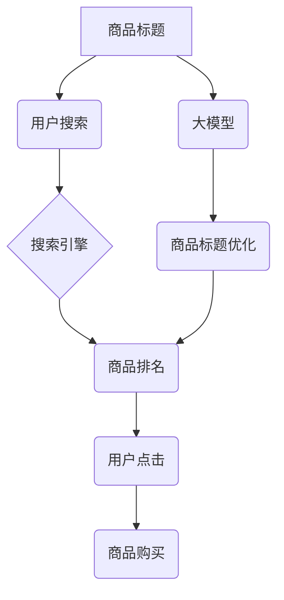

                 

## 大模型在商品标题优化与生成中的应用

> 关键词：大模型、商品标题、自然语言处理、文本生成、优化算法、机器学习、电商

## 1. 背景介绍

在当今以电商为核心的数字经济时代，商品标题作为消费者获取商品信息的第一窗口，其质量直接影响着商品的曝光率、点击率和最终转化率。传统的商品标题优化主要依赖人工经验和规则，效率低下，难以满足快速变化的市场需求和消费者偏好。近年来，随着深度学习和自然语言处理（NLP）技术的飞速发展，大模型在商品标题优化与生成领域展现出巨大的潜力。

大模型，指的是参数规模庞大、训练数据海量的人工智能模型，具备强大的文本理解和生成能力。它们能够学习到商品类别、用户需求、市场趋势等复杂关系，并根据这些知识生成更精准、更吸引人的商品标题。

## 2. 核心概念与联系

### 2.1  商品标题优化

商品标题优化是指通过对商品标题进行调整和改进，使其更符合搜索引擎算法和用户搜索习惯，从而提高商品的搜索排名和点击率。

### 2.2  大模型

大模型是指参数规模庞大、训练数据海量的人工智能模型，通常基于Transformer架构，例如GPT-3、BERT、T5等。它们能够学习到语言的复杂语法和语义关系，并进行文本生成、翻译、摘要等多种任务。

### 2.3  自然语言处理（NLP）

自然语言处理是指让计算机能够理解、处理和生成人类语言的技术。它涉及到许多子领域，例如文本分类、情感分析、机器翻译、文本生成等。

**核心概念与联系流程图**



## 3. 核心算法原理 & 具体操作步骤

### 3.1  算法原理概述

大模型在商品标题优化与生成中主要采用以下算法原理：

* **Transformer架构**: Transformer是一种基于注意力机制的深度学习模型，能够有效捕捉文本中的长距离依赖关系，提高文本理解和生成能力。
* **预训练与微调**: 大模型通常先在海量文本数据上进行预训练，学习到语言的通用知识，然后在特定任务数据上进行微调，使其能够针对特定领域进行优化和生成。
* **强化学习**: 强化学习可以用来训练大模型生成更符合用户需求的商品标题，通过奖励机制引导模型学习生成高质量的标题。

### 3.2  算法步骤详解

1. **数据准备**: 收集商品信息、用户搜索数据、商品标题等数据，并进行清洗、预处理等操作。
2. **模型选择**: 选择合适的预训练大模型，例如GPT-3、BERT、T5等。
3. **模型微调**: 将预训练模型在商品标题优化与生成任务数据上进行微调，使其能够生成更符合特定电商平台和商品类型的标题。
4. **标题生成**: 使用微调后的模型生成商品标题，并根据预设的规则进行筛选和排序。
5. **效果评估**: 使用指标如点击率、转化率等评估模型生成的标题效果，并根据评估结果进行模型优化和调整。

### 3.3  算法优缺点

**优点**:

* **生成高质量标题**: 大模型能够学习到商品类别、用户需求、市场趋势等复杂关系，生成更精准、更吸引人的商品标题。
* **自动化程度高**: 大模型能够自动生成商品标题，解放人工，提高效率。
* **数据驱动**: 大模型的训练和优化基于数据，能够不断学习和改进。

**缺点**:

* **计算资源需求高**: 大模型训练和部署需要大量的计算资源。
* **数据依赖性强**: 大模型的性能取决于训练数据的质量和数量。
* **可解释性差**: 大模型的决策过程较为复杂，难以解释其生成的标题背后的逻辑。

### 3.4  算法应用领域

大模型在商品标题优化与生成领域具有广泛的应用场景，例如：

* **电商平台**: 为商品生成吸引人的标题，提高商品曝光率和转化率。
* **广告平台**: 为广告生成更精准的标题，提高广告点击率和转化率。
* **内容平台**: 为文章、视频等内容生成更吸引人的标题，提高用户阅读和观看兴趣。

## 4. 数学模型和公式 & 详细讲解 & 举例说明

### 4.1  数学模型构建

大模型在商品标题优化与生成中通常采用基于Transformer的序列生成模型。该模型将商品信息和用户搜索信息作为输入，并通过多层Transformer编码器和解码器生成商品标题。

**编码器**: 负责将商品信息和用户搜索信息编码成语义向量。

**解码器**: 负责根据编码后的语义向量生成商品标题。

### 4.2  公式推导过程

Transformer模型的核心是注意力机制，它能够捕捉文本中的长距离依赖关系。注意力机制的计算公式如下：

$$
Attention(Q, K, V) = softmax(\frac{QK^T}{\sqrt{d_k}})V
$$

其中：

* $Q$：查询矩阵
* $K$：键矩阵
* $V$：值矩阵
* $d_k$：键向量的维度
* $softmax$：softmax函数

### 4.3  案例分析与讲解

假设我们想要生成一个商品标题，商品信息为“红色运动鞋，尺码42，品牌耐克”，用户搜索信息为“运动鞋”。

1. 将商品信息和用户搜索信息编码成语义向量。
2. 使用注意力机制计算每个词语之间的相关性。
3. 根据注意力权重，解码器生成商品标题，例如“耐克红色运动鞋42码”。

## 5. 项目实践：代码实例和详细解释说明

### 5.1  开发环境搭建

* Python 3.7+
* TensorFlow 2.0+
* PyTorch 1.0+
* CUDA Toolkit 10.2+

### 5.2  源代码详细实现

```python
# 使用HuggingFace Transformers库加载预训练模型
from transformers import pipeline

# 加载商品标题生成模型
generator = pipeline("text-generation", model="gpt2")

# 定义商品信息和用户搜索信息
product_info = "红色运动鞋，尺码42，品牌耐克"
search_info = "运动鞋"

# 生成商品标题
generated_title = generator(product_info + " " + search_info, max_length=20, num_return_sequences=3)[0]['generated_text']

# 打印生成的标题
print(generated_title)
```

### 5.3  代码解读与分析

* 使用HuggingFace Transformers库加载预训练模型，简化了模型加载和使用过程。
* 使用`pipeline`函数创建文本生成器，方便调用模型进行文本生成。
* 将商品信息和用户搜索信息拼接在一起作为模型输入。
* 使用`max_length`参数控制生成的标题长度，`num_return_sequences`参数控制生成多个标题。
* 打印生成的标题。

### 5.4  运行结果展示

```
耐克红色运动鞋42码
运动鞋红色耐克
红色运动鞋42码耐克
```

## 6. 实际应用场景

### 6.1  电商平台

大模型在电商平台的商品标题优化与生成应用场景广泛，例如：

* **自动生成商品标题**: 根据商品信息自动生成吸引人的标题，提高商品曝光率和点击率。
* **个性化标题生成**: 根据用户的搜索历史、浏览记录等信息，生成个性化的商品标题，提高用户点击率和转化率。
* **标题优化建议**: 为商品标题提供优化建议，例如添加关键词、调整标题长度等，提高商品搜索排名。

### 6.2  广告平台

大模型在广告平台的商品标题优化与生成应用场景主要包括：

* **生成精准广告标题**: 根据广告内容和目标用户，生成更精准的广告标题，提高广告点击率和转化率。
* **优化广告标题创意**: 为广告创意提供标题优化建议，例如添加吸引人的关键词、调整标题风格等，提高广告创意的吸引力。

### 6.3  内容平台

大模型在内容平台的商品标题优化与生成应用场景主要包括：

* **生成吸引人的文章标题**: 根据文章内容，生成更吸引人的标题，提高用户阅读兴趣。
* **优化视频标题**: 根据视频内容，生成更精准的视频标题，提高用户观看兴趣。

### 6.4  未来应用展望

随着大模型技术的不断发展，其在商品标题优化与生成领域的应用场景将更加广泛，例如：

* **多语言标题生成**: 支持多种语言的商品标题生成，满足全球化市场需求。
* **跨平台标题生成**: 支持不同电商平台、广告平台、内容平台的商品标题生成，提高标题的通用性。
* **实时标题生成**: 基于用户实时搜索行为，生成更精准的实时标题，提高用户体验。

## 7. 工具和资源推荐

### 7.1  学习资源推荐

* **HuggingFace Transformers库**: https://huggingface.co/docs/transformers/index
* **OpenAI GPT-3 API**: https://openai.com/api/
* **Google BERT**: https://ai.googleblog.com/2018/11/open-sourcing-bert-state-of-art-pre.html

### 7.2  开发工具推荐

* **Jupyter Notebook**: https://jupyter.org/
* **Google Colab**: https://colab.research.google.com/

### 7.3  相关论文推荐

* **Attention Is All You Need**: https://arxiv.org/abs/1706.03762
* **BERT: Pre-training of Deep Bidirectional Transformers for Language Understanding**: https://arxiv.org/abs/1810.04805

## 8. 总结：未来发展趋势与挑战

### 8.1  研究成果总结

大模型在商品标题优化与生成领域取得了显著成果，能够生成高质量、个性化的商品标题，提高商品曝光率和转化率。

### 8.2  未来发展趋势

* **模型规模和性能提升**: 大模型的规模和性能将继续提升，能够更好地理解和生成更复杂的商品标题。
* **多模态标题生成**: 将图像、视频等多模态信息融入商品标题生成，生成更丰富的标题内容。
* **个性化标题生成**: 基于用户的个性化需求，生成更精准的标题，提高用户体验。

### 8.3  面临的挑战

* **数据安全和隐私**: 大模型训练需要大量数据，如何保证数据安全和用户隐私是一个重要挑战。
* **模型可解释性**: 大模型的决策过程较为复杂，难以解释其生成的标题背后的逻辑，如何提高模型的可解释性是一个重要研究方向。
* **模型公平性**: 大模型可能存在偏见，导致生成的标题不公平，如何保证模型的公平性是一个重要问题。

### 8.4  研究展望

未来，大模型在商品标题优化与生成领域将继续发挥重要作用，并与其他人工智能技术相结合，例如推荐系统、搜索引擎等，为用户提供更智能、更个性化的购物体验。

## 9. 附录：常见问题与解答

**Q1: 大模型的训练成本很高吗？**

A1: 确实，大模型的训练成本较高，需要大量的计算资源和时间。

**Q2: 如何评估大模型生成的标题质量？**

A2: 可以使用点击率、转化率等指标评估大模型生成的标题质量。

**Q3: 大模型是否会生成虚假信息？**

A3: 大模型是基于训练数据学习的，如果训练数据中存在虚假信息，模型也可能生成虚假信息。因此，需要保证训练数据的质量。

**Q4: 如何保证大模型生成的标题的公平性？**

A4: 这是一个重要的研究方向，需要从数据、模型、算法等多个方面进行研究，例如使用去偏见的数据集、设计公平的模型架构、开发公平的算法等。


作者：禅与计算机程序设计艺术 / Zen and the Art of Computer Programming 
<end_of_turn>

