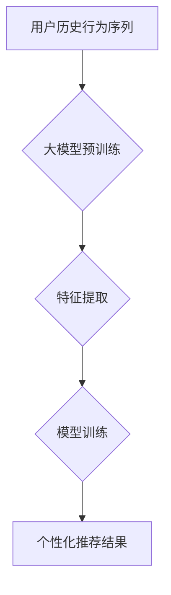

                 

## 大模型在序列推荐中的应用

> 关键词：大模型、序列推荐、Transformer、BERT、GPT、Fine-tuning、个性化推荐、用户行为预测

## 1. 背景介绍

在信息爆炸的时代，用户每天面临着海量的商品、内容和服务选择。如何精准推荐用户感兴趣的内容，提升用户体验，成为各大互联网平台的核心竞争力。传统的序列推荐方法，例如基于协同过滤、基于内容的推荐和基于用户的推荐，虽然取得了一定的效果，但随着数据规模的增长和用户行为的复杂化，这些方法逐渐面临挑战。

近年来，大模型的兴起为序列推荐领域带来了新的机遇。大模型，例如 Transformer、BERT 和 GPT，凭借其强大的语义理解能力和泛化能力，在自然语言处理领域取得了突破性的进展。将大模型应用于序列推荐，可以有效地捕捉用户行为的复杂模式，提升推荐的精准度和个性化程度。

## 2. 核心概念与联系

### 2.1 序列推荐

序列推荐是指根据用户历史行为序列，预测用户未来感兴趣的下一个元素。例如，在电商平台，根据用户的浏览历史、购买历史和评价历史，推荐用户可能感兴趣的商品；在音乐平台，根据用户的播放历史，推荐用户可能喜欢的歌曲。

### 2.2 大模型

大模型是指参数量巨大、训练数据海量的人工智能模型。大模型通常通过深度学习技术训练，能够学习到复杂的语义关系和模式。常见的代表性大模型包括：

* **Transformer:** 由 Google 开发，用于处理序列数据的模型架构，其自注意力机制能够捕捉序列中不同元素之间的长距离依赖关系。
* **BERT:** 由 Google 开发，用于理解自然语言的预训练模型，能够捕捉文本中的语义信息和上下文关系。
* **GPT:** 由 OpenAI 开发，用于生成文本的预训练模型，能够生成流畅、连贯的文本。

### 2.3 核心架构

大模型在序列推荐中的应用，通常采用以下架构：



**流程说明：**

1. **用户历史行为序列:** 收集用户的历史行为数据，例如浏览记录、购买记录、评分记录等，形成用户行为序列。
2. **大模型预训练:** 使用预训练的大模型，例如 Transformer 或 BERT，对用户行为序列进行预训练，学习到用户行为的潜在语义和模式。
3. **特征提取:** 将预训练后的大模型应用于新的用户行为序列，提取用户行为的特征表示。
4. **模型训练:** 使用提取的特征表示，训练一个序列推荐模型，例如基于 Transformer 的推荐模型，以预测用户未来感兴趣的元素。
5. **个性化推荐结果:** 根据训练好的模型，为用户生成个性化的推荐结果。

## 3. 核心算法原理 & 具体操作步骤

### 3.1 算法原理概述

大模型在序列推荐中的核心算法原理是利用大模型强大的语义理解能力和泛化能力，学习到用户行为的复杂模式，并根据这些模式预测用户未来感兴趣的元素。

具体来说，大模型可以学习到以下信息：

* **用户偏好:** 用户对不同类型的商品、内容或服务的偏好。
* **上下文关系:** 用户行为之间的上下文关系，例如用户浏览了某个商品后，可能会购买与其相关的商品。
* **时间趋势:** 用户行为随时间变化的趋势，例如用户在特定时间段内更喜欢购买某些类型的商品。

### 3.2 算法步骤详解

1. **数据预处理:** 收集用户历史行为数据，并进行清洗、格式化和编码。
2. **特征工程:** 将用户行为数据转换为模型可以理解的特征表示。例如，可以将用户浏览记录转换为词袋模型，将用户购买记录转换为商品类别编码。
3. **大模型预训练:** 使用预训练的大模型，例如 Transformer 或 BERT，对用户行为数据进行预训练。预训练过程可以学习到用户行为的潜在语义和模式。
4. **模型微调:** 将预训练后的大模型应用于具体的序列推荐任务，并进行微调。微调过程可以进一步优化模型的性能，使其更适合特定的推荐场景。
5. **预测和推荐:** 使用微调后的模型，对用户的最新行为进行预测，并生成个性化的推荐结果。

### 3.3 算法优缺点

**优点:**

* **强大的语义理解能力:** 大模型能够捕捉用户行为的复杂语义关系，提升推荐的精准度。
* **泛化能力强:** 预训练的大模型已经学习到大量的知识，可以应用于不同的推荐场景。
* **个性化推荐:** 大模型可以根据用户的历史行为，生成个性化的推荐结果。

**缺点:**

* **训练成本高:** 大模型的训练需要大量的计算资源和时间。
* **数据依赖性强:** 大模型的性能依赖于训练数据的质量和数量。
* **可解释性差:** 大模型的决策过程比较复杂，难以解释其推荐结果背后的原因。

### 3.4 算法应用领域

大模型在序列推荐领域具有广泛的应用场景，例如：

* **电商推荐:** 推荐商品、优惠券、促销活动等。
* **内容推荐:** 推荐文章、视频、音乐、书籍等。
* **社交推荐:** 推荐好友、群组、话题等。
* **新闻推荐:** 推荐新闻、资讯、博客等。

## 4. 数学模型和公式 & 详细讲解 & 举例说明

### 4.1 数学模型构建

大模型在序列推荐中的数学模型通常基于 Transformer 架构，其核心是自注意力机制。自注意力机制可以捕捉序列中不同元素之间的长距离依赖关系，从而更好地理解用户行为的上下文关系。

### 4.2 公式推导过程

自注意力机制的计算公式如下：

$$
Attention(Q, K, V) = \frac{exp(Q \cdot K^T / \sqrt{d_k})}{exp(Q \cdot K^T / \sqrt{d_k})} \cdot V
$$

其中：

* $Q$：查询矩阵
* $K$：键矩阵
* $V$：值矩阵
* $d_k$：键向量的维度

### 4.3 案例分析与讲解

假设用户浏览了以下商品序列：

```
[手机, 耳机, 充电器, 手机壳]
```

使用自注意力机制，可以计算出每个商品与其他商品之间的注意力权重，例如，手机与耳机之间的注意力权重可能较高，因为用户经常会同时购买手机和耳机。

## 5. 项目实践：代码实例和详细解释说明

### 5.1 开发环境搭建

* Python 3.6+
* TensorFlow 或 PyTorch
* CUDA 和 cuDNN (可选，用于 GPU 加速)

### 5.2 源代码详细实现

```python
# 使用 TensorFlow 实现基于 Transformer 的序列推荐模型

import tensorflow as tf

# 定义 Transformer 模型
class TransformerModel(tf.keras.Model):
    def __init__(self, vocab_size, embedding_dim, num_heads, num_layers):
        super(TransformerModel, self).__init__()
        self.embedding = tf.keras.layers.Embedding(vocab_size, embedding_dim)
        self.transformer = tf.keras.layers.Transformer(num_heads=num_heads, num_layers=num_layers)
        self.output = tf.keras.layers.Dense(vocab_size)

    def call(self, inputs):
        embeddings = self.embedding(inputs)
        outputs = self.transformer(embeddings)
        predictions = self.output(outputs)
        return predictions

# 实例化模型
model = TransformerModel(vocab_size=10000, embedding_dim=128, num_heads=8, num_layers=6)

# 编译模型
model.compile(optimizer='adam', loss='sparse_categorical_crossentropy', metrics=['accuracy'])

# 训练模型
model.fit(x_train, y_train, epochs=10)

# 预测结果
predictions = model.predict(x_test)
```

### 5.3 代码解读与分析

* **模型定义:** 定义了一个基于 Transformer 架构的序列推荐模型，包含嵌入层、Transformer 层和输出层。
* **数据预处理:** 将用户行为数据转换为模型可以理解的格式，例如词袋模型或序列编码。
* **模型训练:** 使用训练数据训练模型，并使用交叉熵损失函数和 Adam 优化器。
* **模型预测:** 使用训练好的模型对新的用户行为进行预测，生成个性化的推荐结果。

### 5.4 运行结果展示

训练完成后，可以评估模型的性能，例如准确率、召回率和 NDCG 等指标。

## 6. 实际应用场景

### 6.1 电商推荐

大模型在电商推荐领域具有广泛的应用场景，例如：

* **商品推荐:** 根据用户的浏览历史、购买历史和评价历史，推荐用户可能感兴趣的商品。
* **个性化促销:** 根据用户的消费习惯和偏好，推荐个性化的促销活动和优惠券。
* **跨境电商推荐:** 根据用户的地理位置和语言偏好，推荐跨境电商平台上的商品。

### 6.2 内容推荐

大模型在内容推荐领域可以帮助平台提供更精准、更个性化的内容推荐，例如：

* **新闻推荐:** 根据用户的阅读历史和兴趣爱好，推荐用户可能感兴趣的新闻资讯。
* **视频推荐:** 根据用户的观看历史和偏好，推荐用户可能喜欢的视频内容。
* **音乐推荐:** 根据用户的播放历史和音乐风格偏好，推荐用户可能喜欢的歌曲。

### 6.3 其他应用场景

大模型在其他领域也具有广泛的应用场景，例如：

* **社交推荐:** 推荐好友、群组和话题。
* **医疗推荐:** 推荐相关的医疗信息和专家。
* **教育推荐:** 推荐学习资源和课程。

### 6.4 未来应用展望

随着大模型技术的不断发展，其在序列推荐领域的应用将更加广泛和深入。未来，大模型可能能够：

* **更精准地理解用户需求:** 通过更复杂的语义分析和用户行为建模，更精准地理解用户的需求和偏好。
* **提供更个性化的推荐:** 基于用户的个性化特征和行为模式，提供更加个性化的推荐结果。
* **跨平台协同推荐:** 将不同平台的用户行为数据进行整合，提供更全面的用户画像和跨平台协同推荐。

## 7. 工具和资源推荐

### 7.1 学习资源推荐

* **书籍:**
    * 《深度学习》 by Ian Goodfellow, Yoshua Bengio, and Aaron Courville
    * 《自然语言处理》 by Dan Jurafsky and James H. Martin
* **在线课程:**
    * Coursera: Deep Learning Specialization
    * Stanford CS224N: Natural Language Processing with Deep Learning
* **博客和网站:**
    * The Gradient
    * Towards Data Science

### 7.2 开发工具推荐

* **TensorFlow:** 开源深度学习框架，支持 GPU 加速。
* **PyTorch:** 开源深度学习框架，灵活易用。
* **Hugging Face Transformers:** 提供预训练的大模型和相关的工具库。

### 7.3 相关论文推荐

* **BERT: Pre-training of Deep Bidirectional Transformers for Language Understanding**
* **Attention Is All You Need**
* **Recurrent Neural Network for Sequence Recommendation**

## 8. 总结：未来发展趋势与挑战

### 8.1 研究成果总结

大模型在序列推荐领域取得了显著的成果，能够有效地捕捉用户行为的复杂模式，提升推荐的精准度和个性化程度。

### 8.2 未来发展趋势

* **模型规模和能力的提升:** 未来，大模型的规模和能力将继续提升，能够学习到更复杂的语义关系和模式。
* **多模态序列推荐:** 将文本、图像、音频等多模态数据融合到序列推荐模型中，提供更丰富的用户体验。
* **联邦学习和隐私保护:** 利用联邦学习技术，在保护用户隐私的前提下进行大模型训练和部署。

### 8.3 面临的挑战

* **训练成本高:** 大模型的训练需要大量的计算资源和时间，成本较高。
* **数据依赖性强:** 大模型的性能依赖于训练数据的质量和数量，数据获取和清洗是一个挑战。
* **可解释性差:** 大模型的决策过程比较复杂，难以解释其推荐结果背后的原因，这可能会影响用户的信任度。

### 8.4 研究展望

未来，研究者将继续探索大模型在序列推荐领域的应用，解决上述挑战，并开发出更强大、更智能、更可解释的序列推荐模型。


## 9. 附录：常见问题与解答

**Q1: 大模型的训练需要多少数据？**

A1: 大模型的训练需要海量数据，通常需要百万甚至数十亿条数据才能达到良好的效果。

**Q2: 如何评估大模型的性能？**

A2: 大模型的性能通常使用准确率、召回率、NDCG 等指标进行评估。

**Q3: 如何解释大模型的推荐结果？**

A3: 解释大模型的推荐结果是一个开放性问题，目前还没有完美的解决方案。研究者正在探索各种方法，例如注意力机制的可视化和模型解释技术，来提高大模型的可解释性。


作者：禅与计算机程序设计艺术 / Zen and the Art of Computer Programming 
<end_of_turn>

