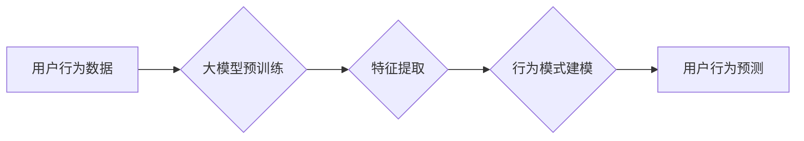

                 

## 大模型推理能力在用户行为建模中的应用

> 关键词：大模型、推理能力、用户行为建模、深度学习、自然语言处理、推荐系统

## 1. 背景介绍

用户行为建模是理解用户行为模式、预测用户未来行为的关键技术，在个性化推荐、精准营销、用户体验优化等领域有着广泛的应用。传统的用户行为建模方法主要依赖于统计模型和规则引擎，但这些方法在面对复杂、非线性的用户行为数据时往往表现力不足。近年来，随着深度学习技术的快速发展，大模型的出现为用户行为建模带来了新的机遇。

大模型是指参数规模庞大、训练数据海量的人工智能模型，其强大的表征能力和泛化能力使其能够更好地捕捉用户行为的复杂性。大模型的推理能力是指模型在接受输入数据后，能够进行逻辑推理、知识抽取、文本理解等高级认知任务的能力。将大模型的推理能力应用于用户行为建模，可以有效提升模型的预测精度和解释性，为更精准的用户行为分析和预测提供支持。

## 2. 核心概念与联系

### 2.1 用户行为建模

用户行为建模是指通过分析用户在使用产品或服务时的行为数据，建立用户行为的数学模型，并利用该模型预测用户未来的行为模式。

### 2.2 大模型

大模型是指参数规模庞大、训练数据海量的人工智能模型，通常拥有数十亿甚至数千亿个参数。大模型通过学习海量数据中的模式和规律，能够对复杂问题进行更深入的理解和分析。

### 2.3 推理能力

推理能力是指模型在接受输入数据后，能够进行逻辑推理、知识抽取、文本理解等高级认知任务的能力。推理能力是人工智能的核心能力之一，也是大模型在用户行为建模中的关键优势。

**Mermaid 流程图**



## 3. 核心算法原理 & 具体操作步骤

### 3.1 算法原理概述

大模型在用户行为建模中的应用主要基于以下核心算法原理：

* **深度学习**: 大模型通常基于深度神经网络架构，例如 Transformer、BERT 等，能够学习用户行为数据中的复杂非线性关系。
* **迁移学习**: 大模型通常在预训练阶段使用海量文本数据进行训练，学习了丰富的语言理解和知识表示能力，可以迁移到用户行为建模任务中，提升模型性能。
* **强化学习**: 可以结合强化学习算法，训练模型学习用户行为的动态变化规律，并根据用户的反馈进行行为预测和优化。

### 3.2 算法步骤详解

1. **数据收集和预处理**: 收集用户行为数据，包括用户点击、浏览、购买、评论等行为，并进行清洗、转换、编码等预处理操作。
2. **特征工程**: 从用户行为数据中提取特征，例如用户 demographics、兴趣爱好、购买历史、浏览记录等，并进行特征选择和组合。
3. **模型训练**: 使用深度学习框架，例如 TensorFlow、PyTorch 等，训练大模型，并根据具体任务选择合适的模型架构和训练策略。
4. **模型评估**: 使用测试数据评估模型的性能，例如准确率、召回率、F1-score 等，并进行模型调优。
5. **模型部署**: 将训练好的模型部署到生产环境中，用于实时用户行为预测和分析。

### 3.3 算法优缺点

**优点**:

* **高准确率**: 大模型的强大表征能力和泛化能力能够学习用户行为数据中的复杂模式，提升预测精度。
* **解释性强**: 随着大模型的可解释性研究的深入，可以更好地理解模型的决策过程，提高模型的信任度。
* **适应性强**: 大模型可以适应不同类型的用户行为数据和任务需求，并通过微调进行个性化定制。

**缺点**:

* **计算资源需求高**: 大模型的训练和推理需要大量的计算资源，成本较高。
* **数据依赖性强**: 大模型的性能依赖于训练数据的质量和数量，数据不足或数据质量低会影响模型效果。
* **可解释性仍有待提升**: 尽管研究者们一直在努力提高大模型的可解释性，但目前仍存在一些挑战。

### 3.4 算法应用领域

大模型推理能力在用户行为建模的应用领域非常广泛，包括：

* **个性化推荐**: 根据用户的历史行为和偏好，推荐个性化的商品、内容或服务。
* **精准营销**: 根据用户的行为特征，精准投放广告和营销信息，提高营销效果。
* **用户体验优化**: 分析用户行为数据，识别用户体验痛点，并进行优化改进。
* **欺诈检测**: 识别异常用户行为，预防和打击欺诈行为。
* **客户服务**: 利用大模型进行智能客服，自动回答用户常见问题，提高客户服务效率。

## 4. 数学模型和公式 & 详细讲解 & 举例说明

### 4.1 数学模型构建

用户行为建模通常使用概率模型来描述用户行为的生成过程。例如，可以使用马尔科夫链模型来描述用户的浏览路径，使用贝叶斯网络来描述用户的购买决策过程。

### 4.2 公式推导过程

假设我们使用马尔科夫链模型来描述用户的浏览路径，其中每个状态代表一个网页，状态之间的转移概率可以通过用户历史浏览数据进行估计。

**状态转移概率矩阵**:

$$
P = \begin{bmatrix}
p_{11} & p_{12} & \cdots & p_{1N} \\
p_{21} & p_{22} & \cdots & p_{2N} \\
\vdots & \vdots & \ddots & \vdots \\
p_{N1} & p_{N2} & \cdots & p_{NN}
\end{bmatrix}
$$

其中，$p_{ij}$ 表示从状态 $i$ 转移到状态 $j$ 的概率。

**用户浏览路径的概率**:

$$
P(path) = p_{s1} \cdot p_{12} \cdot p_{23} \cdot \cdots \cdot p_{N-1,N}
$$

其中，$path$ 表示用户的浏览路径，$s$ 表示初始状态。

### 4.3 案例分析与讲解

例如，假设我们有一个电商网站，用户浏览商品的路径可以表示为：首页 -> 商品分类 -> 商品详情页 -> 购物车 -> 支付。我们可以使用马尔科夫链模型来预测用户在浏览商品时，下一步会访问哪个页面。

通过分析用户历史浏览数据，我们可以估计每个状态之间的转移概率，并构建状态转移概率矩阵。然后，我们可以根据用户的当前状态，预测用户下一步会访问哪个页面。

## 5. 项目实践：代码实例和详细解释说明

### 5.1 开发环境搭建

* Python 3.7+
* TensorFlow 2.0+
* PyTorch 1.0+
* Jupyter Notebook

### 5.2 源代码详细实现

```python
# 使用 TensorFlow 构建一个简单的用户行为预测模型

import tensorflow as tf

# 定义模型结构
model = tf.keras.Sequential([
    tf.keras.layers.Dense(64, activation='relu', input_shape=(10,)),
    tf.keras.layers.Dense(32, activation='relu'),
    tf.keras.layers.Dense(1, activation='sigmoid')
])

# 编译模型
model.compile(optimizer='adam', loss='binary_crossentropy', metrics=['accuracy'])

# 训练模型
model.fit(x_train, y_train, epochs=10)

# 评估模型
loss, accuracy = model.evaluate(x_test, y_test)
print('Loss:', loss)
print('Accuracy:', accuracy)
```

### 5.3 代码解读与分析

* **模型结构**: 该代码定义了一个简单的多层感知机模型，输入层有 10 个神经元，分别对应用户行为特征，输出层只有一个神经元，用于预测用户是否会进行某个行为。
* **模型编译**: 使用 Adam 优化器、二元交叉熵损失函数和准确率作为评估指标。
* **模型训练**: 使用训练数据训练模型 10 个 epochs。
* **模型评估**: 使用测试数据评估模型的性能，输出损失值和准确率。

### 5.4 运行结果展示

运行结果会显示模型的损失值和准确率，可以根据结果评估模型的性能。

## 6. 实际应用场景

### 6.1 个性化推荐

大模型可以分析用户的浏览历史、购买记录、评分等行为数据，学习用户的兴趣偏好，并推荐个性化的商品、内容或服务。例如，电商平台可以利用大模型为用户推荐相关的商品，视频平台可以根据用户的观看历史推荐感兴趣的视频。

### 6.2 精准营销

大模型可以分析用户的行为特征，识别潜在客户，并进行精准营销。例如，广告平台可以根据用户的兴趣爱好和行为模式，投放更精准的广告，提高广告转化率。

### 6.3 用户体验优化

大模型可以分析用户的行为数据，识别用户体验痛点，并进行优化改进。例如，网站可以利用大模型分析用户的浏览路径，优化网站结构和导航，提高用户体验。

### 6.4 未来应用展望

随着大模型技术的不断发展，其在用户行为建模领域的应用将更加广泛和深入。例如，可以利用大模型进行更精准的用户画像构建，预测用户的长期行为趋势，为用户提供更个性化和定制化的服务。

## 7. 工具和资源推荐

### 7.1 学习资源推荐

* **书籍**:
    * 《深度学习》 - Ian Goodfellow, Yoshua Bengio, Aaron Courville
    * 《自然语言处理》 - Dan Jurafsky, James H. Martin
* **在线课程**:
    * Coursera: 深度学习 Specialization
    * Udacity: 自然语言处理 Nanodegree
* **博客**:
    * The Gradient
    * Towards Data Science

### 7.2 开发工具推荐

* **深度学习框架**: TensorFlow, PyTorch
* **自然语言处理库**: NLTK, spaCy, Transformers
* **数据可视化工具**: Matplotlib, Seaborn

### 7.3 相关论文推荐

* BERT: Pre-training of Deep Bidirectional Transformers for Language Understanding
* GPT-3: Language Models are Few-Shot Learners
* Transformer: Attention Is All You Need

## 8. 总结：未来发展趋势与挑战

### 8.1 研究成果总结

大模型推理能力在用户行为建模领域取得了显著的成果，能够提升模型的预测精度和解释性，为更精准的用户行为分析和预测提供支持。

### 8.2 未来发展趋势

* **模型规模和能力的提升**: 大模型的规模和能力将继续提升，能够学习更复杂的用户行为模式。
* **可解释性研究的深入**: 研究者们将继续努力提高大模型的可解释性，使其决策过程更加透明和可理解。
* **多模态用户行为建模**: 将文本、图像、视频等多模态数据融合到用户行为建模中，构建更全面的用户画像。

### 8.3 面临的挑战

* **数据隐私和安全**: 大模型的训练和应用需要大量用户数据，如何保护用户隐私和数据安全是一个重要的挑战。
* **模型偏见和公平性**: 大模型可能存在模型偏见，导致预测结果不公平，需要研究如何 mitigate 模型偏见。
* **模型部署和维护**: 大模型的部署和维护成本较高，需要开发更有效的部署和维护策略。

### 8.4 研究展望

未来，大模型推理能力在用户行为建模领域将继续发挥重要作用，为个性化推荐、精准营销、用户体验优化等领域提供更强大的技术支持。


## 9. 附录：常见问题与解答

**Q1: 大模型的训练需要多少计算资源？**

A1: 大模型的训练需要大量的计算资源，例如 GPU、TPU 等。具体需要的计算资源取决于模型的规模、训练数据的大小和训练时间等因素。

**Q2: 如何评估大模型的性能？**

A2: 大模型的性能可以评估指标包括准确率、召回率、F1-score、AUC 等。具体评估指标的选择取决于具体的应用场景。

**Q3: 如何解决大模型的模型偏见问题？**

A3: 

* 使用更公平的训练数据。
* 在训练过程中加入公平性约束。
* 使用模型解释性技术，识别和解释模型的偏见。

**Q4: 如何部署大模型？**

A4: 大模型的部署方式包括云端部署、边缘部署和本地部署等。具体部署方式的选择取决于应用场景和资源限制。


作者：禅与计算机程序设计艺术 / Zen and the Art of Computer Programming 
<end_of_turn>

