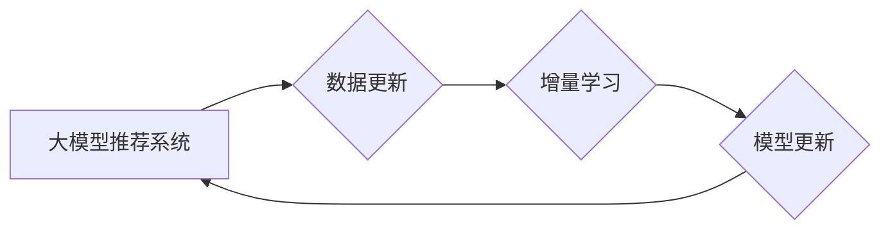

                 

## 大模型推荐系统的增量学习策略

> 关键词：大模型、推荐系统、增量学习、在线学习、知识蒸馏、迁移学习、效率优化

## 1. 背景介绍

推荐系统作为信息过滤和个性化服务的重要组成部分，在电商、社交媒体、视频平台等领域发挥着越来越重要的作用。随着大模型技术的快速发展，基于大模型的推荐系统展现出强大的学习能力和泛化能力，能够提供更精准、更个性化的推荐结果。然而，大模型训练的成本高昂，且需要海量数据进行训练，这在实际应用中存在一定的挑战。

增量学习作为一种高效的机器学习策略，能够在不断更新数据的情况下，对模型进行迭代更新，从而降低模型训练的成本，提高模型的实时性和适应性。将增量学习策略应用于大模型推荐系统，可以有效解决大模型训练的瓶颈，使其能够更好地适应不断变化的用户需求和数据环境。

## 2. 核心概念与联系

### 2.1  大模型推荐系统

大模型推荐系统是指利用大规模参数模型，例如 Transformer、BERT 等，进行推荐任务的推荐系统。大模型能够学习到更深层次的用户偏好和物品特征，从而提供更精准的推荐结果。

### 2.2  增量学习

增量学习是指在模型已经训练完成的情况下，使用新的数据对模型进行迭代更新，从而提高模型的性能。与传统的模型训练方式相比，增量学习能够有效降低模型训练的成本和时间，并提高模型的实时性和适应性。

### 2.3  核心概念联系

大模型推荐系统和增量学习策略相结合，可以构建出高效、灵活、可扩展的推荐系统。

**Mermaid 流程图**



## 3. 核心算法原理 & 具体操作步骤

### 3.1  算法原理概述

增量学习的原理是利用之前训练好的模型作为初始模型，在新的数据上进行微调，从而更新模型参数，提高模型性能。常用的增量学习算法包括：

* **在线学习:** 在每次收到新数据时，对模型进行更新。
* **知识蒸馏:** 将大模型的知识迁移到小模型中，从而降低小模型的训练成本。
* **迁移学习:** 将预训练模型在新的任务上进行微调。

### 3.2  算法步骤详解

**在线学习:**

1. 初始化模型参数。
2. 接收新数据样本。
3. 计算模型预测结果。
4. 计算损失函数。
5. 使用梯度下降算法更新模型参数。

**知识蒸馏:**

1. 训练一个大模型和一个小模型。
2. 使用大模型的预测结果作为教师模型，对小模型进行训练。
3. 通过调整教师模型和学生模型之间的温度参数，引导学生模型学习教师模型的知识。

**迁移学习:**

1. 在一个源任务上预训练一个模型。
2. 将预训练模型迁移到目标任务上进行微调。
3. 使用目标任务的数据进行微调，从而提高模型在目标任务上的性能。

### 3.3  算法优缺点

| 算法 | 优点 | 缺点 |
|---|---|---|
| 在线学习 | 实时性强，能够快速适应数据变化 | 容易过拟合，需要谨慎选择学习率 |
| 知识蒸馏 | 能够有效降低模型训练成本 | 需要训练两个模型，教师模型需要足够大 |
| 迁移学习 | 能够利用预训练模型的知识，提高模型性能 | 需要找到合适的源任务，预训练模型的知识不一定适用于目标任务 |

### 3.4  算法应用领域

增量学习算法广泛应用于推荐系统、自然语言处理、计算机视觉等领域。

* **推荐系统:** 利用增量学习算法，可以根据用户行为数据不断更新推荐模型，提供更精准的推荐结果。
* **自然语言处理:** 利用增量学习算法，可以根据新的文本数据不断更新语言模型，提高模型的理解和生成能力。
* **计算机视觉:** 利用增量学习算法，可以根据新的图像数据不断更新图像识别模型，提高模型的识别精度。

## 4. 数学模型和公式 & 详细讲解 & 举例说明

### 4.1  数学模型构建

假设我们有一个大模型推荐系统，其目标是预测用户对物品的评分。我们可以使用以下数学模型来表示用户对物品的评分预测：

$$
\hat{r}_{u,i} = f(h_u, h_i, \theta)
$$

其中：

* $\hat{r}_{u,i}$ 是模型预测的用户 $u$ 对物品 $i$ 的评分。
* $h_u$ 是用户 $u$ 的特征向量。
* $h_i$ 是物品 $i$ 的特征向量。
* $\theta$ 是模型参数。
* $f$ 是一个非线性函数，例如多层感知机或 Transformer。

### 4.2  公式推导过程

增量学习的目标是根据新的数据更新模型参数 $\theta$，从而提高模型的预测精度。我们可以使用梯度下降算法来更新模型参数。

梯度下降算法的基本思想是：

1. 计算模型预测结果与真实评分之间的损失函数。
2. 计算损失函数对模型参数的梯度。
3. 根据梯度方向更新模型参数。

具体公式如下：

$$
\theta = \theta - \alpha \nabla L(\theta)
$$

其中：

* $\alpha$ 是学习率。
* $\nabla L(\theta)$ 是损失函数对模型参数 $\theta$ 的梯度。

### 4.3  案例分析与讲解

假设我们有一个电商平台的推荐系统，其目标是预测用户对商品的评分。我们使用一个大模型进行训练，并收集了用户的评分数据。随着时间的推移，用户行为数据不断更新，我们需要对模型进行增量更新，以适应用户的最新偏好。

我们可以使用在线学习算法来实现增量更新。每次收到新的用户评分数据，我们就可以计算模型预测结果与真实评分之间的损失函数，并根据梯度下降算法更新模型参数。

## 5. 项目实践：代码实例和详细解释说明

### 5.1  开发环境搭建

* Python 3.7+
* TensorFlow 2.0+
* PyTorch 1.0+
* CUDA 10.0+ (可选)

### 5.2  源代码详细实现

```python
# 导入必要的库
import tensorflow as tf

# 定义模型
class RecommenderModel(tf.keras.Model):
    def __init__(self, embedding_dim, num_users, num_items):
        super(RecommenderModel, self).__init__()
        self.user_embedding = tf.keras.layers.Embedding(num_users, embedding_dim)
        self.item_embedding = tf.keras.layers.Embedding(num_items, embedding_dim)
        self.dense = tf.keras.layers.Dense(1)

    def call(self, user_ids, item_ids):
        user_embeddings = self.user_embedding(user_ids)
        item_embeddings = self.item_embedding(item_ids)
        combined_embeddings = user_embeddings + item_embeddings
        return self.dense(combined_embeddings)

# 定义损失函数
def mean_squared_error(y_true, y_pred):
    return tf.keras.losses.MeanSquaredError()(y_true, y_pred)

# 定义优化器
optimizer = tf.keras.optimizers.Adam(learning_rate=0.001)

# 训练模型
model = RecommenderModel(embedding_dim=64, num_users=1000, num_items=1000)
model.compile(loss=mean_squared_error, optimizer=optimizer)

# 训练数据
train_data = ...

# 训练模型
model.fit(train_data, epochs=10)

# 预测评分
user_id = 123
item_id = 456
prediction = model.predict([user_id, item_id])
print(prediction)
```

### 5.3  代码解读与分析

* 代码首先定义了一个推荐模型，该模型使用嵌入层将用户和物品的ID转换为向量表示，然后使用全连接层进行评分预测。
* 然后定义了损失函数和优化器，并使用这些组件训练模型。
* 训练完成后，可以使用模型预测新的用户对物品的评分。

### 5.4  运行结果展示

运行代码后，会输出用户对物品的评分预测结果。

## 6. 实际应用场景

### 6.1  电商推荐

大模型推荐系统可以根据用户的购买历史、浏览记录、评价等数据，推荐用户可能感兴趣的商品。增量学习策略可以使推荐系统更加实时，能够根据用户的最新行为数据进行更新，提供更精准的推荐结果。

### 6.2  视频推荐

大模型推荐系统可以根据用户的观看历史、点赞记录、评论等数据，推荐用户可能感兴趣的视频。增量学习策略可以使推荐系统更加个性化，能够根据用户的最新观看偏好进行更新，提供更符合用户兴趣的视频推荐。

### 6.3  新闻推荐

大模型推荐系统可以根据用户的阅读历史、关注领域、点赞记录等数据，推荐用户可能感兴趣的新闻。增量学习策略可以使推荐系统更加及时，能够根据用户的最新阅读偏好进行更新，提供更符合用户需求的新闻推荐。

### 6.4  未来应用展望

随着大模型技术的不断发展，增量学习策略在推荐系统中的应用将更加广泛。未来，我们可以期待看到：

* 更个性化、更精准的推荐结果。
* 更高效、更灵活的推荐系统。
* 更广泛的应用场景，例如教育、医疗、金融等领域。

## 7. 工具和资源推荐

### 7.1  学习资源推荐

* **书籍:**
    * Deep Learning by Ian Goodfellow, Yoshua Bengio, and Aaron Courville
    * Hands-On Machine Learning with Scikit-Learn, Keras & TensorFlow by Aurélien Géron
* **在线课程:**
    * TensorFlow Tutorials: https://www.tensorflow.org/tutorials
    * PyTorch Tutorials: https://pytorch.org/tutorials/

### 7.2  开发工具推荐

* **TensorFlow:** https://www.tensorflow.org/
* **PyTorch:** https://pytorch.org/
* **Keras:** https://keras.io/

### 7.3  相关论文推荐

* **BERT: Pre-training of Deep Bidirectional Transformers for Language Understanding**
* **GPT-3: Language Models are Few-Shot Learners**
* **Knowledge Distillation**

## 8. 总结：未来发展趋势与挑战

### 8.1  研究成果总结

大模型推荐系统结合增量学习策略，能够有效解决大模型训练的瓶颈，提高模型的实时性和适应性。

### 8.2  未来发展趋势

* **模型架构创新:** 探索更有效的模型架构，例如 Transformer 的变体、图神经网络等，以提高模型的性能和效率。
* **数据增强:** 利用数据增强技术，例如文本生成、图像合成等，增加训练数据量，提高模型的泛化能力。
* **联邦学习:** 利用联邦学习技术，在不共享原始数据的情况下，实现模型的联合训练，提高模型的隐私性和安全性。

### 8.3  面临的挑战

* **计算资源:** 大模型训练需要大量的计算资源，这对于资源有限的机构或个人来说是一个挑战。
* **数据质量:** 大模型的性能依赖于数据质量，而现实世界的数据往往存在噪声、缺失等问题，需要进行有效的预处理和清洗。
* **模型解释性:** 大模型的决策过程往往难以解释，这对于用户信任和模型应用的推广来说是一个挑战。

### 8.4  研究展望

未来，大模型推荐系统将朝着更智能、更个性化、更安全的方向发展。研究者将继续探索新的模型架构、数据增强技术和联邦学习方法，以解决大模型训练和应用中的挑战，为用户提供更优质的推荐服务。

## 9. 附录：常见问题与解答

**Q1: 增量学习与传统模型训练相比有什么优势？**

**A1:** 增量学习能够有效降低模型训练的成本和时间，并提高模型的实时性和适应性。

**Q2: 如何选择合适的增量学习算法？**

**A2:** 选择合适的增量学习算法需要根据具体应用场景和数据特点进行选择。

**Q3: 大模型推荐系统有哪些应用场景？**

**A3:** 大模型推荐系统广泛应用于电商推荐、视频推荐、新闻推荐等领域。

**作者：禅与计算机程序设计艺术 / Zen and the Art of Computer Programming**<end_of_turn>

