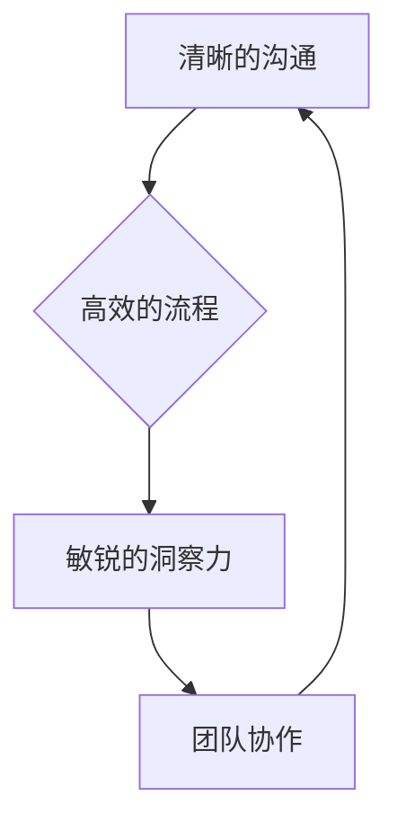

                 

## 如何从经典著作中提炼管理智慧

> 关键词：管理智慧、经典著作、程序设计、软件架构、团队合作、沟通技巧、领导力、效率提升

### 1. 背景介绍

在瞬息万变的科技时代，管理智慧显得尤为重要。作为一名程序员、软件架构师和技术领导者，我深知高效的团队协作、清晰的沟通和敏锐的洞察力对于项目成功至关重要。然而，这些管理智慧并非一蹴而就，需要不断学习和积累。

我发现，许多经典著作虽然并非专门针对管理领域的，却蕴含着丰富的管理智慧。这些智慧，如同精炼的代码，可以被提取、应用和优化，帮助我们提升管理能力，打造高效团队。

### 2. 核心概念与联系

管理智慧的核心概念可以概括为：

* **清晰的沟通:**  如同代码的注释，清晰的沟通是团队协作的基础。
* **高效的流程:**  如同算法的优化，高效的流程可以提高团队效率。
* **敏锐的洞察力:**  如同代码的调试，敏锐的洞察力可以帮助我们发现问题并及时解决。
* **团队协作:**  如同软件开发的迭代，团队协作可以帮助我们共同完成复杂的任务。

这些概念相互关联，形成一个完整的管理智慧体系。



### 3. 核心算法原理 & 具体操作步骤

#### 3.1  算法原理概述

管理智慧的应用可以看作是一个算法，其核心原理是：

1. **识别问题:**  如同代码中的错误，管理问题需要被识别和定义。
2. **分析问题:**  如同代码的调试，需要分析问题的根源和影响范围。
3. **制定方案:**  如同代码的修改，需要制定解决问题的方案。
4. **执行方案:**  如同代码的运行，需要将方案付诸实践。
5. **评估结果:**  如同代码的测试，需要评估方案的有效性和改进空间。

#### 3.2  算法步骤详解

1. **识别问题:**  通过观察、倾听和数据分析，识别团队或项目中的问题。
2. **分析问题:**  深入分析问题的根源，包括人员、流程、工具等方面。
3. **制定方案:**  根据问题的性质，制定具体的解决方案，并评估方案的可行性和风险。
4. **执行方案:**  将方案付诸实践，并进行必要的调整和优化。
5. **评估结果:**  收集数据和反馈，评估方案的有效性和改进空间。

#### 3.3  算法优缺点

* **优点:**  

    * 系统化、可操作性强。
    * 能够帮助我们理性分析问题，制定有效的解决方案。
    * 能够促进团队协作和沟通。

* **缺点:**  

    * 可能会过于僵化，难以应对复杂和突发情况。
    * 需要不断学习和实践，才能熟练掌握。

#### 3.4  算法应用领域

* **项目管理:**  帮助项目经理识别风险、制定计划、协调资源和控制进度。
* **团队建设:**  帮助团队领导提升团队凝聚力、协作效率和沟通水平。
* **个人成长:**  帮助个人识别自身优势和劣势，制定个人发展计划。

### 4. 数学模型和公式 & 详细讲解 & 举例说明

#### 4.1  数学模型构建

我们可以用数学模型来描述管理智慧的应用过程。例如，我们可以用以下公式来表示团队效率：

$$
Efficiency = \frac{Output}{Input}
$$

其中：

* **Output:**  团队完成的工作量
* **Input:**  团队投入的时间、资源和精力

#### 4.2  公式推导过程

这个公式的推导过程很简单，就是将团队的产出与投入进行比值。

#### 4.3  案例分析与讲解

假设一个团队投入了100小时的时间和资源，完成了价值1000美元的工作。那么，这个团队的效率为：

$$
Efficiency = \frac{1000}{100} = 10
$$

这个效率值表明，这个团队非常高效，每投入1小时的时间和资源，就能产出10美元的价值。

### 5. 项目实践：代码实例和详细解释说明

#### 5.1  开发环境搭建

为了更好地理解管理智慧的应用，我们可以用一个简单的项目来进行实践。例如，我们可以创建一个简单的项目管理工具，帮助团队成员跟踪任务进度和协作完成工作。

#### 5.2  源代码详细实现

由于篇幅限制，这里只提供代码框架，具体实现细节可以参考相关开源项目。

```python
class Task:
    def __init__(self, name, description, due_date):
        self.name = name
        self.description = description
        self.due_date = due_date
        self.status = "未完成"

    def update_status(self, new_status):
        self.status = new_status

class Project:
    def __init__(self, name):
        self.name = name
        self.tasks = []

    def add_task(self, task):
        self.tasks.append(task)

    def get_task_status(self):
        for task in self.tasks:
            print(f"{task.name}: {task.status}")

# 示例代码
project = Project("我的项目")
task1 = Task("撰写文档", "完成项目文档", "2023-12-31")
task2 = Task("开发功能", "实现项目核心功能", "2024-01-15")
project.add_task(task1)
project.add_task(task2)
project.get_task_status()
```

#### 5.3  代码解读与分析

这个代码框架实现了简单的任务管理功能。

* **Task类:**  代表一个任务，包含任务名称、描述、截止日期和状态。
* **Project类:**  代表一个项目，包含项目名称和任务列表。
* **add_task()方法:**  将任务添加到项目中。
* **get_task_status()方法:**  打印所有任务的状态。

#### 5.4  运行结果展示

运行代码后，会输出所有任务的状态。

### 6. 实际应用场景

#### 6.1  项目管理

管理智慧可以帮助项目经理更好地管理项目进度、资源和风险。例如，可以通过清晰的沟通和高效的流程，确保项目按时完成。

#### 6.2  团队建设

管理智慧可以帮助团队领导提升团队凝聚力、协作效率和沟通水平。例如，可以通过敏锐的洞察力和有效的团队协作，解决团队中的冲突和问题。

#### 6.3  个人成长

管理智慧可以帮助个人识别自身优势和劣势，制定个人发展计划。例如，可以通过不断学习和实践，提升自己的管理能力和领导力。

#### 6.4  未来应用展望

随着科技的不断发展，管理智慧将发挥越来越重要的作用。例如，人工智能和大数据技术可以帮助我们更有效地分析数据，预测风险，优化流程。

### 7. 工具和资源推荐

#### 7.1  学习资源推荐

* **书籍:**  《高效能人士的七个习惯》、《管理的艺术》、《领导力》
* **课程:**  Coursera、edX、Udemy等平台上的管理课程
* **博客:**  Harvard Business Review、Forbes等网站的管理博客

#### 7.2  开发工具推荐

* **项目管理工具:**  Jira、Trello、Asana等
* **沟通协作工具:**  Slack、Microsoft Teams、Zoom等
* **数据分析工具:**  Tableau、Power BI、Google Analytics等

#### 7.3  相关论文推荐

* **敏捷软件开发:**  Agile Manifesto
* **项目管理:**  Project Management Institute (PMI)
* **团队合作:**  Tuckman's Stages of Group Development

### 8. 总结：未来发展趋势与挑战

#### 8.1  研究成果总结

从经典著作中提炼管理智慧，可以帮助我们提升管理能力，打造高效团队。

#### 8.2  未来发展趋势

未来，管理智慧将更加注重数据驱动、人工智能和个性化定制。

#### 8.3  面临的挑战

管理智慧的应用需要克服一些挑战，例如：

* **文化差异:**  不同的文化背景下，管理智慧的应用方式可能有所不同。
* **组织结构:**  不同的组织结构，需要不同的管理智慧。
* **技术发展:**  科技的不断发展，需要我们不断学习和更新管理智慧。

#### 8.4  研究展望

未来，我们将继续探索管理智慧的应用，并将其与人工智能、大数据等新技术相结合，打造更加高效、智能的管理体系。

### 9. 附录：常见问题与解答

* **问题:**  如何才能更好地从经典著作中提炼管理智慧？
* **解答:**  

    * 阅读经典著作时，要带着问题去思考，并尝试将其中的智慧应用到实际工作中。
    * 可以将经典著作中的观点和案例进行总结和归纳，形成自己的管理智慧体系。
    * 可以与其他管理者交流学习，互相分享经验和 insights。

* **问题:**  管理智慧的应用需要哪些条件？
* **解答:**  

    * 需要有清晰的沟通和高效的流程。
    * 需要有敏锐的洞察力和有效的团队协作。
    * 需要有持续学习和改进的意识。

* **问题:**  管理智慧的应用有哪些局限性？
* **解答:**  

    * 管理智慧的应用需要根据具体情况进行调整，不能一成不变。
    * 管理智慧的应用需要不断学习和实践，才能熟练掌握。


作者：禅与计算机程序设计艺术 / Zen and the Art of Computer Programming 
<end_of_turn>

