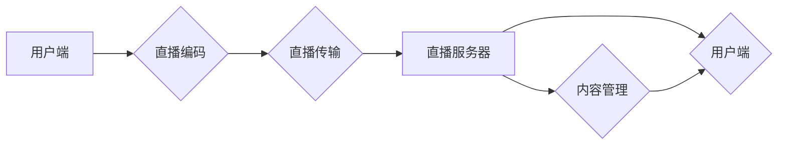

                 

## 如何利用直播平台增加课程复购率

> 关键词：直播平台、课程复购率、用户互动、数据分析、个性化推荐、内容营销、直播电商

## 1. 背景介绍

在线教育行业近年来发展迅速，直播平台作为一种新型的教学模式，凭借其实时互动、沉浸式体验等优势，逐渐成为教育领域的重要组成部分。然而，课程复购率一直是困扰在线教育平台的一大难题。如何有效利用直播平台的特性，提升用户对课程的粘性和复购意愿，成为行业亟待解决的关键问题。

## 2. 核心概念与联系

### 2.1 直播平台与课程复购率

直播平台为在线教育提供了全新的互动模式，打破了传统课程的单向传播，实现了师生实时互动，增强了学习体验。

* **实时互动:** 直播平台支持实时提问、答疑、讨论等功能，让学生能够及时获得解答，提高学习效率。
* **沉浸式体验:** 直播平台通过视频、音频、文字等多媒体形式，营造出更加沉浸式的学习氛围，增强学生的学习兴趣。
* **社群互动:** 直播平台可以建立学习社群，让学生之间互相交流学习心得，形成学习氛围，提升学习动力。

这些特性能够有效提升用户对课程的参与度和满意度，从而提高课程复购率。

### 2.2 直播平台架构

直播平台的架构通常包含以下几个关键模块：

* **直播编码模块:** 将视频和音频信号进行编码，压缩传输。
* **直播传输模块:** 将编码后的数据传输到直播服务器。
* **直播服务器模块:** 接收、存储和转发直播数据，并提供直播观看功能。
* **用户管理模块:** 管理用户注册、登录、权限等功能。
* **内容管理模块:** 管理课程、直播内容等信息。
* **互动模块:** 提供实时聊天、点赞、投票等互动功能。

**Mermaid 流程图:**



## 3. 核心算法原理 & 具体操作步骤

### 3.1 算法原理概述

提升课程复购率的核心算法主要围绕用户行为分析、个性化推荐和内容营销三个方面。

* **用户行为分析:** 通过分析用户的观看记录、互动行为、评价反馈等数据，了解用户的学习偏好、兴趣点和痛点，为个性化推荐提供数据支持。
* **个性化推荐:** 基于用户行为分析结果，推荐与用户兴趣相符的课程、直播内容和学习资源，提高用户学习兴趣和参与度。
* **内容营销:** 通过直播平台的特性，设计和制作吸引用户的直播内容，例如互动课程、专家讲座、答疑直播等，增强用户粘性和复购意愿。

### 3.2 算法步骤详解

1. **数据采集:** 收集用户的观看记录、互动行为、评价反馈等数据，并进行清洗和预处理。
2. **特征提取:** 从用户数据中提取特征，例如观看时长、互动频率、评价内容等，构建用户画像。
3. **模型训练:** 利用机器学习算法，训练用户行为预测模型，例如协同过滤、内容基准推荐等，预测用户的学习偏好和兴趣点。
4. **个性化推荐:** 根据用户画像和预测结果，推荐与用户兴趣相符的课程、直播内容和学习资源。
5. **内容营销:** 设计和制作吸引用户的直播内容，例如互动课程、专家讲座、答疑直播等，并通过平台的推广机制进行宣传。
6. **效果评估:** 定期评估推荐效果和内容营销效果，并根据评估结果进行模型优化和内容调整。

### 3.3 算法优缺点

**优点:**

* **精准推荐:** 基于用户行为分析和机器学习算法，能够精准推荐用户感兴趣的课程和内容。
* **提升用户粘性:** 个性化推荐和内容营销能够提升用户学习兴趣和参与度，增强用户粘性。
* **提高复购率:** 通过精准推荐和内容营销，能够有效提升用户对课程的复购意愿。

**缺点:**

* **数据依赖:** 算法效果依赖于数据的质量和数量，数据不足或数据质量低会影响算法效果。
* **算法复杂度:** 训练和维护机器学习模型需要一定的技术复杂度。
* **用户隐私:** 用户行为数据收集和分析需要考虑用户隐私保护问题。

### 3.4 算法应用领域

* **在线教育:** 提升课程复购率、个性化学习推荐、内容营销。
* **电商平台:** 商品推荐、用户画像分析、精准营销。
* **社交媒体:** 内容推荐、用户兴趣分析、个性化广告投放。

## 4. 数学模型和公式 & 详细讲解 & 举例说明

### 4.1 数学模型构建

用户行为预测模型通常采用协同过滤算法，其核心思想是基于用户的相似度和物品的相似度进行推荐。

**用户相似度计算公式:**

$$
Sim(u_i, u_j) = \frac{\sum_{k=1}^{n} r_{i,k} * r_{j,k}}{\sqrt{\sum_{k=1}^{n} r_{i,k}^2} * \sqrt{\sum_{k=1}^{n} r_{j,k}^2}}
$$

其中:

* $Sim(u_i, u_j)$ 表示用户 $u_i$ 和 $u_j$ 的相似度。
* $r_{i,k}$ 表示用户 $u_i$ 对物品 $k$ 的评分。
* $n$ 表示物品总数。

**物品相似度计算公式:**

$$
Sim(i, j) = \frac{\sum_{u=1}^{m} r_{u,i} * r_{u,j}}{\sqrt{\sum_{u=1}^{m} r_{u,i}^2} * \sqrt{\sum_{u=1}^{m} r_{u,j}^2}}
$$

其中:

* $Sim(i, j)$ 表示物品 $i$ 和 $j$ 的相似度。
* $r_{u,i}$ 表示用户 $u$ 对物品 $i$ 的评分。
* $m$ 表示用户总数。

### 4.2 公式推导过程

协同过滤算法的核心是基于用户相似度和物品相似度进行推荐。

* **基于用户相似度的推荐:**

对于用户 $u_i$，找到与其相似度最高的 $k$ 个用户 $u_j$，然后推荐用户 $u_j$ 喜欢的物品，但用户 $u_i$ 还没有观看过的物品。

* **基于物品相似度的推荐:**

对于用户 $u_i$ 喜欢的物品 $i$，找到与之相似度最高的 $k$ 个物品 $j$，然后推荐用户 $u_i$ 还没有观看过的物品 $j$。

### 4.3 案例分析与讲解

假设有一个在线教育平台，用户 $A$ 喜欢观看编程课程，用户 $B$ 也喜欢观看编程课程，并且他们对一些课程的评分相似。根据协同过滤算法，可以将用户 $A$ 和用户 $B$ 视为相似用户，并推荐用户 $B$ 观看的编程课程给用户 $A$。

## 5. 项目实践：代码实例和详细解释说明

### 5.1 开发环境搭建

* **操作系统:** Ubuntu 20.04 LTS
* **编程语言:** Python 3.8
* **框架:** Flask
* **数据库:** MySQL

### 5.2 源代码详细实现

```python
from flask import Flask, request, jsonify
from sklearn.metrics.pairwise import cosine_similarity

app = Flask(__name__)

# 用户数据
users = {
    'user1': {'courses': ['python', 'java', 'c++']},
    'user2': {'courses': ['python', 'javascript', 'html']},
    'user3': {'courses': ['java', 'c++', 'sql']},
}

# 计算用户相似度
def calculate_user_similarity(user1, user2):
    # 计算用户观看课程的相似度
    similarity = cosine_similarity([user1['courses']], [user2['courses']])[0][0]
    return similarity

# 获取推荐课程
@app.route('/recommend', methods=['POST'])
def recommend():
    user_id = request.json.get('user_id')
    # 获取用户观看课程列表
    user_courses = users.get(user_id, {}).get('courses', [])
    # 计算与当前用户相似度最高的k个用户
    similar_users = sorted(users.keys(), key=lambda user: calculate_user_similarity(users[user], users[user_id]), reverse=True)[:3]
    # 获取相似用户观看的课程列表
    recommended_courses = set()
    for user in similar_users:
        recommended_courses.update(users[user].get('courses', []))
    # 去除用户已经观看过的课程
    recommended_courses = list(recommended_courses - set(user_courses))
    return jsonify({'recommended_courses': recommended_courses})

if __name__ == '__main__':
    app.run(debug=True)
```

### 5.3 代码解读与分析

* **用户数据:** 代码中定义了一个 `users` 字典，存储了用户的 ID 和观看课程列表。
* **用户相似度计算:** `calculate_user_similarity` 函数使用余弦相似度计算两个用户的相似度。
* **推荐课程接口:** `/recommend` 接口接收用户 ID 作为参数，并返回推荐课程列表。
* **推荐算法:** 算法首先计算当前用户与其他用户的相似度，然后找到相似度最高的 $k$ 个用户，并推荐这些用户观看的课程。

### 5.4 运行结果展示

当用户发送 POST 请求到 `/recommend` 接口，并提供用户 ID 时，服务器会返回一个 JSON 响应，包含推荐课程列表。

## 6. 实际应用场景

### 6.1 直播课程推荐

利用用户观看记录和互动行为，推荐与用户兴趣相符的直播课程，提高用户参与度和复购率。

### 6.2 直播内容个性化

根据用户画像和学习偏好，定制化直播内容，例如互动课程、专家讲座、答疑直播等，增强用户学习体验。

### 6.3 直播电商

利用直播平台的特性，进行直播带货，推荐与用户兴趣相符的商品，提高转化率。

### 6.4 未来应用展望

随着直播平台的发展和用户需求的变化，未来直播平台在教育领域的应用场景将更加广泛，例如：

* **沉浸式虚拟现实直播:** 利用虚拟现实技术，打造更加沉浸式的学习体验。
* **人工智能辅助直播:** 利用人工智能技术，实现直播内容自动生成、智能答疑等功能。
* **个性化学习路径:** 根据用户的学习进度和能力，定制化学习路径，提高学习效率。

## 7. 工具和资源推荐

### 7.1 学习资源推荐

* **在线课程:** Coursera、edX、Udacity 等平台提供丰富的在线课程，涵盖计算机科学、数据科学、人工智能等领域。
* **书籍:** 《推荐系统实践》、《机器学习》等书籍可以帮助您深入了解推荐系统和机器学习算法。
* **开源项目:** TensorFlow、PyTorch 等开源项目可以帮助您实践机器学习算法。

### 7.2 开发工具推荐

* **编程语言:** Python 是机器学习和数据分析的常用语言。
* **框架:** Flask、Django 等框架可以帮助您快速搭建Web应用。
* **数据库:** MySQL、MongoDB 等数据库可以存储用户数据和课程信息。

### 7.3 相关论文推荐

* **协同过滤算法:** "Collaborative Filtering: A User-Based Approach"
* **内容基准推荐:** "Content-Based Recommendation Systems"
* **深度学习推荐:** "Deep Learning for Recommender Systems"

## 8. 总结：未来发展趋势与挑战

### 8.1 研究成果总结

本文介绍了利用直播平台增加课程复购率的算法原理和实践方法，包括用户行为分析、个性化推荐和内容营销。

### 8.2 未来发展趋势

* **人工智能技术:** 人工智能技术将进一步提升推荐系统的精准度和个性化程度。
* **数据分析:** 数据分析技术将帮助平台更深入地了解用户的学习偏好和需求。
* **互动体验:** 直播平台将更加注重互动体验，例如虚拟现实、增强现实等技术将被应用于直播教学。

### 8.3 面临的挑战

* **数据隐私:** 如何保护用户数据隐私是直播平台面临的一大挑战。
* **算法公平性:** 算法需要保证公平性，避免出现歧视或偏见。
* **技术复杂度:** 直播平台的开发和维护需要较高的技术复杂度。

### 8.4 研究展望

未来研究方向包括：

* **更精准的推荐算法:** 开发更精准的推荐算法，能够更好地满足用户的个性化需求。
* **更丰富的互动体验:** 利用新技术，打造更丰富的互动体验，提升用户学习兴趣和参与度。
* **更有效的隐私保护机制:** 开发更有效的隐私保护机制，保障用户数据安全。

## 9. 附录：常见问题与解答

**Q1: 如何提高用户参与度？**

**A1:** 可以通过以下方式提高用户参与度：

* 设计互动课程，例如问答环节、小组讨论等。
* 邀请专家进行直播讲座，解答用户的疑问。
* 利用直播平台的互动功能，例如点赞、评论、投票等，增加用户参与感。

**Q2: 如何保证算法公平性？**

**A2:** 算法需要经过严格的测试和评估，确保其公平性。

* 使用多样化的数据集进行训练，避免算法出现偏见。
* 定期评估算法的公平性，并进行调整。

**Q3: 如何保护用户数据隐私？**

**A3:** 平台需要采取以下措施保护用户数据隐私：

* 明确用户数据的使用范围和目的。
* 加密用户数据，防止数据泄露。
* 获得用户的同意后，才进行数据收集和使用。


作者：禅与计算机程序设计艺术 / Zen and the Art of Computer Programming<end_of_turn>

