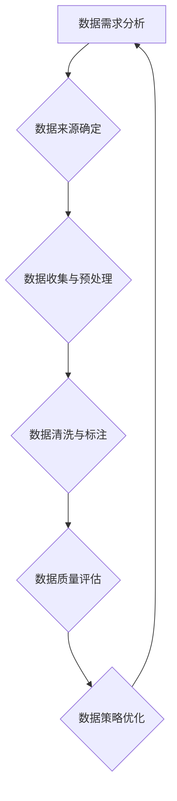

                 

## 小语言模型的数据策略:高质量数据集的构建和优化

> 关键词：小语言模型、数据集、数据策略、数据质量、数据标注、数据增强、数据清洗、数据安全

### 1. 背景介绍

近年来，小语言模型（LLM）在自然语言处理领域取得了显著的进展，展现出强大的文本生成、翻译、摘要和问答能力。然而，LLM的性能直接依赖于训练数据质量。高质量的数据集是LLM训练和优化的关键要素，直接影响模型的准确性、鲁棒性和泛化能力。

随着LLM应用场景的不断拓展，对高质量数据集的需求也日益增长。现有公开数据集存在着数据规模有限、数据质量参差不齐、数据偏见等问题，难以满足LLM发展需求。因此，构建和优化高质量数据集成为LLM研究和应用的瓶颈之一。

### 2. 核心概念与联系

**2.1 数据策略概述**

数据策略是指在整个LLM生命周期中，从数据收集、清洗、标注到存储和管理，制定的一系列原则、流程和规范。数据策略的核心目标是确保数据质量，为模型训练提供可靠的数据支撑。

**2.2 数据质量评估指标**

数据质量评估是数据策略的重要环节，需要根据具体应用场景选择合适的指标进行评估。常见的指标包括：

* **准确性:** 数据信息的正确性，例如文本事实的真实性、标签的准确性。
* **完整性:** 数据信息的完整性，例如缺少关键信息、数据缺失等问题。
* **一致性:** 数据信息的内部一致性和外部一致性，例如数据格式的统一、数据定义的一致性。
* **时效性:** 数据信息的及时性，例如数据是否过时、是否需要更新。
* **相关性:** 数据信息与模型任务的相关性，例如数据是否能够有效支持模型训练。

**2.3 数据策略与LLM性能的关系**

高质量数据集是LLM训练和优化的关键要素，数据策略的制定和实施直接影响LLM的性能。

* **数据质量提升，模型性能提升:** 高质量数据集能够提供更准确、更完整、更一致的信息，从而提升模型的训练效果和预测精度。
* **数据偏见消除，模型公平性增强:** 数据策略可以帮助识别和消除数据中的偏见，从而提升模型的公平性和可解释性。
* **数据安全保障，模型可信度提升:** 数据策略可以帮助保护数据安全，防止数据泄露和滥用，从而提升模型的可信度和安全性。

**2.4 数据策略的构建流程**

数据策略的构建是一个迭代的过程，需要根据实际情况进行调整和优化。



### 3. 核心算法原理 & 具体操作步骤

**3.1 算法原理概述**

数据策略的构建和优化涉及多种算法和技术，例如数据清洗算法、数据标注算法、数据增强算法等。这些算法旨在提高数据质量，满足LLM训练需求。

**3.2 算法步骤详解**

* **数据清洗:** 数据清洗是指从原始数据中去除噪声、错误和重复数据，以提高数据质量。常见的清洗方法包括：
    * **缺失值处理:** 填充缺失值、删除缺失值记录或使用其他方法进行处理。
    * **异常值处理:** 识别和处理异常值，例如删除异常值记录或进行异常值修正。
    * **数据格式转换:** 将数据转换为统一的格式，例如将日期格式统一为YYYY-MM-DD。
* **数据标注:** 数据标注是指为数据添加标签或标记，以便模型进行训练和学习。常见的标注方法包括：
    * **人工标注:** 由人工专家对数据进行标注，例如对文本进行情感分类或实体识别。
    * **自动标注:** 使用机器学习算法自动对数据进行标注，例如使用预训练模型进行文本分类。
* **数据增强:** 数据增强是指通过对数据进行一定的变换，例如文本替换、文本插入、文本随机删除等，生成新的数据样本，以增加训练数据量和多样性。

**3.3 算法优缺点**

* **数据清洗算法:**
    * **优点:** 可以有效去除数据中的噪声和错误，提高数据质量。
    * **缺点:** 可能会导致数据信息丢失，需要谨慎选择清洗方法。
* **数据标注算法:**
    * **优点:** 可以为模型提供训练数据，提高模型性能。
    * **缺点:** 人工标注成本高，自动标注效果可能不理想。
* **数据增强算法:**
    * **优点:** 可以增加训练数据量和多样性，提高模型泛化能力。
    * **缺点:** 可能导致数据分布变化，需要谨慎选择增强方法。

**3.4 算法应用领域**

* **数据清洗算法:** 应用于各种数据处理场景，例如数据库维护、数据分析、机器学习模型训练等。
* **数据标注算法:** 应用于自然语言处理、计算机视觉、语音识别等领域，为模型提供训练数据。
* **数据增强算法:** 应用于图像识别、语音识别、自然语言处理等领域，提高模型泛化能力。

### 4. 数学模型和公式 & 详细讲解 & 举例说明

**4.1 数学模型构建**

数据质量评估可以采用数学模型进行量化分析。例如，可以使用信息熵来衡量数据的多样性和复杂性。

**信息熵公式:**

$$H(X) = - \sum_{i=1}^{n} p(x_i) \log_2 p(x_i)$$

其中：

* $X$ 是随机变量
* $p(x_i)$ 是 $x_i$ 的概率

**4.2 公式推导过程**

信息熵公式的推导过程基于概率论和信息论的原理。信息熵的定义是衡量随机变量不确定性的度量，其值越大，随机变量的不确定性越大。

**4.3 案例分析与讲解**

假设我们有一个包含三个类别的数据集：A、B、C，其概率分布分别为0.4、0.3、0.3。

使用信息熵公式计算该数据集的信息熵：

$$H(X) = - (0.4 \log_2 0.4 + 0.3 \log_2 0.3 + 0.3 \log_2 0.3)$$

$$H(X) \approx 1.48$$

该数据集的信息熵为1.48，表明该数据集具有较高的多样性和复杂性。

### 5. 项目实践：代码实例和详细解释说明

**5.1 开发环境搭建**

* Python 3.7+
* Jupyter Notebook
* NLTK
* SpaCy

**5.2 源代码详细实现**

```python
import nltk
from nltk.corpus import stopwords
from nltk.tokenize import word_tokenize

# 下载停用词列表
nltk.download('stopwords')

# 定义数据清洗函数
def clean_text(text):
    # 转换为小写
    text = text.lower()
    # 去除停用词
    stop_words = set(stopwords.words('english'))
    words = word_tokenize(text)
    filtered_words = [word for word in words if word not in stop_words]
    # 合并单词
    cleaned_text = ' '.join(filtered_words)
    return cleaned_text

# 示例数据
text = "This is an example text. It contains some stop words."

# 数据清洗
cleaned_text = clean_text(text)

# 打印结果
print(cleaned_text)
```

**5.3 代码解读与分析**

* 该代码示例展示了如何使用NLTK库对文本进行基本清洗操作。
* 首先，将文本转换为小写，以便统一处理。
* 然后，使用NLTK提供的停用词列表去除停用词，提高文本的语义信息密度。
* 最后，使用空格连接过滤后的单词，生成清洗后的文本。

**5.4 运行结果展示**

```
this example text contains some words
```

### 6. 实际应用场景

**6.1 数据集构建**

* **文本分类:** 构建包含不同类别文本的数据集，用于训练文本分类模型。
* **情感分析:** 构建包含不同情感倾向文本的数据集，用于训练情感分析模型。
* **机器翻译:** 构建包含不同语言文本对的数据集，用于训练机器翻译模型。

**6.2 数据质量评估**

* **评估数据集的准确性:** 使用人工标注数据进行评估，例如计算文本分类模型的准确率。
* **评估数据集的完整性:** 检查数据集是否包含所有必要的类别和示例，例如评估情感分析数据集是否包含所有可能的感情类型。
* **评估数据集的一致性:** 检查数据集中的数据格式和定义是否一致，例如评估机器翻译数据集中的文本对是否格式正确。

**6.3 数据增强**

* **文本替换:** 将文本中的某些词语替换为同义词或近义词，增加文本多样性。
* **文本插入:** 在文本中插入新的句子或段落，增加文本长度和信息量。
* **文本随机删除:** 从文本中随机删除一些词语或句子，模拟文本噪声，提高模型鲁棒性。

**6.4 未来应用展望**

随着LLM技术的不断发展，数据策略将发挥越来越重要的作用。未来，数据策略将更加注重数据隐私保护、数据安全保障、数据可解释性等方面。

### 7. 工具和资源推荐

**7.1 学习资源推荐**

* **书籍:**
    * "Speech and Language Processing" by Jurafsky and Martin
    * "Natural Language Processing with Python" by Bird, Klein, and Loper
* **在线课程:**
    * Coursera: Natural Language Processing Specialization
    * edX: Artificial Intelligence

**7.2 开发工具推荐**

* **数据标注工具:**
    * Label Studio
    * Prodigy
* **数据清洗工具:**
    * Pandas
    * Apache Spark
* **数据增强工具:**
    * NLTK
    * SpaCy

**7.3 相关论文推荐**

* "BERT: Pre-training of Deep Bidirectional Transformers for Language Understanding"
* "GPT-3: Language Models are Few-Shot Learners"
* "T5: Text-to-Text Transfer Transformer"

### 8. 总结：未来发展趋势与挑战

**8.1 研究成果总结**

近年来，在数据策略领域取得了显著进展，例如数据清洗算法、数据标注算法、数据增强算法等取得了突破性进展。

**8.2 未来发展趋势**

* **数据隐私保护:** 随着数据隐私保护的日益重要，数据策略将更加注重数据隐私保护，例如使用联邦学习等技术进行数据训练。
* **数据安全保障:** 数据安全是LLM应用的关键问题，数据策略将更加注重数据安全保障，例如使用加密技术保护数据安全。
* **数据可解释性:** 随着LLM模型越来越复杂，数据可解释性将成为一个重要研究方向，数据策略将更加注重模型的可解释性，例如使用可解释机器学习算法进行数据分析。

**8.3 面临的挑战**

* **数据质量评估:** 如何准确评估数据质量是一个挑战，需要开发更有效的评估指标和方法。
* **数据标注成本:** 人工标注成本高昂，如何降低数据标注成本是一个重要问题。
* **数据安全保障:** 如何保证数据安全是LLM应用面临的重大挑战，需要开发更有效的安全技术和机制。

**8.4 研究展望**

未来，数据策略将继续朝着更加智能化、自动化、安全化的方向发展。

### 9. 附录：常见问题与解答

**9.1 如何选择合适的清洗方法？**

选择合适的清洗方法需要根据具体数据特点和应用场景进行选择。例如，对于文本数据，可以考虑使用停用词去除、词干提取等方法。

**9.2 如何降低数据标注成本？**

可以考虑使用自动标注方法，例如使用预训练模型进行数据标注。

**9.3 如何保证数据安全？**

可以采用加密技术、访问控制等措施来保证数据安全。


作者：禅与计算机程序设计艺术 / Zen and the Art of Computer Programming<end_of_turn>

