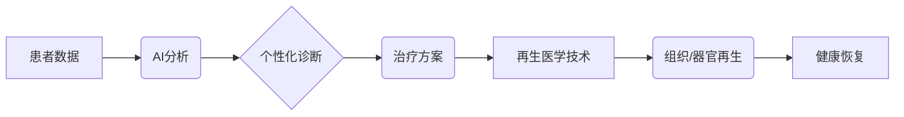

                 

## 2050年的医疗健康：从个性化医疗到再生医学的健康革命

> 关键词：个性化医疗、再生医学、人工智能、基因编辑、纳米技术、区块链、云计算、远程医疗、数字健康

### 1. 背景介绍

21世纪的医疗健康领域正经历着前所未有的变革。从传统的疾病治疗模式向以预防为主、以患者为中心的个性化医疗模式转变，是医疗健康领域发展的重要趋势。而随着人工智能、基因编辑、纳米技术等技术的飞速发展，未来医疗健康将迎来一场更加深刻的革命，即再生医学的兴起。

2050年，医疗健康将不再仅仅是治疗疾病，而是更注重预防、保健和提升人类健康水平。个性化医疗将成为主流，医疗方案将根据个体的基因、环境、生活方式等因素进行定制化设计。再生医学将为患者提供全新的治疗方案，例如利用患者自身的细胞进行组织再生，甚至器官再生，彻底改变人类对疾病的认知和治疗方式。

### 2. 核心概念与联系

**2.1 个性化医疗**

个性化医疗是指根据患者的个体特征，如基因、环境、生活方式等，制定个性化的诊断、治疗和预防方案。它打破了传统的“一刀切”的医疗模式，更加精准、有效地满足患者的个性化需求。

**2.2 再生医学**

再生医学是指利用生物技术手段，修复、再生或替代受损的组织和器官，从而恢复人体功能的医学领域。它包括细胞治疗、基因治疗、组织工程等多种技术，为治疗不可逆转的疾病提供了新的希望。

**2.3 核心技术**

个性化医疗和再生医学的发展离不开以下核心技术的支撑：

* **人工智能 (AI)**：AI技术可以分析海量医疗数据，识别疾病模式，预测患者风险，辅助医生做出更精准的诊断和治疗方案。
* **基因编辑 (CRISPR)**：CRISPR技术可以精确地编辑基因序列，为治疗遗传性疾病提供了新的可能性。
* **纳米技术**：纳米技术可以开发出微型医疗器械和药物递送系统，实现精准的药物靶向和治疗效果。
* **3D打印**：3D打印技术可以用于制造个性化的医疗器械和组织，为再生医学提供了新的工具。

**2.4 架构图**



### 3. 核心算法原理 & 具体操作步骤

**3.1 算法原理概述**

个性化医疗和再生医学的核心算法原理主要包括：

* **机器学习 (ML)**：用于分析患者数据，识别疾病模式，预测患者风险，辅助医生做出更精准的诊断和治疗方案。
* **深度学习 (DL)**：一种更高级的机器学习算法，可以处理更复杂的数据，例如图像、语音等，用于辅助诊断、药物研发等领域。
* **基因组学算法**：用于分析患者的基因组数据，识别与疾病相关的基因变异，为个性化治疗提供依据。
* **生物信息学算法**：用于分析生物数据，例如蛋白质结构、基因表达等，为药物研发、疾病机制研究等领域提供支持。

**3.2 算法步骤详解**

以机器学习算法为例，其具体操作步骤如下：

1. **数据收集**: 收集患者的医疗数据，例如病历、影像、基因组数据等。
2. **数据预处理**: 对收集到的数据进行清洗、转换、归一化等处理，使其适合机器学习算法的训练。
3. **模型选择**: 选择合适的机器学习算法，例如支持向量机 (SVM)、决策树 (DT)、神经网络 (NN) 等。
4. **模型训练**: 使用训练数据训练选择的机器学习模型，使其能够学习到疾病模式和预测患者风险。
5. **模型评估**: 使用测试数据评估模型的性能，例如准确率、召回率、F1-score 等。
6. **模型部署**: 将训练好的模型部署到实际应用场景中，例如辅助医生诊断、预测患者风险等。

**3.3 算法优缺点**

**优点:**

* **精准度高**: 机器学习算法可以分析海量数据，识别疾病模式，提高诊断和治疗的精准度。
* **效率高**: 机器学习算法可以自动化完成许多重复性任务，提高医疗工作效率。
* **可扩展性强**: 机器学习算法可以根据新的数据进行不断学习和改进，适应不断变化的医疗环境。

**缺点:**

* **数据依赖性强**: 机器学习算法需要大量的训练数据，否则其性能会下降。
* **解释性差**: 一些复杂的机器学习算法难以解释其决策过程，这可能会导致医生难以信任其结果。
* **伦理问题**: 机器学习算法的应用可能会引发一些伦理问题，例如数据隐私、算法偏见等。

**3.4 算法应用领域**

机器学习算法在医疗健康领域有着广泛的应用，例如：

* **疾病诊断**: 辅助医生诊断各种疾病，例如癌症、心血管疾病等。
* **药物研发**: 预测药物的疗效和安全性，加速药物研发过程。
* **个性化治疗**: 根据患者的个体特征，制定个性化的治疗方案。
* **远程医疗**: 提供远程医疗服务，方便患者获得医疗帮助。

### 4. 数学模型和公式 & 详细讲解 & 举例说明

**4.1 数学模型构建**

在个性化医疗和再生医学中，数学模型可以用于描述疾病的发生机制、预测患者的风险、优化治疗方案等。例如，我们可以使用统计模型来分析患者的基因组数据，识别与疾病相关的基因变异；我们可以使用动力学模型来模拟疾病的进展过程，预测患者的治疗效果。

**4.2 公式推导过程**

以预测患者患癌风险为例，我们可以使用Logistic回归模型，其公式如下：

$$P(患癌) = \frac{1}{1 + e^{-(β_0 + β_1X_1 + β_2X_2 + ... + β_nX_n)}}$$

其中：

* $P(患癌)$ 是患者患癌的概率。
* $β_0, β_1, β_2, ..., β_n$ 是模型参数，需要通过训练数据进行估计。
* $X_1, X_2, ..., X_n$ 是患者的特征变量，例如年龄、性别、家族病史等。

**4.3 案例分析与讲解**

假设我们收集了1000名患者的数据，其中200人患癌，800人未患癌。我们可以使用Logistic回归模型训练一个预测模型，并将其应用于新的患者数据中。

例如，对于一个新的患者，其年龄为50岁，性别为男性，家族病史中有癌症患者。我们可以将这些特征变量代入公式，计算出该患者患癌的概率。如果概率大于某个阈值，则认为该患者患癌风险较高，需要进一步的检查和治疗。

### 5. 项目实践：代码实例和详细解释说明

**5.1 开发环境搭建**

为了实现个性化医疗和再生医学的项目实践，我们需要搭建一个合适的开发环境。

* **操作系统**: Linux 或 macOS
* **编程语言**: Python
* **机器学习库**: scikit-learn, TensorFlow, PyTorch
* **数据处理库**: pandas, NumPy
* **版本控制工具**: Git

**5.2 源代码详细实现**

以下是一个使用Python和scikit-learn库实现Logistic回归模型的简单代码示例：

```python
from sklearn.linear_model import LogisticRegression
from sklearn.model_selection import train_test_split
from sklearn.metrics import accuracy_score

# 加载数据
data = ... # 加载患者数据

# 将数据分为特征变量和目标变量
X = data.drop('患癌', axis=1)
y = data['患癌']

# 将数据分为训练集和测试集
X_train, X_test, y_train, y_test = train_test_split(X, y, test_size=0.2, random_state=42)

# 创建Logistic回归模型
model = LogisticRegression()

# 训练模型
model.fit(X_train, y_train)

# 预测测试集结果
y_pred = model.predict(X_test)

# 计算模型准确率
accuracy = accuracy_score(y_test, y_pred)
print(f'模型准确率: {accuracy}')
```

**5.3 代码解读与分析**

* 首先，我们加载患者数据，并将数据分为特征变量和目标变量。
* 然后，我们将数据分为训练集和测试集，用于训练和评估模型。
* 接下来，我们创建Logistic回归模型，并使用训练集数据进行训练。
* 训练完成后，我们使用测试集数据进行预测，并计算模型的准确率。

**5.4 运行结果展示**

运行上述代码后，我们可以得到模型的准确率，例如0.85，表示模型在预测测试集结果时，准确率为85%。

### 6. 实际应用场景

**6.1 个性化医疗**

个性化医疗在2050年将成为医疗健康领域的主流模式。例如：

* **精准诊断**: 基于患者的基因组数据、影像数据等，医生可以更精准地诊断疾病，例如癌症、心血管疾病等。
* **个性化治疗**: 根据患者的个体特征，医生可以制定个性化的治疗方案，例如药物剂量、治疗时间等，提高治疗效果，降低副作用。
* **疾病预防**: 基于患者的基因组数据、生活方式等，医生可以预测患者患病风险，并提供个性化的预防方案，例如健康饮食、运动建议等。

**6.2 再生医学**

再生医学在2050年将为治疗不可逆转的疾病提供新的希望。例如：

* **组织再生**: 利用患者自身的细胞，可以再生受损的组织，例如心脏组织、肝脏组织等，治疗心血管疾病、肝硬化等疾病。
* **器官移植**: 利用3D打印技术和细胞工程技术，可以制造出患者自身的器官，解决器官移植供需矛盾。
* **基因治疗**: 利用基因编辑技术，可以修复患者的基因缺陷，治疗遗传性疾病。

**6.3 未来应用展望**

随着人工智能、基因编辑、纳米技术等技术的不断发展，个性化医疗和再生医学将在未来发挥更加重要的作用。例如：

* **智能医疗机器人**: 智能医疗机器人可以协助医生进行手术、诊断、治疗等工作，提高医疗效率和精准度。
* **虚拟现实 (VR) 和增强现实 (AR) 技术**: VR 和 AR 技术可以为患者提供沉浸式的医疗体验，例如虚拟手术模拟、远程医疗等。
* **区块链技术**: 区块链技术可以保障患者数据的安全和隐私，促进医疗数据的共享和互通。

### 7. 工具和资源推荐

**7.1 学习资源推荐**

* **在线课程**: Coursera, edX, Udacity 等平台提供丰富的机器学习、深度学习、生物信息学等课程。
* **书籍**: 《深度学习》、《机器学习实战》、《生物信息学导论》等书籍。
* **开源项目**: TensorFlow, PyTorch, scikit-learn 等开源项目可以帮助你学习和实践机器学习算法。

**7.2 开发工具推荐**

* **编程语言**: Python
* **机器学习库**: scikit-learn, TensorFlow, PyTorch
* **数据处理库**: pandas, NumPy
* **版本控制工具**: Git
* **云计算平台**: AWS, Azure, Google Cloud 等平台可以提供强大的计算资源和存储空间。

**7.3 相关论文推荐**

* **Nature**: https://www.nature.com/
* **Science**: https://www.science.org/
* **Cell**: https://www.cell.com/
* **Bioinformatics**: https://academic.oup.com/bioinformatics/

### 8. 总结：未来发展趋势与挑战

**8.1 研究成果总结**

个性化医疗和再生医学在过去几十年取得了显著的进展，为人类健康带来了新的希望。

* **人工智能**: 人工智能技术在医疗诊断、药物研发、个性化治疗等领域发挥着越来越重要的作用。
* **基因编辑**: 基因编辑技术为治疗遗传性疾病提供了新的可能性。
* **纳米技术**: 纳米技术可以开发出更精准的药物递送系统和医疗器械。

**8.2 未来发展趋势**

未来，个性化医疗和再生医学将朝着以下方向发展：

* **更精准的诊断**: 利用人工智能和基因组学技术，实现更精准的疾病诊断。
* **更个性化的治疗**: 根据患者的个体特征，制定更个性化的治疗方案。
* **更有效的预防**: 利用人工智能和基因组学技术，预测患者患病风险，并提供个性化的预防方案。
* **更安全的再生医学**: 利用基因编辑和细胞工程技术，提高再生医学的安全性和有效性。

**8.3 面临的挑战**

个性化医疗和再生医学的发展也面临着一些挑战：

* **数据隐私**: 医疗数据是高度敏感的信息，需要采取有效的措施保障患者数据的隐私和安全。
* **算法偏见**: 机器学习算法可能会存在偏见，导致不公平的医疗结果。
* **伦理问题**: 基因编辑和再生医学等技术可能会引发一些伦理问题，需要进行深入的讨论和规范。
* **成本问题**: 个性化医疗和再生医学的成本较高，需要探索更经济的解决方案。

**8.4 研究展望**

未来，我们需要继续加强对个性化医疗和再生医学的研究，克服面临的挑战，推动其更快、更安全、更有效地应用于临床实践，为人类健康带来更大的福祉。

### 9. 附录：常见问题与解答

**9.1 Q: 个性化医疗和再生医学的应用场景有哪些？**

**A:** 个性化医疗和再生医学的应用场景非常广泛，例如：

* **精准诊断**: 癌症、心血管疾病、遗传性疾病等。
* **个性化治疗**: 癌症、心血管疾病、糖尿病等。
* **组织再生**: 心脏组织、肝脏组织、骨骼组织等。
* **器官移植**: 心脏、肝脏、肾脏等。
* **基因治疗**: 遗传性疾病。

**9.2 Q: 个性化医疗和再生医学的伦理问题有哪些？**

**A:** 个性化医疗和再生医学的伦理问题包括：

* **数据隐私**: 医疗数据是高度敏感的信息，需要采取有效的措施保障患者数据的隐私和安全。
* **算法偏见**: 机器学习算法可能会存在偏见，导致不公平的医疗结果。
* **基因编辑**: 基因编辑技术可能会引发一些伦理问题，例如基因改造的界限、基因歧视等。

**9.3 Q: 个性化医疗和再生医学的未来发展趋势是什么？**

**A:** 未来，个性化医疗和再生医学将朝着以下方向发展：

* **更精准的诊断**: 利用人工智能和基因组学技术，实现更精准的疾病诊断。
* **更个性化的治疗**: 根据患者的个体特征，制定更个性化的治疗方案。
* **更有效的预防**: 利用人工智能和基因组学技术，预测患者患病风险，并提供个性化的预防方案。
* **更安全的再生医学**: 利用基因编辑和细胞工程技术，提高再生医学的安全性和有效性。


作者：禅与计算机程序设计艺术 / Zen and the Art of Computer Programming<end_of_turn>

