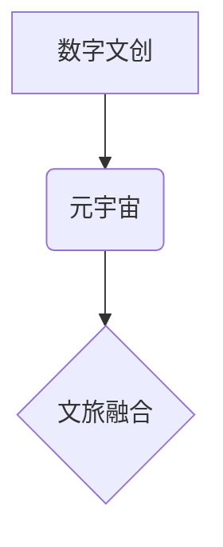

                 

## 2050年的数字文化：从数字文创到元宇宙文旅的数字文化产业升级

> 关键词：数字文创、元宇宙、文旅融合、数字孪生、沉浸式体验、区块链、人工智能、虚拟现实、增强现实

### 1. 背景介绍

数字文化正以惊人的速度发展，深刻地改变着人们的生活方式和文化体验。从网络文学、在线游戏到数字艺术和虚拟偶像，数字文化已渗透到各个领域，并逐渐成为主流文化形态。

随着技术的不断进步，元宇宙概念的兴起为数字文化发展注入了新的活力。元宇宙是一个由虚拟现实、增强现实、区块链、人工智能等技术构建的沉浸式虚拟世界，它将打破物理世界的限制，创造一个全新的数字空间，为人们提供更加丰富多彩的文化体验。

文旅产业作为文化产业的重要组成部分，也面临着数字化转型和升级的挑战。传统文旅模式单一，体验感不足，难以满足现代消费者对个性化、沉浸式体验的需求。而数字文化的发展为文旅产业提供了新的机遇，可以利用数字技术打造更加丰富、互动、沉浸式的文旅体验。

### 2. 核心概念与联系

#### 2.1 数字文创

数字文创是指利用数字技术创作、传播和消费的文化产品和服务。它涵盖了多种形式，例如：

* **网络文学:** 网络小说、网络诗歌、网络漫画等。
* **在线游戏:** 角色扮演游戏、策略游戏、体育游戏等。
* **数字艺术:** 数字绘画、3D建模、虚拟现实艺术等。
* **虚拟偶像:** 通过人工智能技术打造的虚拟人物，拥有自己的形象、性格和故事。

#### 2.2 元宇宙

元宇宙是一个由虚拟现实、增强现实、区块链、人工智能等技术构建的沉浸式虚拟世界。它具有以下特点：

* **沉浸式体验:** 通过虚拟现实和增强现实技术，用户可以身临其境地体验虚拟世界。
* **互联互通:** 元宇宙是一个开放、连接的虚拟世界，用户可以自由地与其他用户互动，共享资源和信息。
* **去中心化:** 元宇宙的治理和运营由社区共同参与，而不是由单一机构控制。
* **永续发展:** 元宇宙是一个持续发展的虚拟世界，用户可以创造和分享内容，不断丰富虚拟世界的生态系统。

#### 2.3 文旅融合

文旅融合是指将文化旅游和数字技术相结合，打造更加丰富、互动、沉浸式的文旅体验。它可以利用数字技术实现以下功能：

* **虚拟旅游:** 通过虚拟现实技术，用户可以提前体验旅游目的地，了解当地文化和景点信息。
* **互动体验:** 通过增强现实技术，用户可以与虚拟人物互动，参与互动游戏和体验活动。
* **个性化定制:** 通过数据分析和人工智能技术，为用户提供个性化的旅游路线和服务。

**核心概念关系流程图**



### 3. 核心算法原理 & 具体操作步骤

#### 3.1 算法原理概述

数字文创、元宇宙和文旅融合的核心算法原理主要包括：

* **人工智能算法:** 用于生成虚拟内容、识别用户需求、提供个性化服务等。
* **区块链算法:** 用于保障数字资产的版权和安全，实现去中心化管理。
* **虚拟现实/增强现实算法:** 用于构建沉浸式虚拟环境，实现用户与虚拟世界的交互。

#### 3.2 算法步骤详解

**以人工智能算法为例，其具体操作步骤如下：**

1. **数据收集:** 收集大量文本、图像、音频等数据，用于训练人工智能模型。
2. **数据预处理:** 对收集到的数据进行清洗、格式化、标注等处理，使其适合用于训练模型。
3. **模型训练:** 使用深度学习算法训练人工智能模型，使其能够识别模式、生成内容、理解用户需求等。
4. **模型评估:** 对训练好的模型进行评估，测试其性能和准确性。
5. **模型部署:** 将训练好的模型部署到实际应用场景中，例如用于生成虚拟人物、创作数字艺术作品、提供个性化旅游推荐等。

#### 3.3 算法优缺点

**人工智能算法的优缺点:**

* **优点:** 能够自动学习和改进，提高效率和准确性；能够处理海量数据，发现隐藏的模式和规律；能够实现个性化定制和智能化服务。
* **缺点:** 需要大量的数据进行训练，训练成本较高；模型的解释性和可控性较差；容易受到数据偏差的影响。

#### 3.4 算法应用领域

人工智能算法广泛应用于数字文创、元宇宙和文旅融合等领域，例如：

* **数字文创:** 生成虚拟人物、创作数字艺术作品、自动翻译和创作网络文学等。
* **元宇宙:** 建立虚拟世界环境、模拟用户行为、提供个性化服务等。
* **文旅融合:** 提供个性化旅游路线推荐、虚拟旅游体验、互动式旅游游戏等。

### 4. 数学模型和公式 & 详细讲解 & 举例说明

#### 4.1 数学模型构建

数字文创、元宇宙和文旅融合的数学模型主要用于描述用户行为、内容生成、虚拟环境构建等方面。例如：

* **用户行为模型:** 使用马尔科夫链模型来预测用户的行为模式，例如用户在元宇宙中游玩的时间、访问的场景、与其他用户的互动等。
* **内容生成模型:** 使用生成对抗网络 (GAN) 来生成虚拟内容，例如虚拟人物、场景、物品等。
* **虚拟环境构建模型:** 使用三维建模和物理引擎来构建虚拟环境，模拟现实世界的物理现象和用户交互。

#### 4.2 公式推导过程

**以马尔科夫链模型为例，其状态转移概率公式如下：**

$$P(s_t|s_{t-1})$$

其中：

* $s_t$ 表示用户在时间 $t$ 的状态。
* $s_{t-1}$ 表示用户在时间 $t-1$ 的状态。
* $P(s_t|s_{t-1})$ 表示用户从状态 $s_{t-1}$ 转移到状态 $s_t$ 的概率。

#### 4.3 案例分析与讲解

**以虚拟旅游为例，可以使用马尔科夫链模型来预测用户的游览路线。**

假设用户在虚拟旅游场景中可以访问三个景点：A、B、C。

根据用户的历史游览数据，我们可以建立马尔科夫链模型，并计算每个景点之间的状态转移概率。例如，如果用户从景点A游览到景点B的概率为0.6，则表示用户在游览过程中更有可能从景点A前往景点B。

通过分析马尔科夫链模型，我们可以预测用户的游览路线，并根据用户的兴趣和偏好，推荐更加个性化的游览路线。

### 5. 项目实践：代码实例和详细解释说明

#### 5.1 开发环境搭建

**开发环境搭建步骤:**

1. 安装Python编程语言和相关库，例如NumPy、Pandas、TensorFlow等。
2. 安装虚拟现实/增强现实开发工具，例如Unity、Unreal Engine等。
3. 设置区块链开发环境，例如使用Ethereum开发平台。

#### 5.2 源代码详细实现

**以使用Python语言生成虚拟人物为例，代码实现如下：**

```python
import numpy as np
from tensorflow.keras.models import Sequential
from tensorflow.keras.layers import Dense, Dropout, Flatten

# 训练数据
data = np.random.rand(1000, 10)  # 假设虚拟人物特征为10维

# 建立模型
model = Sequential()
model.add(Dense(128, activation='relu', input_shape=(10,)))
model.add(Dropout(0.2))
model.add(Dense(64, activation='relu'))
model.add(Dropout(0.2))
model.add(Dense(10, activation='softmax'))

# 编译模型
model.compile(optimizer='adam', loss='categorical_crossentropy', metrics=['accuracy'])

# 训练模型
model.fit(data, data, epochs=10)

# 生成虚拟人物
new_data = np.random.rand(1, 10)
generated_data = model.predict(new_data)
```

#### 5.3 代码解读与分析

* 代码首先导入必要的库，例如NumPy用于数值计算、TensorFlow用于深度学习。
* 然后定义训练数据，假设虚拟人物特征为10维，使用随机数生成1000个样本。
* 建立一个深度学习模型，包含多个全连接层和Dropout层，用于提取特征和防止过拟合。
* 编译模型，选择优化器、损失函数和评价指标。
* 训练模型，使用训练数据进行训练，训练10个epoch。
* 最后使用训练好的模型生成新的虚拟人物，输入一个随机生成的特征向量，模型会输出一个概率分布，表示生成的虚拟人物的特征。

#### 5.4 运行结果展示

运行代码后，会生成一个新的虚拟人物，其特征向量会根据训练数据和模型的权重进行随机采样。

### 6. 实际应用场景

#### 6.1 数字文创

* **虚拟偶像:** 通过人工智能技术打造虚拟偶像，拥有自己的形象、性格和故事，可以进行演唱、直播、互动等活动，吸引粉丝。
* **数字艺术:** 使用人工智能算法生成艺术作品，例如绘画、音乐、雕塑等，打破传统艺术创作的边界，创造新的艺术形式。
* **网络文学:** 利用人工智能算法辅助创作网络小说、诗歌、剧本等，提高创作效率和质量。

#### 6.2 元宇宙

* **虚拟世界:** 建立沉浸式虚拟世界，用户可以自由地创建、探索和互动，体验不同的生活方式和文化场景。
* **虚拟社交:** 在虚拟世界中进行社交互动，例如参加虚拟会议、举办虚拟聚会、玩虚拟游戏等，打破地域限制，拓展社交圈。
* **虚拟经济:** 在虚拟世界中进行交易和投资，例如购买虚拟物品、参与虚拟游戏经济、投资虚拟土地等，创造新的经济模式。

#### 6.3 文旅融合

* **虚拟旅游:** 通过虚拟现实技术，用户可以提前体验旅游目的地，了解当地文化和景点信息，提高旅游决策的效率和准确性。
* **互动式旅游:** 利用增强现实技术，用户可以与虚拟人物互动，参与互动游戏和体验活动，增强旅游的趣味性和参与度。
* **个性化定制:** 通过数据分析和人工智能技术，为用户提供个性化的旅游路线和服务，满足用户的个性化需求。

#### 6.4 未来应用展望

数字文创、元宇宙和文旅融合将继续融合发展，带来更加丰富的文化体验和商业模式。例如：

* **沉浸式文化体验:** 利用虚拟现实和增强现实技术，打造更加沉浸式的文化体验，例如虚拟博物馆、虚拟历史场景、虚拟艺术展览等。
* **元宇宙文旅:** 将文旅元素融入元宇宙世界，打造虚拟旅游目的地、虚拟文化活动、虚拟文创市场等，创造新的文旅消费场景。
* **数字孪生文旅:** 利用数字孪生技术，构建旅游目的地的虚拟模型，实现对旅游资源的实时监测、管理和优化，提高旅游效率和体验。

### 7. 工具和资源推荐

#### 7.1 学习资源推荐

* **在线课程:** Coursera、edX、Udacity等平台提供人工智能、虚拟现实、增强现实等领域的在线课程。
* **书籍:** 《深度学习》、《人工智能简史》、《元宇宙》等书籍可以帮助读者深入了解相关知识。
* **开源社区:** GitHub、Stack Overflow等开源社区提供丰富的代码示例和技术文档。

#### 7.2 开发工具推荐

* **虚拟现实/增强现实开发工具:** Unity、Unreal Engine、ARKit、ARCore等。
* **人工智能开发框架:** TensorFlow、PyTorch、Keras等。
* **区块链开发平台:** Ethereum、Hyperledger Fabric等。

#### 7.3 相关论文推荐

* **数字文创:** "Generative Adversarial Networks for Text Generation"、"A Survey of Text Summarization Techniques"
* **元宇宙:** "The Metaverse: A Vision for the Future"、"Decentralized Metaverse: A Blockchain-Based Approach"
* **文旅融合:** "Virtual Reality Tourism: A Review"、"Augmented Reality in Tourism: Applications and Opportunities"

### 8. 总结：未来发展趋势与挑战

#### 8.1 研究成果总结

数字文创、元宇宙和文旅融合已经取得了显著的成果，例如虚拟偶像、数字艺术、虚拟旅游等应用场景不断涌现。这些成果表明，数字技术正在深刻地改变着文化产业的发展模式和用户体验。

#### 8.2 未来发展趋势

未来，数字文创、元宇宙和文旅融合将继续发展，主要趋势包括：

* **技术融合:** 数字技术将更加融合，例如人工智能、虚拟现实、增强现实、区块链等技术将更加紧密地结合，创造更加沉浸式、互动式和个性化的文化体验。
* **内容丰富:** 数字文创内容将更加丰富多样，例如虚拟人物、虚拟世界、虚拟游戏等将更加真实、生动和有趣。
* **商业模式创新:** 元宇宙和文旅融合将带来新的商业模式，例如虚拟经济、虚拟旅游、虚拟文创市场等。

#### 8.3 面临的挑战

数字文创、元宇宙和文旅融合也面临着一些挑战，例如：

* **技术瓶颈:** 虚拟现实、增强现实等技术的成熟度还有待提高，需要进一步突破技术瓶颈。
* **内容创作:** 数字文创内容的创作需要大量的人力、物力和财力投入，需要探索更加高效的创作模式。
* **伦理问题:** 元宇宙和数字文创涉及到隐私、安全、版权等伦理问题，需要制定相应的规范和制度。

#### 8.4 研究展望

未来，我们需要继续加强对数字文创、元宇宙和文旅融合的理论研究和技术创新，探索更加丰富、多元、可持续的文化发展模式，为人类创造更加美好的未来。

### 9. 附录：常见问题与解答

**常见问题:**

* **元宇宙是什么？**

元宇宙是一个由虚拟现实、增强现实、区块链、人工智能等技术构建的沉浸式虚拟世界，它具有以下特点：

* **沉浸式体验:** 通过虚拟现实和增强现实技术，用户可以身临其境地体验虚拟世界。
* **互联互通:** 元宇宙是一个开放、连接的虚拟世界，用户可以自由地与其他用户互动，共享资源和信息。
* **去中心化:** 元宇宙的治理和运营由社区共同参与，而不是由单一机构控制。
* **永续发展:** 元宇宙是一个持续发展的虚拟世界，用户可以创造和分享内容，不断丰富虚拟世界的生态系统。

* **数字文创的未来发展趋势是什么？**

数字文创的未来发展趋势包括：

* **技术融合:** 数字技术将更加融合，例如人工智能、虚拟现实、增强现实等技术将更加紧密地结合，创造更加沉浸式、互动式和个性化的文化体验。
* **内容丰富:** 数字文创内容将更加丰富多样，例如虚拟人物、虚拟世界、虚拟游戏等将更加真实、生动和有趣。
* **商业模式创新:** 元宇宙和文旅融合将带来新的商业模式，例如虚拟经济、虚拟旅游、虚拟文创市场等。

* **元宇宙文旅如何实现？**

元宇宙文旅可以通过以下方式实现：

* **虚拟旅游:** 利用虚拟现实技术，用户可以提前体验旅游目的地，了解当地文化和景点信息。
* **互动式旅游:** 利用增强现实技术，用户可以与虚拟人物互动，参与互动游戏和体验活动。
* **个性化定制:** 通过数据分析和人工智能技术，为用户提供个性化的旅游路线和服务。


作者：禅与计算机程序设计艺术 / Zen and the Art of Computer Programming<end_of_turn>

