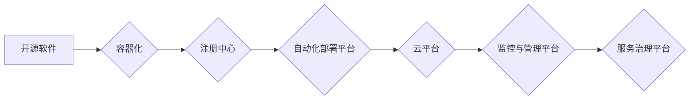

                 

## 开源项目的企业级部署服务：创造高价值机会

> 关键词：开源软件、企业级部署、云原生、容器化、自动化、DevOps、持续交付、服务治理、安全保障、成本优化

## 1. 背景介绍

开源软件在现代软件开发生态系统中扮演着越来越重要的角色。其灵活、可定制、成本效益高以及庞大的社区支持，使其成为企业开发和部署应用的理想选择。然而，将开源软件从开发环境迁移到企业级生产环境，并确保其稳定、可靠、安全和可扩展，却是一个复杂且具有挑战性的任务。

传统企业级软件部署模式往往依赖于复杂的硬件基础设施、手动操作流程和封闭的生态系统，难以适应开源软件的快速迭代和灵活特性。随着云计算、容器化和DevOps理念的兴起，企业级开源软件部署模式也迎来了新的变革。

## 2. 核心概念与联系

企业级开源软件部署服务旨在提供一套完整的解决方案，帮助企业将开源软件安全、高效、可控地部署到生产环境中。其核心概念包括：

* **云原生:** 充分利用云计算平台的弹性、可扩展性和服务化特性，构建可弹性伸缩、高可用、易于管理的开源软件部署环境。
* **容器化:** 使用容器技术将开源软件及其依赖环境打包成独立的单元，实现软件的标准化、可移植性和高效部署。
* **自动化:** 通过自动化工具和流程，简化部署过程，减少人为错误，提高部署效率和可靠性。
* **DevOps:** 将开发和运维团队紧密结合，采用持续集成和持续交付流程，实现快速迭代、持续改进和高效协作。
* **服务治理:** 对部署在云平台上的开源软件服务进行统一管理和监控，确保服务质量、安全性和可维护性。

**核心架构流程图:**



## 3. 核心算法原理 & 具体操作步骤

### 3.1  算法原理概述

企业级开源软件部署服务的核心算法原理主要围绕以下几个方面：

* **容器镜像构建:** 基于Dockerfile等工具，将开源软件及其依赖环境打包成可运行的容器镜像。
* **容器编排:** 使用Kubernetes等容器编排工具，管理和调度容器实例，实现高可用、负载均衡和自动伸缩。
* **自动化部署:** 利用Ansible、Terraform等自动化工具，实现代码部署、环境配置和资源 provisioning 的自动化流程。
* **持续交付:** 通过Jenkins、GitLab CI/CD等持续交付平台，实现代码构建、测试、部署和发布的自动化流水线。

### 3.2  算法步骤详解

1. **开源软件选择和评估:** 根据企业需求选择合适的开源软件，并评估其技术成熟度、社区支持、安全性和可维护性。
2. **容器镜像构建:** 根据开源软件的依赖关系和运行环境，编写Dockerfile文件，构建可运行的容器镜像。
3. **容器注册:** 将构建好的容器镜像注册到容器注册中心，例如Docker Hub或阿里云容器服务。
4. **自动化部署配置:** 使用自动化工具配置部署环境、部署脚本和资源 provisioning。
5. **容器编排部署:** 使用容器编排工具部署容器实例，配置服务发现、负载均衡和自动伸缩策略。
6. **持续交付集成:** 将部署流程集成到持续交付平台，实现代码自动构建、测试、部署和发布。
7. **监控与管理:** 使用监控平台监控服务运行状态，并使用服务治理平台进行服务管理和安全保障。

### 3.3  算法优缺点

**优点:**

* **提高部署效率:** 自动化部署流程可以显著提高部署效率，减少人为错误和时间成本。
* **增强可靠性:** 容器化和编排技术可以提高软件的可靠性和可用性，实现高可用部署和故障自动恢复。
* **降低成本:** 利用云计算平台和开源软件可以降低部署成本，提高资源利用率。
* **促进协作:** DevOps理念和持续交付流程可以促进开发和运维团队的协作，提高软件开发效率。

**缺点:**

* **技术门槛:** 企业级开源软件部署服务需要一定的技术基础和经验，例如容器化、编排、自动化和DevOps等。
* **安全风险:** 由于开源软件的开放性，存在一定的安全风险，需要加强安全防护措施。
* **维护复杂度:** 随着软件规模和复杂度的增加，维护和管理开源软件部署环境可能会变得更加复杂。

### 3.4  算法应用领域

企业级开源软件部署服务广泛应用于以下领域:

* **Web 应用:** 部署和管理Web应用、API和微服务。
* **数据处理:** 部署和管理数据处理引擎、数据库和数据分析平台。
* **物联网:** 部署和管理物联网设备的软件和数据处理平台。
* **人工智能:** 部署和管理人工智能模型和应用。

## 4. 数学模型和公式 & 详细讲解 & 举例说明

### 4.1  数学模型构建

企业级开源软件部署服务可以采用数学模型来分析和优化部署流程，例如：

* **资源利用率模型:** 通过分析容器资源使用情况，预测未来资源需求，并进行资源分配和调度优化。
* **部署时间模型:** 建立部署时间模型，预测部署所需时间，并优化部署流程，缩短部署时间。
* **故障恢复时间模型:** 建立故障恢复时间模型，分析故障恢复时间，并优化部署环境和故障恢复机制，提高故障恢复效率。

### 4.2  公式推导过程

例如，资源利用率模型可以采用以下公式：

$$
ResourceUtilizationRate = \frac{TotalResourceConsumed}{TotalAvailableResource}
$$

其中：

* **TotalResourceConsumed:** 容器实例消耗的总资源量，例如CPU、内存和磁盘空间。
* **TotalAvailableResource:** 可用资源总量，例如服务器的CPU核数、内存容量和磁盘容量。

### 4.3  案例分析与讲解

假设一个企业部署了10个容器实例，每个实例消耗的平均资源量为：CPU 1核、内存 2GB、磁盘空间 10GB。服务器的总资源为：CPU 10核、内存 20GB、磁盘空间 100GB。

根据公式，资源利用率为：

$$
ResourceUtilizationRate = \frac{10 * 1 + 10 * 2 + 10 * 10}{10 * 1 + 20 * 1 + 100 * 1} = \frac{130}{130} = 1
$$

结果表明，容器实例消耗了服务器所有可用资源，需要进行资源优化和扩容。

## 5. 项目实践：代码实例和详细解释说明

### 5.1  开发环境搭建

* **操作系统:** Ubuntu 20.04 LTS
* **容器引擎:** Docker 20.10.12
* **容器编排工具:** Kubernetes 1.24.0
* **自动化工具:** Ansible 2.11.1

### 5.2  源代码详细实现

以下是一个简单的开源软件部署示例，使用Docker、Kubernetes和Ansible实现自动化部署：

**Dockerfile:**

```dockerfile
FROM ubuntu:20.04

RUN apt-get update && apt-get install -y nginx

COPY ./nginx.conf /etc/nginx/conf.d/default.conf

CMD ["nginx", "-g", "daemon off;"]
```

**Kubernetes Deployment:**

```yaml
apiVersion: apps/v1
kind: Deployment
metadata:
  name: nginx-deployment
spec:
  replicas: 3
  selector:
    matchLabels:
      app: nginx
  template:
    metadata:
      labels:
        app: nginx
    spec:
      containers:
      - name: nginx
        image: nginx:latest
        ports:
        - containerPort: 80
```

**Ansible Playbook:**

```yaml
---
- hosts: all
  become: true
  tasks:
    - name: Install Docker
      apt:
        name: docker.io
        state: present
    - name: Install Kubernetes
      apt:
        name: kubelet
        state: present
    - name: Deploy Nginx
      kubernetes:
        state: present
        resource: nginx-deployment.yaml
```

### 5.3  代码解读与分析

* **Dockerfile:** 定义了容器镜像的构建过程，包括基础镜像、软件安装和启动命令。
* **Kubernetes Deployment:** 定义了容器部署的规格，包括副本数、选择器和容器配置。
* **Ansible Playbook:** 定义了自动化部署流程，包括安装Docker和Kubernetes、部署容器镜像等操作。

### 5.4  运行结果展示

通过运行Ansible Playbook，可以自动完成Docker镜像构建、Kubernetes部署和容器实例启动，实现开源软件的自动化部署。

## 6. 实际应用场景

企业级开源软件部署服务在各个行业都有广泛的应用场景:

### 6.1  金融行业

* **交易系统:** 部署高性能、高可靠的交易系统，支持高并发交易和实时数据处理。
* **风险管理系统:** 部署风险管理系统，实时监控和分析市场风险，并进行风险控制。
* **客户关系管理系统:** 部署CRM系统，管理客户信息、客户关系和客户服务。

### 6.2  电商行业

* **商品展示系统:** 部署商品展示系统，提供丰富的商品信息和用户体验。
* **订单处理系统:** 部署订单处理系统，支持快速、高效的订单处理和物流管理。
* **推荐引擎:** 部署推荐引擎，根据用户行为和偏好，推荐相关商品和服务。

### 6.3  医疗行业

* **电子病历系统:** 部署电子病历系统，管理患者信息、病历记录和医疗影像。
* **远程医疗平台:** 部署远程医疗平台，提供远程诊断、咨询和治疗服务。
* **医疗数据分析平台:** 部署医疗数据分析平台，分析医疗数据，发现疾病趋势和医疗模式。

### 6.4  未来应用展望

随着云计算、容器化和人工智能技术的不断发展，企业级开源软件部署服务将迎来更加广泛的应用场景和发展机遇。例如：

* **Serverless 架构:** 将开源软件部署到Serverless平台，实现更灵活、更弹性的资源利用。
* **边缘计算:** 将开源软件部署到边缘设备，实现数据本地处理和实时决策。
* **人工智能集成:** 将开源软件与人工智能技术集成，构建智能化应用和服务。

## 7. 工具和资源推荐

### 7.1  学习资源推荐

* **Kubernetes 官方文档:** https://kubernetes.io/docs/home/
* **Docker 官方文档:** https://docs.docker.com/
* **Ansible 官方文档:** https://docs.ansible.com/

### 7.2  开发工具推荐

* **Docker Desktop:** https://www.docker.com/products/docker-desktop
* **Minikube:** https://minikube.sigs.k8s.io/
* **Ansible Tower:** https://www.ansible.com/products/ansible-tower

### 7.3  相关论文推荐

* **Kubernetes: Container Orchestration at Scale:** https://arxiv.org/abs/1408.2654
* **Docker: Lightweight and Portable Linux Containers:** https://www.usenix.org/system/files/conference/osdi13/osdi13-paper-bauer.pdf

## 8. 总结：未来发展趋势与挑战

### 8.1  研究成果总结

企业级开源软件部署服务已经取得了显著的成果，为企业提供了高效、可靠、可控的开源软件部署解决方案。

### 8.2  未来发展趋势

未来，企业级开源软件部署服务将朝着以下方向发展:

* **更智能化:** 利用人工智能技术，实现自动化部署、故障预测和资源优化。
* **更安全:** 加强安全防护措施，保障开源软件的安全性。
* **更易用:** 提供更友好的用户界面和操作体验，降低部署门槛。

### 8.3  面临的挑战

企业级开源软件部署服务也面临着一些挑战:

* **技术复杂性:** 容器化、编排和自动化技术需要一定的学习成本和经验积累。
* **安全风险:** 开源软件的开放性带来一定的安全风险，需要加强安全防护措施。
* **生态系统发展:** 开源软件生态系统仍在不断发展，需要更多的社区支持和贡献。

### 8.4  研究展望

未来，我们将继续研究和探索企业级开源软件部署服务的新技术和新应用场景，为企业提供更优质、更便捷的开源软件部署解决方案。

## 9. 附录：常见问题与解答

**Q1: 如何选择合适的开源软件？**

A1: 选择开源软件时，需要考虑企业需求、技术成熟度、社区支持、安全性和可维护性等因素。

**Q2: 如何保证开源软件的安全性？**

A2: 可以通过使用安全漏洞扫描工具、定期更新软件版本、加强访问控制和数据加密等措施来保证开源软件的安全性。

**Q3: 如何进行开源软件的维护和更新？**

A3: 可以通过订阅开源软件的社区支持服务、建立内部维护团队或利用自动化工具来进行开源软件的维护和更新。


作者：禅与计算机程序设计艺术 / Zen and the Art of Computer Programming 
<end_of_turn>

