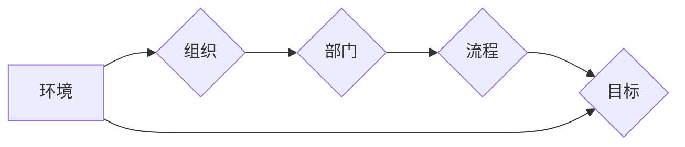

                 

## 思维体系塑造:管理者的必修课

> 关键词：管理思维、系统思维、战略思维、创新思维、数据驱动、决策科学、复杂系统、人工智能

## 1. 背景介绍

在当今瞬息万变的科技时代，管理者面临着前所未有的挑战。传统管理模式已难以应对复杂、动态、充满不确定性的环境。为了在激烈的竞争中脱颖而出，管理者需要具备一套全新的思维体系，能够洞察全局、预测未来、做出明智的决策。

传统的管理思维往往局限于局部，注重执行效率和短期目标。而现代管理需要的是系统思维、战略思维、创新思维等更高级的思维模式。系统思维强调整体与部分的关系，能够帮助管理者理解复杂系统的运作机制；战略思维关注长远目标和全局布局，能够帮助管理者制定有效的战略规划；创新思维则鼓励打破常规，寻求新的解决方案，推动组织发展。

## 2. 核心概念与联系

### 2.1 系统思维

系统思维是一种看待问题和解决问题的全新方式，它强调事物之间的相互联系和整体性。管理者需要将组织视为一个复杂的系统，理解各个部门、各个环节之间的相互作用，才能有效地协调和优化整个系统的运作。

**Mermaid 流程图**



### 2.2 战略思维

战略思维是指制定和实施长期目标的思维方式。管理者需要能够洞察市场趋势、分析竞争环境，并制定相应的战略规划，以确保组织在长远发展中保持竞争力。

### 2.3 创新思维

创新思维是指寻求新的想法、新的方法、新的解决方案的思维方式。管理者需要鼓励员工的创新精神，创造一个有利于创新的环境，才能推动组织不断发展和进步。

## 3. 核心算法原理 & 具体操作步骤

### 3.1 算法原理概述

在管理实践中，我们可以将决策过程看作是一个算法的过程。通过收集数据、分析信息、评估风险，最终做出最佳决策。

### 3.2 算法步骤详解

1. **数据收集:** 收集与决策相关的各种数据，包括内部数据（如财务报表、市场份额等）和外部数据（如市场趋势、竞争对手分析等）。
2. **数据分析:** 对收集到的数据进行分析，识别关键信息、发现潜在问题和机会。可以使用各种数据分析工具和技术，如统计分析、数据挖掘、机器学习等。
3. **风险评估:** 对不同的决策方案进行风险评估，分析潜在的风险和收益，并制定相应的风险控制措施。
4. **决策制定:** 基于数据分析和风险评估的结果，制定最佳的决策方案。
5. **决策执行:** 将决策方案付诸实践，并进行跟踪和评估，及时调整决策方案，以适应不断变化的市场环境。

### 3.3 算法优缺点

**优点:**

* **数据驱动:** 基于数据分析，能够做出更客观、更理性的决策。
* **风险控制:** 通过风险评估，能够有效地控制决策风险。
* **可量化:** 决策过程可以量化，方便评估决策效果。

**缺点:**

* **数据依赖:** 算法的准确性依赖于数据的质量和完整性。
* **复杂性:** 数据分析和风险评估过程可能比较复杂，需要专业的技术支持。
* **局限性:** 算法无法解决所有问题，有些问题需要依靠经验和直觉来判断。

### 3.4 算法应用领域

数据驱动决策算法广泛应用于各个领域，例如：

* **金融:** 风险管理、投资决策、客户服务
* **医疗:** 疾病诊断、治疗方案制定、药物研发
* **制造业:** 生产计划优化、质量控制、设备维护
* **零售:** 商品推荐、库存管理、营销策略

## 4. 数学模型和公式 & 详细讲解 & 举例说明

### 4.1 数学模型构建

在管理决策中，我们可以使用数学模型来描述决策过程和结果。例如，我们可以使用线性规划模型来优化资源分配，使用决策树模型来分析决策风险，使用贝叶斯网络模型来预测未来趋势。

### 4.2 公式推导过程

例如，在资源分配问题中，我们可以使用线性规划模型来求解最优资源分配方案。模型的目标函数是最大化目标效益，约束条件是资源的限制条件。

**目标函数:**

$$
Maximize: Z = c_1x_1 + c_2x_2 + ... + c_nx_n
$$

**约束条件:**

$$
a_{11}x_1 + a_{12}x_2 + ... + a_{1n}x_n \leq b_1
$$

$$
a_{21}x_1 + a_{22}x_2 + ... + a_{2n}x_n \leq b_2
$$

$$
...
$$

$$
a_{m1}x_1 + a_{m2}x_2 + ... + a_{mn}x_n \leq b_m
$$

$$
x_i \geq 0, i = 1, 2, ..., n
$$

其中，$c_i$ 是每个资源的效益系数，$x_i$ 是每个资源的分配量，$a_{ij}$ 是资源的消耗系数，$b_i$ 是资源的限制条件。

### 4.3 案例分析与讲解

例如，一家公司需要分配预算给不同的项目，每个项目都有不同的效益和成本。可以使用线性规划模型来确定最优的预算分配方案，最大化总效益。

## 5. 项目实践：代码实例和详细解释说明

### 5.1 开发环境搭建

可以使用 Python 语言和相应的库来实现数据驱动决策算法。例如，可以使用 Pandas 库进行数据分析，使用 Scikit-learn 库进行机器学习模型训练。

### 5.2 源代码详细实现

```python
import pandas as pd
from sklearn.linear_model import LinearRegression

# 数据加载
data = pd.read_csv('data.csv')

# 特征选择
features = ['feature1', 'feature2', 'feature3']
target = 'target'

# 模型训练
model = LinearRegression()
model.fit(data[features], data[target])

# 预测
new_data = pd.DataFrame({'feature1': [1, 2, 3], 'feature2': [4, 5, 6], 'feature3': [7, 8, 9]})
predictions = model.predict(new_data)

# 结果展示
print(predictions)
```

### 5.3 代码解读与分析

这段代码首先加载数据，然后选择特征和目标变量。然后使用线性回归模型训练模型，并对新的数据进行预测。最后打印预测结果。

### 5.4 运行结果展示

运行结果将显示对新数据的预测值。

## 6. 实际应用场景

数据驱动决策算法在各个领域都有广泛的应用场景，例如：

### 6.1 金融

* 风险管理: 使用机器学习模型分析客户信用风险，制定相应的风险控制措施。
* 投资决策: 使用数据分析和预测模型，识别投资机会，优化投资组合。
* 客户服务: 使用自然语言处理技术，分析客户反馈，提高客户服务质量。

### 6.2 医疗

* 疾病诊断: 使用机器学习模型分析患者症状和病史，辅助医生诊断疾病。
* 治疗方案制定: 使用数据分析和预测模型，制定个性化的治疗方案。
* 药物研发: 使用机器学习模型分析药物数据，加速药物研发过程。

### 6.3 制造业

* 生产计划优化: 使用数据分析和预测模型，优化生产计划，提高生产效率。
* 质量控制: 使用机器学习模型分析生产数据，识别质量问题，提高产品质量。
* 设备维护: 使用机器学习模型预测设备故障，提前进行维护，降低设备故障率。

### 6.4 未来应用展望

随着人工智能技术的不断发展，数据驱动决策算法将应用更加广泛，并发挥更加重要的作用。例如，我们可以使用更复杂的机器学习模型，进行更精准的预测和分析；我们可以使用更强大的计算能力，处理更大的数据量；我们可以使用更先进的算法，解决更复杂的问题。

## 7. 工具和资源推荐

### 7.1 学习资源推荐

* **书籍:**
    * 《数据科学实战》
    * 《机器学习实战》
    * 《Python数据分析手册》
* **在线课程:**
    * Coursera: 数据科学、机器学习
    * edX: 数据分析、人工智能
    * Udacity: 数据科学、机器学习

### 7.2 开发工具推荐

* **Python:** 数据分析、机器学习
* **R:** 数据分析、统计建模
* **SQL:** 数据管理、查询
* **Tableau:** 数据可视化
* **Power BI:** 数据可视化

### 7.3 相关论文推荐

* 《深度学习》
* 《机器学习》
* 《数据挖掘》

## 8. 总结：未来发展趋势与挑战

### 8.1 研究成果总结

数据驱动决策算法已经取得了显著的成果，在各个领域都有广泛的应用。

### 8.2 未来发展趋势

未来，数据驱动决策算法将朝着以下方向发展：

* **更精准的预测:** 使用更复杂的机器学习模型，进行更精准的预测和分析。
* **更强大的计算能力:** 使用更强大的计算能力，处理更大的数据量。
* **更先进的算法:** 使用更先进的算法，解决更复杂的问题。
* **更广泛的应用:** 数据驱动决策算法将应用更加广泛，并发挥更加重要的作用。

### 8.3 面临的挑战

数据驱动决策算法也面临着一些挑战：

* **数据质量:** 算法的准确性依赖于数据的质量和完整性。
* **算法解释性:** 一些机器学习模型的决策过程难以解释，这可能会导致决策的不可信赖性。
* **伦理问题:** 数据驱动决策算法可能会带来一些伦理问题，例如数据隐私、算法偏见等。

### 8.4 研究展望

未来，我们需要继续研究和改进数据驱动决策算法，使其更加精准、更加可解释、更加安全可靠。同时，我们需要关注数据驱动决策算法带来的伦理问题，并制定相应的规范和制度，确保算法的合理使用。

## 9. 附录：常见问题与解答

### 9.1 如何评估数据驱动决策算法的性能？

可以使用各种指标来评估数据驱动决策算法的性能，例如准确率、召回率、F1-score、AUC等。

### 9.2 如何处理不完整的数据？

可以使用各种方法来处理不完整的数据，例如删除缺失值、填充缺失值、使用机器学习模型预测缺失值等。

### 9.3 如何避免算法偏见？

可以使用多种方法来避免算法偏见，例如使用多样化的训练数据、进行算法公平性评估、制定算法使用规范等。


作者：禅与计算机程序设计艺术 / Zen and the Art of Computer Programming 
<end_of_turn>

