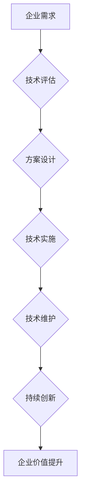

                 

## 技术顾问：高附加值服务的提供

> 关键词：技术咨询、软件架构、人工智能、机器学习、云计算、数据分析、数字化转型

### 1. 背景介绍

在当今科技日新月异的时代，企业面临着前所未有的数字化转型挑战。传统业务模式面临颠覆，新兴技术如人工智能、云计算、大数据等不断涌现，企业需要快速适应和拥抱这些变革，才能保持竞争优势。在这种背景下，技术顾问的需求量急剧增加。

技术顾问作为科技领域的专家，能够帮助企业理解新兴技术，制定数字化转型战略，并提供技术解决方案和实施支持。他们不仅拥有深厚的技术背景，更重要的是具备优秀的沟通能力、问题解决能力和项目管理能力。

### 2. 核心概念与联系

**2.1 技术咨询的核心概念**

技术咨询是指利用专业知识和经验，为企业提供技术方面的建议、解决方案和支持。它涵盖了多个领域，包括：

* **技术评估:** 分析企业现有的技术基础设施、业务流程和技术需求，评估其技术现状和未来发展方向。
* **技术方案设计:** 根据企业的具体需求，设计符合其业务目标和技术条件的解决方案。
* **技术实施支持:** 协助企业实施技术方案，提供技术培训、项目管理和故障排除等支持。

**2.2 高附加值服务的联系**

高附加值服务是指能够为客户创造显著价值的服务，其价值不仅仅体现在价格上，更体现在其带来的效益和影响。技术咨询的高附加值服务主要体现在以下几个方面：

* **战略性咨询:** 帮助企业制定数字化转型战略，明确技术方向和投资计划。
* **创新性解决方案:** 提供独创的技术解决方案，帮助企业突破技术瓶颈，实现业务创新。
* **定制化服务:** 根据企业的具体需求，提供量身定制的技术服务，满足其个性化需求。
* **持续性支持:** 不仅提供技术实施支持，更提供持续的技术维护和升级服务，帮助企业保持技术领先。

**2.3 技术顾问的价值链**

技术顾问的价值链可以概括为以下几个环节：



### 3. 核心算法原理 & 具体操作步骤

**3.1 算法原理概述**

在技术咨询中，算法原理是解决问题的关键。不同的技术问题需要不同的算法，例如：

* **数据分析:** 使用机器学习算法进行数据挖掘和预测。
* **软件架构:** 使用设计模式和软件工程原则进行软件设计和开发。
* **云计算:** 使用云平台提供的服务和工具进行资源管理和应用部署。

**3.2 算法步骤详解**

具体算法步骤需要根据实际问题进行调整，但一般包括以下几个阶段：

* **问题定义:** 明确问题的目标和范围。
* **数据收集:** 收集相关数据，并进行清洗和预处理。
* **模型构建:** 选择合适的算法模型，并进行训练和评估。
* **结果分析:** 分析模型的输出结果，并进行解释和可视化。
* **方案实施:** 将算法模型应用于实际问题，并进行测试和优化。

**3.3 算法优缺点**

不同的算法具有不同的优缺点，需要根据实际问题进行选择。例如：

* **线性回归:** 算法简单易懂，但对非线性关系的拟合能力较弱。
* **决策树:** 算法易于理解和解释，但容易过拟合。
* **支持向量机:** 算法对高维数据处理能力强，但训练时间较长。

**3.4 算法应用领域**

算法广泛应用于各个领域，例如：

* **金融:** 风险评估、欺诈检测、投资预测。
* **医疗:** 疾病诊断、药物研发、患者管理。
* **电商:** 商品推荐、用户画像、精准营销。

### 4. 数学模型和公式 & 详细讲解 & 举例说明

**4.1 数学模型构建**

数学模型是描述客观现象和关系的抽象工具，在技术咨询中，数学模型可以帮助我们理解问题、分析数据、预测趋势。例如：

* **线性回归模型:** 用于描述两个变量之间的线性关系，其数学表达式为：

$$y = mx + c$$

其中，$y$ 是因变量，$x$ 是自变量，$m$ 是斜率，$c$ 是截距。

* **Logistic回归模型:** 用于预测二分类问题，其数学表达式为：

$$P(y=1|x) = \frac{1}{1+e^{-(wx+b)}}$$

其中，$P(y=1|x)$ 是给定自变量$x$时，因变量$y$为1的概率，$w$ 是权重向量，$b$ 是偏置项。

**4.2 公式推导过程**

数学模型的公式推导过程通常需要使用微积分、概率论等数学工具。例如，线性回归模型的系数$m$和$c$可以通过最小二乘法推导得到。

**4.3 案例分析与讲解**

假设我们想要预测房价，可以使用线性回归模型。我们可以收集房子的面积、位置、楼层等数据，并将其作为自变量，房价作为因变量。通过训练线性回归模型，我们可以得到一个预测房价的公式。

### 5. 项目实践：代码实例和详细解释说明

**5.1 开发环境搭建**

技术顾问需要熟悉各种开发环境，例如：

* **Python:** 广泛应用于数据分析、机器学习等领域。
* **Java:** 常用于企业级软件开发。
* **云平台:** 例如AWS、Azure、GCP等，提供各种云计算服务。

**5.2 源代码详细实现**

以下是一个使用Python实现线性回归模型的代码示例：

```python
import numpy as np
from sklearn.linear_model import LinearRegression

# 数据集
X = np.array([[100], [150], [200], [250], [300]])
y = np.array([150000, 200000, 250000, 300000, 350000])

# 创建线性回归模型
model = LinearRegression()

# 训练模型
model.fit(X, y)

# 预测房价
new_house_size = np.array([[220]])
predicted_price = model.predict(new_house_size)

# 打印预测结果
print(f"预测房价: {predicted_price[0]}")
```

**5.3 代码解读与分析**

* 首先，我们导入必要的库，例如NumPy用于数据处理，Scikit-learn用于机器学习。
* 然后，我们定义数据集，其中$X$代表房子的面积，$y$代表房价。
* 接下来，我们创建线性回归模型，并使用训练数据进行模型训练。
* 最后，我们使用训练好的模型预测新房子的房价。

**5.4 运行结果展示**

运行以上代码，可以得到预测房价的结果。例如，如果新房子的面积为220平方米，预测房价可能为280000元。

### 6. 实际应用场景

技术顾问在各个行业都有广泛的应用场景，例如：

* **金融行业:** 帮助银行、保险公司等金融机构进行风险评估、欺诈检测、投资预测等。
* **医疗行业:** 帮助医院、药企等医疗机构进行疾病诊断、药物研发、患者管理等。
* **电商行业:** 帮助电商平台进行商品推荐、用户画像、精准营销等。

**6.4 未来应用展望**

随着人工智能、云计算等技术的不断发展，技术顾问的应用场景将更加广泛，例如：

* **个性化定制:** 为每个用户提供个性化的技术解决方案。
* **智能化服务:** 利用人工智能技术，实现技术服务的自动化和智能化。
* **跨行业融合:** 将不同行业的知识和技术融合，创造新的价值。

### 7. 工具和资源推荐

**7.1 学习资源推荐**

* **在线课程:** Coursera、edX、Udemy等平台提供各种技术相关的在线课程。
* **书籍:** 《深度学习》、《Python编程从入门到实践》等书籍可以帮助你学习相关技术知识。
* **技术博客:** 关注技术领域的博客，例如Hacker News、Medium等，可以了解最新的技术趋势和实践经验。

**7.2 开发工具推荐**

* **Python:** 作为数据分析和机器学习的常用语言，Python拥有丰富的库和工具，例如NumPy、Pandas、Scikit-learn等。
* **Java:** 作为企业级软件开发的常用语言，Java拥有强大的生态系统和工具支持。
* **云平台:** AWS、Azure、GCP等云平台提供各种开发工具和服务，例如云数据库、云计算、云存储等。

**7.3 相关论文推荐**

* **深度学习论文:** 关注人工智能领域的顶级会议和期刊，例如NeurIPS、ICML、AAAI等。
* **云计算论文:** 关注云计算领域的顶级会议和期刊，例如ACM SIGCOMM、IEEE INFOCOM等。

### 8. 总结：未来发展趋势与挑战

**8.1 研究成果总结**

技术咨询领域取得了显著的成果，例如：

* **人工智能技术:** 人工智能技术在各个领域都有广泛的应用，例如自然语言处理、计算机视觉、机器学习等。
* **云计算技术:** 云计算技术提供了弹性、可扩展的计算资源，推动了企业数字化转型。
* **大数据技术:** 大数据技术能够帮助企业从海量数据中挖掘价值，做出更明智的决策。

**8.2 未来发展趋势**

技术咨询领域将继续朝着以下方向发展：

* **更加智能化:** 利用人工智能技术，实现技术服务的自动化和智能化。
* **更加个性化:** 为每个用户提供个性化的技术解决方案。
* **更加跨行业融合:** 将不同行业的知识和技术融合，创造新的价值。

**8.3 面临的挑战**

技术咨询领域也面临着一些挑战，例如：

* **技术更新迭代速度快:** 需要不断学习新的技术和知识。
* **人才短缺:** 高素质的技术顾问人才需求量大，供不应求。
* **竞争激烈:** 技术咨询市场竞争激烈，需要不断提升服务质量和竞争力。

**8.4 研究展望**

未来，技术咨询领域的研究方向将包括：

* **人工智能技术在技术咨询中的应用:** 如何更好地利用人工智能技术，提高技术咨询的效率和质量。
* **技术咨询服务模式的创新:** 如何探索新的技术咨询服务模式，满足客户多样化的需求。
* **技术顾问人才培养机制的完善:** 如何培养更多高素质的技术顾问人才，满足市场需求。

### 9. 附录：常见问题与解答

**9.1 如何选择合适的技术顾问？**

选择技术顾问时，需要考虑以下因素：

* **技术领域:** 确保技术顾问拥有您需要的技术领域经验。
* **项目经验:** 了解技术顾问在类似项目中的经验和成功案例。
* **沟通能力:** 技术顾问需要能够清晰地沟通技术问题和解决方案。
* **价格和服务范围:** 比较不同技术顾问的价格和服务范围，选择最适合您的方案。

**9.2 技术顾问的收费标准如何？**

技术顾问的收费标准因人而异，通常根据以下因素确定：

* **技术顾问的经验和资质:** 经验丰富的技术顾问收费标准通常较高。
* **项目复杂度:** 项目复杂度越高，收费标准越高。
* **服务范围:** 服务范围越广，收费标准越高。

**9.3 技术顾问的职责是什么？**

技术顾问的职责包括：

* **技术评估:** 分析企业现有的技术基础设施、业务流程和技术需求。
* **方案设计:** 根据企业的具体需求，设计符合其业务目标和技术条件的解决方案。
* **技术实施支持:** 协助企业实施技术方案，提供技术培训、项目管理和故障排除等支持。
* **持续性支持:** 提供持续的技术维护和升级服务，帮助企业保持技术领先。


作者：禅与计算机程序设计艺术 / Zen and the Art of Computer Programming 
<end_of_turn>

