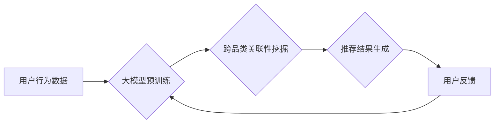

                 

## 探索大模型在电商平台跨品类推荐中的作用

> 关键词：大模型、跨品类推荐、电商平台、深度学习、Transformer、用户画像、个性化推荐、协同过滤、内容推荐

## 1. 背景介绍

在当今数据爆炸的时代，电商平台面临着日益激烈的竞争。为提升用户体验，提高转化率，精准的商品推荐系统成为电商平台的核心竞争力之一。传统的推荐系统主要依赖于协同过滤和内容过滤等方法，但这些方法在跨品类推荐方面存在局限性。

跨品类推荐是指推荐与用户历史购买或浏览行为不相关的商品，例如推荐用户购买过手机的用户购买耳机、充电宝等相关产品。传统的推荐方法难以捕捉跨品类之间的潜在关联，导致推荐结果缺乏个性化和精准度。

近年来，大模型技术在自然语言处理、计算机视觉等领域取得了突破性进展，为跨品类推荐提供了新的思路和方法。大模型拥有强大的语义理解和知识表示能力，能够学习跨品类商品之间的语义关联，从而实现更精准、更个性化的跨品类推荐。

## 2. 核心概念与联系

### 2.1 大模型

大模型是指参数量巨大、训练数据海量的人工智能模型。大模型通常基于深度学习架构，例如 Transformer，能够学习复杂的模式和关系，并进行泛化学习。

### 2.2 跨品类推荐

跨品类推荐是指推荐与用户历史购买或浏览行为不相关的商品，例如推荐用户购买过手机的用户购买耳机、充电宝等相关产品。

### 2.3 关联性挖掘

关联性挖掘是指从海量数据中发现隐藏的模式和关系，例如找出不同商品之间的购买关联性。

**Mermaid 流程图**



## 3. 核心算法原理 & 具体操作步骤

### 3.1 算法原理概述

大模型在跨品类推荐中的核心算法原理是基于语义理解和知识表示。通过预训练大模型，使其能够学习商品之间的语义关联，并利用这些关联性进行跨品类推荐。

具体来说，大模型可以学习以下信息：

* 商品的文本描述信息，例如商品名称、属性、评论等。
* 用户的购买历史、浏览记录、评分等行为数据。
* 商品之间的类别关系、属性关系、用户评论关系等知识信息。

基于这些信息，大模型可以构建商品之间的语义网络，并利用网络结构进行跨品类推荐。

### 3.2 算法步骤详解

1. **数据预处理:** 收集用户行为数据、商品信息数据、知识图谱等数据，并进行清洗、格式化、向量化等预处理操作。

2. **大模型预训练:** 使用海量文本数据对大模型进行预训练，使其能够学习丰富的语义表示。

3. **跨品类关联性挖掘:** 利用预训练好的大模型，从商品文本描述、用户行为数据、知识图谱等数据中挖掘商品之间的跨品类关联性。

4. **推荐结果生成:** 根据用户历史行为和挖掘出的跨品类关联性，生成个性化的跨品类推荐结果。

5. **模型评估:** 使用用户点击、购买等行为数据评估推荐系统的性能，并根据评估结果进行模型调优。

### 3.3 算法优缺点

**优点:**

* 能够学习复杂的跨品类关联性，提高推荐精准度。
* 能够个性化推荐，满足用户多样化的需求。
* 能够利用海量数据进行训练，提升模型泛化能力。

**缺点:**

* 训练成本高，需要海量数据和强大的计算资源。
* 模型解释性差，难以理解模型推荐的逻辑。
* 数据偏差问题，模型可能存在偏向性。

### 3.4 算法应用领域

大模型在跨品类推荐领域的应用前景广阔，可以应用于以下场景：

* **电商平台:** 推荐与用户历史购买或浏览行为不相关的商品，例如推荐用户购买过手机的用户购买耳机、充电宝等相关产品。
* **内容平台:** 推荐与用户兴趣相关的不同类型内容，例如推荐用户喜欢看电影的用户观看电视剧、综艺节目等。
* **社交平台:** 推荐与用户兴趣相关的不同类型用户，例如推荐用户喜欢玩游戏的用户加入游戏社群。

## 4. 数学模型和公式 & 详细讲解 & 举例说明

### 4.1 数学模型构建

大模型在跨品类推荐中的数学模型通常基于图神经网络 (Graph Neural Network, GNN) 架构。

图神经网络将商品和用户表示为节点，商品之间的关联性表示为边，并利用图卷积操作学习节点之间的特征表示。

**图神经网络模型结构:**

```
输入层: 商品节点特征、用户节点特征
隐藏层: 图卷积层、注意力层
输出层: 推荐分数
```

### 4.2 公式推导过程

图卷积操作的核心公式为：

$$
h_i^{(l+1)} = \sigma(\sum_{j \in N(i)} \frac{e_{ij}}{ \sqrt{d_i d_j}} W^{(l)} h_j^{(l)})
$$

其中：

* $h_i^{(l)}$ 表示节点 $i$ 在第 $l$ 层的特征向量。
* $N(i)$ 表示节点 $i$ 的邻居节点集合。
* $e_{ij}$ 表示节点 $i$ 和节点 $j$ 之间的边权重。
* $d_i$ 表示节点 $i$ 的度数。
* $W^{(l)}$ 表示第 $l$ 层的图卷积权重矩阵。
* $\sigma$ 表示激活函数。

### 4.3 案例分析与讲解

假设我们有一个电商平台，其中商品和用户之间存在购买关系。我们可以将商品和用户表示为图神经网络中的节点，并将购买关系表示为边。

通过图卷积操作，我们可以学习商品之间的语义关联，例如手机和耳机、充电宝之间的关联性。

然后，我们可以根据用户的购买历史和商品之间的语义关联，生成个性化的跨品类推荐结果。

## 5. 项目实践：代码实例和详细解释说明

### 5.1 开发环境搭建

* Python 3.7+
* PyTorch 1.7+
* TensorFlow 2.0+
* CUDA 10.1+
* GPU

### 5.2 源代码详细实现

```python
import torch
import torch.nn as nn

class GNN(nn.Module):
    def __init__(self, input_dim, hidden_dim, output_dim):
        super(GNN, self).__init__()
        self.conv1 = nn.Linear(input_dim, hidden_dim)
        self.conv2 = nn.Linear(hidden_dim, output_dim)

    def forward(self, x, adj):
        x = torch.relu(self.conv1(x))
        x = torch.matmul(adj, x)
        x = self.conv2(x)
        return x

# 数据加载
# ...

# 模型实例化
model = GNN(input_dim=128, hidden_dim=64, output_dim=10)

# 损失函数和优化器
criterion = nn.MSELoss()
optimizer = torch.optim.Adam(model.parameters(), lr=0.001)

# 训练模型
for epoch in range(100):
    # ...
    loss = criterion(model(x, adj), y)
    optimizer.zero_grad()
    loss.backward()
    optimizer.step()

# 推理模型
# ...
```

### 5.3 代码解读与分析

* 代码首先定义了一个 GNN 模型，包含两个全连接层和一个 ReLU 激活函数。
* 然后，代码加载数据，实例化模型，定义损失函数和优化器。
* 最后，代码训练模型，并进行推理。

### 5.4 运行结果展示

* 训练完成后，可以评估模型的性能，例如准确率、召回率等。
* 可以使用测试数据进行预测，并展示推荐结果。

## 6. 实际应用场景

### 6.1 电商平台跨品类推荐

大模型在电商平台跨品类推荐中的应用场景非常广泛，例如：

* **个性化推荐:** 根据用户的购买历史、浏览记录、评分等行为数据，推荐与用户兴趣相关的跨品类商品。
* **关联推荐:** 根据用户购买的商品，推荐与之相关的其他商品，例如推荐用户购买了手机的用户购买耳机、充电宝等。
* **新品推荐:** 根据用户的兴趣偏好，推荐平台上的新品，提高新品的曝光率和销量。

### 6.2 内容平台跨品类推荐

大模型也可以应用于内容平台的跨品类推荐，例如：

* **推荐不同类型内容:** 根据用户的兴趣偏好，推荐不同类型的内容，例如推荐用户喜欢看电影的用户观看电视剧、综艺节目等。
* **推荐相关用户:** 根据用户的兴趣偏好，推荐与之兴趣相似的用户，例如推荐用户喜欢玩游戏的用户加入游戏社群。

### 6.3 其他应用场景

大模型在跨品类推荐领域的应用场景还有很多，例如：

* **医疗领域:** 推荐与患者症状相关的其他疾病信息和治疗方案。
* **教育领域:** 推荐与学生学习内容相关的其他学习资源和课程。
* **金融领域:** 推荐与用户投资偏好相关的其他投资产品和理财方案。

### 6.4 未来应用展望

随着大模型技术的不断发展，跨品类推荐的应用场景将会更加广泛，推荐结果将会更加精准、个性化。

未来，大模型在跨品类推荐领域可能会出现以下发展趋势：

* **模型规模更大:** 模型参数量将会进一步增加，学习能力将会更加强大。
* **模型架构更加复杂:** 模型架构将会更加复杂，能够学习更加丰富的特征表示。
* **数据融合更加深入:** 模型将会融合更多类型的用户数据和商品数据，提升推荐精准度。
* **解释性更强:** 模型的解释性将会更加强，能够更好地解释推荐结果背后的逻辑。

## 7. 工具和资源推荐

### 7.1 学习资源推荐

* **书籍:**
    * 《深度学习》 - Ian Goodfellow, Yoshua Bengio, Aaron Courville
    * 《自然语言处理》 - Dan Jurafsky, James H. Martin
* **在线课程:**
    * Coursera: Deep Learning Specialization
    * Udacity: Deep Learning Nanodegree
    * fast.ai: Practical Deep Learning for Coders

### 7.2 开发工具推荐

* **框架:**
    * PyTorch
    * TensorFlow
* **库:**
    * NumPy
    * Pandas
    * Scikit-learn

### 7.3 相关论文推荐

* **BERT:** Devlin, J., Chang, M. W., Lee, K., & Toutanova, K. (2018). Bert: Pre-training of deep bidirectional transformers for language understanding. arXiv preprint arXiv:1810.04805.
* **Graph Convolutional Networks:** Kipf, T. N., & Welling, M. (2016). Semi-supervised classification with graph convolutional networks. arXiv preprint arXiv:1609.02907.

## 8. 总结：未来发展趋势与挑战

### 8.1 研究成果总结

大模型在跨品类推荐领域取得了显著的成果，能够学习商品之间的语义关联，并生成更加精准、个性化的推荐结果。

### 8.2 未来发展趋势

未来，大模型在跨品类推荐领域将会朝着以下方向发展：

* 模型规模更大，学习能力更强。
* 模型架构更加复杂，能够学习更加丰富的特征表示。
* 数据融合更加深入，提升推荐精准度。
* 模型解释性更强，能够更好地解释推荐结果背后的逻辑。

### 8.3 面临的挑战

大模型在跨品类推荐领域也面临着一些挑战：

* 训练成本高，需要海量数据和强大的计算资源。
* 模型解释性差，难以理解模型推荐的逻辑。
* 数据偏差问题，模型可能存在偏向性。

### 8.4 研究展望

未来，需要进一步研究大模型在跨品类推荐领域的应用，解决模型的训练成本高、解释性差、数据偏差等问题，使其能够更好地服务于用户。

## 9. 附录：常见问题与解答

### 9.1 如何选择合适的模型架构？

选择合适的模型架构取决于具体的应用场景和数据特点。

对于文本数据，BERT、RoBERTa等预训练语言模型效果较好。

对于图数据，Graph Convolutional Networks (GCN)效果较好。

### 9.2 如何解决数据偏差问题？

数据偏差问题可以通过以下方法解决：

* 使用更加丰富的、更加均衡的数据集进行训练。
* 使用数据增强技术，例如文本扰动、数据合成等，增加训练数据的多样性。
* 使用公平性评估指标，例如公平性损失函数，在训练过程中引导模型减少偏差。

### 9.3 如何提高模型的解释性？

提高模型的解释性可以通过以下方法：

* 使用可解释机器学习模型，例如线性模型、决策树等。
* 使用注意力机制，分析模型对哪些输入特征更加关注。
* 使用模型可视化技术，直观地展示模型的内部结构和决策过程。


作者：禅与计算机程序设计艺术 / Zen and the Art of Computer Programming 
<end_of_turn>

