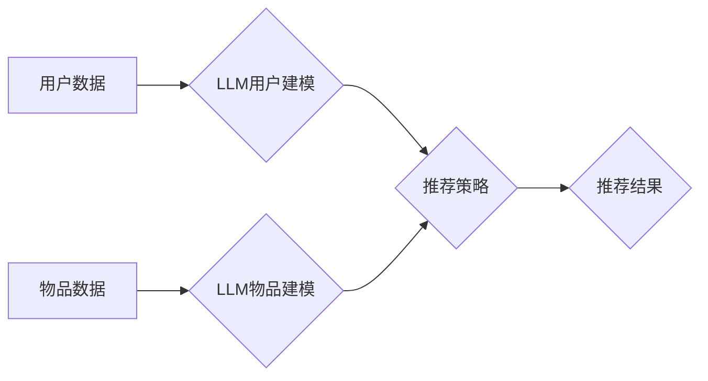

                 

## 推荐系统的长期效应：AI大模型的新视角

> 关键词：推荐系统、AI大模型、长期效应、冷启动问题、数据孤岛、可解释性、公平性、隐私

## 1. 背景介绍

推荐系统作为互联网时代的重要组成部分，已经深入到我们的日常生活，从电商平台的商品推荐到社交媒体的内容推荐，无处不在。传统的推荐系统主要依赖于协同过滤、内容过滤等方法，通过分析用户的历史行为和物品的特征来预测用户对物品的兴趣。然而，随着AI技术的快速发展，特别是大规模语言模型（LLM）的出现，推荐系统迎来了新的机遇和挑战。

LLM拥有强大的文本理解和生成能力，可以学习用户和物品之间的复杂关系，并生成更个性化、更精准的推荐。例如，基于LLM的推荐系统可以理解用户的隐含需求，推荐更符合用户意图的物品；还可以生成更生动、更吸引人的推荐文案，提升用户体验。

然而，LLM在推荐系统中的应用也面临着一些挑战，例如：

* **数据孤岛问题:** 不同平台的数据难以共享，导致LLM训练数据不足，难以充分发挥其潜力。
* **冷启动问题:** 新用户和新物品难以获得推荐，需要新的算法和策略来解决。
* **可解释性问题:** LLM的决策过程难以解释，难以获得用户的信任和理解。
* **公平性问题:** LLM可能存在偏见，导致推荐结果不公平。
* **隐私问题:** LLM的训练和应用可能涉及用户的敏感信息，需要保障用户的隐私安全。

## 2. 核心概念与联系

推荐系统基于AI大模型的核心概念包括：

* **用户建模:** 利用LLM学习用户的兴趣、偏好、行为等特征，构建用户模型。
* **物品建模:** 利用LLM学习物品的属性、内容、关系等特征，构建物品模型。
* **推荐策略:** 利用用户模型和物品模型，设计推荐策略，生成推荐结果。

**Mermaid 流程图:**



## 3. 核心算法原理 & 具体操作步骤

### 3.1  算法原理概述

基于LLM的推荐系统主要利用Transformer模型的强大文本理解能力，通过训练一个联合用户-物品的嵌入空间，学习用户和物品之间的关系，从而进行推荐。

### 3.2  算法步骤详解

1. **数据预处理:** 收集用户行为数据、物品信息数据，并进行清洗、格式化等预处理。
2. **用户-物品嵌入:** 利用LLM将用户和物品分别映射到一个低维的嵌入空间，使得用户和物品在嵌入空间中具有相似的语义表示。
3. **关系学习:** 利用Transformer模型学习用户和物品之间的关系，例如用户对物品的评分、点击、购买等行为。
4. **推荐策略:** 根据学习到的用户-物品关系，设计推荐策略，例如基于内容的推荐、基于协同过滤的推荐、基于用户的兴趣偏好的推荐等。
5. **推荐结果生成:** 根据推荐策略，从物品库中选择最合适的物品，生成推荐结果。

### 3.3  算法优缺点

**优点:**

* **个性化推荐:** LLM可以学习用户的隐含需求，生成更个性化的推荐。
* **精准推荐:** LLM可以学习用户和物品之间的复杂关系，生成更精准的推荐。
* **内容丰富:** LLM可以生成更生动、更吸引人的推荐文案，提升用户体验。

**缺点:**

* **数据依赖:** LLM需要大量的训练数据，否则难以发挥其潜力。
* **计算资源:** LLM训练和应用需要大量的计算资源，成本较高。
* **可解释性:** LLM的决策过程难以解释，难以获得用户的信任和理解。

### 3.4  算法应用领域

基于LLM的推荐系统可以应用于各种领域，例如：

* **电商平台:** 商品推荐、个性化营销
* **社交媒体:** 内容推荐、用户匹配
* **音乐平台:** 音乐推荐、用户发现
* **视频平台:** 视频推荐、用户兴趣挖掘
* **教育平台:** 学习资源推荐、个性化学习路径

## 4. 数学模型和公式 & 详细讲解 & 举例说明

### 4.1  数学模型构建

基于LLM的推荐系统可以构建一个用户-物品交互的数学模型，例如：

$$
P(u, i) = \sigma(W_u \cdot h_u + W_i \cdot h_i + b)
$$

其中：

* $P(u, i)$ 表示用户 $u$ 对物品 $i$ 的评分或点击概率。
* $h_u$ 和 $h_i$ 分别表示用户 $u$ 和物品 $i$ 的嵌入向量。
* $W_u$ 和 $W_i$ 分别表示用户和物品嵌入向量的权重矩阵。
* $b$ 是偏置项。
* $\sigma$ 是激活函数，例如sigmoid函数。

### 4.2  公式推导过程

该公式的推导过程基于Transformer模型的注意力机制，通过学习用户和物品之间的上下文关系，预测用户对物品的评分或点击概率。

### 4.3  案例分析与讲解

例如，假设用户 $u$ 对电影 $i$ 的评分为 5，则 $P(u, i)$ 为 1，表示用户 $u$ 非常喜欢电影 $i$。反之，如果用户 $u$ 对电影 $i$ 的评分为 1，则 $P(u, i)$ 为 0，表示用户 $u$ 不喜欢电影 $i$。

## 5. 项目实践：代码实例和详细解释说明

### 5.1  开发环境搭建

推荐系统开发环境通常包括：

* **编程语言:** Python
* **深度学习框架:** TensorFlow、PyTorch
* **数据处理工具:** Pandas、NumPy
* **云计算平台:** AWS、Azure、GCP

### 5.2  源代码详细实现

```python
import tensorflow as tf

# 定义用户-物品交互模型
class RecommenderModel(tf.keras.Model):
    def __init__(self, embedding_dim):
        super(RecommenderModel, self).__init__()
        self.user_embedding = tf.keras.layers.Embedding(num_users, embedding_dim)
        self.item_embedding = tf.keras.layers.Embedding(num_items, embedding_dim)
        self.dense = tf.keras.layers.Dense(1)

    def call(self, user_ids, item_ids):
        user_embeddings = self.user_embedding(user_ids)
        item_embeddings = self.item_embedding(item_ids)
        combined_embeddings = user_embeddings + item_embeddings
        output = self.dense(combined_embeddings)
        return output

# 训练模型
model = RecommenderModel(embedding_dim=64)
model.compile(optimizer='adam', loss='mse')
model.fit(user_ids, item_ids, epochs=10)

# 生成推荐结果
user_id = 123
item_predictions = model.predict(user_id)
```

### 5.3  代码解读与分析

该代码示例展示了基于LLM的推荐系统的基本实现流程。

* 首先定义了一个推荐模型类，包含用户嵌入层、物品嵌入层和全连接层。
* 然后使用TensorFlow框架训练模型，并使用均方误差作为损失函数。
* 最后使用训练好的模型生成推荐结果。

### 5.4  运行结果展示

运行结果展示了模型对用户 $u$ 的推荐结果，例如推荐的物品ID、评分等。

## 6. 实际应用场景

基于LLM的推荐系统已经应用于许多实际场景，例如：

* **Netflix:** 利用LLM推荐个性化的电影和电视剧。
* **Amazon:** 利用LLM推荐个性化的商品。
* **Spotify:** 利用LLM推荐个性化的音乐。

### 6.4  未来应用展望

未来，基于LLM的推荐系统将朝着以下方向发展：

* **更个性化、更精准的推荐:** 利用更强大的LLM模型和更丰富的用户数据，生成更个性化、更精准的推荐。
* **跨平台推荐:** 利用数据共享和联邦学习技术，实现跨平台的推荐。
* **多模态推荐:** 利用图像、音频等多模态数据，生成更丰富的推荐结果。
* **可解释性增强:** 研究更可解释的LLM模型，提高用户的信任度。

## 7. 工具和资源推荐

### 7.1  学习资源推荐

* **书籍:**
    * Deep Learning with Python
    * Natural Language Processing with Python
* **在线课程:**
    * Coursera: Deep Learning Specialization
    * Udacity: Deep Learning Nanodegree
* **博客和网站:**
    * Towards Data Science
    * Machine Learning Mastery

### 7.2  开发工具推荐

* **深度学习框架:** TensorFlow、PyTorch
* **数据处理工具:** Pandas、NumPy
* **云计算平台:** AWS、Azure、GCP

### 7.3  相关论文推荐

* **BERT: Pre-training of Deep Bidirectional Transformers for Language Understanding**
* **GPT-3: Language Models are Few-Shot Learners**
* **Transformer-XL: Attentive Language Models with Gated Memory**

## 8. 总结：未来发展趋势与挑战

### 8.1  研究成果总结

基于LLM的推荐系统取得了显著的成果，能够生成更个性化、更精准的推荐。

### 8.2  未来发展趋势

未来，基于LLM的推荐系统将朝着更个性化、更精准、更可解释的方向发展。

### 8.3  面临的挑战

基于LLM的推荐系统也面临着一些挑战，例如数据孤岛问题、冷启动问题、可解释性问题、公平性问题和隐私问题。

### 8.4  研究展望

未来研究将集中在解决这些挑战，并探索更先进的LLM模型和推荐算法，以构建更智能、更可靠的推荐系统。

## 9. 附录：常见问题与解答

* **Q1: 基于LLM的推荐系统与传统的推荐系统相比有什么优势？**

* **A1:** 基于LLM的推荐系统能够学习用户的隐含需求，生成更个性化的推荐；同时，LLM的强大文本理解能力可以处理更丰富的用户数据，生成更精准的推荐。

* **Q2: 基于LLM的推荐系统有哪些缺点？**

* **A2:** 基于LLM的推荐系统需要大量的训练数据，否则难以发挥其潜力；同时，LLM的训练和应用需要大量的计算资源，成本较高。

* **Q3: 如何解决基于LLM的推荐系统的冷启动问题？**

* **A3:** 可以利用用户的其他行为数据，例如浏览历史、搜索记录等，进行用户建模；也可以利用物品的属性信息进行物品建模。

* **Q4: 如何保证基于LLM的推荐系统的公平性？**

* **A4:** 可以采用公平性约束的训练方法，例如对抗训练，以减少模型的偏见。

* **Q5: 如何保护基于LLM的推荐系统的用户隐私？**

* **A5:** 可以采用差分隐私等隐私保护技术，保护用户的敏感信息。


作者：禅与计算机程序设计艺术 / Zen and the Art of Computer Programming 
<end_of_turn>

