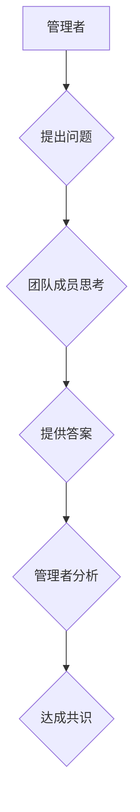

                 

## 提问技巧：管理者的沟通利器

> 关键词：沟通技巧、提问技巧、管理者、团队合作、问题解决、领导力、高效沟通

### 1. 背景介绍

在当今快速变化的科技时代，有效的沟通已成为管理者成功关键。 优秀的管理者不仅能清晰地表达自己的想法，更能巧妙地运用提问技巧，引导团队成员深入思考，激发创新，最终达成共同目标。 

传统的管理模式往往依赖于命令式沟通，而这种方式容易导致信息单向流动，缺乏团队成员的积极参与和创造力。 

提问技巧则打破了这种单向模式，将沟通转变为一种双向互动，让管理者能够更深入地了解团队成员的想法和需求，并引导他们共同解决问题，推动团队发展。

### 2. 核心概念与联系

**2.1 沟通的本质**

沟通的核心在于信息传递和理解。 

有效的沟通需要清晰、准确、简洁的信息传递，以及双方对信息的正确理解和反馈。 

**2.2 提问的价值**

提问是一种强大的沟通工具，它可以：

* **激发思考:** 提问可以引导团队成员深入思考问题，挖掘潜在的解决方案。
* **促进理解:** 通过提问，管理者可以更深入地了解团队成员的想法和需求，从而更好地理解他们的工作状态和挑战。
* **增强参与度:** 提问可以鼓励团队成员积极参与讨论，提升他们的工作热情和责任感。
* **发现问题:** 巧妙的提问可以帮助管理者发现团队中潜在的问题，并及时采取措施解决。

**2.3 提问与领导力的关系**

提问技巧是领导力的一部分。 优秀的领导者善于运用提问，引导团队成员，激发他们的潜能，最终实现团队目标。

**Mermaid 流程图**



### 3. 核心算法原理 & 具体操作步骤

**3.1 算法原理概述**

提问技巧并非一种固定的算法，而是需要根据具体情况灵活运用的一套沟通策略。 

其核心原理在于：

* **目标导向:** 每个问题都应该围绕着明确的目标，引导团队成员朝着预期的方向思考。
* **开放式问题:** 尽量使用开放式问题，鼓励团队成员提供更详细、更深入的思考和答案。
* **倾听与反馈:** 管理者需要认真倾听团队成员的回答，并及时给予反馈，引导他们深入思考。

**3.2 算法步骤详解**

1. **明确目标:** 在提出问题之前，管理者需要明确自己想要达成的目标。 
2. **选择合适的提问方式:** 根据不同的目标和情境，选择不同的提问方式，例如开放式问题、引导式问题、假设性问题等。
3. **简洁明了:** 提问要简洁明了，避免使用过于复杂的语言或术语。
4. **耐心倾听:** 管理者需要耐心倾听团队成员的回答，并给予积极的反馈。
5. **引导思考:** 通过提问，引导团队成员深入思考问题，挖掘潜在的解决方案。

**3.3 算法优缺点**

**优点:**

* 促进团队成员的积极参与和思考。
* 帮助管理者更深入地了解团队成员的想法和需求。
* 提升团队的协作能力和解决问题的能力。

**缺点:**

* 需要管理者具备良好的沟通技巧和倾听能力。
* 并非所有问题都适合用提问的方式解决。

**3.4 算法应用领域**

提问技巧在各个领域都有广泛的应用，例如：

* **项目管理:** 帮助管理者了解团队成员的工作进度和遇到的问题，并及时提供指导和支持。
* **团队建设:** 促进团队成员之间的沟通和了解，增强团队凝聚力。
* **创新驱动:** 鼓励团队成员提出新的想法和解决方案，推动企业创新发展。

### 4. 数学模型和公式 & 详细讲解 & 举例说明

**4.1 数学模型构建**

虽然提问技巧本身不是一个数学模型，但我们可以用信息论的框架来理解其作用。 

信息论认为，信息的传递和理解是通过减少信息熵的过程实现的。 

提问可以帮助管理者收集团队成员的信息，从而降低信息熵，提高信息传递的效率和准确性。

**4.2 公式推导过程**

信息熵的公式为：

$$H(X) = - \sum_{i=1}^{n} p(x_i) \log_2 p(x_i)$$

其中：

* $X$ 是一个随机变量。
* $p(x_i)$ 是 $X$ 取值为 $x_i$ 的概率。

通过提问，管理者可以收集更多关于团队成员的信息，从而降低 $p(x_i)$ 的值，最终降低信息熵 $H(X)$。

**4.3 案例分析与讲解**

例如，在一个项目会议中，管理者发现团队成员对某个功能的实现存在分歧。 

管理者可以利用开放式问题，例如“你们认为这个功能应该如何实现？”，引导团队成员深入思考，并表达各自的想法。 

通过收集这些信息，管理者可以更好地了解团队成员的观点，并最终找到一个大家都认可的解决方案。

### 5. 项目实践：代码实例和详细解释说明

**5.1 开发环境搭建**

由于提问技巧本身不是一种代码实现，因此不需要搭建特定的开发环境。 

它可以应用于任何需要沟通和协作的场景。

**5.2 源代码详细实现**

提问技巧的“代码”体现在管理者日常的沟通行为中。 

例如，在团队会议中，管理者可以利用以下代码片段：

```
// 开放式问题
"你们认为这个功能应该如何实现？"

// 引导式问题
"如果我们采用这种方法，会带来哪些挑战？"

// 假设性问题
"如果我们假设这个功能无法实现，我们应该如何应对？"
```

**5.3 代码解读与分析**

这些代码片段体现了提问技巧的本质：

* **目标导向:** 每个问题都围绕着明确的目标，引导团队成员朝着预期的方向思考。
* **开放式问题:** 鼓励团队成员提供更详细、更深入的思考和答案。
* **引导式问题:** 引导团队成员思考问题的潜在挑战和风险。
* **假设性问题:** 鼓励团队成员进行批判性思考，并探索不同的解决方案。

**5.4 运行结果展示**

提问技巧的运行结果是团队成员的积极参与、深入思考和有效的沟通。 

最终，这将转化为更好的项目成果和团队发展。

### 6. 实际应用场景

**6.1 项目启动阶段**

在项目启动阶段，管理者可以使用提问技巧来了解团队成员的技能和经验，并确定每个成员的职责和目标。

**6.2 项目开发阶段**

在项目开发阶段，管理者可以使用提问技巧来跟踪项目进度，了解团队成员遇到的问题，并及时提供指导和支持。

**6.3 项目总结阶段**

在项目总结阶段，管理者可以使用提问技巧来收集团队成员的反馈，并总结项目经验教训，为下次项目提供参考。

**6.4 未来应用展望**

随着人工智能技术的不断发展，提问技巧将更加智能化和个性化。 

未来，我们可以期待看到基于人工智能的提问工具，能够根据团队成员的性格和工作习惯，提供更加精准和有效的提问建议。

### 7. 工具和资源推荐

**7.1 学习资源推荐**

* 《提问技巧：管理者的沟通利器》
* 《高效沟通》
* 《领导力》

**7.2 开发工具推荐**

* 任何支持文本编辑和沟通的工具，例如 Slack、Microsoft Teams、Zoom 等。

**7.3 相关论文推荐**

* “The Power of Asking Questions”
* “Effective Communication in Teams”
* “Leadership and Communication”

### 8. 总结：未来发展趋势与挑战

**8.1 研究成果总结**

本篇文章探讨了提问技巧在管理者沟通中的重要作用，并分析了其核心原理、应用场景和未来发展趋势。 

通过巧妙地运用提问技巧，管理者可以有效地引导团队成员，激发他们的创造力，最终实现团队目标。

**8.2 未来发展趋势**

未来，提问技巧将更加智能化和个性化，并与人工智能技术深度融合。 

我们可以期待看到基于人工智能的提问工具，能够根据团队成员的性格和工作习惯，提供更加精准和有效的提问建议。

**8.3 面临的挑战**

尽管提问技巧具有巨大的潜力，但其应用也面临一些挑战：

* 管理者需要具备良好的沟通技巧和倾听能力。
* 提问技巧需要根据不同的情境灵活运用。
* 并非所有问题都适合用提问的方式解决。

**8.4 研究展望**

未来，我们需要进一步研究提问技巧的应用场景和最佳实践，并开发更加智能化和个性化的提问工具，帮助管理者更好地运用提问技巧，提升团队沟通效率和协作能力。

### 9. 附录：常见问题与解答

**9.1 如何提问才能更有效？**

* 明确目标：每个问题都应该围绕着明确的目标，引导团队成员朝着预期的方向思考。
* 选择合适的提问方式：根据不同的目标和情境，选择不同的提问方式，例如开放式问题、引导式问题、假设性问题等。
* 简洁明了：提问要简洁明了，避免使用过于复杂的语言或术语。
* 倾听与反馈：管理者需要认真倾听团队成员的回答，并及时给予反馈，引导他们深入思考。

**9.2 什么时候不适合使用提问技巧？**

* 当需要快速做出决定时，例如紧急情况。
* 当团队成员已经明确了答案，不需要进一步思考时。
* 当管理者需要传达明确的指令时，例如命令式沟通。


作者：禅与计算机程序设计艺术 / Zen and the Art of Computer Programming 
<end_of_turn>

