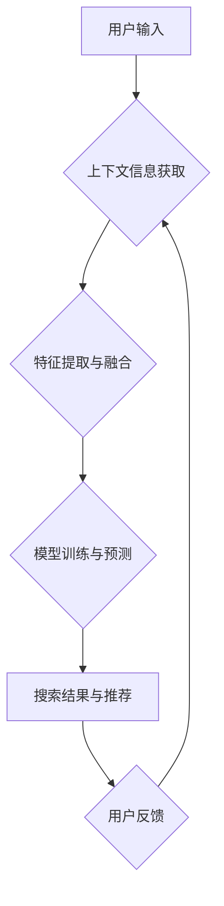

                 

## 1. 背景介绍

在当今数据爆炸的时代，搜索引擎和推荐系统已经成为人们获取信息和发现内容的重要途径。传统的搜索引擎主要依赖关键词匹配，而推荐系统则基于用户的历史行为和偏好进行推荐。然而，这些方法都存在局限性。关键词匹配无法理解用户搜索的真实意图，而基于历史行为的推荐可能陷入“同质化推荐”的困境，无法为用户提供新鲜和个性化的体验。

上下文感知技术应运而生，旨在通过理解用户搜索时的上下文信息，提供更精准、更个性化的搜索结果和推荐。上下文信息可以包括用户的地理位置、设备类型、搜索历史、浏览记录、社交关系等多种因素。

## 2. 核心概念与联系

**2.1 核心概念**

* **上下文：** 指用户在特定时间、特定地点、特定环境下进行搜索或交互时所处的背景信息。
* **上下文感知：** 指系统能够理解和利用上下文信息，从而提供更精准、更个性化的服务。
* **搜索推荐系统：**  一种综合了搜索和推荐技术的系统，旨在根据用户的搜索查询和上下文信息，提供最相关的搜索结果和推荐内容。

**2.2 架构图**



**2.3 核心联系**

上下文感知技术在搜索推荐系统中扮演着至关重要的角色。它通过理解用户的上下文信息，可以：

* **提升搜索结果的精准度：**  例如，根据用户的地理位置，推荐附近的商家信息；根据用户的搜索历史，推荐与之前搜索相关的商品。
* **个性化推荐内容：**  根据用户的兴趣爱好、浏览记录等信息，推荐个性化的商品、文章、视频等内容。
* **提供更丰富的交互体验：**  例如，根据用户的设备类型，提供不同的搜索界面和交互方式。

## 3. 核心算法原理 & 具体操作步骤

**3.1 算法原理概述**

上下文感知技术通常采用机器学习算法，通过训练模型来学习用户上下文信息与搜索结果/推荐内容之间的关系。常见的算法包括：

* **深度学习：**  例如，Transformer模型可以有效地捕捉用户上下文信息中的长距离依赖关系，提升推荐效果。
* **贝叶斯网络：**  可以建模用户上下文信息之间的概率关系，进行预测。
* **关联规则挖掘：**  可以发现用户上下文信息与搜索结果/推荐内容之间的关联规则，进行个性化推荐。

**3.2 算法步骤详解**

1. **数据收集与预处理：** 收集用户上下文信息和搜索结果/推荐内容的数据，并进行清洗、转换、特征提取等预处理工作。
2. **模型选择与训练：** 选择合适的机器学习算法，并根据训练数据进行模型训练。
3. **模型评估与优化：** 使用测试数据评估模型性能，并根据评估结果进行模型优化。
4. **模型部署与应用：** 将训练好的模型部署到生产环境中，用于实时处理用户搜索请求和生成推荐结果。

**3.3 算法优缺点**

* **优点：** 能够提供更精准、更个性化的搜索结果和推荐内容，提升用户体验。
* **缺点：** 需要大量的训练数据，模型训练和部署成本较高，对数据隐私保护也存在挑战。

**3.4 算法应用领域**

* **搜索引擎：**  例如，Google、百度等搜索引擎都采用上下文感知技术，提供更精准的搜索结果。
* **电商平台：**  例如，淘宝、京东等电商平台都采用上下文感知技术，推荐个性化的商品。
* **社交媒体：**  例如，Facebook、Twitter等社交媒体平台都采用上下文感知技术，推荐个性化的内容。

## 4. 数学模型和公式 & 详细讲解 & 举例说明

**4.1 数学模型构建**

假设我们有一个用户 $u$，其上下文信息为 $c_u$，搜索历史为 $h_u$，目标是预测用户 $u$ 对某个商品 $i$ 的点击概率 $P(click|u, c_u, h_u)$。我们可以构建一个基于深度学习的模型，例如一个多层感知机 (MLP)，来学习用户上下文信息、搜索历史和商品特征之间的关系。

**4.2 公式推导过程**

模型的输入为用户上下文信息 $c_u$、搜索历史 $h_u$ 和商品特征 $i$ 的拼接向量。模型的输出为一个实数，表示用户点击商品 $i$ 的概率。

$$
P(click|u, c_u, h_u, i) = \sigma(W_1 \cdot [c_u, h_u, i] + b_1)
$$

其中：

* $\sigma$ 是 sigmoid 函数，用于将模型输出映射到 [0, 1] 的概率范围内。
* $W_1$ 是模型权重矩阵，用于学习用户上下文信息、搜索历史和商品特征之间的关系。
* $b_1$ 是模型偏置项。

**4.3 案例分析与讲解**

假设用户 $u$ 的上下文信息为其地理位置和设备类型，搜索历史为之前搜索过的商品类别，商品 $i$ 的特征为商品类别、价格和评分。模型将这些信息拼接成一个向量，并通过多层感知机进行处理，最终输出用户点击商品 $i$ 的概率。

## 5. 项目实践：代码实例和详细解释说明

**5.1 开发环境搭建**

* Python 3.x
* TensorFlow 或 PyTorch
* Jupyter Notebook

**5.2 源代码详细实现**

```python
import tensorflow as tf

# 定义模型结构
model = tf.keras.Sequential([
    tf.keras.layers.Embedding(input_dim=vocab_size, output_dim=embedding_dim),
    tf.keras.layers.LSTM(units=128),
    tf.keras.layers.Dense(units=1, activation='sigmoid')
])

# 编译模型
model.compile(optimizer='adam', loss='binary_crossentropy', metrics=['accuracy'])

# 训练模型
model.fit(x_train, y_train, epochs=10, batch_size=32)

# 评估模型
loss, accuracy = model.evaluate(x_test, y_test)
print('Loss:', loss)
print('Accuracy:', accuracy)

# 预测点击概率
predictions = model.predict(x_new)
```

**5.3 代码解读与分析**

* 该代码示例使用 TensorFlow 库构建了一个基于 LSTM 的深度学习模型，用于预测用户点击商品的概率。
* 模型的输入为用户上下文信息、搜索历史和商品特征的向量表示。
* LSTM 层用于捕捉用户上下文信息和搜索历史中的长距离依赖关系。
* Dense 层用于将 LSTM 的输出映射到 [0, 1] 的概率范围内。
* 模型使用 Adam 优化器、二元交叉熵损失函数和准确率作为评估指标进行训练。

**5.4 运行结果展示**

训练完成后，模型可以用于预测用户点击商品的概率。例如，对于一个新的用户请求，模型可以输出一个概率值，表示该用户点击某个商品的可能性。

## 6. 实际应用场景

**6.1 搜索引擎**

* **个性化搜索结果：** 根据用户的地理位置、搜索历史、浏览记录等信息，提供个性化的搜索结果。
* **推荐相关搜索词：** 根据用户的搜索查询和上下文信息，推荐相关的搜索词，帮助用户更精准地找到所需信息。

**6.2 电商平台**

* **个性化商品推荐：** 根据用户的兴趣爱好、浏览记录、购买历史等信息，推荐个性化的商品。
* **跨界推荐：**  根据用户的上下文信息，推荐与用户当前浏览商品相关的其他商品，例如，用户浏览了运动鞋，系统可以推荐运动服、运动耳机等相关商品。

**6.3 社交媒体**

* **个性化内容推荐：** 根据用户的兴趣爱好、好友关系、浏览记录等信息，推荐个性化的文章、视频、图片等内容。
* **精准广告投放：** 根据用户的上下文信息，精准投放广告，提高广告点击率和转化率。

**6.4 未来应用展望**

* **多模态上下文感知：**  结合文本、图像、音频等多模态信息，构建更全面的用户上下文模型。
* **实时上下文感知：**  利用实时数据流，例如用户的实时位置、行为轨迹等，进行动态的上下文感知。
* **联邦学习：**  在保护用户隐私的前提下，利用联邦学习技术，构建更强大的上下文感知模型。

## 7. 工具和资源推荐

**7.1 学习资源推荐**

* **书籍：**
    * 《深度学习》 - Ian Goodfellow, Yoshua Bengio, Aaron Courville
    * 《自然语言处理》 - Dan Jurafsky, James H. Martin
* **在线课程：**
    * Coursera: Deep Learning Specialization
    * Udacity: Machine Learning Engineer Nanodegree
* **博客和网站：**
    * TensorFlow Blog: https://blog.tensorflow.org/
    * PyTorch Blog: https://pytorch.org/blog/

**7.2 开发工具推荐**

* **深度学习框架：** TensorFlow, PyTorch
* **数据处理工具：** Pandas, NumPy
* **可视化工具：** Matplotlib, Seaborn

**7.3 相关论文推荐**

* **BERT：** Devlin, J., Chang, M. W., Lee, K., & Toutanova, K. (2018). BERT: Pre-training of deep bidirectional transformers for language understanding. arXiv preprint arXiv:1810.04805.
* **Transformer：** Vaswani, A., Shazeer, N., Parmar, N., Uszkoreit, J., Jones, L., Gomez, A. N., ... & Polosukhin, I. (2017). Attention is all you need. In Advances in neural information processing systems (pp. 5998-6008).

## 8. 总结：未来发展趋势与挑战

**8.1 研究成果总结**

上下文感知技术在搜索推荐系统领域取得了显著的进展，能够提供更精准、更个性化的服务，提升用户体验。

**8.2 未来发展趋势**

* **多模态上下文感知：**  结合文本、图像、音频等多模态信息，构建更全面的用户上下文模型。
* **实时上下文感知：**  利用实时数据流，例如用户的实时位置、行为轨迹等，进行动态的上下文感知。
* **联邦学习：**  在保护用户隐私的前提下，利用联邦学习技术，构建更强大的上下文感知模型。

**8.3 面临的挑战**

* **数据隐私保护：**  上下文感知技术依赖于大量的用户数据，如何保护用户隐私是一个重要的挑战。
* **模型解释性：**  深度学习模型的决策过程往往难以解释，如何提高模型的解释性是一个重要的研究方向。
* **模型鲁棒性：**  上下文感知模型对噪声数据和异常数据敏感，如何提高模型的鲁棒性是一个重要的挑战。

**8.4 研究展望**

未来，上下文感知技术将继续朝着更精准、更个性化、更安全的方向发展，为用户提供更丰富的搜索和推荐体验。


## 9. 附录：常见问题与解答

**9.1 如何收集用户上下文信息？**

用户上下文信息可以从多种渠道收集，例如：

* **用户设备：**  设备类型、操作系统、浏览器版本等。
* **用户地理位置：**  IP 地址、GPS 坐标等。
* **用户行为：**  搜索历史、浏览记录、点击记录、购买记录等。
* **用户社交关系：**  好友关系、关注关系等。

**9.2 如何处理用户上下文信息？**

用户上下文信息通常需要进行以下处理：

* **清洗：**  去除无效数据、重复数据等。
* **转换：**  将不同类型的数据转换为统一格式。
* **特征提取：**  提取用户上下文信息中的重要特征。
* **融合：**  将不同类型特征融合在一起，形成完整的用户上下文向量。

**9.3 如何评估上下文感知技术的性能？**

上下文感知技术的性能可以评估指标包括：

* **点击率：**  用户点击商品的概率。
* **转化率：**  用户购买商品的概率。
* **用户满意度：**  用户对搜索结果和推荐内容的满意度。

**9.4 如何保护用户隐私？**

在收集和使用用户上下文信息时，需要采取以下措施保护用户隐私：

* **匿名化：**  去除用户个人身份信息。
* **加密：**  对用户数据进行加密保护。
* **数据最小化：**  只收集必要的数据。
* **用户授权：**  获取用户明确的授权。


作者：禅与计算机程序设计艺术 / Zen and the Art of Computer Programming 
<end_of_turn>

