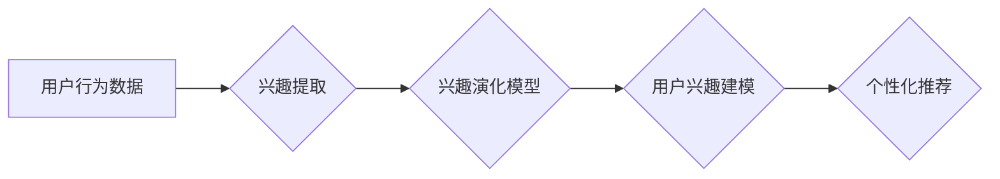

                 

## 搜索推荐系统的长期用户兴趣建模

> 关键词：搜索推荐系统、长期用户兴趣建模、兴趣演化、协同过滤、深度学习、用户画像、推荐算法

### 1. 背景介绍

在当今数据爆炸的时代，搜索推荐系统已成为用户获取信息、发现内容和进行决策的重要工具。传统的搜索推荐系统主要依赖于用户的短期行为，例如最近的搜索历史、点击记录等。然而，用户的兴趣并非静态的，会随着时间推移而发生变化和演化。因此，准确建模用户的长期兴趣对于提升搜索推荐系统的精准度和用户体验至关重要。

长期用户兴趣建模旨在捕捉用户的长期行为模式和兴趣偏好，并将其用于个性化推荐。这对于应对用户兴趣的多样性、动态性和复杂性具有重要意义。

### 2. 核心概念与联系

**2.1 核心概念**

* **用户兴趣:** 指用户对特定主题、产品、服务等事物的偏好和关注程度。
* **兴趣演化:** 用户兴趣随时间推移而发生变化的现象。
* **长期兴趣建模:** 通过分析用户的历史行为数据，构建用户长期兴趣的模型，并将其用于个性化推荐。

**2.2 架构图**



**2.3 联系**

用户行为数据是长期用户兴趣建模的基础。通过提取用户兴趣，并构建兴趣演化模型，可以对用户的长期兴趣进行建模，最终实现个性化推荐。

### 3. 核心算法原理 & 具体操作步骤

**3.1 算法原理概述**

长期用户兴趣建模算法主要分为以下几类：

* **基于内容的推荐算法:** 根据用户的历史行为数据，例如浏览记录、搜索历史等，推荐与用户兴趣相似的物品。
* **基于协同过滤的推荐算法:** 根据用户的行为相似性，推荐与相似用户喜欢的物品。
* **深度学习推荐算法:** 利用深度神经网络，学习用户兴趣的复杂特征，并进行个性化推荐。

**3.2 算法步骤详解**

以基于协同过滤的推荐算法为例，其具体操作步骤如下：

1. **数据收集:** 收集用户的历史行为数据，例如用户对物品的评分、点击记录、购买记录等。
2. **用户-物品矩阵构建:** 将用户和物品作为矩阵的行和列，将用户的行为数据填充到矩阵中。
3. **相似性计算:** 计算用户之间的相似度，例如使用余弦相似度、皮尔逊相关系数等。
4. **推荐生成:** 根据用户的相似用户，推荐与相似用户喜欢的物品。

**3.3 算法优缺点**

* **优点:** 能够捕捉用户的隐性兴趣，推荐更个性化的物品。
* **缺点:** 容易受到数据稀疏性的影响，对于新用户和新物品的推荐效果较差。

**3.4 算法应用领域**

* 电子商务平台
* 流媒体平台
* 社交网络平台

### 4. 数学模型和公式 & 详细讲解 & 举例说明

**4.1 数学模型构建**

基于协同过滤的推荐算法可以构建如下数学模型：

* **用户相似度矩阵:**  $S_{ui, uj}$ 表示用户 $u$ 和用户 $j$ 的相似度。
* **物品评分矩阵:** $R_{ui}$ 表示用户 $u$ 对物品 $i$ 的评分。
* **推荐评分:** $R_{uj}^{pred}$ 表示推荐给用户 $u$ 的物品 $j$ 的评分，可以计算为：

$$R_{uj}^{pred} = \sum_{i \in N(u)} S_{ui, uj} \cdot R_{ui}$$

其中，$N(u)$ 表示与用户 $u$ 相似的用户集合。

**4.2 公式推导过程**

推荐评分公式的推导过程如下：

1. 首先，我们假设用户 $u$ 和用户 $j$ 的兴趣相似，则用户 $u$ 对物品 $i$ 的评分 $R_{ui}$ 可以用来预测用户 $j$ 对物品 $i$ 的评分。
2. 由于用户之间的相似度不同，因此需要权衡每个相似用户的评分贡献。
3. 因此，我们可以使用用户相似度矩阵 $S_{ui, uj}$ 作为权重，将所有相似用户的评分加权平均，得到推荐评分 $R_{uj}^{pred}$。

**4.3 案例分析与讲解**

假设我们有一个用户-物品评分矩阵，其中用户 $u$ 和用户 $j$ 的相似度为 $0.8$，用户 $u$ 对物品 $i$ 的评分为 $4$，用户 $j$ 对物品 $i$ 的评分为 $3$。

根据公式，我们可以计算推荐评分：

$$R_{uj}^{pred} = 0.8 \cdot 4 + 0.2 \cdot 3 = 3.8$$

因此，我们可以推荐物品 $i$ 给用户 $j$，并预测其评分为 $3.8$。

### 5. 项目实践：代码实例和详细解释说明

**5.1 开发环境搭建**

* Python 3.x
* TensorFlow 或 PyTorch
* Scikit-learn

**5.2 源代码详细实现**

```python
import pandas as pd
from sklearn.metrics.pairwise import cosine_similarity

# 加载用户-物品评分数据
data = pd.read_csv('ratings.csv')

# 构建用户-物品矩阵
user_item_matrix = data.pivot_table(index='user_id', columns='item_id', values='rating')

# 计算用户相似度
user_similarity = cosine_similarity(user_item_matrix)

# 获取用户 $u$ 的相似用户
similar_users = user_similarity[0].argsort()[:-10:-1]

# 推荐物品给用户 $u$
recommended_items = []
for user in similar_users:
    for item in user_item_matrix.columns:
        if user_item_matrix.loc[user, item] > 0 and item not in recommended_items:
            recommended_items.append(item)

# 打印推荐结果
print(f'推荐给用户 {user_id} 的物品: {recommended_items}')
```

**5.3 代码解读与分析**

* 代码首先加载用户-物品评分数据，并构建用户-物品矩阵。
* 然后，使用余弦相似度计算用户之间的相似度。
* 接着，获取用户 $u$ 的相似用户，并根据相似用户的评分推荐物品给用户 $u$。

**5.4 运行结果展示**

运行代码后，将输出用户 $u$ 的推荐物品列表。

### 6. 实际应用场景

**6.1 电子商务平台**

* 推荐商品给用户，提高用户购买率。
* 个性化商品展示，提升用户体验。

**6.2 流媒体平台**

* 推荐视频给用户，提高用户观看时长。
* 个性化内容推荐，提升用户粘性。

**6.3 社交网络平台**

* 推荐好友给用户，拓展用户社交圈。
* 个性化内容推荐，提升用户活跃度。

**6.4 未来应用展望**

* 结合多模态数据，例如文本、图像、音频等，构建更全面的用户兴趣模型。
* 利用强化学习算法，优化推荐策略，提高推荐效果。
* 开发更智能的推荐系统，能够主动学习用户的兴趣变化，并提供更个性化的推荐。

### 7. 工具和资源推荐

**7.1 学习资源推荐**

* **书籍:**
    * 《推荐系统》 by  Koren, Yehuda
    * 《深度学习推荐系统》 by  Wang, Xiangnan
* **在线课程:**
    * Coursera: Recommender Systems
    * Udacity: Deep Learning for Recommender Systems

**7.2 开发工具推荐**

* **Python:** 
    * Scikit-learn
    * TensorFlow
    * PyTorch

**7.3 相关论文推荐**

* **协同过滤:**
    * "Collaborative Filtering: A User-Based Approach" by Goldberg, et al. (1992)
* **深度学习推荐:**
    * "Neural Collaborative Filtering" by He, et al. (2017)

### 8. 总结：未来发展趋势与挑战

**8.1 研究成果总结**

长期用户兴趣建模在搜索推荐系统中取得了显著进展，能够更好地捕捉用户的兴趣变化，并提供更个性化的推荐。

**8.2 未来发展趋势**

* 多模态数据融合
* 强化学习优化
* 个性化推荐策略

**8.3 面临的挑战**

* 数据稀疏性
* 冷启动问题
* 用户隐私保护

**8.4 研究展望**

未来，长期用户兴趣建模的研究将继续朝着更智能、更个性化、更安全的方向发展。


### 9. 附录：常见问题与解答

**9.1 如何处理数据稀疏性问题？**

数据稀疏性是协同过滤算法面临的常见问题。可以采用以下方法进行处理：

* 使用矩阵分解技术，将用户-物品矩阵分解成低维子空间，降低数据稀疏性。
* 使用混合推荐算法，结合内容推荐和协同过滤算法，提高推荐效果。

**9.2 如何解决冷启动问题？**

冷启动问题是指对于新用户和新物品的推荐效果较差。可以采用以下方法进行解决：

* 利用用户画像信息，例如用户年龄、性别、兴趣爱好等，进行推荐。
* 利用物品属性信息，例如物品类别、价格、描述等，进行推荐。
* 使用基于内容的推荐算法，推荐与用户兴趣相似的物品。


作者：禅与计算机程序设计艺术 / Zen and the Art of Computer Programming 
<end_of_turn>

