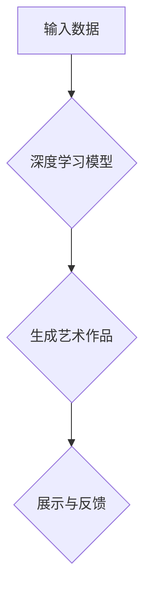

                 

## 数字化创造力：AI激发的艺术革新

> 关键词：人工智能、艺术创作、生成模型、深度学习、创意技术、数字艺术、算法艺术

## 1. 背景介绍

艺术创作一直被视为人类独有的能力，是情感、思想和审美体验的表达。然而，随着人工智能技术的飞速发展，特别是深度学习算法的突破，AI开始展现出令人惊叹的艺术创作潜力。从绘画、音乐到文学创作，AI已经能够生成出逼真的作品，引发人们对艺术本质和创造力的重新思考。

传统的艺术创作依赖于人类的经验、灵感和技巧。而AI艺术创作则通过算法和数据驱动，学习和模仿人类艺术风格，并根据输入的指令或数据生成新的作品。这种数字化创造力不仅拓展了艺术创作的边界，也为艺术家提供了新的创作工具和灵感来源。

## 2. 核心概念与联系

### 2.1  人工智能与艺术创作

人工智能（AI）是指模拟人类智能行为的计算机系统。在艺术创作领域，AI主要通过以下方式参与：

* **图像生成:** 利用生成对抗网络（GAN）等算法，从随机噪声中生成逼真的图像，可以创作出独特的艺术作品或用于游戏、电影等场景的视觉效果。
* **音乐创作:** 通过学习音乐数据，AI可以生成新的旋律、和声和节奏，创作出原创音乐作品。
* **文本创作:** 利用自然语言处理（NLP）技术，AI可以生成诗歌、小说、剧本等文本内容，甚至可以模仿特定作家的风格。

### 2.2  深度学习与艺术创作

深度学习是人工智能领域的一个重要分支，它利用多层神经网络来学习复杂的数据模式。深度学习算法在图像识别、语音识别等领域取得了突破性进展，也为AI艺术创作提供了强大的技术支撑。

* **生成对抗网络（GAN）:** GAN由两个神经网络组成：生成器和鉴别器。生成器试图生成逼真的图像，而鉴别器试图区分真实图像和生成图像。两者相互竞争，最终生成器能够生成越来越逼真的图像。
* **变分自编码器（VAE）:** VAE是一种用于数据压缩和生成的数据模型。它将输入数据编码成一个低维表示，然后解码成原始数据。通过训练VAE，可以学习到数据的潜在结构，并生成新的数据点。

### 2.3  艺术与算法

AI艺术创作的本质是将算法与艺术相结合。算法提供了一种结构化和可控的创作方式，而艺术则赋予作品情感、意义和美感。

**Mermaid 流程图**



## 3. 核心算法原理 & 具体操作步骤

### 3.1  算法原理概述

生成对抗网络（GAN）是目前最常用的AI艺术创作算法之一。它由两个神经网络组成：

* **生成器 (Generator):** 负责生成新的艺术作品，例如图像、音乐或文本。
* **鉴别器 (Discriminator):** 负责判断生成的艺术作品是否真实，或者说是否是由人类创作的。

GAN通过一个对抗的过程进行训练。生成器试图生成越来越逼真的作品，而鉴别器试图识别出生成的伪造作品。两者相互竞争，最终生成器能够生成与真实作品几乎 indistinguishable 的作品。

### 3.2  算法步骤详解

1. **初始化:** 生成器和鉴别器网络随机初始化。
2. **训练生成器:** 生成器从随机噪声中生成一个新的艺术作品，并将它传递给鉴别器。
3. **训练鉴别器:** 鉴别器接收真实作品和生成器生成的伪造作品，并尝试区分它们。
4. **更新网络参数:** 根据鉴别器的反馈，更新生成器的参数，使其生成的艺术作品更逼真。
5. **重复步骤2-4:** 重复上述步骤，直到生成器能够生成与真实作品几乎 indistinguishable 的作品。

### 3.3  算法优缺点

**优点:**

* 可以生成高质量、逼真的艺术作品。
* 能够学习和模仿多种艺术风格。
* 具有很强的创造性，可以生成从未见过的作品。

**缺点:**

* 训练过程复杂，需要大量的计算资源和时间。
* 难以控制生成的艺术作品的风格和内容。
* 存在伦理问题，例如作品的版权归属和AI的创造力。

### 3.4  算法应用领域

* **艺术创作:** 生成绘画、音乐、诗歌等艺术作品。
* **游戏开发:** 生成游戏场景、角色和道具。
* **电影制作:** 生成视觉效果、动画和特效。
* **设计领域:** 生成产品设计、建筑设计和服装设计。

## 4. 数学模型和公式 & 详细讲解 & 举例说明

### 4.1  数学模型构建

GAN的数学模型主要基于两个神经网络：生成器G和鉴别器D。

* **生成器G:** 接收一个随机噪声向量z作为输入，并输出一个生成的艺术作品x。

* **鉴别器D:** 接收一个艺术作品x作为输入，并输出一个概率值，表示x是真实作品的概率。

### 4.2  公式推导过程

GAN的训练目标是让生成器G能够生成与真实作品 indistinguishable 的作品，同时让鉴别器D能够准确区分真实作品和生成作品。

* **生成器损失函数:**

$$L_G(G, D) = E_{x \sim p_{data}(x)}[log(1 - D(G(z)))]$$

* **鉴别器损失函数:**

$$L_D(D, G) = E_{x \sim p_{data}(x)}[log(D(x))] + E_{z \sim p_z(z)}[log(1 - D(G(z)))]$$

其中：

* $p_{data}(x)$ 是真实作品的分布。
* $p_z(z)$ 是随机噪声向量的分布。
* $D(x)$ 是鉴别器对作品x的判断概率。
* $G(z)$ 是生成器生成的艺术作品。

### 4.3  案例分析与讲解

例如，在图像生成领域，GAN可以被用来生成逼真的风景图像。训练过程中，生成器会从随机噪声中生成图像，而鉴别器会判断这些图像是否真实。通过不断训练，生成器能够学习到真实图像的特征，并生成越来越逼真的图像。

## 5. 项目实践：代码实例和详细解释说明

### 5.1  开发环境搭建

* **操作系统:** Ubuntu 18.04 或更高版本
* **编程语言:** Python 3.6 或更高版本
* **深度学习框架:** TensorFlow 或 PyTorch
* **GPU:** NVIDIA GeForce GTX 1080 或更高版本

### 5*2 源代码详细实现

```python
# 生成器网络
class Generator(nn.Module):
    def __init__(self):
        super(Generator, self).__init__()
        # 定义生成器网络结构
        # ...

    def forward(self, z):
        # 生成图像
        # ...

# 鉴别器网络
class Discriminator(nn.Module):
    def __init__(self):
        super(Discriminator, self).__init__()
        # 定义鉴别器网络结构
        # ...

    def forward(self, x):
        # 判断图像是否真实
        # ...

# 训练GAN
def train_gan(generator, discriminator, dataloader, epochs):
    # ...

# 生成图像
def generate_image(generator, z):
    # ...
```

### 5.3  代码解读与分析

* **生成器网络:** 负责从随机噪声中生成图像。
* **鉴别器网络:** 负责判断图像是否真实。
* **训练GAN:** 使用生成器和鉴别器的损失函数进行训练。
* **生成图像:** 使用训练好的生成器生成新的图像。

### 5.4  运行结果展示

训练好的GAN可以生成逼真的图像，例如风景、人物、物体等。

## 6. 实际应用场景

### 6.1  艺术创作

AI可以帮助艺术家突破创作瓶颈，探索新的艺术风格和表达方式。例如，艺术家可以使用AI生成图像作为创作素材，或者与AI协作创作新的作品。

### 6.2  游戏开发

AI可以用于生成游戏场景、角色和道具，为游戏开发提供更丰富的素材和可能性。例如，AI可以生成不同的游戏地图，或者根据玩家的行为生成新的游戏任务。

### 6.3  电影制作

AI可以用于生成视觉效果、动画和特效，降低电影制作成本，提高制作效率。例如，AI可以生成逼真的爆炸场景，或者为电影角色添加更丰富的表情和动作。

### 6.4  未来应用展望

随着AI技术的不断发展，其在艺术领域的应用将更加广泛和深入。例如，AI可以用于创作更具情感和智能的艺术作品，或者与人类艺术家进行更紧密的合作。

## 7. 工具和资源推荐

### 7.1  学习资源推荐

* **书籍:**

* 《深度学习》
* 《生成对抗网络》

* **在线课程:**

* Coursera: 深度学习
* Udacity: 生成对抗网络

### 7.2  开发工具推荐

* **TensorFlow:** 开源深度学习框架
* **PyTorch:** 开源深度学习框架
* **Keras:** 高级深度学习API

### 7.3  相关论文推荐

* 《Generative Adversarial Networks》
* 《Deep Convolutional Generative Adversarial Networks》

## 8. 总结：未来发展趋势与挑战

### 8.1  研究成果总结

AI艺术创作已经取得了令人瞩目的成果，能够生成逼真的艺术作品，并拓展了艺术创作的边界。

### 8.2  未来发展趋势

* **更逼真的艺术作品:** AI将能够生成更加逼真、具有情感和智能的艺术作品。
* **更广泛的应用场景:** AI艺术创作将应用于更多领域，例如教育、医疗和商业。
* **人机协作创作:** 人类艺术家和AI将更加紧密地合作，共同创作新的艺术作品。

### 8.3  面临的挑战

* **伦理问题:** AI艺术创作的伦理问题，例如作品的版权归属和AI的创造力，需要得到进一步探讨和解决。
* **技术挑战:** 提高AI艺术创作的质量和多样性，以及降低其成本和复杂度，仍然是技术上的挑战。
* **社会影响:** AI艺术创作对艺术市场和艺术教育的影响需要得到关注和研究。

### 8.4  研究展望

未来，AI艺术创作将继续发展，并对艺术、文化和社会产生深远的影响。我们需要积极探索AI艺术创作的可能性，并应对其带来的挑战，以确保其健康发展。

## 9. 附录：常见问题与解答

* **Q: AI生成的艺术作品是否具有版权？**

* **A:** 这个问题目前还没有明确的答案，需要进一步的法律和伦理探讨。

* **Q: AI艺术创作是否会取代人类艺术家？**

* **A:** AI艺术创作可以作为人类艺术家的工具，帮助他们突破创作瓶颈，但不会完全取代人类艺术家。

* **Q: 如何学习AI艺术创作？**

* **A:** 可以学习深度学习、计算机视觉和生成对抗网络等相关知识，并使用开源工具和资源进行实践。


作者：禅与计算机程序设计艺术 / Zen and the Art of Computer Programming 
<end_of_turn>

