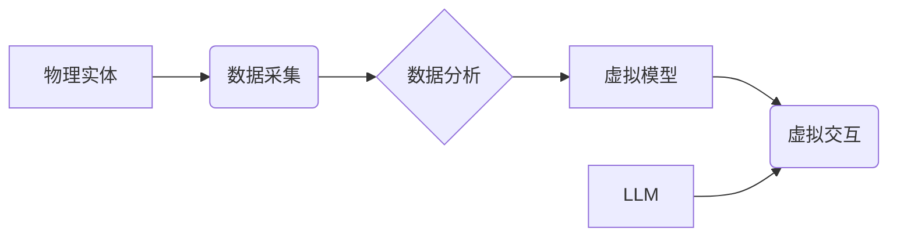

                 

## 数字孪生与LLM：虚拟世界模拟的新维度

> 关键词：数字孪生、LLM、虚拟世界、模拟、人工智能、深度学习、数据驱动

## 1. 背景介绍

数字孪生技术近年来发展迅速，它以虚拟模型模拟现实世界实体，并通过数据交互实现实时状态同步和预测分析。而大型语言模型（LLM）则凭借其强大的文本处理能力，在自然语言理解、生成和对话等领域取得了突破性进展。将这两项前沿技术结合，可以构建更智能、更具交互性的虚拟世界模拟平台，为各个行业带来全新的应用场景。

传统虚拟世界模拟主要依赖于预设的规则和脚本，缺乏灵活性，难以应对复杂、动态变化的现实世界。数字孪生技术的引入，可以打破这一局限性，通过实时数据采集和分析，使虚拟世界更加真实、动态。而LLM的加入则赋予虚拟世界更强的智能和交互能力，使其能够理解和响应用户的自然语言指令，实现更逼真的模拟体验。

## 2. 核心概念与联系

### 2.1 数字孪生

数字孪生是指利用物理世界实体的数字化模型，通过数据采集、分析和反馈，实现与物理世界实时同步和交互的虚拟系统。它包含以下关键要素：

* **物理实体：** 真实世界中的物理对象，例如机器、设备、建筑物等。
* **虚拟模型：** 物理实体的数字化模型，包含其结构、功能、性能等信息。
* **数据采集：** 从物理实体收集各种传感器数据，例如温度、压力、位置等。
* **数据分析：** 对收集到的数据进行分析，识别模式、预测趋势，并生成决策支持信息。
* **虚拟交互：** 通过虚拟模型与用户进行交互，例如模拟操作、进行预测分析等。

### 2.2 LLM

大型语言模型（LLM）是一种基于深度学习的强大人工智能模型，能够理解和生成人类语言。其核心特点包括：

* **规模庞大：** LLM拥有数亿甚至数十亿个参数，能够学习和处理海量文本数据。
* **文本理解能力强：** LLM能够理解复杂的语法结构、语义关系和上下文信息。
* **文本生成能力强：** LLM能够生成流畅、自然的文本，例如文章、对话、代码等。
* **多任务学习能力：** LLM能够在多种自然语言任务上表现出色，例如翻译、问答、摘要等。

### 2.3 数字孪生与LLM的结合

将数字孪生与LLM结合，可以构建更智能、更具交互性的虚拟世界模拟平台。LLM可以赋予虚拟世界更强的智能和交互能力，例如：

* **自然语言交互：** 用户可以使用自然语言与虚拟世界进行交互，例如询问信息、发出指令等。
* **智能模拟：** LLM可以根据用户输入和虚拟世界状态，进行智能模拟和预测分析。
* **个性化体验：** LLM可以根据用户的喜好和需求，定制个性化的虚拟世界体验。

**Mermaid 流程图**



## 3. 核心算法原理 & 具体操作步骤

### 3.1 算法原理概述

数字孪生与LLM的结合主要依赖于以下核心算法：

* **数据采集和预处理：** 从物理实体收集各种传感器数据，并进行清洗、转换、格式化等预处理操作。
* **虚拟模型构建：** 基于物理实体的结构、功能和性能信息，构建其数字化模型，并将其与数据采集系统连接。
* **LLM训练和部署：** 使用海量文本数据训练LLM模型，并将其部署到虚拟世界平台上。
* **自然语言理解和生成：** LLM可以理解用户的自然语言指令，并生成相应的虚拟世界操作指令。
* **虚拟世界模拟和反馈：** 根据LLM生成的指令，虚拟世界进行模拟操作，并反馈模拟结果给用户。

### 3.2 算法步骤详解

1. **数据采集和预处理：** 从物理实体收集各种传感器数据，例如温度、压力、位置等。对收集到的数据进行清洗、转换、格式化等预处理操作，使其能够被虚拟模型和LLM模型理解。
2. **虚拟模型构建：** 基于物理实体的结构、功能和性能信息，构建其数字化模型。虚拟模型可以包含实体的几何形状、物理属性、行为规则等信息。
3. **LLM训练和部署：** 使用海量文本数据训练LLM模型，例如维基百科、书籍、代码等。训练完成后，将LLM模型部署到虚拟世界平台上。
4. **用户交互：** 用户可以通过自然语言与虚拟世界进行交互，例如询问信息、发出指令等。
5. **自然语言理解：** LLM模型接收用户的自然语言指令，并将其解析为虚拟世界可执行的指令。
6. **虚拟世界模拟：** 根据LLM生成的指令，虚拟世界进行模拟操作，例如改变实体状态、触发事件等。
7. **反馈结果：** 虚拟世界模拟的结果反馈给用户，例如文本、图像、音频等。

### 3.3 算法优缺点

**优点：**

* **智能化：** LLM赋予虚拟世界更强的智能和交互能力，能够理解和响应用户的自然语言指令。
* **真实性：** 数字孪生技术可以使虚拟世界更加真实、动态，能够模拟现实世界的复杂性和变化性。
* **可扩展性：** 数字孪生平台可以扩展到多个实体和场景，实现跨领域、跨行业的应用。

**缺点：**

* **数据依赖：** 数字孪生和LLM模型都需要大量数据进行训练和运行，数据质量和数量直接影响模型性能。
* **计算资源需求：** 训练和运行大型LLM模型需要大量的计算资源，成本较高。
* **伦理问题：** 虚拟世界模拟的真实性可能会引发伦理问题，例如虚假信息传播、隐私泄露等。

### 3.4 算法应用领域

数字孪生与LLM的结合可以应用于多个领域，例如：

* **制造业：** 模拟生产线运行，预测设备故障，优化生产流程。
* **医疗保健：** 模拟人体器官功能，辅助医生诊断和治疗疾病。
* **城市规划：** 模拟城市交通、环境等情况，优化城市规划方案。
* **教育培训：** 创建沉浸式虚拟学习环境，提高学习效果。
* **娱乐游戏：** 开发更逼真的虚拟游戏体验。

## 4. 数学模型和公式 & 详细讲解 & 举例说明

### 4.1 数学模型构建

数字孪生与LLM的结合可以构建以下数学模型：

* **状态转移模型：** 描述虚拟世界实体的状态随时间变化的规律，例如物理状态、行为状态等。
* **预测模型：** 基于历史数据和当前状态，预测虚拟世界实体未来的状态，例如设备故障概率、交通流量预测等。
* **交互模型：** 描述用户与虚拟世界实体的交互方式，例如自然语言指令、虚拟操作等。

### 4.2 公式推导过程

状态转移模型可以采用马尔可夫链模型，其状态转移概率可以由以下公式计算：

$$P(s_t|s_{t-1}) = \frac{e^{w_s \cdot h_t}}{Z}$$

其中：

* $s_t$ 表示虚拟世界实体在时间 $t$ 的状态。
* $s_{t-1}$ 表示虚拟世界实体在时间 $t-1$ 的状态。
* $w_s$ 是状态转移权重向量。
* $h_t$ 是时间 $t$ 的状态特征向量。
* $Z$ 是归一化因子。

### 4.3 案例分析与讲解

例如，模拟一个工厂生产线的运行状态，可以构建一个状态转移模型，其中每个状态代表生产线的运行状态，例如正常运行、设备故障、停机等。根据历史数据和当前状态，可以预测生产线的未来状态，并采取相应的措施，例如提前维修设备、调整生产计划等。

## 5. 项目实践：代码实例和详细解释说明

### 5.1 开发环境搭建

* **操作系统：** Ubuntu 20.04 LTS
* **编程语言：** Python 3.8
* **深度学习框架：** TensorFlow 2.x
* **虚拟环境：** conda

### 5.2 源代码详细实现

```python
# 导入必要的库
import tensorflow as tf

# 定义状态转移模型
class StateTransitionModel(tf.keras.Model):
    def __init__(self, num_states, embedding_dim):
        super(StateTransitionModel, self).__init__()
        self.embedding = tf.keras.layers.Embedding(num_states, embedding_dim)
        self.dense = tf.keras.layers.Dense(num_states, activation='softmax')

    def call(self, inputs):
        embedded = self.embedding(inputs)
        output = self.dense(embedded)
        return output

# 训练状态转移模型
model = StateTransitionModel(num_states=10, embedding_dim=64)
model.compile(optimizer='adam', loss='sparse_categorical_crossentropy')
# ... 训练代码 ...

# 使用训练好的模型预测未来状态
future_state = model.predict(current_state)
```

### 5.3 代码解读与分析

* **StateTransitionModel类：** 定义了状态转移模型的结构，包含嵌入层和全连接层。
* **embedding层：** 将状态编码为向量表示。
* **dense层：** 计算状态转移概率。
* **predict方法：** 使用训练好的模型预测未来状态。

### 5.4 运行结果展示

训练完成后，可以使用模型预测未来状态，例如预测生产线在未来一段时间内的运行状态。

## 6. 实际应用场景

### 6.1 制造业

数字孪生与LLM可以应用于制造业的各个环节，例如：

* **设备预测维护：** 通过分析设备运行数据，预测设备故障概率，提前进行维护，降低设备故障率和维修成本。
* **生产线优化：** 模拟生产线运行，优化生产流程，提高生产效率和产品质量。
* **虚拟仿真培训：** 创建虚拟仿真环境，进行设备操作和故障处理的培训，提高员工技能水平。

### 6.2 医疗保健

数字孪生与LLM可以应用于医疗保健领域，例如：

* **虚拟人体模型：** 创建虚拟人体模型，模拟人体器官功能，辅助医生诊断和治疗疾病。
* **个性化医疗方案：** 根据患者的基因信息、生活习惯等数据，制定个性化的医疗方案。
* **远程医疗：** 利用虚拟世界平台，实现远程医疗咨询和诊断。

### 6.3 城市规划

数字孪生与LLM可以应用于城市规划领域，例如：

* **交通流量预测：** 模拟城市交通情况，预测交通流量，优化交通信号灯控制策略。
* **环境模拟：** 模拟城市环境变化，预测空气质量、水质等情况，制定环境保护方案。
* **城市规划决策支持：** 为城市规划决策提供数据支持，例如规划新建筑、道路等。

### 6.4 未来应用展望

数字孪生与LLM的结合将带来更多新的应用场景，例如：

* **虚拟现实游戏：** 开发更逼真的虚拟现实游戏体验，例如沉浸式角色扮演游戏、虚拟社交平台等。
* **教育培训：** 创建沉浸式虚拟学习环境，提高学习效果，例如虚拟实验室、虚拟博物馆等。
* **科学研究：** 模拟复杂系统，例如气候变化、疾病传播等，进行科学研究。

## 7. 工具和资源推荐

### 7.1 学习资源推荐

* **书籍：**
    * 《数字孪生：构建虚拟世界模拟平台》
    * 《深度学习》
* **在线课程：**
    * Coursera：深度学习课程
    * edX：数字孪生课程
* **开源项目：**
    * TensorFlow
    * PyTorch

### 7.2 开发工具推荐

* **编程语言：** Python
* **深度学习框架：** TensorFlow, PyTorch
* **虚拟化平台：** VMware, VirtualBox
* **数据可视化工具：** Tableau, Power BI

### 7.3 相关论文推荐

* 《数字孪生：概念、架构和应用》
* 《大型语言模型：进展和挑战》
* 《数字孪生与人工智能：未来趋势》

## 8. 总结：未来发展趋势与挑战

### 8.1 研究成果总结

数字孪生与LLM的结合为虚拟世界模拟带来了新的突破，赋予虚拟世界更强的智能和交互能力，并拓展了虚拟世界应用场景。

### 8.2 未来发展趋势

* **模型更加智能：** 未来LLM模型将更加智能，能够理解更复杂的自然语言指令，并进行更精细的虚拟世界操作。
* **应用场景更加广泛：** 数字孪生与LLM的结合将应用于更多领域，例如教育、娱乐、科学研究等。
* **技术更加成熟：** 数字孪生与LLM相关的技术将更加成熟，成本将更加降低，应用门槛将更加降低。

### 8.3 面临的挑战

* **数据安全和隐私保护：** 数字孪生平台需要收集大量数据，如何保证数据安全和隐私保护是一个重要的挑战。
* **模型解释性和可信度：** LLM模型的决策过程往往是复杂的，如何提高模型的解释性和可信度是一个重要的研究方向。
* **伦理问题：** 虚拟世界模拟的真实性可能会引发伦理问题，例如虚假信息传播、隐私泄露等，需要制定相应的伦理规范和法律法规。

### 8.4 研究展望

未来，数字孪生与LLM将继续发展，并带来更多新的应用场景和技术突破。研究者需要关注以下几个方面：

* **开发更智能、更安全的LLM模型。**
* **探索数字孪生与LLM在更多领域的应用。**
* **制定相应的伦理规范和法律法规，引导数字孪生与LLM技术健康发展。**

## 9. 附录：常见问题与解答

**Q1：数字孪生与虚拟现实有什么区别？**

**A1：** 数字孪生和虚拟现实都是模拟现实世界的技术，但它们侧重点不同。数字孪生侧重于模拟实体的物理状态和行为，并通过数据分析进行预测和优化。而虚拟现实则侧重于创造沉浸式的虚拟体验，用户可以身临其境地体验虚拟世界。

**Q2：数字孪生与LLM的结合需要哪些技术？**

**A2：** 数字孪生与LLM的结合需要以下技术：

* **数据采集和处理技术：** 收集实体数据并进行预处理。
* **虚拟模型构建技术：** 建立实体的数字化模型。
* **深度学习技术：** 训练和部署LLM模型。
* **交互技术：** 实现用户与虚拟世界的交互。

**Q3：数字孪生与LLM有哪些伦理问题？**

**A3：** 数字孪生与LLM的结合可能引发以下伦理问题：

* **虚假信息传播：** 虚拟世界模拟的真实性可能会导致虚假信息传播。
* **隐私泄露：** 数字孪生平台需要收集大量数据，如何保护用户隐私是一个重要问题。
* **算法偏见：** LLM模型的训练数据可能存在偏见，导致虚拟世界模拟存在偏见。


作者：禅与计算机程序设计艺术 / Zen and the Art of Computer Programming<end_of_turn>

