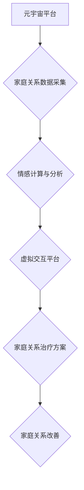

                 

## 数字家庭关系治疗:元宇宙时代的家庭和谐之道

> 关键词：元宇宙、家庭关系、人工智能、情感计算、虚拟现实、数字孪生、协作学习

## 1. 背景介绍

现代社会，科技发展日新月异，元宇宙概念的兴起为人们的生活方式和社会结构带来了前所未有的变革。元宇宙，一个融合虚拟现实、增强现实、人工智能等技术的沉浸式数字世界，正在逐渐渗透到我们的日常生活，包括家庭关系。然而，元宇宙的出现也带来了新的挑战，例如虚拟与现实的界限模糊、虚拟社交的依赖性增强、数字身份的隐私安全等问题。

家庭关系是人类社会最基础的组织形式，其和谐稳定关系着个体心理健康和社会稳定发展。随着元宇宙的普及，家庭成员在虚拟世界中的互动方式和关系模式将发生深刻变化。如何利用元宇宙技术促进家庭关系和谐发展，成为一个值得深入探讨的课题。

## 2. 核心概念与联系

### 2.1 元宇宙与家庭关系

元宇宙是一个虚拟世界，它可以提供沉浸式的体验，让用户在虚拟空间中进行社交、娱乐、学习等活动。对于家庭关系而言，元宇宙可以提供以下几个方面的联系：

* **虚拟共享空间:** 元宇宙可以为家庭成员提供一个虚拟的共享空间，即使身处不同地点，也能随时随地进行互动交流。
* **虚拟共同体验:** 元宇宙可以提供各种虚拟体验，例如虚拟旅行、虚拟游戏等，让家庭成员共同参与，增进情感连接。
* **虚拟角色扮演:** 元宇宙可以允许用户创建虚拟角色，扮演不同的角色，体验不同的生活场景，从而帮助家庭成员更好地理解彼此，提升沟通技巧。

### 2.2 数字家庭关系治疗

数字家庭关系治疗是指利用数字技术，例如人工智能、虚拟现实等，来帮助家庭成员改善家庭关系的治疗方法。它可以帮助家庭成员：

* **识别问题:** 通过数据分析和情感计算，识别家庭关系中的问题和冲突点。
* **提升沟通:** 提供虚拟平台和工具，帮助家庭成员进行更有效的沟通和表达。
* **增强理解:** 通过虚拟角色扮演和模拟场景，帮助家庭成员更好地理解彼此的感受和需求。
* **重建信任:** 通过虚拟互动和共同体验，帮助家庭成员重建信任和亲密关系。

### 2.3 核心架构



## 3. 核心算法原理 & 具体操作步骤

### 3.1 算法原理概述

数字家庭关系治疗的核心算法基于情感计算和机器学习技术。

* **情感计算:** 通过分析文本、语音、表情等数据，识别和理解用户的感情状态。
* **机器学习:** 利用历史数据训练模型，预测用户行为和情绪变化，并提供个性化的治疗方案。

### 3.2 算法步骤详解

1. **数据采集:** 收集家庭成员的虚拟交互数据，例如聊天记录、游戏行为、虚拟表情等。
2. **数据预处理:** 对收集到的数据进行清洗、格式化和转换，以便于后续分析。
3. **情感分析:** 利用情感计算模型，分析用户的文本、语音和表情数据，识别用户的感情状态。
4. **关系建模:** 建立家庭成员之间的关系模型，例如亲属关系、朋友关系、合作关系等。
5. **问题识别:** 通过分析情感数据和关系模型，识别家庭关系中的问题和冲突点。
6. **方案推荐:** 根据问题的类型和家庭成员的特点，推荐个性化的治疗方案。
7. **虚拟交互:** 利用虚拟现实技术，提供虚拟平台和工具，帮助家庭成员进行互动交流和体验。
8. **方案评估:** 评估治疗方案的效果，并根据反馈进行调整和优化。

### 3.3 算法优缺点

**优点:**

* **客观的分析:** 利用数据分析和算法模型，客观地识别家庭关系问题。
* **个性化的治疗:** 根据家庭成员的特点和需求，提供个性化的治疗方案。
* **虚拟安全的体验:** 在虚拟环境中进行互动交流，可以降低现实世界中的压力和顾虑。

**缺点:**

* **数据隐私:** 收集和分析家庭成员的数据，需要考虑数据隐私和安全问题。
* **算法偏差:** 算法模型可能存在偏差，导致治疗方案不准确或不适用。
* **人机交互:** 虚拟交互体验可能无法完全替代现实世界的人际交往。

### 3.4 算法应用领域

数字家庭关系治疗算法可以应用于以下领域:

* **家庭咨询:** 为家庭提供线上线下结合的咨询服务，帮助解决家庭关系问题。
* **教育培训:** 为青少年提供家庭关系教育和培训，帮助他们建立健康的人际关系。
* **医疗保健:** 为患有心理疾病的家庭成员提供虚拟治疗服务，帮助他们改善家庭关系。

## 4. 数学模型和公式 & 详细讲解 & 举例说明

### 4.1 数学模型构建

数字家庭关系治疗的数学模型可以基于以下几个方面构建:

* **情感状态模型:** 利用情感词典和机器学习算法，构建情感状态模型，将用户的文本、语音和表情数据映射到情感状态向量。
* **关系强度模型:** 利用社交网络分析和机器学习算法，构建关系强度模型，量化家庭成员之间的关系强度。
* **冲突预测模型:** 利用时间序列分析和机器学习算法，构建冲突预测模型，预测家庭成员之间的冲突可能性。

### 4.2 公式推导过程

**情感状态向量:**

假设用户表达的情感类型为：快乐、悲伤、愤怒、恐惧、惊喜。可以将用户的文本、语音和表情数据映射到一个5维的情感状态向量，例如：

```latex
E = [e_1, e_2, e_3, e_4, e_5]
```

其中，$e_i$ 代表用户在第i种情感类型上的强度，取值范围为0到1。

**关系强度模型:**

可以利用社交网络分析中的PageRank算法，计算家庭成员之间的关系强度。

**冲突预测模型:**

可以利用时间序列分析中的ARIMA模型，预测家庭成员之间的冲突可能性。

### 4.3 案例分析与讲解

假设一个家庭成员在虚拟聊天中表达了悲伤的情绪，并且与其他家庭成员的关系强度较低。根据情感状态模型和关系强度模型，可以预测该家庭成员可能面临情绪问题，需要进行情感支持。

## 5. 项目实践：代码实例和详细解释说明

### 5.1 开发环境搭建

* 操作系统: Windows/macOS/Linux
* 编程语言: Python
* 框架: TensorFlow/PyTorch
* 工具: Jupyter Notebook/VS Code

### 5.2 源代码详细实现

```python
# 情感分析模型
import tensorflow as tf

# 加载预训练模型
model = tf.keras.models.load_model('emotion_model.h5')

# 预处理文本数据
def preprocess_text(text):
  # ...

# 预测情感状态
def predict_emotion(text):
  processed_text = preprocess_text(text)
  prediction = model.predict(processed_text)
  return prediction

# 关系强度模型
import networkx as nx

# 创建社交网络图
graph = nx.Graph()
# 添加节点和边
# ...

# 计算关系强度
def calculate_relationship_strength(node1, node2):
  # ...

# 冲突预测模型
import statsmodels.tsa.arima.model as arima

# 加载历史数据
data = pd.read_csv('conflict_data.csv')

# 训练ARIMA模型
model = arima.ARIMA(data['conflict_score'], order=(5,1,0))
model_fit = model.fit()

# 预测未来冲突可能性
def predict_conflict_score(date):
  # ...

```

### 5.3 代码解读与分析

* 情感分析模型: 利用预训练的深度学习模型，对用户的文本数据进行情感分析，识别用户的感情状态。
* 关系强度模型: 利用社交网络分析中的PageRank算法，计算家庭成员之间的关系强度。
* 冲突预测模型: 利用时间序列分析中的ARIMA模型，预测家庭成员之间的冲突可能性。

### 5.4 运行结果展示

运行上述代码，可以得到以下结果:

* 用户的感情状态向量
* 家庭成员之间的关系强度
* 家庭成员之间的冲突可能性

## 6. 实际应用场景

### 6.1 家庭咨询平台

数字家庭关系治疗可以应用于家庭咨询平台，为家庭提供线上线下结合的咨询服务。

### 6.2 教育培训平台

数字家庭关系治疗可以应用于教育培训平台，为青少年提供家庭关系教育和培训，帮助他们建立健康的人际关系。

### 6.3 虚拟现实游戏

数字家庭关系治疗可以应用于虚拟现实游戏，通过虚拟角色扮演和模拟场景，帮助玩家体验不同的家庭关系模式，提升沟通技巧。

### 6.4 未来应用展望

随着元宇宙技术的不断发展，数字家庭关系治疗将有更广泛的应用场景，例如:

* **虚拟家庭模拟:** 为家庭成员提供虚拟家庭模拟环境，帮助他们更好地理解彼此，提升家庭关系和谐度。
* **跨时空家庭互动:** 利用元宇宙技术，实现跨时空的家庭互动，即使身处不同地点，也能随时随地与家人进行交流。
* **个性化家庭关系治疗:** 利用人工智能和机器学习技术，为每个家庭提供个性化的治疗方案，帮助他们解决家庭关系问题。

## 7. 工具和资源推荐

### 7.1 学习资源推荐

* **书籍:**

    * 《情感计算》
    * 《机器学习》
    * 《元宇宙》

* **在线课程:**

    * Coursera: 情感计算与分析
    * edX: 机器学习
    * Udemy: 元宇宙开发

### 7.2 开发工具推荐

* **编程语言:** Python
* **框架:** TensorFlow/PyTorch
* **虚拟现实平台:** Unity/Unreal Engine
* **社交网络分析工具:** NetworkX

### 7.3 相关论文推荐

* **情感计算:**

    * "Sentiment Analysis and Opinion Mining"
    * "Emotion Recognition from Text"

* **机器学习:**

    * "Machine Learning: A Probabilistic Perspective"
    * "Deep Learning"

* **元宇宙:**

    * "The Metaverse: A New Frontier for Human Interaction"
    * "Building the Metaverse: A Technical Perspective"

## 8. 总结：未来发展趋势与挑战

### 8.1 研究成果总结

数字家庭关系治疗是一个新兴的领域，近年来取得了显著的进展。情感计算、机器学习和虚拟现实技术的不断发展，为数字家庭关系治疗提供了强大的技术支撑。

### 8.2 未来发展趋势

* **更精准的预测:** 利用更先进的机器学习算法，提高家庭关系问题和冲突预测的精准度。
* **更个性化的治疗:** 利用人工智能技术，为每个家庭提供个性化的治疗方案，提升治疗效果。
* **更沉浸式的体验:** 利用虚拟现实技术，打造更沉浸式的虚拟家庭环境，提升用户体验。

### 8.3 面临的挑战

* **数据隐私:** 收集和分析家庭成员的数据，需要考虑数据隐私和安全问题。
* **算法偏差:** 算法模型可能存在偏差，导致治疗方案不准确或不适用。
* **人机交互:** 虚拟交互体验可能无法完全替代现实世界的人际交往。

### 8.4 研究展望

数字家庭关系治疗是一个充满挑战和机遇的领域，未来研究方向包括:

* **开发更安全可靠的数据处理和分析方法。**
* **构建更准确、更鲁棒的算法模型。**
* **探索更有效的虚拟交互方式，提升用户体验。**


## 9. 附录：常见问题与解答

**Q1: 数字家庭关系治疗是否会取代传统的家庭咨询？**

**A1:** 数字家庭关系治疗可以作为一种补充手段，帮助家庭成员更好地了解彼此，提升沟通技巧。但它并不能完全取代传统的家庭咨询，因为家庭关系问题往往需要专业的咨询师进行面对面的沟通和引导。

**Q2: 数字家庭关系治疗的数据安全如何保障？**

**A2:** 数字家庭关系治疗平台需要采取严格的数据安全措施，例如加密传输、数据匿名化等，确保用户数据的安全和隐私。

**Q3: 数字家庭关系治疗的成本如何？**

**A3:** 数字家庭关系治疗的成本取决于具体的平台和服务内容，一般来说，比传统的家庭咨询费用更低。

**Q4: 数字家庭关系治疗的效果如何？**

**A4:** 数字家庭关系治疗的效果因人而异，但一些研究表明，它可以有效地帮助家庭成员改善家庭关系。

**Q5: 如何选择合适的数字家庭关系治疗平台？**

**A5:** 选择数字家庭关系治疗平台时，需要考虑以下因素：

* 平台的安全性
* 平台的功能
* 平台的口碑
* 平台的费用


作者：禅与计算机程序设计艺术 / Zen and the Art of Computer Programming 
<end_of_turn>

