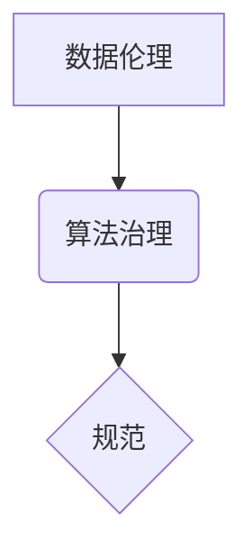

                 

## 数据伦理：算法治理与规范

> 关键词：数据伦理、算法治理、规范、公平性、透明度、可解释性、隐私保护

### 1. 背景介绍

随着人工智能（AI）技术的飞速发展，算法在各个领域扮演着越来越重要的角色，从医疗诊断到金融决策，从自动驾驶到社交推荐，算法的影响力无处不在。然而，算法的强大也带来了新的伦理挑战。数据驱动的算法可能存在偏见、歧视和不透明性，从而导致社会不公、侵犯隐私和损害个人利益。因此，建立健全的算法治理体系，规范算法的开发、应用和监管，成为当今社会面临的 pressing 问题。

### 2. 核心概念与联系

**2.1 数据伦理**

数据伦理是指在收集、使用、存储和共享数据时，遵循道德原则和社会规范，确保数据的使用符合伦理标准和社会价值观。

**2.2 算法治理**

算法治理是指对算法的开发、部署和使用进行规范和管理，以确保算法的公平、透明、可解释、安全和可控。

**2.3 规范**

规范是指为算法治理提供指导和约束的规则、标准和原则。

**2.4 关系图**



**2.5 核心概念联系**

数据伦理是算法治理的基石，它为算法治理提供了道德和价值观的指导。算法治理则通过制定规范，将数据伦理原则转化为可操作的规则和标准，从而确保算法的开发和应用符合伦理规范。

### 3. 核心算法原理 & 具体操作步骤

**3.1 算法原理概述**

本节将介绍一种常用的算法，例如决策树算法，并阐述其原理。

决策树算法是一种监督学习算法，用于分类或回归问题。它通过构建一颗树状结构来模拟人类的决策过程，每个节点代表一个特征，每个分支代表一个特征的取值，每个叶子节点代表一个类别或预测值。

**3.2 算法步骤详解**

1. 选择最优特征作为根节点，该特征应该能够最大程度地划分数据。
2. 对于每个特征的取值，创建分支，将数据划分到不同的子集。
3. 对于每个子集，重复步骤1和2，直到满足停止条件，例如达到最大深度或所有数据点都属于同一类别。
4. 将决策树转换为规则，用于预测新数据。

**3.3 算法优缺点**

**优点：**

* 易于理解和解释。
* 可以处理分类和回归问题。
* 对缺失值和异常值有一定的鲁棒性。

**缺点：**

* 容易过拟合，导致泛化能力差。
* 对数据特征的顺序敏感。
* 对于高维数据，树的深度可能过长，导致计算复杂度高。

**3.4 算法应用领域**

决策树算法广泛应用于各个领域，例如：

* 医疗诊断
* 欺诈检测
* 客户关系管理
* 市场营销

### 4. 数学模型和公式 & 详细讲解 & 举例说明

**4.1 数学模型构建**

决策树算法的构建可以看作是一个递归的过程，每个节点的决策基于特征的取值和数据分布。

**4.2 公式推导过程**

决策树算法的构建通常使用信息增益或基尼系数等指标来选择最优特征。

* **信息增益:**

$$
Gain(S,A) = Entropy(S) - \sum_{v \in Values(A)} \frac{|S_v|}{|S|} Entropy(S_v)
$$

其中：

* $S$ 是数据集
* $A$ 是特征
* $Values(A)$ 是特征 $A$ 的所有取值
* $S_v$ 是特征 $A$ 取值为 $v$ 的子集
* $Entropy(S)$ 是数据集 $S$ 的熵

* **基尼系数:**

$$
Gini(S) = 1 - \sum_{i=1}^{k} p_i^2
$$

其中：

* $k$ 是类别数
* $p_i$ 是类别 $i$ 的概率

**4.3 案例分析与讲解**

假设我们有一个数据集，用于预测客户是否会购买产品。特征包括年龄、收入和购买历史。我们可以使用信息增益或基尼系数来选择最优特征作为根节点。例如，如果年龄特征的信息增益最大，那么我们将使用年龄特征作为根节点，将数据划分成不同年龄组。

### 5. 项目实践：代码实例和详细解释说明

**5.1 开发环境搭建**

本节将使用 Python 语言和 scikit-learn 库来实现决策树算法。

**5.2 源代码详细实现**

```python
from sklearn.tree import DecisionTreeClassifier
from sklearn.model_selection import train_test_split
from sklearn.metrics import accuracy_score

# 加载数据集
# ...

# 将数据划分为训练集和测试集
X_train, X_test, y_train, y_test = train_test_split(X, y, test_size=0.2, random_state=42)

# 创建决策树模型
model = DecisionTreeClassifier()

# 训练模型
model.fit(X_train, y_train)

# 预测测试集
y_pred = model.predict(X_test)

# 计算准确率
accuracy = accuracy_score(y_test, y_pred)
print(f"准确率: {accuracy}")
```

**5.3 代码解读与分析**

* `DecisionTreeClassifier()` 创建决策树模型。
* `train_test_split()` 将数据划分为训练集和测试集。
* `fit()` 训练模型。
* `predict()` 预测测试集。
* `accuracy_score()` 计算准确率。

**5.4 运行结果展示**

运行代码后，将输出模型的准确率。

### 6. 实际应用场景

**6.1 医疗诊断**

决策树算法可以用于分析患者的症状、病史和检查结果，预测疾病的可能性。

**6.2 欺诈检测**

决策树算法可以用于分析交易数据，识别异常交易，从而预防欺诈行为。

**6.3 客户关系管理**

决策树算法可以用于分析客户的行为和偏好，进行个性化营销和客户服务。

**6.4 未来应用展望**

随着人工智能技术的不断发展，决策树算法将在更多领域得到应用，例如自动驾驶、机器人控制和个性化教育。

### 7. 工具和资源推荐

**7.1 学习资源推荐**

* **书籍:**

    * 《机器学习》 - 周志华
    * 《Python机器学习实战》 - 塞缪尔·阿布拉姆斯

* **在线课程:**

    * Coursera: Machine Learning
    * edX: Artificial Intelligence

**7.2 开发工具推荐**

* **Python:** 

    * scikit-learn
    * TensorFlow
    * PyTorch

* **数据可视化工具:**

    * Matplotlib
    * Seaborn

**7.3 相关论文推荐**

* Quinlan, J. R. (1986). Induction of decision trees. Machine learning, 1(1), 81-106.
* Breiman, L., Friedman, J. H., Olshen, R. A., & Stone, C. J. (1984). Classification and regression trees. Wadsworth & Brooks/Cole Advanced Books & Software.

### 8. 总结：未来发展趋势与挑战

**8.1 研究成果总结**

数据伦理和算法治理已经成为人工智能领域的重要研究方向。近年来，学者们提出了许多算法公平性、透明度和可解释性方面的研究成果。

**8.2 未来发展趋势**

未来，数据伦理和算法治理的研究将更加深入，重点关注以下几个方面：

* **算法公平性:** 

    研究如何设计和部署公平的算法，避免算法歧视和偏见。
* **算法透明度:** 

    研究如何提高算法的可解释性，使算法决策更加透明和可理解。
* **算法可控性:** 

    研究如何增强对算法的控制能力，确保算法的安全性和可靠性。

**8.3 面临的挑战**

数据伦理和算法治理面临着许多挑战，例如：

* **缺乏统一的标准和规范:** 

    目前，数据伦理和算法治理缺乏统一的标准和规范，不同国家和地区的法律法规也不尽相同。
* **技术复杂性:** 

    算法的复杂性使得其公平性、透明度和可控性难以保证。
* **社会认知偏差:** 

    人们对人工智能的认知偏差可能会影响算法的开发和应用。

**8.4 研究展望**

未来，我们需要加强跨学科合作，整合技术、法律、伦理和社会学等多方面的研究成果，共同构建一个更加公平、透明和可控的算法治理体系。

### 9. 附录：常见问题与解答

**9.1 如何评估算法的公平性？**

算法的公平性可以通过多种指标来评估，例如：

* **均等机会:** 

    算法对不同群体是否提供了平等的机会。
* **不歧视:** 

    算法是否对特定群体存在歧视。
* **公平性度量:** 

    例如，衡量算法对不同群体预测结果的差异。

**9.2 如何提高算法的透明度？**

提高算法的透明度可以通过以下方式实现：

* **使用可解释的算法模型:** 

    例如，决策树、线性回归等。
* **提供算法决策的解释:** 

    例如，使用局部解释方法，解释算法对特定数据点的预测结果。
* **公开算法的数据和代码:** 

    使算法的开发和应用更加透明。


作者：禅与计算机程序设计艺术 / Zen and the Art of Computer Programming 
<end_of_turn>

