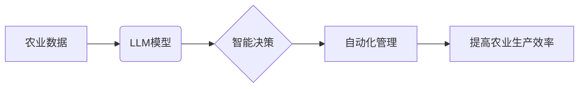

                 

## 智能农作物管理：LLM在精准农业中的角色

> 关键词：大型语言模型 (LLM)、精准农业、农作物管理、数据分析、机器学习、自然语言处理 (NLP)、农业科技

## 1. 背景介绍

农业作为人类文明的基石，一直面临着如何提高产量、降低成本、保障粮食安全等挑战。随着科技的进步，精准农业应运而生，它利用先进技术手段，对农作物进行个性化管理，提高资源利用效率，实现可持续发展。其中，大型语言模型 (LLM) 作为人工智能领域的一项突破性进展，展现出巨大的潜力，为精准农业的智能化发展提供了新的思路和方法。

传统农业管理模式往往依赖经验和主观判断，难以实现精准化和自动化。而精准农业则通过数据采集、分析和决策，为农作物提供个性化的管理方案，例如施肥、灌溉、病虫害防治等。LLM 凭借其强大的语言理解和生成能力，能够有效处理农业领域的海量文本数据，例如农业气象数据、土壤信息、病虫害诊断报告等，并从中提取有价值的信息，为精准农业决策提供支持。

## 2. 核心概念与联系

**2.1 精准农业**

精准农业是指利用信息技术、传感器技术、地理信息系统 (GIS) 等手段，对农作物进行个性化管理，提高资源利用效率，实现可持续发展的一种农业模式。

**2.2 大型语言模型 (LLM)**

大型语言模型 (LLM) 是一种基于深度学习的强大人工智能模型，通过训练海量文本数据，学习语言的结构和规律，能够理解和生成人类语言。LLM 拥有强大的文本处理能力，可以进行文本分类、摘要、翻译、问答等多种任务。

**2.3 核心概念联系**

LLM 在精准农业中的应用，主要体现在以下几个方面：

* **数据分析与挖掘:** LLM 可以处理农业领域的海量文本数据，例如农业气象数据、土壤信息、病虫害诊断报告等，并从中提取有价值的信息，为精准农业决策提供支持。
* **智能决策支持:** LLM 可以根据分析结果，为农作物提供个性化的管理方案，例如施肥、灌溉、病虫害防治等。
* **自动化管理:** LLM 可以与其他农业传感器和自动化设备集成，实现农作物管理的自动化。

**2.4 架构图**



## 3. 核心算法原理 & 具体操作步骤

**3.1 算法原理概述**

LLM 在精准农业中的应用主要基于自然语言处理 (NLP) 技术，包括文本分类、文本摘要、问答系统等。这些技术可以帮助LLM理解和处理农业相关的文本信息，并从中提取有价值的知识。

**3.2 算法步骤详解**

1. **数据收集:** 收集农业相关的文本数据，例如农业气象数据、土壤信息、病虫害诊断报告等。
2. **数据预处理:** 对收集到的数据进行清洗、格式化和标注，以便于LLM模型的训练。
3. **模型训练:** 使用预处理后的数据训练LLM模型，例如BERT、GPT等。
4. **模型评估:** 使用测试数据评估模型的性能，例如准确率、召回率等。
5. **模型部署:** 将训练好的模型部署到实际应用场景中，例如农业决策支持系统。

**3.3 算法优缺点**

**优点:**

* 能够处理海量文本数据，提取有价值的信息。
* 能够理解和生成人类语言，与农业从业者进行自然交互。
* 能够提供个性化的管理方案，提高农业生产效率。

**缺点:**

* 训练LLM模型需要大量的计算资源和时间。
* 模型的性能依赖于训练数据的质量。
* 模型的解释性较差，难以理解模型的决策过程。

**3.4 算法应用领域**

* **病虫害诊断:** LLM 可以根据病虫害症状描述，识别病虫害种类，并提供相应的防治方案。
* **作物产量预测:** LLM 可以根据历史数据、天气预报等信息，预测作物产量。
* **农业决策支持:** LLM 可以为农户提供个性化的农业决策建议，例如施肥、灌溉、病虫害防治等。

## 4. 数学模型和公式 & 详细讲解 & 举例说明

**4.1 数学模型构建**

LLM 的训练过程本质上是一个优化问题，目标是找到一个模型参数，使得模型在训练数据上的预测结果与真实值尽可能接近。常用的数学模型包括：

* **交叉熵损失函数:** 用于衡量模型预测结果与真实值的差异。

$$
Loss = - \sum_{i=1}^{N} y_i \log(p_i)
$$

其中：

* $N$ 是样本数量。
* $y_i$ 是真实标签。
* $p_i$ 是模型预测的概率。

* **梯度下降算法:** 用于更新模型参数，使得损失函数最小化。

**4.2 公式推导过程**

梯度下降算法的基本原理是通过计算损失函数对模型参数的梯度，并沿着梯度负方向更新模型参数。

$$
\theta = \theta - \alpha \nabla Loss(\theta)
$$

其中：

* $\theta$ 是模型参数。
* $\alpha$ 是学习率。
* $\nabla Loss(\theta)$ 是损失函数对模型参数的梯度。

**4.3 案例分析与讲解**

假设我们训练一个LLM模型用于识别病虫害种类。训练数据包含了病虫害图片和对应的标签。模型的输出是一个概率分布，表示每个病虫害种类的概率。

使用交叉熵损失函数计算模型预测结果与真实标签的差异。然后，使用梯度下降算法更新模型参数，使得损失函数最小化。经过多次迭代，模型的预测性能将会逐渐提高。

## 5. 项目实践：代码实例和详细解释说明

**5.1 开发环境搭建**

* Python 3.7+
* TensorFlow 或 PyTorch
* CUDA 和 cuDNN (可选，用于GPU加速)

**5.2 源代码详细实现**

```python
# 使用 TensorFlow 框架训练一个简单的文本分类模型

import tensorflow as tf

# 定义模型结构
model = tf.keras.models.Sequential([
    tf.keras.layers.Embedding(input_dim=10000, output_dim=128),
    tf.keras.layers.LSTM(units=64),
    tf.keras.layers.Dense(units=2, activation='softmax')
])

# 编译模型
model.compile(optimizer='adam',
              loss='sparse_categorical_crossentropy',
              metrics=['accuracy'])

# 训练模型
model.fit(x_train, y_train, epochs=10)

# 评估模型
loss, accuracy = model.evaluate(x_test, y_test)
print('Loss:', loss)
print('Accuracy:', accuracy)
```

**5.3 代码解读与分析**

* 该代码示例使用 TensorFlow 框架构建了一个简单的文本分类模型。
* 模型结构包括 Embedding 层、LSTM 层和 Dense 层。
* Embedding 层将单词映射到低维向量空间。
* LSTM 层用于捕捉文本序列中的长距离依赖关系。
* Dense 层用于分类。
* 模型使用 Adam 优化器、交叉熵损失函数和准确率作为评估指标。

**5.4 运行结果展示**

训练完成后，模型的性能可以通过评估指标来衡量，例如准确率、召回率、F1-score 等。

## 6. 实际应用场景

**6.1 病虫害诊断**

LLM 可以根据病虫害症状描述，识别病虫害种类，并提供相应的防治方案。例如，农户可以通过手机拍照上传病虫害图片，LLM 模型可以识别病虫害种类，并给出防治建议。

**6.2 作物产量预测**

LLM 可以根据历史数据、天气预报等信息，预测作物产量。例如，农业企业可以通过LLM模型预测不同作物在不同区域的产量，以便进行合理的生产计划。

**6.3 农业决策支持**

LLM 可以为农户提供个性化的农业决策建议，例如施肥、灌溉、病虫害防治等。例如，农户可以通过与LLM模型进行对话，获取针对自身作物和环境条件的个性化建议。

**6.4 未来应用展望**

LLM 在精准农业领域的应用前景广阔，未来可能在以下方面得到进一步发展：

* **更精准的预测:** 利用更丰富的农业数据和更先进的机器学习算法，实现更精准的作物产量预测、病虫害爆发预测等。
* **更智能的决策支持:** 开发更智能的农业决策支持系统，能够根据农户的具体需求，提供更个性化、更有效的决策建议。
* **更自动化的人工智能农场:** 将LLM与其他农业传感器和自动化设备集成，实现更自动化的人工智能农场，提高农业生产效率和降低人力成本。

## 7. 工具和资源推荐

**7.1 学习资源推荐**

* **斯坦福大学 NLP课程:** https://web.stanford.edu/class/cs224n/
* **Hugging Face Transformers库:** https://huggingface.co/docs/transformers/index

**7.2 开发工具推荐**

* **TensorFlow:** https://www.tensorflow.org/
* **PyTorch:** https://pytorch.org/

**7.3 相关论文推荐**

* **BERT: Pre-training of Deep Bidirectional Transformers for Language Understanding:** https://arxiv.org/abs/1810.04805
* **GPT-3: Language Models are Few-Shot Learners:** https://arxiv.org/abs/2005.14165

## 8. 总结：未来发展趋势与挑战

**8.1 研究成果总结**

LLM 在精准农业领域的应用取得了显著进展，能够有效处理农业文本数据，提供智能决策支持，提高农业生产效率。

**8.2 未来发展趋势**

未来，LLM 在精准农业领域的应用将朝着以下方向发展：

* **更精准的预测:** 利用更丰富的农业数据和更先进的机器学习算法，实现更精准的作物产量预测、病虫害爆发预测等。
* **更智能的决策支持:** 开发更智能的农业决策支持系统，能够根据农户的具体需求，提供更个性化、更有效的决策建议。
* **更自动化的人工智能农场:** 将LLM与其他农业传感器和自动化设备集成，实现更自动化的人工智能农场，提高农业生产效率和降低人力成本。

**8.3 面临的挑战**

LLM 在精准农业领域的应用也面临一些挑战：

* **数据质量:** LLM 的性能依赖于训练数据的质量，农业数据往往存在不完整、不准确等问题。
* **模型解释性:** LLM 的决策过程往往难以解释，这使得其应用在农业领域存在一定的局限性。
* **计算资源:** 训练大型LLM模型需要大量的计算资源，这对于一些小型农业企业来说是一个负担。

**8.4 研究展望**

未来研究方向包括：

* 开发更 robust 的农业数据处理方法，提高数据质量。
* 研究更可解释的LLM模型，提高模型的透明度和可信度。
* 开发更轻量级的LLM模型，降低模型的计算成本。


## 9. 附录：常见问题与解答

**9.1 如何选择合适的LLM模型？**

选择合适的LLM模型需要根据具体的应用场景和数据特点进行选择。例如，对于文本分类任务，BERT 和 RoBERTa 等模型效果较好；对于文本生成任务，GPT-3 等模型效果较好。

**9.2 如何处理农业数据中的噪声和缺失值？**

可以采用数据清洗、填充等方法处理农业数据中的噪声和缺失值。例如，可以使用众数填充缺失值，可以使用正则表达式去除噪声数据。

**9.3 如何评估LLM模型的性能？**

可以使用准确率、召回率、F1-score 等指标评估LLM模型的性能。

**9.4 如何部署LLM模型到实际应用场景？**

可以使用云平台、边缘设备等方式部署LLM模型。


作者：禅与计算机程序设计艺术 / Zen and the Art of Computer Programming 
<end_of_turn>

