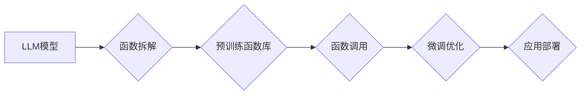

                 

## 智能函数库：LLM系统的标准配置

> 关键词：LLM, 智能函数库,  模型微调,  函数调用,  可组合性,  代码生成,  应用扩展

## 1. 背景介绍

近年来，大型语言模型（LLM）在自然语言处理领域取得了令人瞩目的成就，展现出强大的文本生成、理解和翻译能力。然而，现有的LLM模型通常是黑盒式的，缺乏可解释性和可定制性。为了更好地利用LLM的潜力，并使其更易于应用于实际场景，我们需要构建一个灵活、可扩展的智能函数库。

智能函数库的概念源于将LLM模型的功能拆解成一个个独立的、可复用的函数，这些函数可以根据特定任务进行组合和调用。类似于编程语言中的函数库，智能函数库为开发者提供了一套预先训练好的功能模块，可以方便地构建和部署基于LLM的应用程序。

## 2. 核心概念与联系

### 2.1  LLM模型

大型语言模型（LLM）是一种基于深度学习的强大人工智能模型，通过训练海量文本数据，学习语言的语法、语义和上下文关系。常见的LLM模型包括GPT-3、BERT、LaMDA等。

### 2.2  智能函数库

智能函数库是一个包含一系列预训练LLM模型函数的集合，每个函数都针对特定的任务进行优化，例如文本生成、翻译、问答、代码生成等。开发者可以通过调用这些函数，快速构建和部署基于LLM的应用程序。

### 2.3  函数调用与微调

智能函数库的核心机制是函数调用。开发者可以通过API接口调用预先训练好的LLM函数，并根据需要进行微调，以提高函数在特定任务上的性能。微调是指在预训练模型的基础上，使用少量特定任务的数据进行进一步训练，从而使模型在该任务上表现更优。

**Mermaid 流程图**



## 3. 核心算法原理 & 具体操作步骤

### 3.1  算法原理概述

智能函数库的核心算法原理是基于Transformer架构的预训练语言模型，通过自监督学习的方式，学习语言的表示和关系。

预训练阶段，模型通过大量的文本数据进行训练，学习到语言的语法、语义和上下文关系。微调阶段，模型根据特定任务的数据进行训练，调整模型参数，使其在该任务上表现更优。

### 3.2  算法步骤详解

1. **数据预处理:** 将文本数据进行清洗、分词、标记等预处理操作，使其适合模型训练。
2. **模型训练:** 使用Transformer架构的预训练语言模型，通过自监督学习的方式，训练模型学习语言的表示和关系。
3. **函数拆解:** 将预训练模型的功能拆解成一个个独立的、可复用的函数，每个函数针对特定的任务进行优化。
4. **函数库构建:** 将拆解后的函数打包成智能函数库，提供API接口供开发者调用。
5. **函数调用:** 开发者可以通过API接口调用预先训练好的LLM函数，并根据需要进行微调。
6. **微调优化:** 使用少量特定任务的数据进行模型微调，提高函数在该任务上的性能。
7. **应用部署:** 将微调后的模型部署到实际应用场景中，提供基于LLM的应用程序服务。

### 3.3  算法优缺点

**优点:**

* **可复用性:** 预训练好的LLM函数可以被多个应用程序复用，提高开发效率。
* **可定制性:** 开发者可以根据需要对函数进行微调，使其在特定任务上表现更优。
* **易于使用:** 通过API接口调用函数，简化了LLM模型的应用开发。

**缺点:**

* **模型规模:** 预训练LLM模型通常规模较大，部署和使用需要较高的计算资源。
* **数据依赖:** 模型性能受训练数据质量的影响，需要高质量的数据进行预训练和微调。
* **可解释性:** LLM模型的决策过程通常难以解释，缺乏透明度。

### 3.4  算法应用领域

智能函数库在多个领域具有广泛的应用前景，例如：

* **自然语言处理:** 文本生成、翻译、问答、摘要、情感分析等。
* **代码生成:** 根据自然语言描述生成代码，提高开发效率。
* **创意写作:** 辅助作家创作小说、诗歌、剧本等。
* **教育培训:** 提供个性化学习辅导、自动批改作业等。
* **客服服务:** 自动回复用户咨询，提高服务效率。

## 4. 数学模型和公式 & 详细讲解 & 举例说明

### 4.1  数学模型构建

智能函数库的核心数学模型是基于Transformer架构的预训练语言模型，其核心思想是利用注意力机制学习文本序列之间的依赖关系。

Transformer模型的输入是一个文本序列，每个单词都被映射成一个向量表示。模型通过多层编码器和解码器结构，对文本序列进行编码和解码，最终生成目标文本序列。

### 4.2  公式推导过程

Transformer模型的注意力机制公式如下：

$$
Attention(Q, K, V) = \frac{exp(Q \cdot K^T / \sqrt{d_k})}{exp(Q \cdot K^T / \sqrt{d_k})} \cdot V
$$

其中：

* $Q$：查询矩阵
* $K$：键矩阵
* $V$：值矩阵
* $d_k$：键向量的维度

注意力机制通过计算查询向量与键向量的点积，并使用softmax函数进行归一化，得到每个键向量的权重。然后，将权重与值矩阵相乘，得到最终的注意力输出。

### 4.3  案例分析与讲解

假设我们有一个文本序列“我爱学习编程”，我们需要计算每个单词对“学习”的注意力权重。

1. 将每个单词映射成一个向量表示。
2. 将查询向量设置为“学习”对应的向量表示。
3. 将键向量和值向量设置为所有单词对应的向量表示。
4. 计算查询向量与每个键向量的点积，并使用softmax函数进行归一化，得到每个单词对“学习”的注意力权重。

例如，"我"对"学习"的注意力权重可能较高，因为"我"在句子中与"学习"紧密相关。

## 5. 项目实践：代码实例和详细解释说明

### 5.1  开发环境搭建

智能函数库的开发环境通常需要以下软件：

* Python 3.x
* PyTorch 或 TensorFlow
* CUDA 和 cuDNN (用于GPU加速)
* Git

### 5.2  源代码详细实现

以下是一个简单的智能函数库代码示例，使用Python和HuggingFace Transformers库实现文本生成功能：

```python
from transformers import pipeline

# 初始化文本生成器
generator = pipeline("text-generation", model="gpt2")

# 生成文本
text = generator("写一首关于人工智能的诗歌", max_length=100, num_return_sequences=3)

# 打印结果
for i in range(len(text)):
    print(f"诗歌{i+1}: {text[i]['generated_text']}")
```

### 5.3  代码解读与分析

* 使用HuggingFace Transformers库加载预训练的GPT-2模型。
* 使用pipeline函数创建一个文本生成器。
* 调用generator函数生成文本，并指定最大长度和生成序列数量。
* 打印生成的文本。

### 5.4  运行结果展示

运行以上代码，将生成三首关于人工智能的诗歌。

## 6. 实际应用场景

智能函数库在实际应用场景中具有广泛的应用前景，例如：

### 6.1  聊天机器人

智能函数库可以为聊天机器人提供丰富的文本生成能力，使机器人能够更自然地与用户进行对话。

### 6.2  内容创作

智能函数库可以辅助作家、记者、广告文案等创作人员生成高质量的文本内容，提高创作效率。

### 6.3  代码辅助

智能函数库可以根据自然语言描述生成代码，帮助程序员提高开发效率。

### 6.4  未来应用展望

随着LLM模型的不断发展，智能函数库将更加智能化、个性化和可定制化。未来，智能函数库将成为构建基于AI的应用程序的标准配置，推动人工智能技术在各个领域的广泛应用。

## 7. 工具和资源推荐

### 7.1  学习资源推荐

* **HuggingFace Transformers:** https://huggingface.co/docs/transformers/index
* **OpenAI API:** https://beta.openai.com/docs/api-reference/introduction
* **Google AI Platform:** https://cloud.google.com/ai-platform

### 7.2  开发工具推荐

* **Jupyter Notebook:** https://jupyter.org/
* **VS Code:** https://code.visualstudio.com/

### 7.3  相关论文推荐

* **Attention Is All You Need:** https://arxiv.org/abs/1706.03762
* **BERT: Pre-training of Deep Bidirectional Transformers for Language Understanding:** https://arxiv.org/abs/1810.04805

## 8. 总结：未来发展趋势与挑战

### 8.1  研究成果总结

智能函数库为LLM的应用提供了新的思路和方法，使其更加灵活、可定制和易于使用。

### 8.2  未来发展趋势

* **更强大的模型:** 随着模型规模和训练数据的不断增加，LLM模型的性能将进一步提升。
* **更细粒度的函数:** 智能函数库将更加细粒化，提供针对特定任务的专用函数。
* **更智能的调用机制:** 智能函数库将采用更智能的调用机制，自动选择最合适的函数组合。

### 8.3  面临的挑战

* **模型可解释性:** LLM模型的决策过程难以解释，缺乏透明度。
* **数据安全:** LLM模型的训练数据可能包含敏感信息，需要采取措施保护数据安全。
* **伦理问题:** LLM模型的应用可能引发伦理问题，例如内容生成中的虚假信息和偏见问题。

### 8.4  研究展望

未来，智能函数库的研究将集中在以下几个方面：

* **提高模型可解释性:** 研究更有效的模型解释方法，使LLM模型的决策过程更加透明。
* **增强数据安全:** 研究更有效的隐私保护技术，保障LLM模型训练数据的安全。
* **解决伦理问题:** 研究LLM模型的伦理问题，并制定相应的规范和指南。

## 9. 附录：常见问题与解答

### 9.1  Q: 如何选择合适的LLM模型？

A: 选择合适的LLM模型取决于具体的应用场景。对于文本生成任务，GPT-3、T5等模型效果较好。对于问答任务，BERT、RoBERTa等模型效果较好。

### 9.2  Q: 如何进行LLM模型微调？

A: 微调LLM模型需要使用少量特定任务的数据进行训练。可以使用HuggingFace Transformers库中的fine-tuning功能进行微调。

### 9.3  Q: 如何部署智能函数库？

A: 智能函数库可以部署到云服务器、本地服务器或边缘设备上。可以使用Docker容器进行部署，方便管理和维护。


作者：禅与计算机程序设计艺术 / Zen and the Art of Computer Programming 
<end_of_turn>

