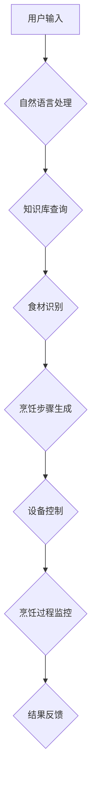

                 

## 智能厨房助手创业：烹饪辅助的未来

> 关键词：智能厨房、烹饪辅助、人工智能、机器学习、自然语言处理、计算机视觉、物联网、创业

## 1. 背景介绍

随着科技的飞速发展，人工智能（AI）正在深刻地改变着我们的生活方式。从智能手机到自动驾驶汽车，AI技术的应用无处不在。而厨房，作为人类日常生活的重要场所，也逐渐成为AI技术的应用领域之一。智能厨房助手，作为一种利用AI技术辅助烹饪的智能设备，正逐渐走进我们的生活。

传统的烹饪方式往往需要丰富的经验和技巧，而智能厨房助手则可以帮助用户克服这些困难，让烹饪变得更加便捷、高效和有趣。它可以提供丰富的菜谱推荐、食材识别、烹饪指导、烹饪时间提醒等功能，帮助用户轻松完成各种菜肴的制作。

## 2. 核心概念与联系

智能厨房助手是一个集多项技术于一体的复杂系统，其核心概念包括：

* **人工智能（AI）：** 智能厨房助手的核心驱动力，用于理解用户需求、识别食材、生成菜谱、提供烹饪指导等。
* **机器学习（ML）：** 训练AI模型，使其能够从海量数据中学习，不断提高其识别、理解和预测能力。
* **自然语言处理（NLP）：** 理解用户自然语言指令，例如“帮我做一份番茄炒蛋”或“我想吃点清淡的”。
* **计算机视觉（CV）：**识别食材种类、烹饪步骤、食物状态等，并提供相应的烹饪建议。
* **物联网（IoT）：** 连接智能厨房设备，实现数据共享和协同控制，例如控制烤箱温度、定时烹饪等。

**核心架构流程图：**



## 3. 核心算法原理 & 具体操作步骤

### 3.1  算法原理概述

智能厨房助手的核心算法主要包括：

* **菜谱推荐算法：** 基于用户喜好、食材可用性、烹饪时间等因素，推荐合适的菜谱。常用的算法包括协同过滤、内容过滤和基于知识图谱的推荐算法。
* **食材识别算法：** 利用计算机视觉技术，识别食材的种类、重量、新鲜度等信息。常用的算法包括卷积神经网络（CNN）和支持向量机（SVM）。
* **烹饪步骤生成算法：** 根据选择的菜谱，生成详细的烹饪步骤，并提供相应的烹饪技巧和建议。常用的算法包括自然语言生成和基于规则的生成算法。

### 3.2  算法步骤详解

**菜谱推荐算法：**

1. 收集用户历史烹饪记录、评分、评论等数据。
2. 利用协同过滤算法，找到与用户兴趣相似的用户，推荐他们喜欢的菜谱。
3. 利用内容过滤算法，根据用户的口味偏好、食材限制等条件，推荐符合条件的菜谱。
4. 利用知识图谱，分析菜谱之间的关系，推荐用户可能感兴趣的菜谱。

**食材识别算法：**

1. 使用摄像头拍摄食材图像。
2. 对图像进行预处理，例如调整亮度、对比度等。
3. 将预处理后的图像输入CNN模型进行识别。
4. 模型输出食材的种类、重量等信息。

**烹饪步骤生成算法：**

1. 根据选择的菜谱，提取烹饪步骤的描述信息。
2. 利用自然语言生成算法，将描述信息转换为自然语言的烹饪步骤。
3. 根据用户经验和烹饪技巧，对烹饪步骤进行优化和完善。

### 3.3  算法优缺点

**优点：**

* 提高烹饪效率和便捷性。
* 提供个性化菜谱推荐和烹饪指导。
* 帮助用户学习新的烹饪技巧。

**缺点：**

* 算法精度需要不断提高，例如食材识别和烹饪步骤生成。
* 需要大量的训练数据，才能训练出准确的模型。
* 存在安全隐患，例如数据泄露和网络攻击。

### 3.4  算法应用领域

智能厨房助手算法的应用领域非常广泛，包括：

* 智能冰箱：识别食材种类、剩余量、过期日期等信息，并提供相应的烹饪建议。
* 智能烤箱：根据菜谱要求自动调节温度、时间等参数，实现智能烹饪。
* 智能烹饪锅：根据食材种类和烹饪步骤自动调节火候、时间等参数，实现智能烹饪。
* 智能厨房平台：整合各种智能厨房设备，提供统一的控制界面和烹饪服务。

## 4. 数学模型和公式 & 详细讲解 & 举例说明

### 4.1  数学模型构建

菜谱推荐算法可以采用协同过滤模型，其核心思想是基于用户的相似度和物品的相似度进行推荐。

**用户-物品交互矩阵：**

用户-物品交互矩阵是一个n x m的矩阵，其中n代表用户数量，m代表菜谱数量。矩阵中的每个元素代表用户对菜谱的评分或交互行为，例如点赞、收藏、评论等。

**用户相似度计算：**

可以使用余弦相似度或皮尔逊相关系数等方法计算用户之间的相似度。

**菜谱相似度计算：**

可以使用余弦相似度或Jaccard系数等方法计算菜谱之间的相似度。

### 4.2  公式推导过程

**余弦相似度公式：**

$$
\text{相似度} = \frac{\mathbf{u} \cdot \mathbf{v}}{\|\mathbf{u}\| \|\mathbf{v}\|}
$$

其中：

* $\mathbf{u}$ 和 $\mathbf{v}$ 代表两个向量的表示。
* $\cdot$ 代表向量的点积。
* $\|\mathbf{u}\|$ 和 $\|\mathbf{v}\|$ 代表向量的模长。

**皮尔逊相关系数公式：**

$$
\text{相关系数} = \frac{\sum_{i=1}^{n}(x_i - \bar{x})(y_i - \bar{y})}{\sqrt{\sum_{i=1}^{n}(x_i - \bar{x})^2} \sqrt{\sum_{i=1}^{n}(y_i - \bar{y})^2}}
$$

其中：

* $x_i$ 和 $y_i$ 代表两个变量的第i个观测值。
* $\bar{x}$ 和 $\bar{y}$ 代表两个变量的平均值。

### 4.3  案例分析与讲解

假设有两个用户A和B，他们对以下菜谱的评分如下：

| 菜谱 | 用户A | 用户B |
|---|---|---|
| A | 5 | 4 |
| B | 3 | 5 |
| C | 4 | 3 |
| D | 5 | 5 |

我们可以使用余弦相似度计算用户A和用户B之间的相似度：

1. 将用户评分转换为向量：

* 用户A向量： [5, 3, 4, 5]
* 用户B向量： [4, 5, 3, 5]

2. 计算向量点积：

* [5, 3, 4, 5] • [4, 5, 3, 5] = 20 + 15 + 12 + 25 = 72

3. 计算向量模长：

* ||[5, 3, 4, 5]|| = √(5² + 3² + 4² + 5²) = √75
* ||[4, 5, 3, 5]|| = √(4² + 5² + 3² + 5²) = √75

4. 计算余弦相似度：

* 相似度 = 72 / (√75 * √75) = 72 / 75 = 0.96

因此，用户A和用户B之间的相似度为0.96，说明他们具有很高的相似度。

## 5. 项目实践：代码实例和详细解释说明

### 5.1  开发环境搭建

智能厨房助手项目可以使用Python语言开发，并结合以下开源库：

* **TensorFlow/PyTorch:** 深度学习框架，用于训练食材识别和烹饪步骤生成模型。
* **NLTK/SpaCy:** 自然语言处理库，用于处理用户输入和生成烹饪步骤。
* **OpenCV:** 图像处理库，用于食材识别和烹饪过程监控。
* **Flask/Django:** Web框架，用于构建智能厨房助手平台。

### 5.2  源代码详细实现

以下是一个简单的食材识别代码示例，使用TensorFlow和OpenCV：

```python
import tensorflow as tf
import cv2

# 加载预训练的食材识别模型
model = tf.keras.models.load_model('food_recognition_model.h5')

# 打开摄像头
cap = cv2.VideoCapture(0)

while True:
    # 读取摄像头图像
    ret, frame = cap.read()

    # 预处理图像
    gray = cv2.cvtColor(frame, cv2.COLOR_BGR2GRAY)
    resized = cv2.resize(gray, (224, 224))

    # 将图像输入模型进行预测
    prediction = model.predict(resized[None, ...])

    # 获取预测结果
    predicted_class = tf.math.argmax(prediction, axis=1).numpy()[0]

    # 显示预测结果
    cv2.putText(frame, predicted_class, (10, 30), cv2.FONT_HERSHEY_SIMPLEX, 1, (0, 255, 0), 2)

    # 显示图像
    cv2.imshow('Food Recognition', frame)

    # 按键退出
    if cv2.waitKey(1) & 0xFF == ord('q'):
        break

# 释放资源
cap.release()
cv2.destroyAllWindows()
```

### 5.3  代码解读与分析

这段代码首先加载预训练的食材识别模型，然后打开摄像头读取图像。

图像经过预处理，例如灰度化和尺寸调整，然后输入模型进行预测。模型输出预测结果，并根据结果显示预测的食材类别。

### 5.4  运行结果展示

运行这段代码后，摄像头会捕捉到图像，并实时识别食材类别，并将结果显示在图像上。

## 6. 实际应用场景

智能厨房助手已经开始在一些场景中得到应用，例如：

* **智能餐厅：** 智能厨房助手可以帮助餐厅自动化烹饪流程，提高效率和服务质量。
* **家庭厨房：** 智能厨房助手可以帮助家庭用户轻松烹饪，学习新的菜谱，并提供个性化的烹饪建议。
* **教育机构：** 智能厨房助手可以作为烹饪教学工具，帮助学生学习烹饪技巧和知识。

### 6.4  未来应用展望

未来，智能厨房助手将更加智能化、个性化和便捷化。例如：

* **语音控制：** 用户可以通过语音指令控制智能厨房助手，例如“帮我做一份番茄炒蛋”。
* **个性化推荐：** 智能厨房助手将根据用户的饮食习惯、健康状况等因素，提供更加个性化的菜谱推荐和烹饪建议。
* **远程烹饪：** 用户可以通过手机或平板电脑远程控制智能厨房助手，实现远程烹饪。

## 7. 工具和资源推荐

### 7.1  学习资源推荐

* **Coursera:** 提供人工智能、机器学习、计算机视觉等领域的在线课程。
* **edX:** 提供人工智能、机器学习、自然语言处理等领域的在线课程。
* **Udacity:** 提供人工智能、机器学习、数据科学等领域的在线课程和项目。

### 7.2  开发工具推荐

* **TensorFlow:** 深度学习框架，用于训练机器学习模型。
* **PyTorch:** 深度学习框架，用于训练机器学习模型。
* **OpenCV:** 图像处理库，用于图像识别、处理和分析。
* **NLTK:** 自然语言处理库，用于文本处理、分析和生成。
* **SpaCy:** 自然语言处理库，用于文本处理、分析和生成。

### 7.3  相关论文推荐

* **Deep Learning for Image Recognition**
* **Recurrent Neural Networks for Natural Language Processing**
* **Collaborative Filtering for Recommender Systems**

## 8. 总结：未来发展趋势与挑战

### 8.1  研究成果总结

智能厨房助手是一个充满潜力的领域，近年来取得了显著的进展。

* **食材识别精度不断提高：** 深度学习算法的应用使得食材识别精度大幅提升。
* **烹饪步骤生成更加智能化：** 自然语言生成算法的进步使得烹饪步骤生成更加自然流畅。
* **用户体验不断优化：** 智能厨房助手平台更加便捷易用，并提供个性化服务。

### 8.2  未来发展趋势

* **更精准的个性化推荐：** 利用用户行为数据和健康信息，提供更加精准的菜谱推荐和烹饪建议。
* **更智能的烹饪助手：** 智能厨房助手将能够自主规划菜单、控制烹饪设备、提供烹饪指导等。
* **更安全的厨房环境：** 智能厨房助手将能够监测厨房环境，预防火灾、中毒等安全事故。

### 8.3  面临的挑战

* **算法精度提升：** 对于复杂烹饪场景，算法还需要进一步提高精度，例如识别食材的烹饪状态、判断烹饪时间等。
* **数据安全和隐私保护：** 智能厨房助手收集用户大量数据，需要加强数据安全和隐私保护措施。
* **成本控制：** 智能厨房助手设备成本较高，需要降低成本，使其更加普及。

### 8.4  研究展望

未来，智能厨房助手将继续朝着更加智能化、个性化、便捷化的方向发展，为人们的生活带来更多便利和乐趣。


## 9. 附录：常见问题与解答

**常见问题：**

* **智能厨房助手需要联网吗？**

  部分智能厨房助手需要联网，以便获取菜谱、更新软件等。

* **智能厨房助手可以控制所有厨房设备吗？**

  目前，智能厨房助手可以控制部分厨房设备，例如烤箱、微波炉等。

* **智能厨房助手的数据安全如何保障？**

  智能厨房助手厂商需要采取相应的安全措施，例如数据加密、访问控制等，保障用户数据安全。

**解答：**

* 智能厨房助手是否需要联网取决于具体产品的功能和设计。部分产品可以离线使用，但联网功能可以提供更丰富的服务。
* 智能厨房助手可以控制的设备类型取决于其兼容性。厂商通常会提供兼容设备列表。
* 智能厨房助手厂商需要采取相应的安全措施，例如数据加密、访问控制等，保障用户数据安全。用户也可以通过设置隐私选项来控制数据共享。


作者：禅与计算机程序设计艺术 / Zen and the Art of Computer Programming<end_of_turn>

