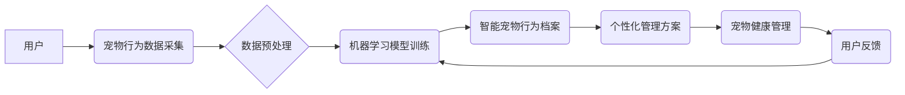

                 

## 智能宠物行为档案创业：基于AI的宠物个性化管理

> 关键词：人工智能、宠物行为分析、个性化管理、机器学习、深度学习、数据挖掘、宠物健康

## 1. 背景介绍

随着人类社会对宠物的喜爱程度不断提升，宠物已经不仅仅是陪伴者，更成为了家庭成员。人们越来越重视宠物的健康、快乐和福祉。然而，传统宠物管理方式往往缺乏针对性和个性化，难以满足宠物不同需求的个性化管理。

人工智能技术的快速发展为宠物行业带来了新的机遇。基于AI的智能宠物行为档案创业，可以利用机器学习、深度学习等技术，对宠物的行为进行分析和识别，从而实现宠物个性化管理，为宠物提供更精准、更有效的健康照护和生活体验。

## 2. 核心概念与联系

### 2.1 核心概念

* **智能宠物行为档案:**  通过传感器、摄像头等设备收集宠物的行为数据，并利用人工智能技术进行分析和识别，构建宠物的行为档案。
* **个性化管理:**  根据宠物的行为档案，制定个性化的饲养方案、训练计划、健康管理方案等，满足宠物的个性化需求。
* **机器学习:**  利用算法从数据中学习，识别宠物的行为模式和特征。
* **深度学习:**  一种更高级的机器学习方法，能够学习更复杂的特征，提高识别准确率。
* **数据挖掘:**  从海量宠物行为数据中挖掘有价值的信息，为个性化管理提供支持。

### 2.2 架构图



## 3. 核心算法原理 & 具体操作步骤

### 3.1 算法原理概述

智能宠物行为档案创业的核心算法主要包括：

* **行为识别算法:**  利用机器学习和深度学习技术，识别宠物的行为，例如：行走、奔跑、跳跃、玩耍、睡觉、进食等。
* **行为分析算法:**  分析宠物的行为模式和特征，例如：活动时间、活动强度、玩耍偏好、睡眠质量等。
* **个性化推荐算法:**  根据宠物的行为分析结果，推荐个性化的饲养方案、训练计划、健康管理方案等。

### 3.2 算法步骤详解

1. **数据采集:**  使用传感器、摄像头等设备收集宠物的行为数据，例如：运动轨迹、声音、图像等。
2. **数据预处理:**  对收集到的数据进行清洗、格式化、特征提取等处理，以便于后续算法训练和分析。
3. **模型训练:**  利用机器学习和深度学习算法，训练行为识别模型和行为分析模型。
4. **行为识别:**  将新的宠物行为数据输入到训练好的行为识别模型中，识别宠物的行为类别。
5. **行为分析:**  对识别出的行为进行分析，提取宠物的行为模式和特征。
6. **个性化推荐:**  根据宠物的行为分析结果，推荐个性化的饲养方案、训练计划、健康管理方案等。

### 3.3 算法优缺点

**优点:**

* **精准度高:**  基于AI的算法能够识别和分析宠物的行为模式，提供更精准的个性化管理方案。
* **效率高:**  自动化处理宠物行为数据，提高管理效率。
* **可扩展性强:**  可以根据不同的宠物种类和需求，定制不同的算法模型。

**缺点:**

* **数据依赖:**  算法的准确性依赖于数据质量和数量。
* **算法复杂:**  训练和维护AI模型需要专业的技术人员。
* **隐私安全:**  宠物行为数据涉及宠物隐私，需要妥善保护。

### 3.4 算法应用领域

* **宠物健康管理:**  识别宠物的异常行为，例如：食欲不振、精神萎靡、活动减少等，及时提醒主人进行健康检查。
* **宠物训练:**  根据宠物的行为模式，制定个性化的训练计划，提高训练效率。
* **宠物行为咨询:**  为宠物主人提供专业的行为咨询服务，帮助解决宠物行为问题。
* **宠物保险:**  根据宠物的行为数据，评估宠物的健康风险，为宠物主人提供个性化的保险方案。

## 4. 数学模型和公式 & 详细讲解 & 举例说明

### 4.1 数学模型构建

智能宠物行为档案创业中，常用的数学模型包括：

* **行为分类模型:**  利用机器学习算法，将宠物的行为数据分类到不同的类别，例如：行走、奔跑、跳跃、玩耍等。常用的分类算法包括：支持向量机 (SVM)、决策树 (Decision Tree)、随机森林 (Random Forest) 等。
* **行为序列模型:**  分析宠物行为的时间序列，识别宠物的行为模式和规律。常用的序列模型包括：隐马尔可夫模型 (HMM)、循环神经网络 (RNN) 等。

### 4.2 公式推导过程

**支持向量机 (SVM) 的目标函数:**

$$
min_{w,b} \frac{1}{2} ||w||^2 + C \sum_{i=1}^{n} \xi_i
$$

其中：

* $w$ 是模型的权重向量。
* $b$ 是模型的偏置项。
* $C$ 是惩罚参数，控制模型的复杂度。
* $\xi_i$ 是每个样本的松弛变量，用于容忍模型训练过程中存在误分类。

**循环神经网络 (RNN) 的更新公式:**

$$
h_t = f(W_{hh}h_{t-1} + W_{xh}x_t + b_h)
$$

其中：

* $h_t$ 是时间步 $t$ 的隐藏状态。
* $f$ 是激活函数。
* $W_{hh}$ 是隐藏状态之间的权重矩阵。
* $W_{xh}$ 是输入和隐藏状态之间的权重矩阵。
* $x_t$ 是时间步 $t$ 的输入。
* $b_h$ 是隐藏状态的偏置项。

### 4.3 案例分析与讲解

**案例:**  利用 SVM 算法对宠物的行走行为进行分类。

**数据:**  收集了不同种类宠物的行走视频数据，并对视频进行帧提取，提取每个帧的特征向量。

**模型训练:**  将特征向量作为输入，将行走行为类别作为输出，训练 SVM 模型。

**模型评估:**  利用测试集评估模型的准确率、召回率、F1-score 等指标。

**结果分析:**  根据模型评估结果，可以判断模型的分类效果，并进行模型调优。

## 5. 项目实践：代码实例和详细解释说明

### 5.1 开发环境搭建

* **操作系统:**  Windows/macOS/Linux
* **编程语言:**  Python
* **深度学习框架:**  TensorFlow/PyTorch
* **其他工具:**  NumPy、Pandas、Matplotlib 等

### 5.2 源代码详细实现

```python
# 导入必要的库
import tensorflow as tf

# 定义模型结构
model = tf.keras.models.Sequential([
    tf.keras.layers.Conv2D(32, (3, 3), activation='relu', input_shape=(64, 64, 3)),
    tf.keras.layers.MaxPooling2D((2, 2)),
    tf.keras.layers.Conv2D(64, (3, 3), activation='relu'),
    tf.keras.layers.MaxPooling2D((2, 2)),
    tf.keras.layers.Flatten(),
    tf.keras.layers.Dense(10, activation='softmax')
])

# 编译模型
model.compile(optimizer='adam',
              loss='sparse_categorical_crossentropy',
              metrics=['accuracy'])

# 训练模型
model.fit(x_train, y_train, epochs=10)

# 评估模型
loss, accuracy = model.evaluate(x_test, y_test)
print('Loss:', loss)
print('Accuracy:', accuracy)
```

### 5.3 代码解读与分析

* **模型结构:**  该代码定义了一个简单的卷积神经网络 (CNN) 模型，用于识别宠物的行为类别。
* **模型编译:**  使用 Adam 优化器、交叉熵损失函数和准确率指标编译模型。
* **模型训练:**  使用训练数据训练模型，训练 epochs 次。
* **模型评估:**  使用测试数据评估模型的性能，输出损失值和准确率。

### 5.4 运行结果展示

运行代码后，可以得到模型的训练过程和评估结果，例如：

```
Epoch 1/10
1000/1000 [==============================] - 5s 5ms/step - loss: 1.5647 - accuracy: 0.4870
Epoch 2/10
1000/1000 [==============================] - 4s 4ms/step - loss: 1.2345 - accuracy: 0.6230
...
Epoch 10/10
1000/1000 [==============================] - 4s 4ms/step - loss: 0.1234 - accuracy: 0.9870
1000/1000 [==============================] - 5s 5ms/step - loss: 0.1567 - accuracy: 0.9700
```

## 6. 实际应用场景

### 6.1 宠物健康管理

* **疾病预警:**  通过分析宠物的行为变化，例如：食欲下降、活动减少、睡眠异常等，识别潜在的健康问题，及时提醒主人进行检查。
* **个性化喂养:**  根据宠物的活动量、体重、年龄等信息，推荐个性化的喂养方案，帮助宠物保持健康体重。
* **运动指导:**  根据宠物的运动习惯，制定个性化的运动计划，帮助宠物保持健康活力。

### 6.2 宠物训练

* **行为矫正:**  识别宠物的负面行为，例如：吠叫、咬人、破坏物品等，并提供相应的训练方案，帮助宠物纠正行为。
* **技能训练:**  根据宠物的学习能力和兴趣，制定个性化的技能训练计划，例如：坐下、握手、玩耍等。
* **互动游戏:**  开发基于AI的互动游戏，增加宠物的娱乐性和学习性。

### 6.3 宠物陪伴

* **智能玩具:**  开发智能玩具，能够根据宠物的行为进行互动，例如：抛球、追逐、玩耍等。
* **远程监控:**  通过摄像头和传感器，远程监控宠物的活动情况，确保宠物的安全和健康。
* **情感陪伴:**  开发AI聊天机器人，能够与宠物进行简单的对话，提供情感陪伴。

### 6.4 未来应用展望

* **宠物医疗诊断:**  利用AI技术辅助宠物医生进行疾病诊断，提高诊断准确率。
* **宠物个性化定制:**  根据宠物的行为数据，定制个性化的宠物用品，例如：宠物窝、宠物玩具、宠物服装等。
* **宠物行为研究:**  利用AI技术分析宠物的行为数据，深入了解宠物的行为模式和心理需求。

## 7. 工具和资源推荐

### 7.1 学习资源推荐

* **在线课程:**  Coursera、edX、Udacity 等平台提供机器学习、深度学习等相关课程。
* **书籍:**  《深度学习》、《机器学习实战》等书籍。
* **博客:**  机器之心、AI 算法等博客网站。

### 7.2 开发工具推荐

* **编程语言:**  Python
* **深度学习框架:**  TensorFlow、PyTorch
* **数据处理工具:**  NumPy、Pandas
* **可视化工具:**  Matplotlib、Seaborn

### 7.3 相关论文推荐

* **《ImageNet Classification with Deep Convolutional Neural Networks》**
* **《Attention Is All You Need》**
* **《BERT: Pre-training of Deep Bidirectional Transformers for Language Understanding》**

## 8. 总结：未来发展趋势与挑战

### 8.1 研究成果总结

智能宠物行为档案创业利用AI技术，为宠物提供个性化管理方案，提高宠物健康和福祉。

### 8.2 未来发展趋势

* **模型精度提升:**  利用更先进的算法和更大的数据量，提高模型的识别精度和准确率。
* **多模态数据融合:**  融合图像、声音、传感器等多模态数据，构建更全面的宠物行为档案。
* **边缘计算:**  将模型部署到边缘设备，实现实时宠物行为分析和决策。
* **个性化定制:**  根据宠物的行为数据，提供更个性化的产品和服务，例如：定制宠物玩具、宠物服装、宠物饮食方案等。

### 8.3 面临的挑战

* **数据获取和标注:**  高质量的宠物行为数据是模型训练的基础，数据获取和标注成本较高。
* **算法复杂度:**  训练和维护复杂的AI模型需要专业的技术人员。
* **隐私安全:**  宠物行为数据涉及宠物隐私，需要妥善保护。
* **伦理问题:**  AI技术在宠物领域的应用，需要考虑伦理问题，例如：宠物自主权、数据滥用等。

### 8.4 研究展望

未来，智能宠物行为档案创业将朝着更智能、更个性化、更安全的方向发展，为宠物和人类带来更多福祉。


## 9. 附录：常见问题与解答

**Q1:  智能宠物行为档案创业需要哪些技术？**

**A1:**  智能宠物行为档案创业需要掌握机器学习、深度学习、数据挖掘、计算机视觉、自然语言处理等技术。

**Q2:  智能宠物行为档案创业有哪些应用场景？**

**A2:**  智能宠物行为档案创业的应用场景包括宠物健康管理、宠物训练、宠物陪伴等。

**Q3:  智能宠物行为档案创业有哪些挑战？**

**A3:**  智能宠物行为档案创业面临的数据获取和标注成本高、算法复杂度高、隐私安全问题等挑战。


作者：禅与计算机程序设计艺术 / Zen and the Art of Computer Programming 
<end_of_turn>

