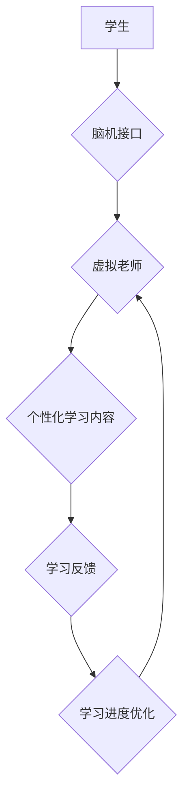

                 

## 未来的教育变革：2050年的虚拟老师与脑机接口学习

> 关键词：虚拟老师、脑机接口、教育变革、人工智能、个性化学习、沉浸式学习、未来教育

### 1. 背景介绍

教育，作为人类文明进步的基石，一直以来都在不断演变。从传统的师生面对面教学到如今的在线教育平台，教育模式的变革从未停止。而随着人工智能、虚拟现实、脑机接口等技术的飞速发展，未来教育将迎来一场前所未有的变革。

2050年，我们或许会看到一个全新的教育场景：虚拟老师将成为学生学习的常态，脑机接口技术将赋予学习更深层的个性化和沉浸式体验。

### 2. 核心概念与联系

#### 2.1 虚拟老师

虚拟老师是指利用人工智能技术模拟人类教师角色，为学生提供个性化教学、辅导和评估的智能系统。

#### 2.2 脑机接口

脑机接口 (Brain-Computer Interface，BCI) 是一种直接连接大脑和外部设备的技术，它可以读取大脑活动信号，并将其转化为指令，控制外部设备或产生相应的输出。

#### 2.3 连接

虚拟老师与脑机接口技术的结合将为教育带来革命性的改变。

**Mermaid 流程图**



### 3. 核心算法原理 & 具体操作步骤

#### 3.1 算法原理概述

虚拟老师的核心算法主要包括：

* **自然语言处理 (NLP)**：理解和生成自然语言，使虚拟老师能够与学生进行流畅的对话。
* **机器学习 (ML)**：根据学生的学习数据，个性化定制学习内容和教学方法。
* **深度学习 (DL)**：模拟人类大脑的学习机制，提高虚拟老师的学习理解和知识推理能力。
* **行为分析**: 分析学生的学习行为，识别学习模式和困难点，及时提供帮助。

#### 3.2 算法步骤详解

1. **数据收集**: 收集学生的学习数据，包括学习记录、考试成绩、学习偏好等。
2. **数据预处理**: 对收集到的数据进行清洗、转换和格式化，以便于算法训练。
3. **模型训练**: 利用机器学习和深度学习算法，训练虚拟老师模型，使其能够理解和生成自然语言，并根据学生的学习数据进行个性化学习内容定制。
4. **知识库构建**: 建立一个丰富的知识库，为虚拟老师提供学习内容和知识推理支持。
5. **交互学习**: 学生与虚拟老师进行交互学习，虚拟老师根据学生的学习情况，提供个性化的学习内容、辅导和评估。
6. **学习效果评估**: 评估学生的学习效果，并根据评估结果，不断优化虚拟老师的模型和学习内容。

#### 3.3 算法优缺点

**优点**:

* **个性化学习**: 虚拟老师可以根据学生的学习进度、能力和兴趣，提供个性化的学习内容和教学方法。
* **24/7 可用**: 学生可以随时随地与虚拟老师进行学习互动。
* **降低成本**: 虚拟老师可以替代部分教师，降低教育成本。
* **提高效率**: 虚拟老师可以提供更精准的学习指导和反馈，提高学习效率。

**缺点**:

* **缺乏情感支持**: 虚拟老师无法像人类教师一样提供情感支持和鼓励。
* **技术限制**: 虚拟老师的智能水平仍然有限，无法完全替代人类教师。
* **数据安全**: 学生的学习数据需要得到妥善保护。

#### 3.4 算法应用领域

虚拟老师的应用领域非常广泛，包括：

* **K-12 教育**: 为学生提供个性化的学习辅导和支持。
* **高等教育**: 为学生提供在线课程、实验指导和学术咨询。
* **职业培训**: 为员工提供技能培训和职业发展指导。
* **语言学习**: 为学生提供个性化的语言学习辅导和练习。

### 4. 数学模型和公式 & 详细讲解 & 举例说明

#### 4.1 数学模型构建

虚拟老师的个性化学习推荐系统可以基于协同过滤算法构建数学模型。

**协同过滤算法**

协同过滤算法通过分析用户的历史行为数据，预测用户对未来物品的喜好。

**公式**:

$$
r_{ui} = \frac{\sum_{j \in N(u)} s_{uj} \cdot s_{uj} }{\sum_{j \in N(u)} s_{uj}^2}
$$

其中：

* $r_{ui}$: 用户 $u$ 对物品 $i$ 的预测评分
* $s_{uj}$: 用户 $u$ 对物品 $j$ 的评分
* $N(u)$: 用户 $u$ 评分过的物品集合

#### 4.2 公式推导过程

协同过滤算法的核心思想是：如果用户 $u$ 和用户 $v$ 对相似的物品有相似的评分，那么用户 $u$ 也可能喜欢用户 $v$ 喜欢的物品。

公式推导过程：

1. 计算用户 $u$ 和所有其他用户 $v$ 的相似度。
2. 根据相似度，计算用户 $u$ 对物品 $i$ 的预测评分。

#### 4.3 案例分析与讲解

假设有一个用户 $u$ 评分了以下物品：

* 电影 $A$：5分
* 电影 $B$：4分
* 电影 $C$：3分

另一个用户 $v$ 评分了以下物品：

* 电影 $A$：5分
* 电影 $D$：4分
* 电影 $E$：3分

根据协同过滤算法，我们可以计算用户 $u$ 和用户 $v$ 的相似度，并预测用户 $u$ 对电影 $D$ 的评分。

### 5. 项目实践：代码实例和详细解释说明

#### 5.1 开发环境搭建

* 操作系统：Windows/macOS/Linux
* 编程语言：Python
* 库依赖：TensorFlow/PyTorch、Scikit-learn、NLTK

#### 5.2 源代码详细实现

```python
# 导入必要的库
import tensorflow as tf
from sklearn.metrics.pairwise import cosine_similarity

# 定义用户-物品评分矩阵
ratings_matrix = {
    'user1': {'item1': 5, 'item2': 4, 'item3': 3},
    'user2': {'item1': 5, 'item3': 4, 'item4': 3},
    'user3': {'item2': 5, 'item3': 4, 'item5': 3},
}

# 计算用户之间的相似度
user_similarity = cosine_similarity(ratings_matrix)

# 预测用户对物品的评分
def predict_rating(user_id, item_id):
    # 获取用户评分过的物品
    rated_items = ratings_matrix[user_id]
    # 计算用户与其他用户的相似度
    similarity_scores = user_similarity[user_id]
    # 预测评分
    predicted_rating = sum(similarity_scores * ratings_matrix[other_user_id][item_id] for other_user_id in range(len(similarity_scores))) / sum(similarity_scores)
    return predicted_rating

# 预测用户1对物品4的评分
predicted_rating = predict_rating('user1', 'item4')
print(f'Predicted rating for user1 on item4: {predicted_rating}')
```

#### 5.3 代码解读与分析

* 代码首先定义了用户-物品评分矩阵，并使用 cosine_similarity 函数计算用户之间的相似度。
* `predict_rating` 函数接收用户 ID 和物品 ID 作为输入，并根据用户评分过的物品和与其他用户的相似度，预测用户对该物品的评分。
* 最后，代码演示了如何使用 `predict_rating` 函数预测用户1对物品4的评分。

#### 5.4 运行结果展示

运行结果将显示用户1对物品4的预测评分。

### 6. 实际应用场景

#### 6.1 个性化学习路径

虚拟老师可以根据学生的学习进度、能力和兴趣，定制个性化的学习路径，帮助学生更高效地掌握知识。

#### 6.2 智能辅导与评估

虚拟老师可以提供智能辅导，解答学生疑问，并根据学生的学习情况进行个性化的评估，及时发现学习困难并提供针对性帮助。

#### 6.3 沉浸式学习体验

结合虚拟现实技术，虚拟老师可以创造沉浸式的学习环境，让学生身临其境地体验学习内容，提高学习兴趣和效果。

#### 6.4 未来应用展望

未来，虚拟老师将更加智能化、个性化和人性化。

* **更强大的 AI 能力**: 虚拟老师将拥有更强大的自然语言处理、机器学习和深度学习能力，能够更精准地理解学生的学习需求和提供个性化学习支持。
* **更丰富的学习资源**: 虚拟老师将连接更丰富的学习资源，包括在线课程、实验平台、知识库等，为学生提供更全面的学习体验。
* **更人性化的交互**: 虚拟老师将更加人性化，能够模拟人类教师的语气、表情和肢体语言，与学生进行更自然的互动。

### 7. 工具和资源推荐

#### 7.1 学习资源推荐

* **Coursera**: 提供各种在线课程，包括人工智能、机器学习和教育技术。
* **edX**: 类似 Coursera 的在线学习平台，提供来自世界顶尖大学的课程。
* **Udacity**: 专注于技术领域的在线学习平台，提供人工智能、数据科学和软件开发等课程。

#### 7.2 开发工具推荐

* **TensorFlow**: 开源深度学习框架，用于构建和训练人工智能模型。
* **PyTorch**: 另一个流行的深度学习框架，以其灵活性和易用性而闻名。
* **Scikit-learn**: 用于机器学习的 Python 库，提供各种算法和工具。

#### 7.3 相关论文推荐

* **Deep Learning for Education**: https://arxiv.org/abs/1706.08647
* **Personalized Learning with AI**: https://www.nature.com/articles/s41598-019-41931-z
* **Brain-Computer Interfaces for Education**: https://www.frontiersin.org/articles/10.3389/fnhum.2020.00049/full

### 8. 总结：未来发展趋势与挑战

#### 8.1 研究成果总结

虚拟老师与脑机接口技术的结合将为教育带来革命性的变革，实现个性化学习、沉浸式体验和智能化辅导。

#### 8.2 未来发展趋势

* **更智能的虚拟老师**: 虚拟老师将拥有更强大的 AI 能力，能够更精准地理解学生的学习需求和提供个性化学习支持。
* **更丰富的学习资源**: 虚拟老师将连接更丰富的学习资源，包括在线课程、实验平台、知识库等，为学生提供更全面的学习体验。
* **更人性化的交互**: 虚拟老师将更加人性化，能够模拟人类教师的语气、表情和肢体语言，与学生进行更自然的互动。

#### 8.3 面临的挑战

* **技术挑战**: 虚拟老师的开发需要突破人工智能、脑机接口和教育技术等多个领域的瓶颈。
* **伦理挑战**: 虚拟老师的应用需要解决数据隐私、算法偏见和教育公平等伦理问题。
* **社会挑战**: 虚拟老师的普及需要改变传统的教育模式和观念，并应对潜在的社会影响。

#### 8.4 研究展望

未来，我们需要继续加强虚拟老师与脑机接口技术的研发，并积极探索其在教育领域的应用场景，为学生提供更优质的学习体验。

### 9. 附录：常见问题与解答

#### 9.1 虚拟老师会取代人类教师吗？

虚拟老师可以辅助人类教师，提高教学效率和个性化程度，但不会完全取代人类教师。人类教师的经验、情感支持和创造性思维仍然是不可替代的。

#### 9.2 虚拟老师的学习数据如何保证安全？

虚拟老师的学习数据需要严格保护，采用加密、匿名化等技术手段，防止数据泄露和滥用。

#### 9.3 脑机接口技术是否安全可靠？

脑机接口技术目前还处于发展阶段，安全性需要进一步研究和验证。


作者：禅与计算机程序设计艺术 / Zen and the Art of Computer Programming 
<end_of_turn>

