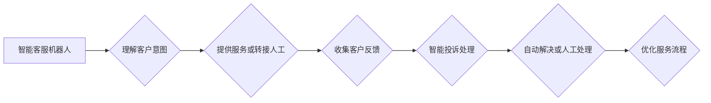

                 

## 关键词：智能客服、人工智能、自然语言处理、机器学习、投诉处理、对话系统、情感分析、预测建模

## 1. 背景介绍

随着科技的飞速发展，人工智能（AI）已经渗透到生活的方方面面，客服行业也不例外。传统的客服模式面临着效率低下、成本高昂、客户体验差等问题。智能客服机器人作为一种新兴的客服模式，凭借其24小时在线、快速响应、个性化服务等优势，逐渐成为企业提升客户服务体验的重要手段。

2050年，智能客服将更加智能化、人性化，并深度融合多项先进技术，为用户提供更加便捷、高效、个性化的服务体验。本文将探讨2050年智能客服的未来发展趋势，重点关注智能客服机器人与智能投诉处理的演进。

## 2. 核心概念与联系

### 2.1 智能客服机器人

智能客服机器人是指利用人工智能技术，能够模拟人类与客户进行自然语言交互的虚拟助手。它可以理解客户的意图，并提供相应的服务，例如回答常见问题、处理订单、预约服务等。

### 2.2 智能投诉处理

智能投诉处理是指利用人工智能技术，自动识别、分类、分析和解决客户投诉。它可以帮助企业快速响应客户投诉，提高投诉处理效率，并从中挖掘客户需求和改进服务。

**核心概念与联系流程图**



## 3. 核心算法原理 & 具体操作步骤

### 3.1 算法原理概述

智能客服机器人和智能投诉处理的核心算法主要包括：

* **自然语言处理（NLP）：** 用于理解和处理人类语言，包括文本分析、语音识别、机器翻译等。
* **机器学习（ML）：** 用于训练模型，使其能够从数据中学习并做出预测。
* **深度学习（DL）：** 用于构建更复杂的模型，例如卷积神经网络（CNN）和循环神经网络（RNN），能够处理更复杂的语言数据。
* **情感分析：** 用于识别文本或语音中的情感倾向，例如积极、消极、中性等。
* **预测建模：** 用于预测客户行为，例如投诉类型、投诉原因、投诉解决时间等。

### 3.2 算法步骤详解

**智能客服机器人：**

1. **数据收集：** 收集客户与客服人员的对话数据、常见问题解答、产品信息等。
2. **数据预处理：** 对数据进行清洗、格式化、标注等处理，使其适合模型训练。
3. **模型训练：** 使用NLP、ML、DL等算法训练模型，使其能够理解客户意图并提供相应的服务。
4. **模型评估：** 使用测试数据评估模型的性能，并进行调整和优化。
5. **部署上线：** 将训练好的模型部署到线上环境，供客户使用。

**智能投诉处理：**

1. **投诉数据收集：** 收集客户投诉数据，包括文本、语音、图片等多种形式。
2. **数据分类：** 使用NLP算法对投诉数据进行分类，例如产品问题、服务问题、价格问题等。
3. **投诉原因分析：** 使用机器学习算法分析投诉原因，例如产品缺陷、服务态度差、价格过高等。
4. **自动解决：** 根据投诉类型和原因，自动生成解决方案，例如退货退款、更换产品、提供优惠券等。
5. **人工处理：** 对无法自动解决的投诉，转交给人工客服处理。

### 3.3 算法优缺点

**优点：**

* **提高效率：** 自动化处理客户请求和投诉，提高客服效率。
* **降低成本：** 减少人工客服的成本。
* **提供24小时服务：** 不受时间限制，随时为客户提供服务。
* **个性化服务：** 根据客户的历史数据和行为，提供个性化的服务。

**缺点：**

* **理解能力有限：** 现有的AI技术仍然无法完全理解人类语言的复杂性和多义性。
* **缺乏情感共鸣：** AI机器人无法像人类一样理解和表达情感，可能会导致客户体验差。
* **数据安全问题：** AI模型需要大量客户数据进行训练，存在数据泄露和隐私保护问题。

### 3.4 算法应用领域

智能客服机器人和智能投诉处理技术广泛应用于各个行业，例如：

* 电商：处理订单、退货退款、客户咨询等。
* 金融：提供理财咨询、贷款申请、信用卡服务等。
* 医疗：预约挂号、查询病历、提供健康咨询等。
* 教育：在线答疑、课程辅导、招生咨询等。

## 4. 数学模型和公式 & 详细讲解 & 举例说明

### 4.1 数学模型构建

智能客服机器人和智能投诉处理的数学模型主要基于统计学习和深度学习。

**统计学习模型：**

* **朴素贝叶斯分类器：** 用于分类客户意图，例如“查询订单”、“投诉问题”等。

$$P(C|F) = \frac{P(F|C)P(C)}{P(F)}$$

其中：

* $P(C|F)$：给定特征 $F$ 的条件下，类别 $C$ 的概率。
* $P(F|C)$：类别 $C$ 的条件下，特征 $F$ 的概率。
* $P(C)$：类别 $C$ 的先验概率。
* $P(F)$：特征 $F$ 的概率。

* **支持向量机（SVM）：** 用于识别客户情感倾向，例如“积极”、“消极”、“中性”等。

**深度学习模型：**

* **循环神经网络（RNN）：** 用于处理序列数据，例如客户对话历史。
* **卷积神经网络（CNN）：** 用于提取文本特征，例如关键词、情感词等。

### 4.2 公式推导过程

公式推导过程涉及到概率论、统计学、线性代数等数学知识，具体推导过程可以参考相关机器学习和深度学习教材。

### 4.3 案例分析与讲解

**案例：**

假设一个电商平台的智能客服机器人需要识别客户的意图，例如“查询订单”、“退货退款”、“投诉问题”等。

**分析：**

可以使用朴素贝叶斯分类器来识别客户意图。

* 收集客户对话数据，并进行标注，例如“查询订单”、“退货退款”、“投诉问题”等。
* 使用训练数据训练朴素贝叶斯分类器模型。
* 将新客户的对话数据输入到模型中，模型会根据对话内容的特征，预测客户的意图。

**讲解：**

朴素贝叶斯分类器基于贝叶斯定理，假设特征之间相互独立，可以计算出每个类别出现的概率，并根据输入的特征数据，选择概率最高的类别作为预测结果。

## 5. 项目实践：代码实例和详细解释说明

### 5.1 开发环境搭建

* 操作系统：Windows/macOS/Linux
* Python版本：3.6+
* 必要的库：NLTK、spaCy、TensorFlow、PyTorch等

### 5.2 源代码详细实现

```python
# 使用NLTK库进行文本分类
import nltk
from nltk.classify import NaiveBayesClassifier

# 准备训练数据
training_data = [
    ("查询订单", "查询订单"),
    ("退货退款", "退货退款"),
    ("投诉问题", "投诉问题"),
    # ...
]

# 创建朴素贝叶斯分类器
classifier = NaiveBayesClassifier.train(training_data)

# 测试分类
new_text = "我想查询我的订单状态"
prediction = classifier.classify(new_text)
print(prediction)
```

### 5.3 代码解读与分析

* 代码首先导入必要的库，例如NLTK库。
* 然后准备训练数据，每个数据包含一个文本和对应的类别标签。
* 使用`NaiveBayesClassifier.train()`函数训练朴素贝叶斯分类器模型。
* 最后使用`classifier.classify()`函数对新文本进行分类，并输出预测结果。

### 5.4 运行结果展示

运行代码后，会输出预测结果，例如“查询订单”。

## 6. 实际应用场景

### 6.1 智能客服机器人

* **电商平台：** 处理客户的订单查询、退货退款、物流信息查询等问题。
* **金融机构：** 提供信用卡咨询、贷款申请、理财建议等服务。
* **航空公司：** 处理航班查询、改签退票、行李托运等问题。

### 6.2 智能投诉处理

* **制造业：** 分析客户投诉数据，识别产品缺陷，改进产品设计和生产流程。
* **服务业：** 分析客户投诉数据，识别服务质量问题，改进服务流程和员工培训。
* **政府部门：** 分析市民投诉数据，识别公共服务问题，改进公共服务政策和措施。

### 6.4 未来应用展望

未来，智能客服机器人和智能投诉处理技术将更加智能化、人性化，并深度融合多项先进技术，例如：

* **多模态交互：** 支持文本、语音、图像等多种交互方式。
* **个性化定制：** 根据客户的个人喜好和需求，提供个性化的服务体验。
* **情感识别和理解：** 能够识别和理解客户的情感状态，提供更加贴心的服务。
* **主动服务：** 基于客户行为和历史数据，主动提供服务和建议。

## 7. 工具和资源推荐

### 7.1 学习资源推荐

* **书籍：**
    * 《深度学习》
    * 《自然语言处理》
    * 《机器学习实战》
* **在线课程：**
    * Coursera
    * edX
    * Udacity

### 7.2 开发工具推荐

* **Python：** 广泛应用于人工智能开发，拥有丰富的库和工具。
* **TensorFlow：** 开源深度学习框架，支持多种硬件平台。
* **PyTorch：** 开源深度学习框架，以其灵活性和易用性而闻名。
* **spaCy：** 自然语言处理库，提供强大的文本分析功能。

### 7.3 相关论文推荐

* **BERT：** Pre-training of Deep Bidirectional Transformers for Language Understanding
* **GPT-3：** Language Models are Few-Shot Learners
* **Transformer：** Attention Is All You Need

## 8. 总结：未来发展趋势与挑战

### 8.1 研究成果总结

智能客服机器人和智能投诉处理技术取得了显著进展，能够处理越来越复杂的任务，并提供更加智能化、人性化的服务体验。

### 8.2 未来发展趋势

* **更强大的AI模型：** 随着深度学习技术的不断发展，未来将出现更加强大的AI模型，能够更好地理解和处理人类语言。
* **多模态交互：** 智能客服将支持多种交互方式，例如文本、语音、图像、视频等，提供更加丰富的服务体验。
* **个性化定制：** 智能客服将根据客户的个人喜好和需求，提供个性化的服务体验。
* **主动服务：** 智能客服将基于客户行为和历史数据，主动提供服务和建议。

### 8.3 面临的挑战

* **数据安全问题：** AI模型需要大量客户数据进行训练，存在数据泄露和隐私保护问题。
* **算法解释性问题：** 现有的AI模型难以解释其决策过程，这可能会导致客户对AI服务的信任度降低。
* **伦理问题：** AI技术的发展可能会带来一些伦理问题，例如算法偏见、工作岗位替代等。

### 8.4 研究展望

未来，我们需要继续研究和探索智能客服的应用场景，并解决其面临的挑战，使其能够更好地服务于人类社会。

## 9. 附录：常见问题与解答

**常见问题：**

* **智能客服机器人和人工客服有什么区别？**

**解答：** 智能客服机器人可以24小时在线，快速响应客户请求，并提供标准化的服务。人工客服则需要人工操作，效率相对较低，且存在时间限制。

* **智能客服机器人可以解决所有问题吗？**

**解答：** 目前，智能客服机器人仍然无法解决所有问题，例如需要专业知识或判断的复杂问题。对于这类问题，需要人工客服进行处理。

* **如何保证智能客服机器人的数据安全？**

**解答：** 企业需要采取相应的安全措施，例如数据加密、访问控制等，保护客户数据的安全。

* **智能客服机器人会取代人工客服吗？**

**解答：** 智能客服机器人可以帮助企业提高客服效率，但不会完全取代人工客服。未来，智能客服和人工客服将共同协作，为客户提供更加优质的服务体验。


作者：禅与计算机程序设计艺术 / Zen and the Art of Computer Programming<end_of_turn>

