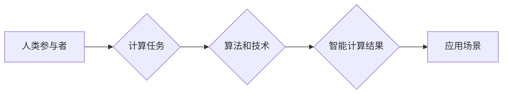

                 

## 构建更智能的世界：人类计算的应用场景

> 关键词：人类计算、人工智能、协同智能、计算模型、算法优化、应用场景、未来趋势

### 1. 背景介绍

人类文明的进步离不开对信息的获取、处理和利用。随着信息技术的飞速发展，人工智能（AI）作为信息处理和决策支持的重要工具，正在深刻地改变着我们的生活和工作方式。然而，传统的AI模型往往局限于数据驱动，缺乏对复杂、动态环境的适应能力和对人类意图的理解。

人类计算（Human Computation）应运而生，它将人类的智慧和计算能力相结合，以解决传统AI难以处理的问题。人类计算的核心思想是，将一些需要人类认知和判断的任务分配给人类参与者，并通过算法和技术手段将这些参与者的贡献整合起来，从而构建更智能、更强大的计算系统。

### 2. 核心概念与联系

人类计算的核心概念包括：

* **人类参与者:**  人类参与者可以是个人、团队或群体，他们通过各种方式参与计算任务，例如：数据标注、问题解答、创意生成等。
* **计算任务:**  人类计算的任务通常是需要人类认知和判断的，例如：图像识别、文本理解、决策支持等。
* **算法和技术:**  人类计算需要利用算法和技术手段来组织和协调人类参与者，并有效地整合他们的贡献。

**Mermaid 流程图:**



### 3. 核心算法原理 & 具体操作步骤

#### 3.1  算法原理概述

人类计算算法通常基于以下原理：

* **分而治之:** 将复杂的任务分解成多个简单易处理的任务，分配给不同的参与者。
* **协同工作:** 利用参与者的多样性，通过合作和交流，共同完成任务。
* **反馈机制:**  通过反馈机制，不断优化算法和任务分配策略，提高计算效率和准确性。

#### 3.2  算法步骤详解

1. **任务分解:** 将复杂任务分解成多个子任务，并根据子任务的性质和难度分配给不同的参与者。
2. **参与者招募:** 通过平台或其他渠道招募合适的参与者，并对他们进行培训和指导。
3. **任务分配:** 根据参与者的能力和经验，将子任务分配给相应的参与者。
4. **数据收集:** 参与者完成任务后，将结果上传到平台。
5. **数据整合:** 利用算法将参与者的结果整合起来，形成最终的计算结果。
6. **结果评估:** 对计算结果进行评估，并根据评估结果进行反馈和优化。

#### 3.3  算法优缺点

**优点:**

* **解决传统AI难以处理的问题:**  人类计算可以处理需要人类认知和判断的任务，例如：图像识别、文本理解、决策支持等。
* **提高计算效率:** 通过分工合作，可以提高计算效率。
* **降低成本:**  相比于传统计算方法，人类计算可以降低成本。

**缺点:**

* **数据质量问题:**  人类参与者的贡献可能存在偏差或错误，需要进行数据清洗和验证。
* **参与者激励机制:**  需要设计有效的激励机制，保证参与者的积极性和稳定性。
* **算法复杂度:**  人类计算算法的复杂度较高，需要不断进行优化和改进。

#### 3.4  算法应用领域

* **科学研究:**  例如：蛋白质结构预测、药物研发、气候模型构建等。
* **商业应用:**  例如：市场调研、客户服务、产品设计等。
* **社会治理:**  例如：舆情监测、风险预警、公共服务等。

### 4. 数学模型和公式 & 详细讲解 & 举例说明

#### 4.1  数学模型构建

人类计算可以采用多种数学模型来描述参与者之间的交互和任务分配过程。例如：

* **图论模型:**  将参与者和任务表示为图中的节点和边，并利用图论算法来分析参与者之间的关系和任务分配策略。
* **博弈论模型:**  将参与者之间的交互视为博弈过程，并利用博弈论理论来分析参与者的行为和决策。
* **概率模型:**  将参与者的贡献和任务结果视为随机变量，并利用概率论和统计学方法来分析和预测计算结果。

#### 4.2  公式推导过程

例如，在图论模型中，我们可以使用以下公式来计算参与者之间的连接强度：

$$
C_{ij} = \frac{N_{ij}}{N_{i}}
$$

其中：

* $C_{ij}$ 表示参与者 $i$ 和 $j$ 之间的连接强度。
* $N_{ij}$ 表示参与者 $i$ 和 $j$ 之间完成的任务数量。
* $N_{i}$ 表示参与者 $i$ 完成的所有任务数量。

#### 4.3  案例分析与讲解

例如，在蛋白质结构预测任务中，我们可以利用图论模型来分析蛋白质结构的各个部分之间的关系，并根据这些关系来预测蛋白质的整体结构。

### 5. 项目实践：代码实例和详细解释说明

#### 5.1  开发环境搭建

* **操作系统:**  Linux 或 macOS
* **编程语言:**  Python
* **开发工具:**  VS Code 或 Atom
* **库和框架:**  NumPy、Pandas、Scikit-learn、TensorFlow 或 PyTorch

#### 5.2  源代码详细实现

```python
# 人类计算任务分配示例代码

import random

# 定义参与者信息
participants = {
    "Alice": {"skills": ["图像识别", "文本理解"]},
    "Bob": {"skills": ["数据分析", "编程"]},
    "Charlie": {"skills": ["写作", "翻译"]}
}

# 定义任务信息
tasks = [
    {"id": 1, "description": "图像识别", "skills": ["图像识别"]},
    {"id": 2, "description": "文本理解", "skills": ["文本理解"]},
    {"id": 3, "description": "数据分析", "skills": ["数据分析"]},
    {"id": 4, "description": "编程", "skills": ["编程"]}
]

# 任务分配算法
def assign_tasks(participants, tasks):
    for task in tasks:
        for participant in participants:
            if all(skill in participants[participant]["skills"] for skill in task["skills"]):
                print(f"分配任务 {task['id']} 给 {participant}")
                break

# 调用任务分配算法
assign_tasks(participants, tasks)
```

#### 5.3  代码解读与分析

* 该代码定义了参与者和任务的信息，并使用一个简单的任务分配算法来分配任务给参与者。
* 算法的核心思想是：找到所有技能匹配的任务和参与者，并将其分配给参与者。
* 该代码只是一个简单的示例，实际应用中需要根据具体情况进行调整和优化。

#### 5.4  运行结果展示

```
分配任务 1 给 Alice
分配任务 2 给 Alice
分配任务 3 给 Bob
分配任务 4 给 Bob
```

### 6. 实际应用场景

#### 6.1  图像识别

人类计算可以用于图像识别任务，例如：

* **医学图像分析:**  利用人类参与者对医学图像进行标注，训练更准确的图像识别模型。
* **自动驾驶:**  利用人类参与者对道路场景进行标注，训练自动驾驶系统的视觉识别能力。

#### 6.2  文本理解

人类计算可以用于文本理解任务，例如：

* **情感分析:**  利用人类参与者对文本进行情感标注，训练情感分析模型。
* **问答系统:**  利用人类参与者对知识库进行问答，训练问答系统的理解能力。

#### 6.3  决策支持

人类计算可以用于决策支持任务，例如：

* **风险评估:**  利用人类参与者对风险事件进行评估，构建更准确的风险模型。
* **投资决策:**  利用人类参与者对市场趋势进行分析，辅助投资决策。

#### 6.4  未来应用展望

人类计算在未来将有更广泛的应用场景，例如：

* **个性化教育:**  根据学生的学习情况，利用人类参与者提供个性化的学习指导。
* **智能医疗:**  利用人类参与者对患者信息进行分析，辅助医生进行诊断和治疗。
* **创意设计:**  利用人类参与者进行创意 brainstorming，辅助设计更具创新性的产品和服务。

### 7. 工具和资源推荐

#### 7.1  学习资源推荐

* **书籍:**  《人类计算》
* **在线课程:**  Coursera、edX 等平台上的相关课程
* **博客和论坛:**  Human Computation Institute、Kaggle 等平台

#### 7.2  开发工具推荐

* **平台:**  Amazon Mechanical Turk、Figure Eight 等
* **编程语言:**  Python、Java 等
* **库和框架:**  NumPy、Pandas、Scikit-learn、TensorFlow 或 PyTorch

#### 7.3  相关论文推荐

* **人类计算的定义和分类:**  Surowiecki, J. (2004). The wisdom of crowds. Anchor Books.
* **人类计算的算法和技术:**  von Ahn, L., & Dabbish, L. (2004). Labeling images with a computer game. In Proceedings of the 2004 ACM conference on Computer supported cooperative work (pp. 319-328).
* **人类计算的应用场景:**  Kittur, A., Chi, E. H., & Pendleton, B. (2009). Crowdsourcing: A survey of the state of the art. In Proceedings of the 2009 ACM conference on Computer supported cooperative work (pp. 1-10).

### 8. 总结：未来发展趋势与挑战

#### 8.1  研究成果总结

人类计算作为一种新兴的计算模式，在解决传统AI难以处理的问题方面取得了显著的成果。

#### 8.2  未来发展趋势

* **更智能的算法:**  开发更智能、更有效的算法，提高人类计算的效率和准确性。
* **更广泛的应用场景:**  将人类计算应用于更多领域，例如：教育、医疗、金融等。
* **更有效的激励机制:**  设计更有效的激励机制，保证参与者的积极性和稳定性。

#### 8.3  面临的挑战

* **数据质量问题:**  人类参与者的贡献可能存在偏差或错误，需要进行数据清洗和验证。
* **参与者激励机制:**  需要设计有效的激励机制，保证参与者的积极性和稳定性。
* **算法复杂度:**  人类计算算法的复杂度较高，需要不断进行优化和改进。

#### 8.4  研究展望

未来，人类计算将与其他人工智能技术相结合，例如：机器学习、深度学习等，构建更智能、更强大的计算系统。


### 9. 附录：常见问题与解答

**Q1: 人类计算和传统AI有什么区别？**

**A1:**  传统AI主要依赖于数据驱动，而人类计算则将人类的智慧和计算能力相结合。

**Q2: 人类计算的应用场景有哪些？**

**A2:**  人类计算可以应用于图像识别、文本理解、决策支持等多个领域。

**Q3: 如何设计有效的激励机制？**

**A3:**  激励机制的设计需要考虑参与者的个人需求和贡献，例如：金钱奖励、声誉奖励、成就感等。


作者：禅与计算机程序设计艺术 / Zen and the Art of Computer Programming 
<end_of_turn>

