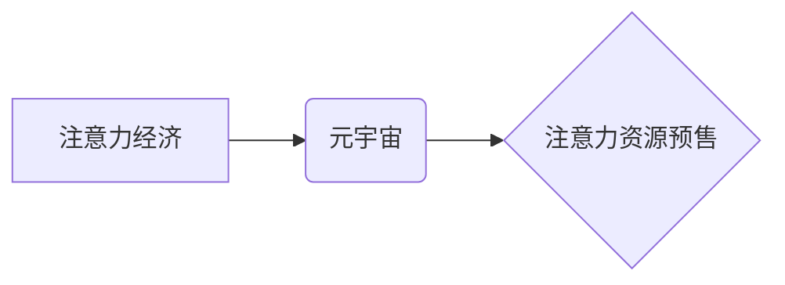

                 

## 注意力期货市场:元宇宙中的注意力资源预售

> 关键词：元宇宙、注意力经济、注意力资源、注意力期货、数据驱动、预测模型、算法优化、伦理问题

## 1. 背景介绍

元宇宙概念的兴起，标志着人类进入一个全新的数字世界。在这个虚拟世界中，人们将能够以更加沉浸的方式体验生活、工作和娱乐。然而，元宇宙的构建并非仅仅是技术层面的挑战，更重要的是如何构建一个可持续、公平、安全的数字经济体系。

注意力，作为人类认知的核心资源，在元宇宙中将变得更加宝贵。人们在元宇宙中将面临来自各种虚拟体验、内容和服务的竞争，如何有效地分配和管理注意力将成为一个关键问题。

注意力经济的概念已经逐渐深入人心，人们开始意识到注意力是新时代的稀缺资源。在元宇宙中，注意力资源将更加集中，更加可交易，也更加容易被量化和预测。

## 2. 核心概念与联系

### 2.1 注意力经济

注意力经济是指以注意力为核心资源的经济模式。在这个模式中，人们的注意力被视为一种稀缺资源，而能够吸引和获取用户注意力的产品和服务则具有更高的价值。

### 2.2 元宇宙

元宇宙是一个由虚拟现实、增强现实、区块链等技术构建的沉浸式虚拟世界。它将连接现实世界和虚拟世界，提供更加丰富、交互性和沉浸式的体验。

### 2.3 注意力资源预售

注意力资源预售是指在元宇宙中，提前预售用户未来的注意力时间。用户可以将自己的注意力时间“打包”成某种形式的虚拟资产，并在元宇宙平台上进行交易。

**核心概念关系图**



## 3. 核心算法原理 & 具体操作步骤

### 3.1 算法原理概述

注意力资源预售的核心算法原理是基于数据驱动和预测模型。通过收集用户在元宇宙中的行为数据，例如浏览时间、互动频率、兴趣偏好等，训练机器学习模型，预测用户未来在特定时间段内对不同内容或服务的注意力分配。

### 3.2 算法步骤详解

1. **数据收集:** 收集用户在元宇宙中的行为数据，包括浏览记录、互动行为、偏好设置等。
2. **数据预处理:** 对收集到的数据进行清洗、转换和特征提取，以便于模型训练。
3. **模型训练:** 使用机器学习算法，例如回归模型、神经网络等，训练预测模型，预测用户未来对不同内容或服务的注意力分配。
4. **注意力资源预售:** 根据预测模型的结果，将用户未来的注意力时间“打包”成某种形式的虚拟资产，并在元宇宙平台上进行预售。
5. **注意力资源兑换:** 用户在元宇宙中使用注意力资源，例如观看广告、参与活动、获取服务等。

### 3.3 算法优缺点

**优点:**

* **数据驱动:** 基于用户行为数据进行预测，更加准确和可信。
* **可量化:** 将注意力资源量化，方便交易和管理。
* **可预测:** 通过预测模型，可以预估用户未来的注意力分配，帮助内容提供者和服务商制定策略。

**缺点:**

* **数据隐私:** 收集和使用用户行为数据需要考虑隐私保护问题。
* **模型准确性:** 预测模型的准确性取决于数据质量和模型复杂度，存在一定的误差。
* **公平性:** 注意力资源预售可能会加剧社会不平等，需要考虑公平分配机制。

### 3.4 算法应用领域

* **内容推荐:** 根据用户注意力预测，推荐更符合用户兴趣的内容。
* **广告投放:** 根据用户注意力预测，精准投放广告，提高广告效果。
* **虚拟商品交易:** 将注意力资源作为虚拟商品交易的媒介。
* **元宇宙游戏:** 使用注意力资源作为游戏内货币或道具。

## 4. 数学模型和公式 & 详细讲解 & 举例说明

### 4.1 数学模型构建

注意力资源预售的数学模型可以基于用户行为数据和时间序列分析构建。

假设用户 $i$ 在时间 $t$ 的注意力分配为 $a_{i,t}$，则可以构建一个时间序列模型：

$$a_{i,t} = f(h_{i,t-1}, h_{i,t-2}, ..., h_{i,t-n})$$

其中，$h_{i,t}$ 为用户 $i$ 在时间 $t$ 的历史行为特征，$n$ 为历史特征的长度。

### 4.2 公式推导过程

可以使用线性回归、支持向量机、神经网络等机器学习算法对上述模型进行训练，并推导出注意力分配的预测公式。

例如，使用线性回归模型，可以得到以下预测公式：

$$a_{i,t} = \beta_0 + \beta_1 h_{i,t-1} + \beta_2 h_{i,t-2} + ... + \beta_n h_{i,t-n}$$

其中，$\beta_0, \beta_1, ..., \beta_n$ 为模型参数。

### 4.3 案例分析与讲解

假设一个用户在元宇宙中观看视频的时长、点赞次数、评论次数等行为特征作为历史行为特征。通过训练机器学习模型，可以预测该用户未来在特定时间段内观看视频的时长。

例如，如果模型预测该用户未来30分钟内观看视频的时长为15分钟，则可以将这15分钟的注意力时间“打包”成虚拟资产，并在元宇宙平台上进行预售。

## 5. 项目实践：代码实例和详细解释说明

### 5.1 开发环境搭建

* Python 3.x
* TensorFlow/PyTorch
* Jupyter Notebook

### 5.2 源代码详细实现

```python
# 导入必要的库
import pandas as pd
from sklearn.model_selection import train_test_split
from sklearn.linear_model import LinearRegression

# 加载用户行为数据
data = pd.read_csv('user_behavior.csv')

# 选择特征和目标变量
features = ['video_watch_time', 'like_count', 'comment_count']
target = 'future_watch_time'

# 将数据划分为训练集和测试集
X_train, X_test, y_train, y_test = train_test_split(data[features], data[target], test_size=0.2)

# 创建线性回归模型
model = LinearRegression()

# 训练模型
model.fit(X_train, y_train)

# 预测测试集数据
y_pred = model.predict(X_test)

# 评估模型性能
# ...
```

### 5.3 代码解读与分析

* 代码首先导入必要的库，包括 pandas 用于数据处理、sklearn 用于机器学习模型训练。
* 然后加载用户行为数据，并选择特征和目标变量。
* 使用 train_test_split 函数将数据划分为训练集和测试集。
* 创建线性回归模型，并使用 fit 函数训练模型。
* 使用 predict 函数预测测试集数据，并评估模型性能。

### 5.4 运行结果展示

* 模型训练完成后，可以查看模型的准确率、召回率、F1-score等指标，评估模型的性能。
* 可以使用可视化工具，例如 matplotlib 或 seaborn，绘制模型预测结果与实际值的对比图，直观地展示模型的预测效果。

## 6. 实际应用场景

### 6.1 内容推荐

元宇宙平台可以根据用户注意力预测，推荐更符合用户兴趣的内容。例如，如果用户在元宇宙中经常观看科技类视频，则可以推荐更多科技类视频。

### 6.2 广告投放

元宇宙平台可以根据用户注意力预测，精准投放广告，提高广告效果。例如，如果用户在元宇宙中正在浏览游戏相关内容，则可以投放游戏广告。

### 6.3 虚拟商品交易

注意力资源可以作为虚拟商品交易的媒介。例如，用户可以将自己的注意力时间“打包”成虚拟资产，并在元宇宙平台上出售给需要获取注意力资源的商家。

### 6.4 未来应用展望

注意力资源预售在元宇宙中的应用场景还有很多，例如：

* **元宇宙游戏:** 使用注意力资源作为游戏内货币或道具。
* **虚拟社交:** 用户可以根据自己的注意力时间，选择与哪些虚拟人物互动。
* **元宇宙教育:** 用户可以根据自己的注意力时间，选择学习哪些课程。

## 7. 工具和资源推荐

### 7.1 学习资源推荐

* **书籍:**

    * 《注意力经济》
    * 《元宇宙》

* **在线课程:**

    * Coursera: 机器学习
    * edX: 数据科学

### 7.2 开发工具推荐

* **Python:** 

    * TensorFlow
    * PyTorch

* **数据分析工具:**

    * pandas
    * matplotlib
    * seaborn

### 7.3 相关论文推荐

* **注意力机制在深度学习中的应用**
* **元宇宙的经济模型**

## 8. 总结：未来发展趋势与挑战

### 8.1 研究成果总结

注意力资源预售是元宇宙经济发展的重要方向之一。通过数据驱动和预测模型，可以将注意力资源量化，并将其作为虚拟资产进行交易。

### 8.2 未来发展趋势

* **模型精度提升:** 随着机器学习算法的不断发展，注意力资源预售模型的精度将会不断提升。
* **应用场景拓展:** 注意力资源预售的应用场景将会不断拓展，覆盖更多元宇宙领域。
* **伦理规范制定:** 随着注意力资源预售的普及，需要制定相应的伦理规范，确保其公平、透明、安全。

### 8.3 面临的挑战

* **数据隐私保护:** 收集和使用用户行为数据需要考虑隐私保护问题。
* **模型公平性:** 注意力资源预售模型可能会存在偏见，导致社会不平等加剧。
* **监管政策:** 需要制定相应的监管政策，规范注意力资源预售市场。

### 8.4 研究展望

未来，注意力资源预售的研究将更加注重以下几个方面:

* **隐私保护技术:** 开发更加隐私保护的注意力资源预售模型。
* **公平性算法:** 研究更加公平的注意力资源预售算法。
* **伦理规范体系:** 建立完善的注意力资源预售伦理规范体系。

## 9. 附录：常见问题与解答

* **注意力资源预售是否安全？**

注意力资源预售平台需要采取相应的安全措施，例如身份验证、数据加密等，确保用户资金安全。

* **注意力资源预售是否公平？**

注意力资源预售平台需要制定公平的分配机制，避免出现垄断或不公平竞争的情况。

* **注意力资源预售对用户隐私有什么影响？**

注意力资源预售平台需要明确用户隐私政策，并采取相应的措施保护用户隐私。

作者：禅与计算机程序设计艺术 / Zen and the Art of Computer Programming


<end_of_turn>

