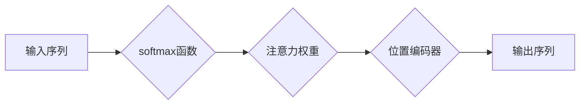

                 

## 1. 背景介绍

深度学习的蓬勃发展离不开各种创新性的架构和技术，其中注意力机制（Attention Mechanism）作为一种重要的突破，在自然语言处理（NLP）、计算机视觉（CV）等领域取得了显著的成果。注意力机制的核心思想是让模型关注输入序列中与当前任务最相关的部分，从而提高模型的理解能力和准确性。

传统的循环神经网络（RNN）在处理长序列数据时存在梯度消失和梯度爆炸的问题，难以捕捉长距离依赖关系。注意力机制的出现有效解决了这一难题，它允许模型在处理序列时动态地分配注意力权重，从而聚焦于与当前任务最相关的部分，忽略无关信息。

## 2. 核心概念与联系

### 2.1  softmax函数

softmax函数是注意力机制的核心之一，它将一个向量映射到一个概率分布，每个元素代表了对相应输入的关注程度。

**原理：** softmax函数将每个输入元素通过指数函数进行变换，然后归一化，使得所有元素之和为1。

**公式：**

$$
softmax(x_i) = \frac{e^{x_i}}{\sum_{j=1}^{n} e^{x_j}}
$$

其中：

* $x_i$ 是输入向量中的第i个元素
* $n$ 是输入向量的长度

**作用：** softmax函数将输入向量转换为概率分布，表示模型对每个输入元素的关注程度。

### 2.2  位置编码器

位置编码器是另一个重要的概念，它为输入序列中的每个元素添加位置信息，使模型能够理解输入元素的顺序关系。

**原理：** 位置编码器通常使用sinusoidal函数来生成位置编码，每个维度对应不同的频率，从而为每个位置编码一个独特的向量。

**作用：** 位置编码器为输入序列添加位置信息，使模型能够理解输入元素的顺序关系。

**Mermaid 流程图：**



## 3. 核心算法原理 & 具体操作步骤

### 3.1  算法原理概述

注意力机制的核心思想是通过计算输入序列中每个元素与当前任务相关的程度，动态地分配注意力权重，从而聚焦于与当前任务最相关的部分。

**步骤：**

1. 计算每个输入元素与当前任务相关的程度，通常使用一个查询（Query）、键（Key）和值（Value）三者的点积操作。
2. 使用 softmax 函数将计算出的相关程度转换为概率分布，得到每个输入元素的注意力权重。
3. 根据注意力权重，对输入序列进行加权求和，得到最终的输出。

### 3.2  算法步骤详解

1. **查询（Query）、键（Key）和值（Value）的计算：**

   * 将输入序列映射到三个不同的向量空间：查询空间、键空间和值空间。
   * 每个输入元素在三个空间中对应一个向量：Query、Key和Value。

2. **点积计算：**

   * 计算每个 Query 向量与所有 Key 向量之间的点积，得到一个得分矩阵。
   * 得分矩阵表示每个 Query 向量与每个 Key 向量之间的相关程度。

3. **softmax归一化：**

   * 对得分矩阵应用 softmax 函数，得到每个 Query 向量对每个 Key 向量关注的概率分布。

4. **加权求和：**

   * 根据注意力权重，对每个 Query 向量对应的 Value 向量进行加权求和，得到最终的输出。

### 3.3  算法优缺点

**优点：**

* 能够捕捉长距离依赖关系，解决 RNN 的梯度消失问题。
* 可以动态地分配注意力权重，聚焦于与当前任务最相关的部分。
* 在 NLP、CV 等领域取得了显著的成果。

**缺点：**

* 计算复杂度较高，训练时间较长。
* 难以解释模型的注意力机制，难以理解模型是如何做出决策的。

### 3.4  算法应用领域

注意力机制广泛应用于各种深度学习领域，包括：

* **自然语言处理：** 机器翻译、文本摘要、问答系统、情感分析等。
* **计算机视觉：** 图像分类、目标检测、图像 captioning 等。
* **语音识别：** 语音转文本、语音合成等。
* **推荐系统：** 用户个性化推荐、商品推荐等。

## 4. 数学模型和公式 & 详细讲解 & 举例说明

### 4.1  数学模型构建

注意力机制的数学模型可以概括为以下步骤：

1. **输入序列：** 输入序列为一个长度为 $n$ 的向量序列 $X = \{x_1, x_2, ..., x_n\}$。

2. **查询、键和值矩阵：** 将输入序列映射到三个不同的向量空间：查询空间、键空间和值空间。每个空间对应一个矩阵：$Q \in R^{n \times d_q}$, $K \in R^{n \times d_k}$, $V \in R^{n \times d_v}$。其中，$d_q$, $d_k$, $d_v$ 分别是查询、键和值向量的维度。

3. **注意力权重计算：** 计算每个 Query 向量与所有 Key 向量之间的点积，得到一个得分矩阵 $S \in R^{n \times n}$。

$$
S_{ij} = Q_i \cdot K_j
$$

4. **softmax归一化：** 对得分矩阵应用 softmax 函数，得到每个 Query 向量对每个 Key 向量关注的概率分布 $A \in R^{n \times n}$。

$$
A_{ij} = softmax(S_{ij})
$$

5. **加权求和：** 根据注意力权重，对每个 Query 向量对应的 Value 向量进行加权求和，得到最终的输出 $O \in R^{n \times d_v}$。

$$
O_i = \sum_{j=1}^{n} A_{ij} V_j
$$

### 4.2  公式推导过程

**注意力权重计算：**

点积操作是计算 Query 向量与 Key 向量相关程度的常用方法。点积的结果越大，表示两个向量之间的相关程度越高。

**softmax归一化：**

softmax 函数将得分矩阵转换为概率分布，使得每个元素代表了对相应输入的关注程度。

**加权求和：**

加权求和将每个 Value 向量根据其对应的注意力权重进行加权求和，得到最终的输出。

### 4.3  案例分析与讲解

**机器翻译：**

在机器翻译任务中，注意力机制可以帮助模型关注源语言中与目标语言单词相关的部分，从而提高翻译的准确性。

**举例：**

源语言句子： "The cat sat on the mat."

目标语言句子： "Le chat s'est assis sur le tapis."

注意力机制可以帮助模型关注 "cat" 和 "sat" 等单词，并将它们与目标语言单词 "chat" 和 "s'est assis" 关联起来，从而提高翻译的准确性。

## 5. 项目实践：代码实例和详细解释说明

### 5.1  开发环境搭建

* Python 3.6+
* TensorFlow 或 PyTorch

### 5.2  源代码详细实现

```python
import tensorflow as tf

# 定义注意力机制层
class AttentionLayer(tf.keras.layers.Layer):
    def __init__(self, units):
        super(AttentionLayer, self).__init__()
        self.Wq = tf.keras.layers.Dense(units)
        self.Wk = tf.keras.layers.Dense(units)
        self.Wv = tf.keras.layers.Dense(units)
        self.dense = tf.keras.layers.Dense(units)

    def call(self, inputs):
        # 分别计算 Query、Key 和 Value 向量
        Q = self.Wq(inputs)
        K = self.Wk(inputs)
        V = self.Wv(inputs)

        # 计算注意力权重
        attention_scores = tf.matmul(Q, K, transpose_b=True)
        attention_weights = tf.nn.softmax(attention_scores, axis=-1)

        # 加权求和
        output = tf.matmul(attention_weights, V)
        return self.dense(output)

# 示例用法
inputs = tf.random.normal(shape=(10, 50, 128))
attention_layer = AttentionLayer(units=64)
output = attention_layer(inputs)
print(output.shape)
```

### 5.3  代码解读与分析

* **AttentionLayer 类：** 定义了一个注意力机制层，包含三个权重矩阵：WQ、WK、WV，用于计算 Query、Key 和 Value 向量。
* **call 方法：** 实现了注意力机制的计算过程，包括计算注意力权重和加权求和。
* **示例用法：** 创建了一个 AttentionLayer 实例，并将其应用于一个随机输入，输出结果的形状为 (10, 50, 64)。

### 5.4  运行结果展示

运行上述代码，输出结果为一个形状为 (10, 50, 64) 的张量，表示经过注意力机制处理后的输出。

## 6. 实际应用场景

### 6.1  机器翻译

注意力机制在机器翻译中可以帮助模型关注源语言中与目标语言单词相关的部分，从而提高翻译的准确性。

### 6.2  文本摘要

注意力机制可以帮助模型识别文本中最关键的信息，并生成简洁准确的摘要。

### 6.3  问答系统

注意力机制可以帮助模型理解问题和上下文，并找到最相关的答案。

### 6.4  未来应用展望

注意力机制在未来将有更广泛的应用，例如：

* **自动驾驶：** 帮助模型关注道路上的关键信息，提高驾驶安全。
* **医疗诊断：** 帮助模型识别病人的关键症状，提高诊断准确性。
* **金融分析：** 帮助模型分析市场数据，预测股票价格。

## 7. 工具和资源推荐

### 7.1  学习资源推荐

* **论文：**
    * "Attention Is All You Need"
    * "BERT: Pre-training of Deep Bidirectional Transformers for Language Understanding"
* **博客：**
    * Jay Alammar's Blog: https://jalammar.github.io/
    * Distill.pub: https://distill.pub/

### 7.2  开发工具推荐

* **TensorFlow:** https://www.tensorflow.org/
* **PyTorch:** https://pytorch.org/

### 7.3  相关论文推荐

* "Attention Is All You Need"
* "BERT: Pre-training of Deep Bidirectional Transformers for Language Understanding"
* "Transformer-XL: Attentive Language Models Beyond a Fixed-Length Context"

## 8. 总结：未来发展趋势与挑战

### 8.1  研究成果总结

注意力机制在深度学习领域取得了显著的成果，在 NLP、CV 等领域取得了突破性的进展。

### 8.2  未来发展趋势

* **更有效的注意力机制：** 研究更有效的注意力机制，例如自注意力机制、多头注意力机制等。
* **注意力机制的解释性：** 研究注意力机制的解释性，理解模型是如何做出决策的。
* **注意力机制的应用扩展：** 将注意力机制应用于更多领域，例如自动驾驶、医疗诊断等。

### 8.3  面临的挑战

* **计算复杂度：** 注意力机制的计算复杂度较高，难以在大型模型中应用。
* **参数量：** 注意力机制的参数量较大，需要大量的训练数据才能训练出效果好的模型。
* **可解释性：** 注意力机制的决策过程难以解释，难以理解模型是如何做出决策的。

### 8.4  研究展望

未来，注意力机制的研究将继续深入，探索更有效的、更可解释的注意力机制，并将其应用于更多领域，推动深度学习技术的进步。

## 9. 附录：常见问题与解答

**Q1：注意力机制的原理是什么？**

**A1：** 注意力机制的核心思想是通过计算输入序列中每个元素与当前任务相关的程度，动态地分配注意力权重，从而聚焦于与当前任务最相关的部分。

**Q2：注意力机制有哪些应用场景？**

**A2：** 注意力机制广泛应用于各种深度学习领域，包括机器翻译、文本摘要、问答系统、图像分类、目标检测等。

**Q3：注意力机制的优缺点是什么？**

**A3：** 注意力机制的优点是能够捕捉长距离依赖关系，并动态地分配注意力权重，聚焦于与当前任务最相关的部分。缺点是计算复杂度较高，难以解释模型的注意力机制。


作者：禅与计算机程序设计艺术 / Zen and the Art of Computer Programming 
<end_of_turn>

