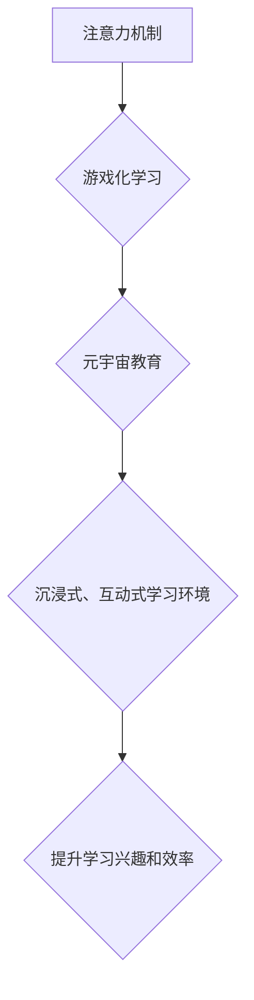

                 

## 注意力游戏化学习:元宇宙教育的创新方法

> 关键词：注意力、游戏化学习、元宇宙、教育、人工智能、沉浸式体验、互动学习

## 1. 背景介绍

在当今数字化时代，教育领域面临着前所未有的挑战和机遇。传统教育模式的局限性日益凸显，学生学习兴趣下降、注意力分散、学习效率低下等问题日益普遍。而元宇宙作为一种新兴的虚拟现实技术，为教育领域带来了全新的可能性。元宇宙能够提供沉浸式、互动式的学习环境，激发学生的学习兴趣，提升学习效率。

注意力是学习的关键要素，然而，在信息爆炸的时代，学生容易受到各种干扰，注意力难以集中。游戏化学习则通过将游戏元素融入学习内容，激发学生的学习兴趣和参与度，从而有效提升学生的注意力。将注意力机制与游戏化学习相结合，并应用于元宇宙教育，可以构建一个更加沉浸式、互动式、个性化的学习环境，有效解决传统教育模式的弊端，为学生提供更加高效、有趣、有意义的学习体验。

## 2. 核心概念与联系

### 2.1 注意力机制

注意力机制是近年来深度学习领域取得的重要突破，它能够模拟人类的注意力机制，学习到输入数据中最重要的部分，从而提高模型的学习效率和准确性。注意力机制的核心思想是通过一个注意力权重来分配输入数据的不同部分的关注度，权重越高，表示该部分信息越重要。

### 2.2 游戏化学习

游戏化学习是指将游戏元素融入学习内容，以提高学生的学习兴趣和参与度。常见的游戏化学习元素包括：

* **目标和奖励:** 设置明确的学习目标和奖励机制，激励学生积极参与学习。
* **竞争和合作:** 通过竞争和合作的方式，激发学生的学习动力和团队合作精神。
* **反馈和进度追踪:** 及时提供反馈和进度追踪，帮助学生了解自己的学习情况，并及时调整学习策略。
* **沉浸式体验:** 通过虚拟现实、增强现实等技术，构建沉浸式的学习环境，增强学生的学习体验。

### 2.3 元宇宙教育

元宇宙教育是指利用元宇宙技术构建虚拟的学习环境，提供沉浸式、互动式的学习体验。元宇宙教育的特点包括：

* **虚拟化:** 将现实世界中的学习场景虚拟化，提供更加丰富的学习环境。
* **互动性:** 学生可以与虚拟角色、虚拟环境进行互动，体验更加生动的学习过程。
* **个性化:** 元宇宙教育可以根据学生的学习进度、学习风格等特点，提供个性化的学习内容和学习路径。
* **全球化:** 元宇宙教育可以打破地域限制，让学生来自世界各地进行学习交流。

**核心概念与联系流程图:**



## 3. 核心算法原理 & 具体操作步骤

### 3.1 算法原理概述

注意力机制在游戏化学习和元宇宙教育中的应用主要基于以下算法原理：

* **自注意力机制:**  自注意力机制能够学习到输入序列中不同元素之间的关系，并根据这些关系分配注意力权重。
* **Transformer模型:** Transformer模型是一种基于自注意力机制的深度学习模型，能够有效处理长序列数据，在自然语言处理、机器翻译等领域取得了优异的性能。
* **强化学习:** 强化学习可以训练智能体在虚拟环境中学习，并通过奖励机制引导智能体做出更优的决策。

### 3.2 算法步骤详解

1. **数据预处理:** 将学习内容转换为数字格式，例如将文本转换为词向量，将图像转换为像素数据。
2. **注意力机制构建:** 根据具体的应用场景，选择合适的注意力机制，例如自注意力机制、多头注意力机制等。
3. **模型训练:** 使用Transformer模型或其他深度学习模型，结合注意力机制进行训练，学习到学习内容的特征表示和注意力权重。
4. **游戏化元素设计:** 根据训练好的模型，设计游戏化的学习内容和奖励机制，例如设置学习目标、提供反馈、进行排行榜排名等。
5. **元宇宙环境构建:** 利用元宇宙技术构建虚拟的学习环境，并根据模型的输出，动态调整虚拟环境的场景、内容和交互方式。

### 3.3 算法优缺点

**优点:**

* **提升学习兴趣:** 游戏化元素能够激发学生的学习兴趣，提高学习参与度。
* **增强注意力:** 注意力机制能够帮助学生集中注意力，提高学习效率。
* **个性化学习:** 元宇宙教育可以根据学生的学习进度和风格提供个性化的学习内容和路径。
* **沉浸式体验:** 元宇宙环境能够提供更加沉浸式的学习体验，增强学生的学习效果。

**缺点:**

* **技术复杂:** 元宇宙教育技术复杂，需要专业的技术团队进行开发和维护。
* **成本高昂:** 元宇宙教育的硬件设备和软件开发成本较高。
* **伦理问题:** 元宇宙教育涉及到学生隐私、数据安全等伦理问题，需要谨慎处理。

### 3.4 算法应用领域

注意力游戏化学习和元宇宙教育的应用领域非常广泛，包括：

* **K12教育:** 提升学生的学习兴趣和效率，提供个性化的学习体验。
* **高等教育:** 增强学生的学习互动性和参与度，提供更加沉浸式的学习环境。
* **职业培训:** 提供更加高效、灵活、个性化的职业技能培训。
* **远程教育:** 突破地域限制，提供更加便捷、灵活的远程教育服务。

## 4. 数学模型和公式 & 详细讲解 & 举例说明

### 4.1 数学模型构建

注意力机制的核心是注意力权重，它决定了模型对输入序列中不同元素的关注程度。常用的注意力权重计算公式如下：

$$
\text{Attention}(Q, K, V) = \text{softmax}\left(\frac{Q K^T}{\sqrt{d_k}}\right) V
$$

其中：

* $Q$：查询矩阵，表示模型对输入序列的查询。
* $K$：键矩阵，表示输入序列中每个元素的特征。
* $V$：值矩阵，表示输入序列中每个元素的实际值。
* $d_k$：键向量的维度。
* $\text{softmax}$：softmax函数，将注意力权重归一化到0到1之间。

### 4.2 公式推导过程

注意力权重计算公式的推导过程如下：

1. 计算查询矩阵 $Q$ 和键矩阵 $K$ 的点积，即 $QK^T$。
2. 将点积结果除以键向量的维度 $\sqrt{d_k}$，以进行归一化。
3. 应用softmax函数对归一化后的结果进行归一化，得到注意力权重矩阵。
4. 将注意力权重矩阵与值矩阵 $V$ 进行加权求和，得到最终的注意力输出。

### 4.3 案例分析与讲解

例如，在机器翻译任务中，输入句子可以看作是一个序列，每个单词都是一个元素。查询矩阵 $Q$ 表示模型对目标语言单词的查询，键矩阵 $K$ 表示源语言单词的特征，值矩阵 $V$ 表示源语言单词的实际含义。通过注意力机制，模型可以学习到源语言单词与目标语言单词之间的关系，并根据这些关系分配注意力权重，从而更好地翻译句子。

## 5. 项目实践：代码实例和详细解释说明

### 5.1 开发环境搭建

* **操作系统:** Ubuntu 20.04 LTS
* **编程语言:** Python 3.8
* **深度学习框架:** TensorFlow 2.x
* **虚拟环境:** conda

### 5.2 源代码详细实现

```python
import tensorflow as tf

# 定义注意力机制
def attention_mechanism(query, key, value, mask=None):
    # 计算注意力权重
    scores = tf.matmul(query, key, transpose_b=True) / tf.math.sqrt(tf.cast(key.shape[-1], tf.float32))
    if mask is not None:
        scores += (1 - tf.cast(mask, tf.float32)) * -1e9
    attention_weights = tf.nn.softmax(scores, axis=-1)
    # 计算注意力输出
    context_vector = tf.matmul(attention_weights, value)
    return context_vector, attention_weights

# 定义Transformer模型
class Transformer(tf.keras.Model):
    def __init__(self, num_layers, d_model, num_heads):
        super(Transformer, self).__init__()
        self.num_layers = num_layers
        self.d_model = d_model
        self.num_heads = num_heads
        self.encoder_layers = [
            tf.keras.layers.MultiHeadAttention(num_heads=num_heads, key_dim=d_model)
            for _ in range(num_layers)
        ]
        self.decoder_layers = [
            tf.keras.layers.MultiHeadAttention(num_heads=num_heads, key_dim=d_model)
            for _ in range(num_layers)
        ]

    def call(self, inputs):
        # ...
        return outputs

# 训练模型
model = Transformer(num_layers=6, d_model=512, num_heads=8)
model.compile(optimizer='adam', loss='mse')
model.fit(train_data, train_labels, epochs=10)

```

### 5.3 代码解读与分析

* **注意力机制:** 代码中定义了 `attention_mechanism` 函数，实现自注意力机制的计算。
* **Transformer模型:** 代码中定义了 `Transformer` 类，实现了一个基本的Transformer模型。
* **模型训练:** 代码中使用 `model.compile` 和 `model.fit` 函数训练模型。

### 5.4 运行结果展示

训练完成后，可以使用 `model.evaluate` 函数评估模型的性能，并使用 `model.predict` 函数对新的输入数据进行预测。

## 6. 实际应用场景

### 6.1 元宇宙教育平台

元宇宙教育平台可以利用注意力游戏化学习和元宇宙技术，构建沉浸式的学习环境，提供个性化的学习内容和体验。例如，学生可以身临其境地体验历史场景、探索宇宙奥秘、进行虚拟实验室实验等。

### 6.2 在线学习游戏

在线学习游戏可以将游戏元素融入学习内容，激发学生的学习兴趣和参与度。例如，学生可以通过完成学习任务获得经验值、升级角色、解锁新内容等。

### 6.3 虚拟现实培训

虚拟现实培训可以利用元宇宙技术，构建虚拟的培训环境，提供更加安全、高效、沉浸式的培训体验。例如，医生可以通过虚拟现实模拟手术场景进行练习，飞行员可以通过虚拟现实模拟飞行场景进行训练。

### 6.4 未来应用展望

注意力游戏化学习和元宇宙教育的应用前景广阔，未来将有更多创新应用场景出现，例如：

* **元宇宙课堂:** 学生可以在虚拟课堂中与老师和同学互动，进行协作学习。
* **个性化学习路径:** 根据学生的学习进度和风格，自动生成个性化的学习路径。
* **沉浸式博物馆:** 学生可以在虚拟博物馆中探索历史文物、艺术作品等。
* **虚拟社交学习:** 学生可以在虚拟世界中与来自世界各地的同学交流学习。

## 7. 工具和资源推荐

### 7.1 学习资源推荐

* **书籍:**
    * 《深度学习》
    * 《Transformer模型》
    * 《元宇宙》
* **在线课程:**
    * Coursera: 深度学习
    * edX: Transformer模型
    * Udemy: 元宇宙开发

### 7.2 开发工具推荐

* **深度学习框架:** TensorFlow, PyTorch
* **元宇宙平台:** Unity, Unreal Engine
* **虚拟现实设备:** Oculus Quest, HTC Vive

### 7.3 相关论文推荐

* 《Attention Is All You Need》
* 《BERT: Pre-training of Deep Bidirectional Transformers for Language Understanding》
* 《Metaverse: A New Paradigm for Education》

## 8. 总结：未来发展趋势与挑战

### 8.1 研究成果总结

注意力游戏化学习和元宇宙教育的研究取得了显著进展，为教育领域带来了新的可能性。注意力机制能够有效提升学习效率，游戏化元素能够激发学习兴趣，元宇宙技术能够提供沉浸式的学习体验。

### 8.2 未来发展趋势

未来，注意力游戏化学习和元宇宙教育将朝着以下方向发展：

* **更智能化的学习体验:** 利用人工智能技术，实现更加个性化、智能化的学习体验。
* **更丰富的元宇宙场景:** 开发更加丰富、生动的元宇宙场景，提供更加沉浸式的学习体验。
* **更广泛的应用场景:** 将注意力游戏化学习和元宇宙教育应用到更多领域，例如职业培训、远程教育等。

### 8.3 面临的挑战

注意力游戏化学习和元宇宙教育也面临着一些挑战：

* **技术复杂性:** 元宇宙技术和深度学习技术都比较复杂，需要专业的技术团队进行开发和维护。
* **成本高昂:** 元宇宙教育的硬件设备和软件开发成本较高，需要投入大量的资金。
* **伦理问题:** 元宇宙教育涉及到学生隐私、数据安全等伦理问题，需要谨慎处理。

### 8.4 研究展望

未来，我们需要继续深入研究注意力机制、游戏化学习和元宇宙技术，解决技术难题，降低成本，并关注伦理问题，推动注意力游戏化学习和元宇宙教育的健康发展。

## 9. 附录：常见问题与解答

**Q1: 注意力机制是如何工作的？**

A1: 注意力机制通过一个注意力权重来分配输入数据的不同部分的关注度，权重越高，表示该部分信息越重要。

**Q2: 游戏化学习有哪些优点？**

A2: 游戏化学习能够激发学生的学习兴趣、提高学习参与度、增强学习效果。

**Q3: 元宇宙教育有哪些应用场景？**

A3: 元宇宙教育可以应用于K12教育、高等教育、职业培训、远程教育等领域。

**Q4: 注意力游戏化学习和元宇宙教育面临哪些挑战？**

A4: 这些技术面临的技术复杂性、成本高昂、伦理问题等挑战。

**Q5: 未来注意力游戏化学习和元宇宙教育的发展趋势是什么？**

A5: 未来将更加智能化、丰富化、广泛化。


作者：禅与计算机程序设计艺术 / Zen and the Art of Computer Programming<end_of_turn>

