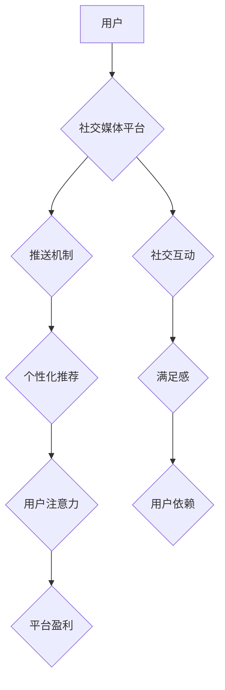

                 

## 1. 背景介绍

在当今数字时代，我们被无处不在的互联网和社交媒体所包围。这些平台提供了便捷的信息获取、社交互动和娱乐方式，但也带来了新的挑战——注意力经济和社交媒体依赖。

注意力，是人类宝贵的资源，它决定了我们学习、工作和生活的效率。然而，社交媒体的推送机制和信息爆炸式增长，不断地争夺着我们的注意力，导致我们难以集中精力，难以深度思考。

社交媒体依赖，是指过度依赖社交媒体，无法控制使用时间，对社交媒体断开连接感到焦虑或不安的现象。它不仅影响我们的个人生活，也可能导致工作效率低下、人际关系疏远、心理健康问题等。

## 2. 核心概念与联系

### 2.1 注意力经济

注意力经济是指在信息过剩的时代，注意力成为一种稀缺资源，而能够有效获取和利用注意力的人或平台，就能获得更大的经济利益。

社交媒体平台通过各种算法和设计，例如推送机制、个性化推荐、无限滚动等，不断地刺激用户的注意力，并通过广告、数据分析等方式获取利润。

### 2.2 社交媒体依赖

社交媒体依赖是指对社交媒体过度依赖，无法控制使用时间，对社交媒体断开连接感到焦虑或不安的现象。

它与注意力经济密切相关，因为社交媒体平台通过获取用户的注意力，来维持其商业模式，而用户为了获得满足感和社交认可，也更容易沉迷于社交媒体。

**Mermaid 流程图**



## 3. 核心算法原理 & 具体操作步骤

### 3.1 算法原理概述

社交媒体平台使用的算法主要包括：

* **推荐算法:** 根据用户的历史行为、兴趣爱好等信息，推荐相关的内容，以吸引用户的注意力。
* **推送算法:** 根据用户的在线状态、活跃时间等信息，推送通知和消息，提醒用户及时查看平台内容。
* **内容排序算法:** 根据内容的受欢迎程度、时效性等因素，对内容进行排序，展示给用户。

这些算法通常基于机器学习和深度学习技术，通过训练大量的用户数据，不断优化算法模型，提高推荐和推送的精准度。

### 3.2 算法步骤详解

**推荐算法步骤:**

1. **数据收集:** 收集用户的行为数据，例如浏览记录、点赞、评论、分享等。
2. **特征提取:** 从用户行为数据中提取特征，例如用户兴趣爱好、阅读偏好、社交关系等。
3. **模型训练:** 使用机器学习算法，训练推荐模型，学习用户行为模式。
4. **内容推荐:** 根据用户的特征和模型预测，推荐相关的内容。

**推送算法步骤:**

1. **用户状态监测:** 监测用户的在线状态、活跃时间等信息。
2. **推送时机判断:** 根据用户状态和平台规则，判断推送通知的最佳时机。
3. **消息内容生成:** 根据用户兴趣和平台内容，生成个性化的推送消息。
4. **消息发送:** 发送推送消息到用户的设备。

### 3.3 算法优缺点

**优点:**

* **个性化推荐:** 能够根据用户的兴趣爱好，推荐更符合其需求的内容。
* **提高用户粘性:** 通过推送机制和个性化推荐，提高用户使用平台的频率和时长。
* **精准广告投放:** 根据用户特征，精准投放广告，提高广告转化率。

**缺点:**

* **信息茧房:** 推荐算法可能会导致用户只接触到自己感兴趣的信息，形成信息茧房，限制视野。
* **注意力碎片化:** 推送机制和个性化推荐，会不断地打断用户的注意力，导致注意力碎片化。
* **数据隐私问题:** 收集和利用用户数据，可能会引发数据隐私问题。

### 3.4 算法应用领域

社交媒体推荐和推送算法广泛应用于：

* **社交媒体平台:** Facebook、Twitter、Instagram、TikTok等。
* **电商平台:** Amazon、淘宝、京东等。
* **新闻资讯平台:** 新浪、腾讯、今日头条等。
* **视频网站:** YouTube、Bilibili等。

## 4. 数学模型和公式 & 详细讲解 & 举例说明

### 4.1 数学模型构建

推荐算法通常使用协同过滤模型，例如用户-物品评分矩阵。

**用户-物品评分矩阵:**

* 行表示用户，列表示物品。
* 每个单元格表示用户对物品的评分。

**公式:**

$$
R(u, i) = \text{预测用户u对物品i的评分}
$$

### 4.2 公式推导过程

协同过滤模型通过分析用户的评分历史，预测用户对未评分物品的评分。

**基于用户的协同过滤:**

* 找到与用户u评分相似度的用户v。
* 计算用户v对物品i的平均评分。
* 根据相似度权重，预测用户u对物品i的评分。

**基于物品的协同过滤:**

* 找到与物品i评分相似度的物品j。
* 计算用户u对物品j的平均评分。
* 根据相似度权重，预测用户u对物品i的评分。

### 4.3 案例分析与讲解

**举例:**

假设用户A和用户B都对电影A和电影B评分了，并且他们的评分相似度很高。

如果用户A对电影C评分很高，而用户B对电影C没有评分，那么我们可以基于用户的协同过滤，预测用户A对电影C的评分。

## 5. 项目实践：代码实例和详细解释说明

### 5.1 开发环境搭建

* Python 3.x
* Pandas
* Scikit-learn

### 5.2 源代码详细实现

```python
import pandas as pd
from sklearn.metrics.pairwise import cosine_similarity

# 加载用户-物品评分矩阵
ratings = pd.read_csv('ratings.csv')

# 计算用户之间的相似度
user_similarity = cosine_similarity(ratings)

# 预测用户对物品的评分
def predict_rating(user_id, item_id):
    # 找到与用户相似度最高的k个用户
    k = 5
    similar_users = user_similarity[user_id].argsort()[-k:][::-1]

    # 计算预测评分
    predicted_rating = 0
    for user in similar_users:
        if ratings.loc[user, item_id] is not None:
            predicted_rating += ratings.loc[user, item_id] * user_similarity[user_id][user]
    return predicted_rating / sum(user_similarity[user_id][similar_users])

# 预测用户1对物品5的评分
predicted_rating = predict_rating(1, 5)
print(f'预测用户1对物品5的评分: {predicted_rating}')
```

### 5.3 代码解读与分析

* 代码首先加载用户-物品评分矩阵。
* 然后使用cosine_similarity计算用户之间的相似度。
* predict_rating函数根据用户相似度，预测用户对物品的评分。
* 最后，代码预测用户1对物品5的评分。

### 5.4 运行结果展示

运行结果将显示预测用户1对物品5的评分。

## 6. 实际应用场景

### 6.1 社交媒体推荐

社交媒体平台使用推荐算法，推荐用户可能感兴趣的内容，例如新闻、视频、帖子等。

### 6.2 个性化广告投放

电商平台和广告平台使用推荐算法，根据用户的兴趣爱好和行为数据，精准投放广告。

### 6.3 内容排序

新闻资讯平台和视频网站使用内容排序算法，根据内容的受欢迎程度和时效性，对内容进行排序，展示给用户。

### 6.4 未来应用展望

* **更精准的推荐:** 利用深度学习和自然语言处理技术，实现更精准的个性化推荐。
* **增强用户体验:** 通过更智能的推荐和推送机制，增强用户的体验和粘性。
* **解决信息茧房问题:** 开发算法，帮助用户打破信息茧房，接触更多元的观点和信息。

## 7. 工具和资源推荐

### 7.1 学习资源推荐

* **书籍:**

    * 《推荐系统实践》
    * 《深度学习》

* **在线课程:**

    * Coursera: Recommender Systems
    * Udacity: Machine Learning Engineer Nanodegree

### 7.2 开发工具推荐

* **Python:** 广泛用于机器学习和数据分析。
* **Scikit-learn:** Python机器学习库。
* **TensorFlow:** 深度学习框架。
* **PyTorch:** 深度学习框架。

### 7.3 相关论文推荐

* **Collaborative Filtering for Implicit Feedback Datasets**
* **Deep Learning for Recommender Systems**

## 8. 总结：未来发展趋势与挑战

### 8.1 研究成果总结

注意力经济和社交媒体依赖是当今社会面临的重要挑战。

推荐和推送算法在社交媒体平台中发挥着重要作用，但也带来了新的问题，例如信息茧房和注意力碎片化。

### 8.2 未来发展趋势

未来，推荐和推送算法将更加智能化、个性化和透明化。

* **更精准的推荐:** 利用深度学习和自然语言处理技术，实现更精准的个性化推荐。
* **增强用户体验:** 通过更智能的推荐和推送机制，增强用户的体验和粘性。
* **解决信息茧房问题:** 开发算法，帮助用户打破信息茧房，接触更多元的观点和信息。

### 8.3 面临的挑战

* **数据隐私问题:** 收集和利用用户数据，可能会引发数据隐私问题。
* **算法公平性:** 算法可能会存在偏见，导致不公平的结果。
* **用户信任问题:** 用户对算法的透明度和可解释性要求越来越高。

### 8.4 研究展望

未来研究需要关注以下几个方面:

* 开发更公平、更透明的推荐算法。
* 研究如何帮助用户更好地控制注意力，避免沉迷社交媒体。
* 探索如何利用算法，促进用户之间的理解和沟通。

## 9. 附录：常见问题与解答

### 9.1 如何避免社交媒体依赖？

* **设定使用时间限制:** 使用手机自带的应用时间管理功能，限制每天使用社交媒体的时间。
* **关闭通知:** 关闭社交媒体的推送通知，避免被频繁提醒。
* **寻找其他兴趣爱好:** 培养其他兴趣爱好，例如阅读、运动、音乐等，转移注意力。
* **与朋友和家人线下交流:** 多与朋友和家人线下交流，建立更深层的连接。

### 9.2 如何提高算法的公平性？

* **数据多样化:** 使用更加多样化的训练数据，避免算法偏见。
* **算法调优:** 对算法进行调优，减少算法偏见的影响。
* **透明度和可解释性:** 提高算法的透明度和可解释性，让用户了解算法是如何工作的。


作者：禅与计算机程序设计艺术 / Zen and the Art of Computer Programming 
<end_of_turn>

