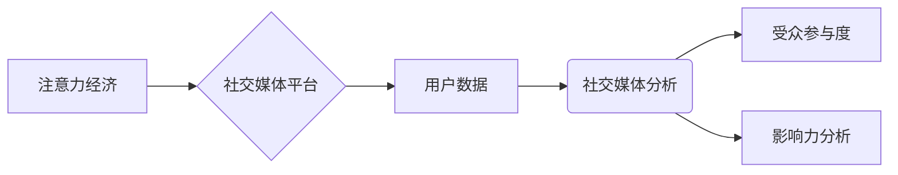

                 

##  注意力经济与社交媒体分析：了解受众参与度和影响力的秘诀

> 关键词：注意力经济、社交媒体分析、受众参与度、影响力分析、算法原理、数据挖掘、机器学习、网络分析、数据可视化

## 1. 背景介绍

在当今数字时代，信息爆炸和竞争日益激烈，人们的注意力成为稀缺资源，被誉为“注意力经济”的时代来临。社交媒体作为信息传播和用户互动的重要平台，在“注意力经济”中扮演着至关重要的角色。 

社交媒体平台上，用户每天接触着海量信息，如何吸引用户注意力，并将其转化为参与度和影响力，成为平台运营和品牌营销的关键问题。 

深入了解用户行为，分析受众参与度和影响力，对于社交媒体平台的运营、内容创作、广告投放等方面都具有重要意义。

## 2. 核心概念与联系

### 2.1 注意力经济

注意力经济是指在信息过剩的时代，人们对信息的筛选和选择能力成为重要的经济资源。 

注意力是有限的，而信息则无限增多，因此，获取和利用用户注意力成为了企业和平台争夺的焦点。

### 2.2 社交媒体分析

社交媒体分析是指利用数据挖掘、机器学习等技术，从社交媒体平台上收集和分析用户数据，以洞察用户行为、趋势和偏好。

社交媒体分析可以帮助企业和平台了解用户群体、分析内容传播效果、识别潜在影响者，并制定更有效的营销策略。

### 2.3 受众参与度和影响力

受众参与度是指用户对社交媒体内容的互动程度，例如点赞、评论、转发等行为。

影响力是指用户在社交媒体平台上的话语权和传播能力，能够影响其他用户的观点和行为。

**核心概念与联系流程图**



## 3. 核心算法原理 & 具体操作步骤

### 3.1 算法原理概述

社交媒体分析中常用的算法包括：

* **文本挖掘算法**: 用于分析用户发布的文本内容，提取关键词、主题、情感等信息。
* **网络分析算法**: 用于分析用户之间的关系网络，识别关键用户、社区结构等。
* **机器学习算法**: 用于预测用户行为、识别潜在影响者等。

### 3.2 算法步骤详解

**以文本挖掘算法为例，其具体操作步骤如下：**

1. **数据收集**: 从社交媒体平台上收集用户发布的文本数据，例如微博、朋友圈、评论等。
2. **数据预处理**: 对收集到的文本数据进行清洗、去噪、分词等预处理操作，去除无关信息，提取有效内容。
3. **特征提取**: 利用自然语言处理技术，提取文本数据中的关键词、主题、情感等特征。
4. **模型训练**: 利用机器学习算法，对提取的特征进行训练，建立文本分类、主题识别、情感分析等模型。
5. **模型评估**: 对训练好的模型进行评估，测试其准确率、召回率等指标，并进行优化。
6. **结果分析**: 对模型预测结果进行分析，洞察用户行为、内容传播趋势等信息。

### 3.3 算法优缺点

**文本挖掘算法的优缺点：**

* **优点**: 可以有效地分析用户文本数据，提取隐藏的信息，洞察用户行为和内容趋势。
* **缺点**: 需要依赖于自然语言处理技术，对文本数据的质量要求较高，算法的复杂度较高。

### 3.4 算法应用领域

文本挖掘算法广泛应用于以下领域：

* **社交媒体营销**: 分析用户评论、话题趋势，制定精准的营销策略。
* **品牌监测**: 监控品牌相关信息，及时发现负面舆情。
* **舆情分析**: 分析社会热点事件，了解公众舆论走向。
* **客户服务**: 自动识别客户问题，提供快速响应。

## 4. 数学模型和公式 & 详细讲解 & 举例说明

### 4.1 数学模型构建

受众参与度和影响力可以采用数学模型进行量化分析。

**受众参与度模型**:

$$
Engagement = \frac{Likes + Comments + Shares}{Total Posts}
$$

其中：

* Engagement: 受众参与度
* Likes: 点赞数
* Comments: 评论数
* Shares: 转发数
* Total Posts: 总发布数量

**影响力模型**:

$$
Influence = \frac{Followers \times Engagement}{Reach}
$$

其中：

* Influence: 影响力
* Followers: 粉丝数量
* Engagement: 受众参与度
* Reach: 内容传播范围

### 4.2 公式推导过程

受众参与度模型的推导过程：

1. 定义受众参与度为用户对内容的互动总量与总发布数量的比值。
2. 互动总量包括点赞、评论、转发等行为，可以分别用 Likes、Comments、Shares 表示。
3. 将上述变量代入公式，得到受众参与度模型。

影响力模型的推导过程：

1. 定义影响力为用户粉丝数量、受众参与度和内容传播范围的综合体现。
2. 粉丝数量代表用户潜在影响力，受众参与度代表用户内容的吸引力和互动性，内容传播范围代表用户内容的覆盖面。
3. 将上述变量代入公式，得到影响力模型。

### 4.3 案例分析与讲解

假设一个社交媒体账号拥有 10000 粉丝，其平均每条内容的点赞数为 500，评论数为 100，转发数为 50，总发布数量为 100 条。

**受众参与度计算**:

$$
Engagement = \frac{500 + 100 + 50}{100} = 6.5
$$

假设该账号的内容传播范围为 50000 人。

**影响力计算**:

$$
Influence = \frac{10000 \times 6.5}{50000} = 1.3
$$

通过计算，我们可以得出该账号的受众参与度为 6.5，影响力为 1.3。

## 5. 项目实践：代码实例和详细解释说明

### 5.1 开发环境搭建

本项目使用 Python 语言进行开发，所需环境如下：

* Python 3.x
* Jupyter Notebook
* NLTK 自然语言处理库
* Scikit-learn 机器学习库
* Pandas 数据处理库
* Matplotlib 数据可视化库

### 5.2 源代码详细实现

```python
import nltk
from nltk.corpus import stopwords
from sklearn.feature_extraction.text import TfidfVectorizer
from sklearn.cluster import KMeans

# 下载 NLTK 数据包
nltk.download('stopwords')
nltk.download('punkt')

# 加载数据
data = [
    "今天天气真好，出去散步很舒服。",
    "感觉最近工作压力很大，需要放松一下。",
    "学习 Python 编程很有趣，正在学习数据分析。",
    "周末想去旅行，不知道去哪里好。",
    "喜欢看电影，最近看了一部很不错的电影。"
]

# 数据预处理
stop_words = set(stopwords.words('english'))
processed_data = []
for text in data:
    words = nltk.word_tokenize(text)
    filtered_words = [word for word in words if word.lower() not in stop_words]
    processed_data.append(" ".join(filtered_words))

# 文本特征提取
vectorizer = TfidfVectorizer()
tfidf_matrix = vectorizer.fit_transform(processed_data)

# 聚类分析
kmeans = KMeans(n_clusters=2)
kmeans.fit(tfidf_matrix)
labels = kmeans.labels_

# 结果展示
for i, text in enumerate(data):
    print(f"文本: {text}")
    print(f"类别: {labels[i]}")
```

### 5.3 代码解读与分析

这段代码实现了文本数据预处理、特征提取和聚类分析。

1. **数据预处理**: 使用 NLTK 库对文本数据进行分词、去除停用词等预处理操作，提取有效信息。
2. **文本特征提取**: 使用 TF-IDF 向量化技术，将文本数据转换为数值向量，用于后续聚类分析。
3. **聚类分析**: 使用 KMeans 聚类算法，将文本数据聚类到不同的类别。

### 5.4 运行结果展示

运行代码后，会输出每个文本的类别标签，例如：

```
文本: 今天天气真好，出去散步很舒服。
类别: 0
文本: 感觉最近工作压力很大，需要放松一下。
类别: 1
文本: 学习 Python 编程很有趣，正在学习数据分析。
类别: 0
...
```

## 6. 实际应用场景

### 6.1 内容创作

社交媒体平台上的内容创作需要考虑受众参与度和影响力。

通过分析用户行为数据，可以了解用户感兴趣的话题、内容形式和传播渠道，从而创作更吸引用户的优质内容。

### 6.2 品牌营销

品牌营销可以通过社交媒体平台与用户互动，提升品牌知名度和影响力。

通过分析用户数据，可以识别潜在客户群体，制定精准的营销策略，并进行有效的品牌监测和舆情分析。

### 6.3 社交媒体运营

社交媒体平台运营需要不断优化内容策略和用户互动方式，以提高平台活跃度和用户粘性。

通过分析用户行为数据，可以了解用户使用习惯、偏好内容和互动模式，从而制定更有效的运营策略。

### 6.4 未来应用展望

随着人工智能技术的不断发展，社交媒体分析将更加智能化和精准化。

未来，社交媒体分析将能够更深入地洞察用户行为，预测用户需求，并为用户提供更个性化的服务。

## 7. 工具和资源推荐

### 7.1 学习资源推荐

* **书籍**:
    * 《社交媒体分析》
    * 《数据挖掘实战》
    * 《机器学习实战》
* **在线课程**:
    * Coursera: 数据科学
    * edX: 人工智能
    * Udemy: 社交媒体营销

### 7.2 开发工具推荐

* **Python**: 强大的编程语言，广泛应用于数据分析和机器学习。
* **Jupyter Notebook**: 交互式编程环境，方便进行数据分析和可视化。
* **NLTK**: 自然语言处理库，提供文本处理和分析工具。
* **Scikit-learn**: 机器学习库，提供各种机器学习算法和工具。
* **Pandas**: 数据处理库，提供数据结构和操作工具。
* **Matplotlib**: 数据可视化库，提供各种图表和图形绘制工具。

### 7.3 相关论文推荐

* **Social Media Analytics: A Survey**
* **Sentiment Analysis in Social Media**
* **Network Analysis of Social Media Data**

## 8. 总结：未来发展趋势与挑战

### 8.1 研究成果总结

社交媒体分析已经取得了显著的成果，为企业和平台提供了洞察用户行为、优化内容策略和提升营销效果的工具。

### 8.2 未来发展趋势

未来，社交媒体分析将朝着以下方向发展：

* **更精准的分析**: 利用人工智能技术，实现更精准的用户画像和行为预测。
* **更全面的数据**: 收集和分析更多类型的社交媒体数据，例如视频、音频、图片等。
* **更个性化的服务**: 为用户提供更个性化的内容推荐和服务。

### 8.3 面临的挑战

社交媒体分析也面临着一些挑战：

* **数据隐私**: 如何保护用户隐私，同时进行有效的分析。
* **数据质量**: 社交媒体数据往往杂乱无章，需要进行有效的数据清洗和预处理。
* **算法解释性**: 许多机器学习算法的决策过程难以解释，需要提高算法的透明度和可解释性。

### 8.4 研究展望

未来，社交媒体分析的研究将继续深入，探索更先进的算法和技术，以更好地理解用户行为，并为用户提供更优质的服务。

## 9. 附录：常见问题与解答

**Q1: 如何选择合适的聚类算法？**

**A1:** 选择聚类算法需要根据数据的特点和分析目标进行选择。

KMeans 算法适用于数据分布较为均匀的情况，而 DBSCAN 算法则适用于数据分布不均匀的情况。

**Q2: 如何评估聚类结果的质量？**

**A2:** 可以使用 Silhouette Coefficient、Dunn Index 等指标来评估聚类结果的质量。

**Q3: 如何处理社交媒体数据中的噪音和异常值？**

**A3:** 可以使用数据清洗和预处理技术，例如去除停用词、过滤重复数据、处理异常值等，来提高数据质量。


作者：禅与计算机程序设计艺术 / Zen and the Art of Computer Programming 
<end_of_turn>

