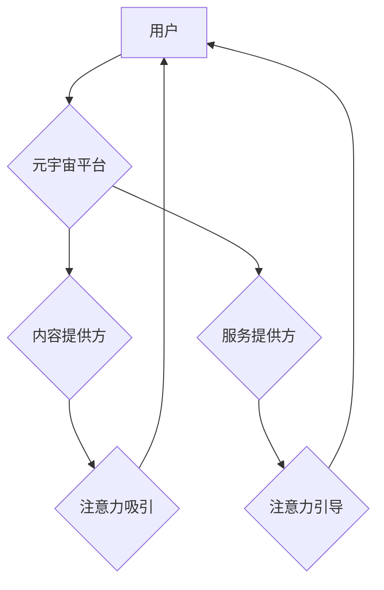

                 

## 注意力经济学理论:元宇宙中的价值重构

> 关键词：元宇宙、注意力经济学、价值重构、用户体验、数据驱动、沉浸式交互、虚拟经济

## 1. 背景介绍

在数字时代，信息爆炸和网络环境的日益复杂化，人们面临着前所未有的信息过载。如何有效地获取、处理和利用信息，成为了当今社会面临的重大挑战。注意力，作为人类认知的核心能力，在信息时代显得尤为重要。注意力经济学理论正是从这个角度出发，探讨了注意力在经济活动中的作用，并预测了元宇宙时代注意力价值的重构。

元宇宙，作为下一代互联网的雏形，以其沉浸式交互、虚拟化体验和去中心化的特性，将深刻地改变人们的生活方式和价值观。在元宇宙中，用户将拥有更丰富的虚拟身份、更真实的虚拟体验和更广泛的社交互动。然而，元宇宙的虚拟世界也面临着信息过载和注意力竞争的挑战。

## 2. 核心概念与联系

**2.1 注意力经济学理论**

注意力经济学理论认为，注意力是稀缺的资源，而信息竞争者则争夺着用户的注意力。在信息时代，注意力成为了新的货币，能够带来商业价值和社会影响力。

**2.2 元宇宙与注意力经济学**

元宇宙的沉浸式交互和虚拟化体验，将进一步加剧注意力竞争。用户在元宇宙中需要面对来自游戏、社交、购物、教育等多个领域的注意力吸引。因此，如何有效地获取和利用用户注意力，成为了元宇宙发展的重要课题。

**2.3 元宇宙中的价值重构**

注意力经济学理论预示着元宇宙中的价值重构。在元宇宙中，注意力将成为新的价值载体，而能够有效地获取和利用用户注意力的平台和服务，将拥有更大的商业价值和社会影响力。

**2.4  元宇宙注意力经济学架构**



## 3. 核心算法原理 & 具体操作步骤

**3.1 算法原理概述**

元宇宙中的注意力经济学算法，旨在通过数据分析和机器学习，预测用户注意力偏好，并引导用户注意力到更有价值的内容和服务。这些算法通常基于以下原理：

* **用户行为分析:** 通过分析用户的浏览记录、点击行为、停留时间等数据，了解用户的兴趣爱好和注意力模式。
* **内容推荐:** 基于用户行为分析，推荐用户感兴趣的内容和服务，提高用户参与度和注意力停留时间。
* **个性化定制:** 根据用户的个人特征和偏好，定制个性化的内容和服务，增强用户体验和注意力吸引力。
* **注意力引导:** 通过设计交互式元素、游戏化机制等，引导用户注意力到特定的内容和服务，提高用户转化率和商业价值。

**3.2 算法步骤详解**

1. **数据收集:** 收集用户在元宇宙平台上的行为数据，包括浏览记录、点击行为、停留时间、互动行为等。
2. **数据预处理:** 对收集到的数据进行清洗、转换和格式化，以便于后续分析和建模。
3. **特征提取:** 从用户行为数据中提取特征，例如用户兴趣爱好、注意力偏好、消费习惯等。
4. **模型训练:** 使用机器学习算法，训练注意力预测模型，并根据模型评估指标进行模型选择和优化。
5. **注意力引导:** 基于训练好的模型，对用户进行个性化推荐和注意力引导，引导用户注意力到更有价值的内容和服务。
6. **效果评估:** 对注意力引导策略的效果进行评估，并根据评估结果进行模型调整和优化。

**3.3 算法优缺点**

**优点:**

* **精准推荐:** 基于用户行为数据和机器学习算法，能够精准地推荐用户感兴趣的内容和服务。
* **个性化体验:** 根据用户的个人特征和偏好，定制个性化的内容和服务，增强用户体验。
* **提高用户参与度:** 通过注意力引导策略，提高用户参与度和注意力停留时间。
* **提升商业价值:** 通过引导用户注意力到更有价值的内容和服务，提升商业价值和转化率。

**缺点:**

* **数据依赖:** 算法的准确性依赖于用户行为数据的质量和数量。
* **隐私安全:** 用户行为数据收集和使用，需要考虑用户隐私安全问题。
* **算法偏差:** 算法模型可能存在偏差，导致推荐结果不公平或不准确。
* **用户体验:** 过度关注注意力引导，可能会影响用户的自主选择和体验。

**3.4 算法应用领域**

* **元宇宙游戏:** 引导用户注意力到游戏内容和社交互动，提升游戏参与度和用户粘性。
* **元宇宙社交:** 推荐用户感兴趣的社交圈和活动，促进用户之间的互动和交流。
* **元宇宙教育:** 根据用户的学习进度和兴趣爱好，推荐个性化的学习内容和互动体验。
* **元宇宙购物:** 推荐用户感兴趣的商品和服务，提升用户购物体验和转化率。

## 4. 数学模型和公式 & 详细讲解 & 举例说明

**4.1 数学模型构建**

注意力经济学模型通常基于用户行为数据和机器学习算法，构建一个预测用户注意力偏好的数学模型。

**4.2 公式推导过程**

例如，可以使用以下公式来预测用户对特定内容的注意力：

$$
Attention(c) = \alpha \cdot Engagement(c) + \beta \cdot Relevance(c) + \gamma \cdot Novelty(c)
$$

其中：

* $Attention(c)$ 表示用户对内容 $c$ 的注意力得分。
* $Engagement(c)$ 表示用户与内容 $c$ 的互动程度，例如停留时间、点击次数等。
* $Relevance(c)$ 表示内容 $c$ 与用户兴趣的匹配度。
* $Novelty(c)$ 表示内容 $c$ 的新颖程度。
* $\alpha$, $\beta$, $\gamma$ 是权重系数，可以通过训练模型来确定。

**4.3 案例分析与讲解**

假设一个元宇宙平台，用户在平台上浏览了三个不同的内容：游戏视频、新闻资讯和音乐专辑。

* 游戏视频的 $Engagement(c)$ 高，因为用户观看时间长，点击次数多。
* 新闻资讯的 $Relevance(c)$ 高，因为用户订阅了相关新闻频道。
* 音乐专辑的 $Novelty(c)$ 高，因为用户从未接触过该专辑。

根据上述公式，可以计算出用户对每个内容的注意力得分。如果 $\alpha$，$\beta$，$\gamma$ 的权重系数分别为 0.5，0.3，0.2，那么用户对游戏视频的注意力得分最高，其次是新闻资讯，最后是音乐专辑。

## 5. 项目实践：代码实例和详细解释说明

**5.1 开发环境搭建**

* 操作系统: Ubuntu 20.04 LTS
* Python 版本: 3.8.10
* 虚拟环境: venv
* 库依赖: numpy, pandas, scikit-learn, tensorflow

**5.2 源代码详细实现**

```python
import pandas as pd
from sklearn.model_selection import train_test_split
from sklearn.linear_model import LogisticRegression
from sklearn.metrics import accuracy_score

# 数据加载
data = pd.read_csv('user_behavior.csv')

# 特征工程
features = ['engagement', 'relevance', 'novelty']
target = 'attention'

# 数据分割
X_train, X_test, y_train, y_test = train_test_split(data[features], data[target], test_size=0.2, random_state=42)

# 模型训练
model = LogisticRegression()
model.fit(X_train, y_train)

# 模型评估
y_pred = model.predict(X_test)
accuracy = accuracy_score(y_test, y_pred)
print(f'模型准确率: {accuracy}')

# 预测用户注意力
new_user_data = pd.DataFrame({'engagement': [0.8], 'relevance': [0.6], 'novelty': [0.4]})
predicted_attention = model.predict(new_user_data)
print(f'新用户的注意力预测结果: {predicted_attention}')
```

**5.3 代码解读与分析**

* 代码首先加载用户行为数据，并进行特征工程，提取用户对内容的注意力相关特征。
* 然后使用 scikit-learn 库中的 LogisticRegression 模型进行训练，预测用户对内容的注意力得分。
* 最后，使用训练好的模型对新用户的注意力进行预测。

**5.4 运行结果展示**

运行代码后，会输出模型的准确率和对新用户的注意力预测结果。

## 6. 实际应用场景

**6.1 元宇宙游戏**

在元宇宙游戏中，注意力经济学算法可以用于推荐游戏任务、引导玩家探索游戏世界、增强玩家与其他玩家的互动。例如，游戏可以根据玩家的喜好和游戏进度，推荐更具吸引力的游戏任务，并通过游戏机制引导玩家探索新的游戏区域。

**6.2 元宇宙社交**

在元宇宙社交平台，注意力经济学算法可以用于推荐好友、推荐兴趣小组、推荐社交活动。例如，平台可以根据用户的兴趣爱好和社交行为，推荐更符合用户需求的好友和兴趣小组，并通过社交活动引导用户进行互动交流。

**6.3 元宇宙教育**

在元宇宙教育平台，注意力经济学算法可以用于推荐个性化学习内容、引导学生进行互动学习、评估学生的学习进度。例如，平台可以根据学生的学习进度和兴趣爱好，推荐更符合学生需求的学习内容，并通过互动游戏和虚拟实验引导学生进行沉浸式学习。

**6.4 未来应用展望**

随着元宇宙技术的不断发展，注意力经济学算法将在元宇宙中发挥越来越重要的作用。未来，注意力经济学算法将被应用于更广泛的领域，例如元宇宙医疗、元宇宙艺术、元宇宙商业等。

## 7. 工具和资源推荐

**7.1 学习资源推荐**

* **书籍:**

    * 《注意力经济学》
    * 《元宇宙：下一代互联网》

* **在线课程:**

    * Coursera: 人工智能与机器学习
    * edX: 数据科学与分析

**7.2 开发工具推荐**

* **Python:** 作为元宇宙开发的常用语言，Python 提供了丰富的库和框架，例如 TensorFlow、PyTorch、Unity 等。
* **Unity:** 作为一款流行的游戏引擎，Unity 也被广泛应用于元宇宙开发。

**7.3 相关论文推荐**

* **Attention is All You Need**
* **BERT: Pre-training of Deep Bidirectional Transformers for Language Understanding**

## 8. 总结：未来发展趋势与挑战

**8.1 研究成果总结**

注意力经济学理论为元宇宙中的价值重构提供了新的视角，并促进了注意力预测算法的研发。这些算法能够精准地预测用户注意力偏好，并引导用户注意力到更有价值的内容和服务。

**8.2 未来发展趋势**

* **更精准的注意力预测:** 未来，注意力预测算法将更加精准，能够更准确地预测用户的注意力偏好。
* **更个性化的注意力引导:** 未来，注意力引导策略将更加个性化，能够根据用户的不同需求和场景，提供更精准的注意力引导。
* **更丰富的注意力应用场景:** 未来，注意力经济学算法将被应用于更广泛的元宇宙领域，例如元宇宙医疗、元宇宙艺术、元宇宙商业等。

**8.3 面临的挑战**

* **数据隐私安全:** 用户行为数据收集和使用，需要更加注重用户隐私安全问题。
* **算法公平性:** 算法模型可能存在偏差，导致推荐结果不公平或不准确。
* **用户体验:** 过度关注注意力引导，可能会影响用户的自主选择和体验。

**8.4 研究展望**

未来，注意力经济学研究将更加注重以下几个方面:

* **开发更公平、更透明的注意力预测算法。**
* **探索注意力经济学与其他学科的交叉融合，例如心理学、社会学、经济学等。**
* **研究注意力经济学对人类社会的影响，并探讨如何更好地利用注意力经济学为人类社会创造价值。**

## 9. 附录：常见问题与解答

**9.1 如何保护用户隐私安全？**

在收集和使用用户行为数据时，需要采取以下措施保护用户隐私安全:

* **获取用户明确的同意:** 在收集用户数据之前，需要获取用户的明确同意。
* **匿名化数据:** 将用户个人信息匿名化，避免直接识别用户身份。
* **加密数据传输:** 使用加密技术保护用户数据在传输过程中的安全。
* **限制数据访问权限:** 限制只有授权人员才能访问用户数据。

**9.2 如何避免算法偏差？**

* 使用多样化的训练数据，避免算法偏向特定群体。
* 定期评估算法模型的公平性，并进行调整。
* 鼓励算法开发人员来自不同背景，避免单一视角的算法设计。

**9.3 如何平衡注意力引导与用户体验？**

* 不要过度关注注意力引导，避免影响用户的自主选择和体验。
* 提供用户可控的注意力引导选项，例如用户可以选择是否接收推荐内容。
* 设计人性化的注意力引导策略，例如使用渐进式引导，避免突然的注意力转移。


作者：禅与计算机程序设计艺术 / Zen and the Art of Computer Programming 
<end_of_turn>

