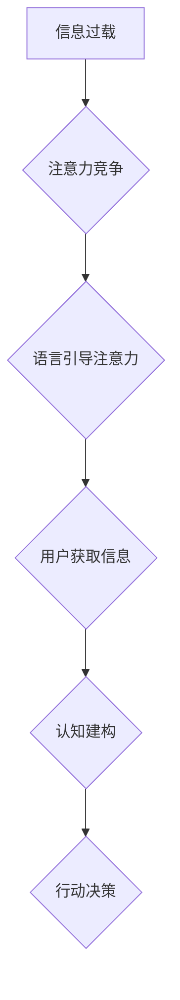

                 

## 1. 背景介绍

在信息爆炸的时代，人们面临着前所未有的信息洪流。如何有效地获取、处理和利用信息成为了当今社会面临的重大挑战。注意力经济应运而生，它强调了注意力作为一种稀缺资源的重要性，并探讨了如何有效地获取和利用注意力。

语言作为人类交流的主要工具，在注意力经济中扮演着至关重要的角色。它不仅是信息传递的载体，也是人们获取和处理信息的关键媒介。然而，注意力经济的到来也对语言的使用方式产生了深刻的影响。

### 1.1 信息过载与注意力碎片化

互联网的普及和移动设备的广泛使用，使得人们每天接触的信息量呈指数级增长。这种信息过载导致人们的注意力变得更加碎片化，难以集中精力处理大量信息。

### 1.2  注意力经济的本质

注意力经济的核心概念是“注意力是稀缺资源”。人们的注意力有限，无法同时关注所有信息。因此，在竞争激烈的市场环境中，获取和利用用户的注意力成为了至关重要的商业目标。

### 1.3  语言在注意力经济中的作用

语言在注意力经济中扮演着多重角色：

* **信息传递:** 语言是人们获取和传播信息的 primary 方式。
* **注意力引导:**  语言可以被用来引导人们的注意力，吸引他们的兴趣，并促使他们采取行动。
* **情感共鸣:**  语言可以用来唤起人们的情感共鸣，增强他们的参与度。
* **认知建构:**  语言可以帮助人们构建认知框架，理解和解释世界。

## 2. 核心概念与联系

注意力经济的核心概念包括：

* **注意力:**  指人们对特定信息或事件的集中和持续的关注。
* **注意力资源:**  指人们可以用来关注信息的有限能力。
* **注意力竞争:**  指不同信息或事件争夺人们的注意力。
* **注意力经济:**  指围绕着注意力资源的经济活动。

语言与注意力经济之间存在着密切的联系。语言是获取和利用注意力最有效的手段之一。

**Mermaid 流程图:**



## 3. 核心算法原理 & 具体操作步骤

### 3.1  算法原理概述

注意力机制是一种模仿人类注意力机制的算法，它能够帮助模型专注于输入数据中最重要的部分。

注意力机制的核心思想是通过一个加权机制来分配不同输入元素的权重，从而突出重要信息，抑制无关信息。

### 3.2  算法步骤详解

1. **计算注意力权重:**  对于每个输入元素，计算其与输出的相关性，并将其转换为一个权重值。
2. **加权求和:**  将每个输入元素的权重值与其本身相乘，然后对所有权重值进行求和，得到最终的输出。

### 3.3  算法优缺点

**优点:**

* **提高模型性能:**  注意力机制能够帮助模型更好地理解输入数据，从而提高模型的准确率和性能。
* **可解释性增强:**  注意力权重可以直观地反映模型对输入数据的关注程度，从而提高模型的可解释性。

**缺点:**

* **计算复杂度高:**  注意力机制的计算复杂度较高，尤其是在处理长序列数据时。
* **参数量增加:**  注意力机制需要额外的参数来存储注意力权重，从而增加了模型的参数量。

### 3.4  算法应用领域

注意力机制在自然语言处理、计算机视觉、语音识别等多个领域都有广泛的应用。

* **机器翻译:**  注意力机制可以帮助模型更好地理解源语言和目标语言之间的关系，从而提高翻译质量。
* **文本摘要:**  注意力机制可以帮助模型识别文本中最关键的信息，从而生成更准确的摘要。
* **图像识别:**  注意力机制可以帮助模型关注图像中最重要的区域，从而提高识别准确率。

## 4. 数学模型和公式 & 详细讲解 & 举例说明

### 4.1  数学模型构建

注意力机制的数学模型通常基于一个加权求和操作。

假设我们有一个输入序列 $x = (x_1, x_2, ..., x_n)$，以及一个输出向量 $y$。

注意力权重 $a_{ij}$ 表示输入元素 $x_i$ 对输出元素 $y$ 的注意力程度。

最终的输出 $y'$ 可以表示为：

$$y' = \sum_{i=1}^{n} a_{ij} x_i$$

### 4.2  公式推导过程

注意力权重 $a_{ij}$ 通常通过一个评分函数来计算，该函数将输入元素 $x_i$ 和输出元素 $y$ 的相关性转换为一个数值。

常用的评分函数包括：

* **点积注意力:**

$$a_{ij} = \frac{exp(x_i^T y)}{\sum_{k=1}^{n} exp(x_k^T y)}$$

* **多头注意力:**

$$a_{ij} = softmax(\frac{W_q x_i^T W_k y}{\sqrt{d_k}})$$

其中，$W_q$、$W_k$ 和 $W_v$ 是可训练的权重矩阵，$d_k$ 是键向量的维度。

### 4.3  案例分析与讲解

例如，在机器翻译任务中，注意力机制可以帮助模型关注源语言中与目标语言单词相关的词语，从而提高翻译质量。

## 5. 项目实践：代码实例和详细解释说明

### 5.1  开发环境搭建

* Python 3.6+
* TensorFlow 或 PyTorch

### 5.2  源代码详细实现

```python
import tensorflow as tf

# 定义一个简单的注意力机制
class Attention(tf.keras.layers.Layer):
    def __init__(self, units):
        super(Attention, self).__init__()
        self.W_q = tf.keras.layers.Dense(units)
        self.W_k = tf.keras.layers.Dense(units)
        self.W_v = tf.keras.layers.Dense(units)
        self.softmax = tf.keras.layers.Softmax()

    def call(self, query, key, value, mask=None):
        # 计算注意力权重
        scores = tf.matmul(self.W_q(query), self.W_k(key), transpose_b=True)
        if mask is not None:
            scores += (mask * -1e9)
        attention_weights = self.softmax(scores)

        # 加权求和
        context_vector = tf.matmul(attention_weights, value)
        return context_vector
```

### 5.3  代码解读与分析

* `Attention` 类定义了一个简单的注意力机制层。
* `__init__` 方法初始化三个稠密层，用于计算查询、键和值的表示。
* `call` 方法计算注意力权重，并使用加权求和操作得到最终的上下文向量。

### 5.4  运行结果展示

运行上述代码，可以得到注意力权重和上下文向量。

## 6. 实际应用场景

### 6.1  搜索引擎优化

注意力机制可以帮助搜索引擎更好地理解用户搜索意图，并返回更相关的搜索结果。

### 6.2  个性化推荐

注意力机制可以帮助推荐系统识别用户的兴趣偏好，并推荐更个性化的内容。

### 6.3  广告投放

注意力机制可以帮助广告平台更好地定位目标用户，并提高广告点击率。

### 6.4  未来应用展望

注意力机制在未来将有更广泛的应用，例如：

* **自动驾驶:**  注意力机制可以帮助自动驾驶系统关注道路上的重要信息，提高驾驶安全。
* **医疗诊断:**  注意力机制可以帮助医生识别病人的关键症状，提高诊断准确率。
* **教育:**  注意力机制可以帮助教育系统个性化教学，提高学生的学习效果。

## 7. 工具和资源推荐

### 7.1  学习资源推荐

* **论文:**  "Attention Is All You Need"
* **博客:**  "Attention Is All You Need: A Deep Dive"
* **课程:**  "Deep Learning Specialization"

### 7.2  开发工具推荐

* **TensorFlow:**  https://www.tensorflow.org/
* **PyTorch:**  https://pytorch.org/

### 7.3  相关论文推荐

* "Attention Is All You Need"
* "BERT: Pre-training of Deep Bidirectional Transformers for Language Understanding"
* "Transformer-XL: Attentive Language Models Beyond a Fixed-Length Context"

## 8. 总结：未来发展趋势与挑战

### 8.1  研究成果总结

注意力机制在自然语言处理、计算机视觉等领域取得了显著的成果，提高了模型的性能和可解释性。

### 8.2  未来发展趋势

* **更有效的注意力机制:**  研究更有效的注意力机制，例如长序列注意力机制、动态注意力机制等。
* **多模态注意力机制:**  研究能够处理多种模态数据的注意力机制，例如文本、图像、音频等。
* **可解释性增强:**  研究更可解释的注意力机制，以便更好地理解模型的决策过程。

### 8.3  面临的挑战

* **计算复杂度:**  注意力机制的计算复杂度较高，尤其是在处理长序列数据时。
* **参数量:**  注意力机制需要额外的参数来存储注意力权重，从而增加了模型的参数量。
* **数据依赖性:**  注意力机制的性能依赖于训练数据的质量。

### 8.4  研究展望

未来，注意力机制将继续是人工智能领域的研究热点，并将在更多领域得到应用。


## 9. 附录：常见问题与解答

### 9.1  Q1: 注意力机制与RNN有什么区别？

### 9.2  A1:

注意力机制与RNN的区别在于：

* RNN只能处理顺序数据，而注意力机制可以处理任意顺序的数据。
* RNN的性能会随着序列长度的增加而下降，而注意力机制可以更好地处理长序列数据。
* 注意力机制可以更好地理解输入数据的全局信息，而RNN只能处理局部信息。

### 9.3  Q2: 注意力机制的应用场景有哪些？

### 9.4  A2:

注意力机制的应用场景非常广泛，例如：

* 机器翻译
* 文本摘要
* 图像识别
* 语音识别
* 自动驾驶
* 医疗诊断
* 教育

### 9.5  Q3: 如何选择合适的注意力机制？

### 9.6  A3:

选择合适的注意力机制需要根据具体任务和数据特点进行选择。

* **点积注意力:**  适用于处理文本数据，可以捕捉单词之间的语义关系。
* **多头注意力:**  可以捕捉不同层次的语义信息，适用于处理更复杂的文本数据。
* **长序列注意力机制:**  适用于处理长序列数据，例如文章摘要、对话系统等。


作者：禅与计算机程序设计艺术 / Zen and the Art of Computer Programming 
<end_of_turn>

