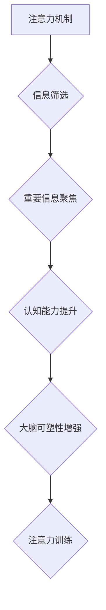

                 

## 1. 背景介绍

在当今信息爆炸的时代，注意力已经成为至关重要的认知能力。我们每天都被各种信息轰炸，从手机通知到社交媒体更新，从电子邮件到新闻报道，无处不在的干扰让我们难以集中精力完成任务，学习新知识，甚至享受生活。注意力力的下降不仅影响着我们的工作效率和学习成果，也可能导致焦虑、压力和情绪波动。

然而，大脑并非一成不变的器官，它具有强大的可塑性，可以通过训练和练习来增强注意力能力。注意力训练，就像锻炼肌肉一样，可以帮助我们提高专注力、记忆力、执行功能等认知能力。

## 2. 核心概念与联系

### 2.1 注意力机制

注意力机制是人工智能领域近年来发展迅速的关键技术之一，它模拟了人类大脑对重要信息进行筛选和聚焦的过程。注意力机制的核心思想是，在处理信息时，并非所有信息都具有同等重要性，我们应该将注意力集中在与当前任务最相关的部分上。

### 2.2 大脑可塑性

大脑可塑性是指大脑结构和功能在经历学习、训练或环境变化后能够发生改变的能力。这种可塑性使得我们能够适应新的环境、学习新的知识和技能，并不断提升认知能力。

### 2.3 注意力训练与大脑可塑性

注意力训练通过反复练习，可以改变大脑的结构和功能，从而增强注意力能力。研究表明，注意力训练可以增加大脑中与注意力相关的区域的灰质体积，提高神经元之间的连接强度，以及增强信号传递效率。

**Mermaid 流程图**



## 3. 核心算法原理 & 具体操作步骤

### 3.1 算法原理概述

注意力机制的核心算法是**注意力权重**的计算。注意力权重代表了模型对不同输入信息的关注程度，它通过一个可学习的参数来衡量每个输入信息的 relevance。

### 3.2 算法步骤详解

1. **输入数据:** 将输入数据（例如文本序列）转换为向量表示。
2. **计算注意力权重:** 使用一个注意力函数计算每个输入向量与目标向量的注意力权重。
3. **加权求和:** 将每个输入向量与其对应的注意力权重相乘，然后对所有权重进行加权求和，得到最终的输出向量。

### 3.3 算法优缺点

**优点:**

* 可以有效地捕捉输入信息中的重要部分。
* 可以处理长序列数据，例如文本和音频。
* 在许多自然语言处理任务中取得了优异的性能。

**缺点:**

* 计算复杂度较高。
* 需要大量的训练数据。

### 3.4 算法应用领域

注意力机制在自然语言处理、计算机视觉、语音识别等领域都有广泛的应用，例如：

* **机器翻译:** 捕捉源语言和目标语言之间的语义关系。
* **文本摘要:** 识别文本中最关键的信息。
* **图像识别:** 关注图像中与目标物体相关的区域。

## 4. 数学模型和公式 & 详细讲解 & 举例说明

### 4.1 数学模型构建

注意力机制的数学模型通常基于一个**注意力函数**，该函数计算每个输入向量与目标向量的注意力权重。

**注意力函数:**

$$
\text{Attention}(Q, K, V) = \text{softmax}\left(\frac{Q K^T}{\sqrt{d_k}}\right) V
$$

其中:

* $Q$ 是查询向量。
* $K$ 是键向量。
* $V$ 是值向量。
* $d_k$ 是键向量的维度。
* $\text{softmax}$ 是一个归一化函数，将注意力权重归一化为一个概率分布。

### 4.2 公式推导过程

注意力函数的推导过程基于以下几个假设:

* **查询向量**代表着模型当前需要关注的信息。
* **键向量**代表着输入向量的特征。
* **值向量**代表着输入向量的实际内容。

注意力函数通过计算查询向量与键向量的相似度来确定每个输入向量的重要性，然后将这些重要性信息用于加权求和，得到最终的输出向量。

### 4.3 案例分析与讲解

例如，在机器翻译任务中，查询向量可以是目标语言的词向量，键向量和值向量可以是源语言的词向量。注意力函数可以帮助模型识别源语言中与目标语言词语最相关的部分，从而提高翻译的准确性。

## 5. 项目实践：代码实例和详细解释说明

### 5.1 开发环境搭建

* Python 3.6+
* TensorFlow 或 PyTorch

### 5.2 源代码详细实现

```python
import tensorflow as tf

# 定义注意力函数
def attention_function(query, key, value, mask=None):
    # 计算注意力权重
    scores = tf.matmul(query, key, transpose_b=True) / tf.math.sqrt(tf.cast(key.shape[-1], tf.float32))
    if mask is not None:
        scores += (mask * -1e9)
    attention_weights = tf.nn.softmax(scores, axis=-1)
    # 加权求和
    context_vector = tf.matmul(attention_weights, value)
    return context_vector, attention_weights

# 示例代码
query = tf.random.normal([1, 5, 64])
key = tf.random.normal([1, 10, 64])
value = tf.random.normal([1, 10, 128])

context_vector, attention_weights = attention_function(query, key, value)

print(context_vector.shape)
print(attention_weights.shape)
```

### 5.3 代码解读与分析

* `attention_function` 函数计算注意力权重并进行加权求和。
* `scores` 计算查询向量与键向量的相似度。
* `attention_weights` 使用 softmax 函数将相似度转换为概率分布。
* `context_vector` 通过加权求和得到最终的输出向量。

### 5.4 运行结果展示

运行代码后，会输出 `context_vector` 和 `attention_weights` 的形状，分别代表最终的输出向量和注意力权重矩阵。

## 6. 实际应用场景

注意力机制在许多实际应用场景中发挥着重要作用，例如：

### 6.1 机器翻译

注意力机制可以帮助机器翻译模型更好地捕捉源语言和目标语言之间的语义关系，从而提高翻译的准确性和流畅度。

### 6.2 文本摘要

注意力机制可以帮助文本摘要模型识别文本中最关键的信息，并生成简洁准确的摘要。

### 6.3 图像识别

注意力机制可以帮助图像识别模型关注图像中与目标物体相关的区域，从而提高识别准确率。

### 6.4 未来应用展望

随着人工智能技术的不断发展，注意力机制的应用场景将会更加广泛，例如：

* **个性化教育:** 根据学生的学习情况，提供个性化的学习内容和建议。
* **医疗诊断:** 帮助医生更快、更准确地诊断疾病。
* **自动驾驶:** 帮助自动驾驶汽车更好地感知周围环境。

## 7. 工具和资源推荐

### 7.1 学习资源推荐

* **书籍:**
    * 《深度学习》
    * 《自然语言处理》
* **在线课程:**
    * Coursera: 深度学习
    * Udacity: 自然语言处理
* **博客:**
    * Jay Alammar's Blog
    * Distill.pub

### 7.2 开发工具推荐

* **TensorFlow:** 开源深度学习框架。
* **PyTorch:** 开源深度学习框架。
* **Keras:** 高级深度学习API。

### 7.3 相关论文推荐

* **Attention Is All You Need**
* **BERT: Pre-training of Deep Bidirectional Transformers for Language Understanding**
* **Transformer-XL: Attentive Language Models Beyond a Fixed-Length Context**

## 8. 总结：未来发展趋势与挑战

### 8.1 研究成果总结

注意力机制在人工智能领域取得了显著的成果，并在许多应用场景中展现出强大的能力。

### 8.2 未来发展趋势

未来，注意力机制的研究将继续朝着以下方向发展:

* **更有效的注意力机制:** 设计更有效的注意力函数，提高计算效率和性能。
* **多模态注意力机制:** 将注意力机制应用于多模态数据，例如文本、图像、音频等。
* **自适应注意力机制:** 开发能够根据任务需求自适应调整注意力权重的机制。

### 8.3 面临的挑战

注意力机制也面临着一些挑战:

* **计算复杂度:** 某些注意力机制的计算复杂度较高，难以在资源有限的设备上运行。
* **可解释性:** 注意力机制的决策过程相对复杂，难以解释其注意力权重的分配。
* **数据依赖性:** 注意力机制需要大量的训练数据才能达到最佳性能。

### 8.4 研究展望

未来，研究人员将继续努力解决这些挑战，并探索注意力机制在更多领域的新应用。


## 9. 附录：常见问题与解答

### 9.1 什么是注意力机制？

注意力机制是一种模拟人类大脑对重要信息进行筛选和聚焦的技术。

### 9.2 注意力机制的应用场景有哪些？

注意力机制在机器翻译、文本摘要、图像识别等领域都有广泛的应用。

### 9.3 如何训练注意力机制？

注意力机制可以通过监督学习的方式进行训练，需要大量的标注数据。

### 9.4 注意力机制的优缺点是什么？

注意力机制的优点是能够有效地捕捉输入信息中的重要部分，缺点是计算复杂度较高，需要大量的训练数据。


作者：禅与计算机程序设计艺术 / Zen and the Art of Computer Programming 
<end_of_turn>

